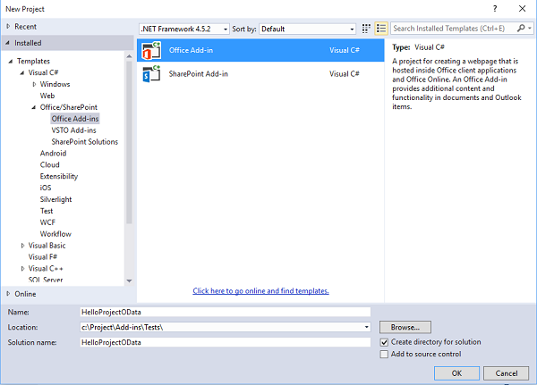
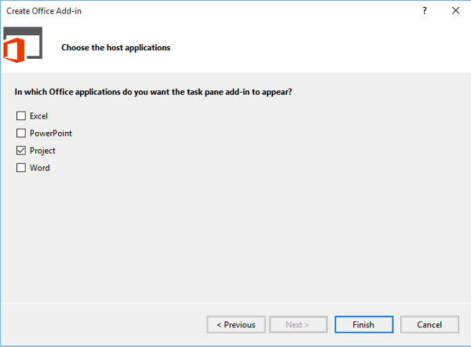
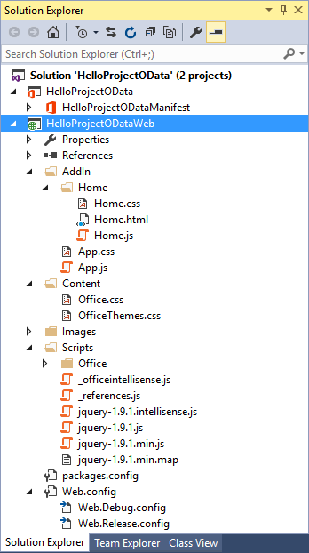

# Create a Project add-in that uses REST with an on-premises Project Server OData service

This article describes how to build a task pane add-in for Project Professional that compares cost and work data in the active project with the averages for all projects in the current Project Web App instance. The add-in uses REST with the jQuery library to access the **ProjectData** OData reporting service in Project Server.

The code in this article is based on a sample developed by Saurabh Sanghvi and Arvind Iyer, Microsoft Corporation.

## Prerequisites

The following are the prerequisites for creating a Project task pane add-in that reads the **ProjectData** service of a Project Web App instance in an on-premises installation of Project Server.

- Project Professional is required to connect with Project Web App. The development computer must have Project Professional installed to enable **F5** debugging with Visual Studio.

    > [!NOTE]
    > Project Standard can also host task pane add-ins, but cannot sign in to Project Web App.

- Visual Studio 2015 with Office Developer Tools for Visual Studio includes templates for creating Office and SharePoint Add-ins. Ensure that you have installed the most recent version of Office Developer Tools; see the  *Tools* section of the [Office Add-ins and SharePoint downloads](https://developer.microsoft.com/office/docs).

- The procedures and code examples in this article access the **ProjectData** service of Project Server in a local domain. The jQuery methods in this article do not work with Project on the web.

    Verify that the **ProjectData** service is accessible from your development computer.

### Procedure 1. Verify that the ProjectData service is accessible

1. To enable your browser to directly show the XML data from a REST query, turn off the feed reading view. For information about how to do this in Internet Explorer, see Procedure 1, step 4 in [Query OData feeds for Project reporting data](/previous-versions/office/project-odata/jj163048(v=office.15)).

1. Query the **ProjectData** service by using your browser with the following URL: `http://ServerName /ProjectServerName /_api/ProjectData`. For example, if the Project Web App instance is  `http://MyServer/pwa`, the browser shows the following results.

    ```xml
    <?xml version="1.0" encoding="utf-8"?>
        <service xml:base="http://myserver/pwa/_api/ProjectData/"
        xmlns="https://www.w3.org/2007/app"
        xmlns:atom="https://www.w3.org/2005/Atom">
        <workspace>
            <atom:title>Default</atom:title>
            <collection href="Projects">
                <atom:title>Projects</atom:title>
            </collection>
            <collection href="ProjectBaselines">
                <atom:title>ProjectBaselines</atom:title>
            </collection>
            <!-- ... and 33 more collection elements -->
        </workspace>
        </service>
    ```

1. You may have to provide your network credentials to see the results. If the browser shows "Error 403, Access Denied," either you do not have logon permission for that Project Web App instance, or there is a network problem that requires administrative help.

## Use Visual Studio to create a task pane add-in for Project

Office Developer Tools for Visual Studio includes a template for task pane add-ins for Project. If you create a solution named **HelloProjectOData**, the solution contains the following two Visual Studio projects:

- The add-in project takes the name of the solution. It includes the add-in only manifest file for the add-in and targets the .NET Framework 4.5. Procedure 3 shows the steps to modify the manifest for the **HelloProjectOData** add-in.

- The web project is named **HelloProjectODataWeb**. It includes the webpages, JavaScript files, CSS files, images, references, and configuration files for the web content in the task pane. The web project targets the .NET Framework 4. Procedure 4 and Procedure 5 show how to modify the files in the web project to create the functionality of the **HelloProjectOData** add-in.

### Procedure 2. Create the HelloProjectOData add-in for Project

1. Run Visual Studio 2015 as an administrator, and then select **New Project** on the Start page.

1. In the **New Project** dialog box, expand the **Templates**, **Visual C#**, and **Office/SharePoint** nodes, and then select **Office Add-ins**. Select **.NET Framework 4.5.2** in the target framework drop-down list at the top of the center pane, and then select **Office Add-in** (see the next screenshot).

1. To place both of the Visual Studio projects in the same directory, select **Create directory for solution**, and then browse to the location you want.

1. In the **Name** field, typeHelloProjectOData, and then choose **OK**.

    *Figure 1. Create an Office Add-in*

    

1. In the **Choose the add-in type** dialog box, select **Task pane** and choose **Next** (see the next screenshot).

    *Figure 2. Choosing the type of add-in to create*

    

1. In the **Choose the host applications** dialog box, clear all check boxes except the **Project** check box (see the next screenshot) and choose **Finish**.

    *Figure 3. Choosing the host application*

    

    Visual Studio creates the **HelloProjectOdata** project and the **HelloProjectODataWeb** project.

The **AddIn** folder (see the next screenshot) contains the App.css file for custom CSS styles. In the **Home** subfolder , the Home.html file contains references to the CSS files and the JavaScript files that the add-in uses, and the HTML5 content for the add-in. Also, the Home.js file is for your custom JavaScript code. The **Scripts** folder includes the jQuery library files. The **Office** subfolder includes the JavaScript libraries such as office.js and project-15.js, plus the language libraries for standard strings in the Office Add-ins. In the **Content** folder, the Office.css file contains the default styles for all of the Office Add-ins.

*Figure 4. View the default web project files in Solution Explorer*



The manifest for the **HelloProjectOData** project is the HelloProjectOData.xml file. You can optionally modify the manifest to add a description of the add-in, a reference to an icon, information for additional languages, and other settings. Procedure 3 simply modifies the add-in display name and description, and adds an icon.

For more information about the manifest, see [Office Add-ins manifest](../develop/add-in-manifests.md) and [Schema reference for Office Add-ins manifests](/openspecs/office_file_formats/ms-owemxml/c6a06390-34b8-4b42-82eb-b28be12494a8).

### Procedure 3. Modify the add-in manifest

1. In Visual Studio, open the HelloProjectOData.xml file.

1. The default display name is the name of the Visual Studio project ("HelloProjectOData"). For example, change the default value of the **\<DisplayName\>** element to"Hello ProjectData".

1. The default description is also "HelloProjectOData". For example, change the default value of the Description element to "Test REST queries of the ProjectData service".

1. Add an icon to show in the **Office Add-ins** drop-down list on the **PROJECT** tab of the ribbon. You can add an icon file in the Visual Studio solution or use a URL for an icon.

The following steps show how to add an icon file to the Visual Studio solution.

1. In **Solution Explorer**, go to the folder named Images.

1. To be displayed in the **Office Add-ins** drop-down list, the icon must be 32 x 32 pixels. Use your own 32 x 32 icon; or, copy the following image to a file named **NewIcon.png**, and then add that file to the  `HelloProjectODataWeb\Images` folder.

    

1. In the HelloProjectOData.xml, add an **\<IconUrl\>** element below the **\<Description\>** element, where the value of the icon URL is the relative path to the 32x32 icon file. For example, add the following line: `<IconUrl DefaultValue="~remoteAppUrl/Images/NewIcon.png" />`. The HelloProjectOData.xml file now contains the following (your **\<Id\>** value will be different):

    ```XML
    <?xml version="1.0" encoding="UTF-8"?>
    <OfficeApp xmlns="http://schemas.microsoft.com/office/appforoffice/1.1"
            xmlns:xsi="http://www.w3.org/2001/XMLSchema-instance" xsi:type="TaskPaneApp">
        <!--IMPORTANT! Id must be unique for each add-in. If you copy this manifest ensure that you change this id to your own GUID. -->
        <Id>c512df8d-a1c5-4d74-8a34-d30f6bbcbd82</Id>
        <Version>1.0</Version>
        <ProviderName> [Provider name]</ProviderName>
        <DefaultLocale>en-US</DefaultLocale>
        <DisplayName DefaultValue="Hello ProjectData" />
        <Description DefaultValue="Test REST queries of the ProjectData service"/>
        <IconUrl DefaultValue="~remoteAppUrl/Images/NewIcon.png" />
        <SupportUrl DefaultValue="[Insert the URL of a page that provides support information for the app]" />
        <Hosts>
            <Host Name="Project" />
        </Hosts>
        <DefaultSettings>
            <SourceLocation DefaultValue="~remoteAppUrl/AddIn/Home/Home.html" />
        </DefaultSettings>
        <Permissions>ReadWriteDocument</Permissions>
    </OfficeApp>
    ```

## Create the HTML content for the HelloProjectOData add-in

The **HelloProjectOData** add-in is a sample that includes debugging and error output; it is not intended for production use. Before you start coding the HTML content, design the UI and user experience for the add-in, and outline the JavaScript functions that interact with the HTML code. For more information, see [Design guidelines for Office Add-ins](../design/add-in-design.md).

The task pane shows the add-in display name at the top, which is the value of the **\<DisplayName\>** element in the manifest. The **body** element in the HelloProjectOData.html file contains the other UI elements, as follows:

- A subtitle indicates the general functionality or type of operation, for example, **ODATA REST QUERY**.

- The **Get ProjectData Endpoint** button calls the `setOdataUrl` function to get the endpoint of the **ProjectData** service, and display it in a text box. If Project is not connected with Project Web App, the add-in calls an error handler to display a pop-up error message.

- The **Compare All Projects** button is disabled until the add-in gets a valid OData endpoint. When you select the button, it calls the `retrieveOData` function, which uses a REST query to get project cost and work data from the **ProjectData** service.

- A table displays the average values for project cost, actual cost, work, and percent complete. The table also compares the current active project values with the average. If the current value is greater than the average for all projects, the value is displayed as red. If the current value is less than the average, the value is displayed as green. If the current value is not available, the table displays a blue **NA**.

    The `retrieveOData` function calls the `parseODataResult` function, which calculates and displays values for the table.

    > [!NOTE]
    > In this example, cost and work data for the active project are derived from the published values. If you change values in Project, the **ProjectData** service does not have the changes until the project is published.

### Procedure 4. Create the HTML content

1. In the **head** element of the Home.html file, add any additional **link** elements for CSS files that your add-in uses. The Visual Studio project template includes a link for the App.css file that you can use for custom CSS styles.

1. Add any additional **script** elements for JavaScript libraries that your add-in uses. The project template includes links for the jQuery- *[version]*.js, office.js, and MicrosoftAjax.js files in the **Scripts** folder.

    > [!NOTE]
    > Before you deploy the add-in, change the office.js reference and the jQuery reference to the content delivery network (CDN) reference. The CDN reference provides the most recent version and better performance.

    The **HelloProjectOData** add-in also uses a **SurfaceErrors.js** file, which displays errors in a pop-up message. Copy the code from the [SurfaceErrors.js file section](#surfaceerrorsjs-file) of this article into the **Scripts\Office** folder of the **HelloProjectODataWeb** project as a new file named **SurfaceErrors.js**.

    Following is the updated HTML code for the **head** element, with the additional line for the **SurfaceErrors.js** file.

    ```HTML
    <!DOCTYPE html>
    <html>
    <head>
    <meta charset="UTF-8" />
    <meta http-equiv="X-UA-Compatible" content="IE=Edge" />
    <title>Test ProjectData Service</title>

    <link rel="stylesheet" type="text/css" href="../Content/Office.css" />

    <!-- Add your CSS styles to the following file. -->
    <link rel="stylesheet" type="text/css" href="../Content/App.css" />

    <!-- Use the CDN reference to the mini-version of jQuery when deploying your add-in. -->
    <!--<script src="http://ajax.aspnetcdn.com/ajax/jquery/jquery-1.9.0.min.js"></script> -->
    <script src="../Scripts/jquery-1.7.1.js"></script>

    <!-- Use the CDN reference to office.js when deploying your add-in. -->
    <!--<script src="https://appsforoffice.microsoft.com/lib/1/hosted/office.js"></script>-->

    <!-- Use the local script references for Office.js to enable offline debugging -->
    <script src="../Scripts/Office/1.0/MicrosoftAjax.js"></script>
    <script src="../Scripts/Office/1.0/Office.js"></script>

    <!-- Add your JavaScript to the following files. -->
    <script src="../Scripts/HelloProjectOData.js"></script>
    <script src="../Scripts/SurfaceErrors.js"></script>
    </head>
    <body>
    <!-- See the code in Step 3. -->
    </body>
    </html>
    ```

1. In the **body** element, delete the existing code from the template, and then add the code for the user interface. If an element is to be filled with data or manipulated by a jQuery statement, the element must include a unique **id** attribute. In the following code, the **id** attributes for the **button**, **span**, and **td** (table cell definition) elements that jQuery functions use are shown in bold font.

   The following HTML adds a graphic image (**NewLogo.png**), which could be a company logo.

    ```HTML
    <body>
        <div id="SectionContent">
        <div id="odataQueries">
            ODATA REST QUERY
        </div>
        <div id="odataInfo">
            <button class="button-wide" onclick="setOdataUrl()">Get ProjectData Endpoint</button>
            <br /><br />
            <span class="rest" id="projectDataEndPoint">Endpoint of the 
                <strong>ProjectData</strong> service</span>
            <br />
        </div>
        <div id="compareProjectData">
            <button class="button-wide" disabled="disabled" id="compareProjects"
            onclick="retrieveOData()">Compare All Projects</button>
            <br />
        </div>
        </div>
        <div id="corpInfo">
            <table class="infoTable" aria-readonly="True" style="width: 100%;">
                <tr>
                    <td class="heading_leftCol"></td>
                    <td class="heading_midCol"><strong>Average</strong></td>
                    <td class="heading_rightCol"><strong>Current</strong></td>
                </tr>
                <tr>
                    <td class="row_leftCol"><strong>Project Cost</strong></td>
                    <td class="row_midCol" id="AverageProjectCost">&amp;nbsp;</td>
                    <td class="row_rightCol" id="CurrentProjectCost">&amp;nbsp;</td>
                </tr>
                <tr>
                    <td class="row_leftCol"><strong>Project Actual Cost</strong></td>
                    <td class="row_midCol" id="AverageProjectActualCost">&amp;nbsp;</td>
                    <td class="row_rightCol" id="CurrentProjectActualCost">&amp;nbsp;</td>
                </tr>
                <tr>
                    <td class="row_leftCol"><strong>Project Work</strong></td>
                    <td class="row_midCol" id="AverageProjectWork">&amp;nbsp;</td>
                    <td class="row_rightCol" id="CurrentProjectWork">&amp;nbsp;</td>
                </tr>
                <tr>
                    <td class="row_leftCol"><strong>Project % Complete</strong></td>
                    <td class="row_midCol" id="AverageProjectPercentComplete">&amp;nbsp;</td>
                    <td class="row_rightCol" id="CurrentProjectPercentComplete">&amp;nbsp;</td>
                </tr>
            </table>
        </div>
        
        <br />
        <textarea id="odataText" rows="12" cols="40"></textarea>
    </body>
    ```

## Create the JavaScript code for the add-in

The template for a Project task pane add-in includes default initialization code that's designed to demonstrate basic get and set actions for data in a document for an Office add-in that uses the [Common APIs](../develop/office-javascript-api-object-model.md). Because Project doesn't support actions that write to the active project, and the **HelloProjectOData** add-in doesn't use the `getSelectedDataAsync` method, you can delete the script within the `Office.initialize` function, and delete the `setData` function and `getData` function in the default HelloProjectOData.js file.

The JavaScript includes global constants for the REST query and global variables that are used in several functions. The **Get ProjectData Endpoint** button calls the `setOdataUrl` function, which initializes the global variables and determines whether Project is connected with Project Web App.

The remainder of the HelloProjectOData.js file includes two functions: the `retrieveOData` function is called when the user selects **Compare All Projects**; and the `parseODataResult` function calculates averages and then populates the comparison table with values that are formatted for color and units.

### Procedure 5. Create the JavaScript code

1. Delete all code in the default HelloProjectOData.js file, and then add the global variables and `Office.initialize` function. Variable names that are all capitals imply that they are constants; they are later used with the `_pwa` variable to create the REST query in this example.

    ```js
    let PROJDATA = "/_api/ProjectData";
    let PROJQUERY = "/Projects?";
    let QUERY_FILTER = "$filter=ProjectName ne 'Timesheet Administrative Work Items'";
    let QUERY_SELECT1 = "&amp;$select=ProjectId, ProjectName";
    let QUERY_SELECT2 = ", ProjectCost, ProjectWork, ProjectPercentCompleted, ProjectActualCost";
    let _pwa;           // URL of Project Web App.
    let _projectUid;    // GUID of the active project.
    let _docUrl;        // Path of the project document.
    let _odataUrl = ""; // URL of the OData service: http[s]://ServerName /ProjectServerName /_api/ProjectData

    // Ensure the Office.js library is loaded.
    Office.onReady(function() {
        // Office is ready.
        $(document).ready(function () {
            // The document is ready.
        });
    });
    ```

1. Add `setOdataUrl` and related functions. The `setOdataUrl` function calls `getProjectGuid` and `getDocumentUrl` to initialize the global variables. In the [getProjectFieldAsync method](/javascript/api/office/office.document), the anonymous function for the  *callback* parameter enables the **Compare All Projects** button by using the `removeAttr` method in the jQuery library, and then displays the URL of the **ProjectData** service. If Project is not connected with Project Web App, the function throws an error, which displays a pop-up error message. The SurfaceErrors.js file includes the `throwError` function.

   > [!NOTE]
   > If you run Visual Studio on the Project Server computer, to use **F5** debugging, uncomment the code after the line that initializes the `_pwa` global variable. To enable using the jQuery `ajax` method when debugging on the Project Server computer, you must set the `localhost` value for the PWA URL.If you run Visual Studio on a remote computer, the `localhost` URL is not required. Before you deploy the add-in, comment out that code.

    ```js
    function setOdataUrl() {
        Office.context.document.getProjectFieldAsync(
            Office.ProjectProjectFields.ProjectServerUrl,
            function (asyncResult) {
                if (asyncResult.status == Office.AsyncResultStatus.Succeeded) {
                    _pwa = String(asyncResult.value.fieldValue);

                    // If you debug with Visual Studio on a local Project Server computer, 
                    // uncomment the following lines to use the localhost URL.
                    //let localhost = location.host.split(":", 1);
                    //let pwaStartPosition = _pwa.lastIndexOf("/");
                    //let pwaLength = _pwa.length - pwaStartPosition;
                    //let pwaName = _pwa.substr(pwaStartPosition, pwaLength);
                    //_pwa = location.protocol + "//" + localhost + pwaName;

                    if (_pwa.substring(0, 4) == "http") {
                        _odataUrl = _pwa + PROJDATA;
                        $("#compareProjects").removeAttr("disabled");
                        getProjectGuid();
                    }
                    else {
                        _odataUrl = "No connection!";
                        throwError(_odataUrl, "You are not connected to Project Web App.");
                    }
                    getDocumentUrl();
                    $("#projectDataEndPoint").text(_odataUrl);
                }
                else {
                    throwError(asyncResult.error.name, asyncResult.error.message);
                }
            }
        );
    }

    // Get the GUID of the active project.
    function getProjectGuid() {
        Office.context.document.getProjectFieldAsync(
            Office.ProjectProjectFields.GUID,
            function (asyncResult) {
                if (asyncResult.status == Office.AsyncResultStatus.Succeeded) {
                    _projectUid = asyncResult.value.fieldValue;
                }
                else {
                    throwError(asyncResult.error.name, asyncResult.error.message);
                }
            }
        );
    }

    // Get the path of the project in Project web app, which is in the form <>\ProjectName .
    function getDocumentUrl() {
        _docUrl = "Document path:\r\n" + Office.context.document.url;
    }
    ```

1. Add the `retrieveOData` function, which concatenates values for the REST query and then calls the `ajax` function in jQuery to get the requested data from the **ProjectData** service. The `support.cors` variable enables cross-origin resource sharing (CORS) with the `ajax` function. If the `support.cors` statement is missing or is set to `false`, the `ajax` function returns a **No transport** error.

   > [!NOTE]
   > The following code works with an on-premises installation of Project Server. For Project on the web, you can use OAuth for token-based authentication. For more information, see [Addressing same-origin policy limitations in Office Add-ins](../develop/addressing-same-origin-policy-limitations.md).

   In the `ajax` call, you can use either the *headers* parameter or the *beforeSend* parameter. The *complete* parameter is an anonymous function so that it is in the same scope as the variables in `retrieveOData`. The function for the  *complete* parameter displays results in the `odataText` control and also calls the `parseODataResult` method to parse and display the JSON response. The *error* parameter specifies the named `getProjectDataErrorHandler` function, which writes an error message to the `odataText` control and also uses the `throwError` function to display a pop-up message.

    ```js
    // Functions to get and parse the Project Server reporting data./

    // Get data about all projects on Project Server,
    // by using a REST query with the ajax method in jQuery.
    function retrieveOData() {
        let restUrl = _odataUrl + PROJQUERY + QUERY_FILTER + QUERY_SELECT1 + QUERY_SELECT2;
        let accept = "application/json; odata=verbose";
        accept.toLocaleLowerCase();

        // Enable cross-origin scripting (required by jQuery 1.5 and later).
        // This does not work with Project on the web.
        $.support.cors = true;

        $.ajax({
            url: restUrl,
            type: "GET",
            contentType: "application/json",
            data: "",      // Empty string for the optional data.
            //headers: { "Accept": accept },
            beforeSend: function (xhr) {
                xhr.setRequestHeader("ACCEPT", accept);
            },
            complete: function (xhr, textStatus) {
                // Create a message to display in the text box.
                let message = "\r\ntextStatus: " + textStatus +
                    "\r\nContentType: " + xhr.getResponseHeader("Content-Type") +
                    "\r\nStatus: " + xhr.status +
                    "\r\nResponseText:\r\n" + xhr.responseText;

                // xhr.responseText is the result from an XmlHttpRequest, which
                // contains the JSON response from the OData service.
                parseODataResult(xhr.responseText, _projectUid);

                // Write the document name, response header, status, and JSON to the odataText control.
                $("#odataText").text(_docUrl);
                $("#odataText").append("\r\nREST query:\r\n" + restUrl);
                $("#odataText").append(message);

                if (xhr.status != 200 &amp;&amp; xhr.status != 1223 &amp;&amp; xhr.status != 201) {
                    $("#odataInfo").append("<div>" + htmlEncode(restUrl) + "</div>");
                }
            },
            error: getProjectDataErrorHandler
        });
    }

    function getProjectDataErrorHandler(data, errorCode, errorMessage) {
        $("#odataText").text("Error code: " + errorCode + "\r\nError message: \r\n"
        + errorMessage);
        throwError(errorCode, errorMessage);
    }
    ```

1. Add the `parseODataResult` function, which deserializes and processes the JSON response from the OData service. The `parseODataResult` function calculates average values of the cost and work data to an accuracy of one or two decimal places, formats values with the correct color and adds a unit ( **$**, **hrs**, or **%**), and then displays the values in specified table cells.

   If the GUID of the active project matches the `ProjectId` value, the `myProjectIndex` variable is set to the project index. If `myProjectIndex` indicates the active project is published on Project Server, the `parseODataResult` method formats and displays cost and work data for that project. If the active project is not published, values for the active project are displayed as a blue **NA**.

    ```js
    // Calculate the average values of actual cost, cost, work, and percent complete
    // for all projects, and compare with the values for the current project.
    function parseODataResult(oDataResult, currentProjectGuid) {
        // Deserialize the JSON string into a JavaScript object.
        let res = Sys.Serialization.JavaScriptSerializer.deserialize(oDataResult);
        let len = res.d.results.length;
        let projActualCost = 0;
        let projCost = 0;
        let projWork = 0;
        let projPercentCompleted = 0;
        let myProjectIndex = -1;
        for (i = 0; i < len; i++) {
            // If the current project GUID matches the GUID from the OData query,  
            // store the project index.
            if (currentProjectGuid.toLocaleLowerCase() == res.d.results[i].ProjectId) {
                myProjectIndex = i;
            }
            projCost += Number(res.d.results[i].ProjectCost);
            projWork += Number(res.d.results[i].ProjectWork);
            projActualCost += Number(res.d.results[i].ProjectActualCost);
            projPercentCompleted += Number(res.d.results[i].ProjectPercentCompleted);
        }
        let avgProjCost = projCost / len;
        let avgProjWork = projWork / len;
        let avgProjActualCost = projActualCost / len;
        let avgProjPercentCompleted = projPercentCompleted / len;

        // Round off cost to two decimal places, and round off other values to one decimal place.
        avgProjCost = avgProjCost.toFixed(2);
        avgProjWork = avgProjWork.toFixed(1);
        avgProjActualCost = avgProjActualCost.toFixed(2);
        avgProjPercentCompleted = avgProjPercentCompleted.toFixed(1);

        // Display averages in the table, with the correct units.
        document.getElementById("AverageProjectCost").innerHTML = "$"
            + avgProjCost;
        document.getElementById("AverageProjectActualCost").innerHTML
            = "$" + avgProjActualCost;
        document.getElementById("AverageProjectWork").innerHTML
            = avgProjWork + " hrs";
        document.getElementById("AverageProjectPercentComplete").innerHTML
            = avgProjPercentCompleted + "%";

        // Calculate and display values for the current project.
        if (myProjectIndex != -1) {
            let myProjCost = Number(res.d.results[myProjectIndex].ProjectCost);
            let myProjWork = Number(res.d.results[myProjectIndex].ProjectWork);
            let myProjActualCost = Number(res.d.results[myProjectIndex].ProjectActualCost);
            let myProjPercentCompleted =
            Number(res.d.results[myProjectIndex].ProjectPercentCompleted);

            myProjCost = myProjCost.toFixed(2);
            myProjWork = myProjWork.toFixed(1);
            myProjActualCost = myProjActualCost.toFixed(2);
            myProjPercentCompleted = myProjPercentCompleted.toFixed(1);

            document.getElementById("CurrentProjectCost").innerHTML = "$" + myProjCost;

            if (Number(myProjCost) <= Number(avgProjCost)) {
                document.getElementById("CurrentProjectCost").style.color = "green"
            }
            else {
                document.getElementById("CurrentProjectCost").style.color = "red"
            }

            document.getElementById("CurrentProjectActualCost").innerHTML = "$" + myProjActualCost;

            if (Number(myProjActualCost) <= Number(avgProjActualCost)) {
                document.getElementById("CurrentProjectActualCost").style.color = "green"
            }
            else {
                document.getElementById("CurrentProjectActualCost").style.color = "red"
            }

            document.getElementById("CurrentProjectWork").innerHTML = myProjWork + " hrs";

            if (Number(myProjWork) <= Number(avgProjWork)) {
                document.getElementById("CurrentProjectWork").style.color = "red"
            }
            else {
                document.getElementById("CurrentProjectWork").style.color = "green"
            }

            document.getElementById("CurrentProjectPercentComplete").innerHTML = myProjPercentCompleted + "%";

            if (Number(myProjPercentCompleted) <= Number(avgProjPercentCompleted)) {
                document.getElementById("CurrentProjectPercentComplete").style.color = "red"
            }
            else {
                document.getElementById("CurrentProjectPercentComplete").style.color = "green"
            }
        }
        else {
            document.getElementById("CurrentProjectCost").innerHTML = "NA";
            document.getElementById("CurrentProjectCost").style.color = "blue"

            document.getElementById("CurrentProjectActualCost").innerHTML = "NA";
            document.getElementById("CurrentProjectActualCost").style.color = "blue"

            document.getElementById("CurrentProjectWork").innerHTML = "NA";
            document.getElementById("CurrentProjectWork").style.color = "blue"

            document.getElementById("CurrentProjectPercentComplete").innerHTML = "NA";
            document.getElementById("CurrentProjectPercentComplete").style.color = "blue"
        }
    }
    ```

## Test the HelloProjectOData add-in

To test and debug the **HelloProjectOData** add-in with Visual Studio, Project Professional must be installed on the development computer. To enable different test scenarios, ensure that you can choose whether Project opens for files on the local computer or connects with Project Web App. The following are example steps.

1. On the **File** tab, choose the **Info** tab in the Backstage view, and then choose **Manage Accounts**.

1. In the **Project web app Accounts** dialog box, the **Available accounts** list can have multiple Project Web App accounts in addition to the local **Computer** account. In the **When starting** section, select **Choose an account**.

1. Close Project so that Visual Studio can start it for debugging the add-in.

Basic tests should include the following:

- Run the add-in from Visual Studio, and then open a published project from Project Web App that contains cost and work data. Verify that the add-in displays the **ProjectData** endpoint and correctly displays the cost and work data in the table. You can use the output in the **odataText** control to check the REST query and other information.

- Run the add-in again, where you choose the local computer profile in the **Login** dialog box when Project starts. Open a local .mpp file, and then test the add-in. Verify that the add-in displays an error message when you try to get the **ProjectData** endpoint.

- Run the add-in again, where you create a project that has tasks with cost and work data. You can save the project to Project Web App, but don't publish it. Verify that the add-in displays data from Project Server, but **NA** for the current project.

### Procedure 6. Test the add-in

1. Run Project Professional, connect with Project Web App, and then create a test project. Assign tasks to local resources or to enterprise resources, set various values of percent complete on some tasks, and then publish the project. Quit Project, which enables Visual Studio to start Project for debugging the add-in.

1. In Visual Studio, press **F5**. Log on to Project Web App, and then open the project that you created in the previous step. You can open the project in read-only mode or in edit mode.

1. On the **PROJECT** tab of the ribbon, in the **Office Add-ins** drop-down list, select **Hello ProjectData** (see Figure 5). The **Compare All Projects** button should be disabled.

    *Figure 5. Start the HelloProjectOData add-in*

    

1. In the **Hello ProjectData** task pane, select **Get ProjectData Endpoint**. The **projectDataEndPoint** line should show the URL of the **ProjectData** service, and the **Compare All Projects** button should be enabled (see Figure 6).

1. Select **Compare All Projects**. The add-in may pause while it retrieves data from the **ProjectData** service, and then it should display the formatted average and current values in the table.

    *Figure 6. View results of the REST query*

    

1. Examine output in the text box. It should show the document path, REST query, status information, and JSON results from the calls to `ajax` and `parseODataResult`. The output helps to understand, create, and debug code in the `parseODataResult` function such as `projCost += Number(res.d.results[i].ProjectCost);`.

    Following is an example of the output with line breaks and spaces added to the text for clarity, for three projects in a Project Web App instance.

    ```json
    Document path: <>\WinProj test1

    REST query:
    http://sphvm-37189/pwa/_api/ProjectData/Projects?$filter=ProjectName ne 'Timesheet Administrative Work Items'
        &amp;$select=ProjectId, ProjectName, ProjectCost, ProjectWork, ProjectPercentCompleted, ProjectActualCost

    textStatus: success
    ContentType: application/json;odata=verbose;charset=utf-8
    Status: 200

    ResponseText:
    {"d":{"results":[
    {"__metadata":
        {"id":"http://sphvm-37189/pwa/_api/ProjectData/Projects(guid'ce3d0d65-3904-e211-96cd-00155d157123')",
        "uri":"http://sphvm-37189/pwa/_api/ProjectData/Projects(guid'ce3d0d65-3904-e211-96cd-00155d157123')",
        "type":"ReportingData.Project"},
        "ProjectId":"ce3d0d65-3904-e211-96cd-00155d157123",
        "ProjectActualCost":"0.000000",
        "ProjectCost":"0.000000",
        "ProjectName":"Task list created in PWA",
        "ProjectPercentCompleted":0,
        "ProjectWork":"16.000000"},
    {"__metadata":
        {"id":"http://sphvm-37189/pwa/_api/ProjectData/Projects(guid'c31023fc-1404-e211-86b2-3c075433b7bd')",
        "uri":"http://sphvm-37189/pwa/_api/ProjectData/Projects(guid'c31023fc-1404-e211-86b2-3c075433b7bd')",
        "type":"ReportingData.Project"},
        "ProjectId":"c31023fc-1404-e211-86b2-3c075433b7bd",
        "ProjectActualCost":"700.000000",
        "ProjectCost":"2400.000000",
        "ProjectName":"WinProj test 2",
        "ProjectPercentCompleted":29,
        "ProjectWork":"48.000000"},
    {"__metadata":
        {"id":"http://sphvm-37189/pwa/_api/ProjectData/Projects(guid'dc81fbb2-b801-e211-9d2a-3c075433b7bd')",
        "uri":"http://sphvm-37189/pwa/_api/ProjectData/Projects(guid'dc81fbb2-b801-e211-9d2a-3c075433b7bd')",
        "type":"ReportingData.Project"},
        "ProjectId":"dc81fbb2-b801-e211-9d2a-3c075433b7bd",
        "ProjectActualCost":"1900.000000",
        "ProjectCost":"5200.000000",
        "ProjectName":"WinProj test1",
        "ProjectPercentCompleted":37,
        "ProjectWork":"104.000000"}
    ]}}
    ```

1. Stop debugging (press **Shift + F5**), and then press **F5** again to run a new instance of Project. In the **Login** dialog box, choose the local **Computer** profile, not Project Web App. Create or open a local project .mpp file, open the **Hello ProjectData** task pane, and then select **Get ProjectData Endpoint**. The add-in should show a **No connection!** error (see Figure 7), and the **Compare All Projects** button should remain disabled.

   *Figure 7. Use the add-in without a Project web app connection*

   

1. Stop debugging, and then press **F5** again. Log on to Project Web App, and then create a project that contains cost and work data. You can save the project, but don't publish it.

   In the **Hello ProjectData** task pane, when you select **Compare All Projects**, you should see a blue **NA** for fields in the **Current** column (see Figure 8).

   *Figure 8. Compare an unpublished project with other projects*

   

Even if your add-in is working correctly in the previous tests, there are other tests that should be run. For example:

- Open a project from Project Web App that has no cost or work data for the tasks. You should see values of zero in the fields in the **Current** column.

- Test a project that has no tasks.

- If you modify the add-in and publish it, you should run similar tests again with the published add-in. For other considerations, see [Next steps](#next-steps).

> [!NOTE]
> There are limits to the amount of data that can be returned in one query of the **ProjectData** service; the amount of data varies by entity. For example, the `Projects` entity set has a default limit of 100 projects per query, but the `Risks` entity set has a default limit of 200. For a production installation, the code in the **HelloProjectOData** example should be modified to enable queries of more than 100 projects. For more information, see [Next steps](#next-steps) and [Querying OData feeds for Project reporting data](/previous-versions/office/project-odata/jj163048(v=office.15)).

## Example code for the HelloProjectOData add-in

### HelloProjectOData.html file

The following code is in the `Pages\HelloProjectOData.html` file of the **HelloProjectODataWeb** project.

```HTML
<!DOCTYPE html>
<html>
    <head>
        <meta charset="UTF-8" />
        <meta http-equiv="X-UA-Compatible" content="IE=Edge" />
        <title>Test ProjectData Service</title>

        <link rel="stylesheet" type="text/css" href="../Content/Office.css" />

        <!-- Add your CSS styles to the following file. -->
        <link rel="stylesheet" type="text/css" href="../Content/App.css" />

        <!-- Use the CDN reference to the mini-version of jQuery when deploying your add-in. -->
        <!--<script src="http://ajax.aspnetcdn.com/ajax/jquery/jquery-1.9.0.min.js"></script> -->
        <script src="../Scripts/jquery-1.7.1.js"></script>

        <!-- Use the CDN reference to Office.js when deploying your add-in -->
        <!--<script src="https://appsforoffice.microsoft.com/lib/1/hosted/office.js"></script>-->

        <!-- Use the local script references for Office.js to enable offline debugging -->
        <script src="../Scripts/Office/1.0/MicrosoftAjax.js"></script>
        <script src="../Scripts/Office/1.0/Office.js"></script>

        <!-- Add your JavaScript to the following files. -->
        <script src="../Scripts/HelloProjectOData.js"></script>
        <script src="../Scripts/SurfaceErrors.js"></script>
    </head>
    <body>
        <div id="SectionContent">
        <div id="odataQueries">
            ODATA REST QUERY
        </div>
        <div id="odataInfo">
            <button class="button-wide" onclick="setOdataUrl()">Get ProjectData Endpoint</button>
            <br />
            <br />
            <span class="rest" id="projectDataEndPoint">Endpoint of the 
            <strong>ProjectData</strong> service</span>
            <br />
        </div>
        <div id="compareProjectData">
            <button class="button-wide" disabled="disabled" id="compareProjects"
            onclick="retrieveOData()">
            Compare All Projects</button>
            <br />
        </div>
        </div>
        <div id="corpInfo">
        <table class="infoTable" aria-readonly="True" style="width: 100%;">
            <tr>
            <td class="heading_leftCol"></td>
            <td class="heading_midCol"><strong>Average</strong></td>
            <td class="heading_rightCol"><strong>Current</strong></td>
            </tr>
            <tr>
            <td class="row_leftCol"><strong>Project Cost</strong></td>
            <td class="row_midCol" id="AverageProjectCost">&amp;nbsp;</td>
            <td class="row_rightCol" id="CurrentProjectCost">&amp;nbsp;</td>
            </tr>
            <tr>
            <td class="row_leftCol"><strong>Project Actual Cost</strong></td>
            <td class="row_midCol" id="AverageProjectActualCost">&amp;nbsp;</td>
            <td class="row_rightCol" id="CurrentProjectActualCost">&amp;nbsp;</td>
            </tr>
            <tr>
            <td class="row_leftCol"><strong>Project Work</strong></td>
            <td class="row_midCol" id="AverageProjectWork">&amp;nbsp;</td>
            <td class="row_rightCol" id="CurrentProjectWork">&amp;nbsp;</td>
            </tr>
            <tr>
            <td class="row_leftCol"><strong>Project % Complete</strong></td>
            <td class="row_midCol" id="AverageProjectPercentComplete">&amp;nbsp;</td>
            <td class="row_rightCol" id="CurrentProjectPercentComplete">&amp;nbsp;</td>
            </tr>
        </table>
        </div>
        
        <br />
        <textarea id="odataText" rows="12" cols="40"></textarea>
    </body>
</html>
```

### HelloProjectOData.js file

The following code is in the `Scripts\Office\HelloProjectOData.js` file of the **HelloProjectODataWeb** project.

```js
/* File: HelloProjectOData.js
* JavaScript functions for the HelloProjectOData example task pane app.
* October 2, 2012
*/

let PROJDATA = "/_api/ProjectData";
let PROJQUERY = "/Projects?";
let QUERY_FILTER = "$filter=ProjectName ne 'Timesheet Administrative Work Items'";
let QUERY_SELECT1 = "&amp;$select=ProjectId, ProjectName";
let QUERY_SELECT2 = ", ProjectCost, ProjectWork, ProjectPercentCompleted, ProjectActualCost";
let _pwa;           // URL of Project Web App.
let _projectUid;    // GUID of the active project.
let _docUrl;        // Path of the project document.
let _odataUrl = ""; // URL of the OData service: http[s]://ServerName /ProjectServerName /_api/ProjectData

// The initialize function is required for all add-ins.
Office.initialize = function (reason) {
    // Checks for the DOM to load using the jQuery ready method.
    $(document).ready(function () {
        // After the DOM is loaded, app-specific code can run.
    });
}

// Set the global variables, enable the Compare All Projects button,
// and display the URL of the ProjectData service.
// Display an error if Project is not connected with Project Web App.
function setOdataUrl() {
    Office.context.document.getProjectFieldAsync(
        Office.ProjectProjectFields.ProjectServerUrl,
        function (asyncResult) {
            if (asyncResult.status == Office.AsyncResultStatus.Succeeded) {
                _pwa = String(asyncResult.value.fieldValue);

                // If you debug with Visual Studio on a local Project Server computer,
                // uncomment the following lines to use the localhost URL.
                //let localhost = location.host.split(":", 1);
                //let pwaStartPosition = _pwa.lastIndexOf("/");
                //let pwaLength = _pwa.length - pwaStartPosition;
                //let pwaName = _pwa.substr(pwaStartPosition, pwaLength);
                //_pwa = location.protocol + "//" + localhost + pwaName;

                if (_pwa.substring(0, 4) == "http") {
                    _odataUrl = _pwa + PROJDATA;
                    $("#compareProjects").removeAttr("disabled");
                    getProjectGuid();
                }
                else {
                    _odataUrl = "No connection!";
                    throwError(_odataUrl, "You are not connected to Project Web App.");
                }
                getDocumentUrl();
                $("#projectDataEndPoint").text(_odataUrl);
            }
            else {
                throwError(asyncResult.error.name, asyncResult.error.message);
            }
        }
    );
}

// Get the GUID of the active project.
function getProjectGuid() {
    Office.context.document.getProjectFieldAsync(
        Office.ProjectProjectFields.GUID,
        function (asyncResult) {
            if (asyncResult.status == Office.AsyncResultStatus.Succeeded) {
                _projectUid = asyncResult.value.fieldValue;
            }
            else {
                throwError(asyncResult.error.name, asyncResult.error.message);
            }
        }
    );
}

// Get the path of the project in Project web app, which is in the form <>\ProjectName .
function getDocumentUrl() {
    _docUrl = "Document path:\r\n" + Office.context.document.url;
}

//  Functions to get and parse the Project Server reporting data./

// Get data about all projects on Project Server,
// by using a REST query with the ajax method in jQuery.
function retrieveOData() {
    let restUrl = _odataUrl + PROJQUERY + QUERY_FILTER + QUERY_SELECT1 + QUERY_SELECT2;
    let accept = "application/json; odata=verbose";
    accept.toLocaleLowerCase();

    // Enable cross-origin scripting (required by jQuery 1.5 and later).
    // This does not work with Project on the web.
    $.support.cors = true;

    $.ajax({
        url: restUrl,
        type: "GET",
        contentType: "application/json",
        data: "",      // Empty string for the optional data.
        //headers: { "Accept": accept },
        beforeSend: function (xhr) {
            xhr.setRequestHeader("ACCEPT", accept);
        },
        complete: function (xhr, textStatus) {
            // Create a message to display in the text box.
            let message = "\r\ntextStatus: " + textStatus +
                "\r\nContentType: " + xhr.getResponseHeader("Content-Type") +
                "\r\nStatus: " + xhr.status +
                "\r\nResponseText:\r\n" + xhr.responseText;

            // xhr.responseText is the result from an XmlHttpRequest, which 
            // contains the JSON response from the OData service.
            parseODataResult(xhr.responseText, _projectUid);

            // Write the document name, response header, status, and JSON to the odataText control.
            $("#odataText").text(_docUrl);
            $("#odataText").append("\r\nREST query:\r\n" + restUrl);
            $("#odataText").append(message);

            if (xhr.status != 200 &amp;&amp; xhr.status != 1223 &amp;&amp; xhr.status != 201) {
                $("#odataInfo").append("<div>" + htmlEncode(restUrl) + "</div>");
            }
        },
        error: getProjectDataErrorHandler
    });
}

function getProjectDataErrorHandler(data, errorCode, errorMessage) {
    $("#odataText").text("Error code: " + errorCode + "\r\nError message: \r\n"
        + errorMessage);
    throwError(errorCode, errorMessage);
}

// Calculate the average values of actual cost, cost, work, and percent complete
// for all projects, and compare with the values for the current project.
function parseODataResult(oDataResult, currentProjectGuid) {
    // Deserialize the JSON string into a JavaScript object.
    let res = Sys.Serialization.JavaScriptSerializer.deserialize(oDataResult);
    let len = res.d.results.length;
    let projActualCost = 0;
    let projCost = 0;
    let projWork = 0;
    let projPercentCompleted = 0;
    let myProjectIndex = -1;

    for (i = 0; i < len; i++) {
        // If the current project GUID matches the GUID from the OData query,  
        // then store the project index.
        if (currentProjectGuid.toLocaleLowerCase() == res.d.results[i].ProjectId) {
            myProjectIndex = i;
        }
        projCost += Number(res.d.results[i].ProjectCost);
        projWork += Number(res.d.results[i].ProjectWork);
        projActualCost += Number(res.d.results[i].ProjectActualCost);
        projPercentCompleted += Number(res.d.results[i].ProjectPercentCompleted);

    }
    let avgProjCost = projCost / len;
    let avgProjWork = projWork / len;
    let avgProjActualCost = projActualCost / len;
    let avgProjPercentCompleted = projPercentCompleted / len;

    // Round off cost to two decimal places, and round off other values to one decimal place.
    avgProjCost = avgProjCost.toFixed(2);
    avgProjWork = avgProjWork.toFixed(1);
    avgProjActualCost = avgProjActualCost.toFixed(2);
    avgProjPercentCompleted = avgProjPercentCompleted.toFixed(1);

    // Display averages in the table, with the correct units. 
    document.getElementById("AverageProjectCost").innerHTML = "$"
        + avgProjCost;
    document.getElementById("AverageProjectActualCost").innerHTML
        = "$" + avgProjActualCost;
    document.getElementById("AverageProjectWork").innerHTML
        = avgProjWork + " hrs";
    document.getElementById("AverageProjectPercentComplete").innerHTML
        = avgProjPercentCompleted + "%";

    // Calculate and display values for the current project.
    if (myProjectIndex != -1) {

        let myProjCost = Number(res.d.results[myProjectIndex].ProjectCost);
        let myProjWork = Number(res.d.results[myProjectIndex].ProjectWork);
        let myProjActualCost = Number(res.d.results[myProjectIndex].ProjectActualCost);
        let myProjPercentCompleted = Number(res.d.results[myProjectIndex].ProjectPercentCompleted);

        myProjCost = myProjCost.toFixed(2);
        myProjWork = myProjWork.toFixed(1);
        myProjActualCost = myProjActualCost.toFixed(2);
        myProjPercentCompleted = myProjPercentCompleted.toFixed(1);

        document.getElementById("CurrentProjectCost").innerHTML = "$" + myProjCost;

        if (Number(myProjCost) <= Number(avgProjCost)) {
            document.getElementById("CurrentProjectCost").style.color = "green"
        }
        else {
            document.getElementById("CurrentProjectCost").style.color = "red"
        }

        document.getElementById("CurrentProjectActualCost").innerHTML = "$" + myProjActualCost;

        if (Number(myProjActualCost) <= Number(avgProjActualCost)) {
            document.getElementById("CurrentProjectActualCost").style.color = "green"
        }
        else {
            document.getElementById("CurrentProjectActualCost").style.color = "red"
        }

        document.getElementById("CurrentProjectWork").innerHTML = myProjWork + " hrs";

        if (Number(myProjWork) <= Number(avgProjWork)) {
            document.getElementById("CurrentProjectWork").style.color = "red"
        }
        else {
            document.getElementById("CurrentProjectWork").style.color = "green"
        }

        document.getElementById("CurrentProjectPercentComplete").innerHTML = myProjPercentCompleted + "%";

        if (Number(myProjPercentCompleted) <= Number(avgProjPercentCompleted)) {
            document.getElementById("CurrentProjectPercentComplete").style.color = "red"
        }
        else {
            document.getElementById("CurrentProjectPercentComplete").style.color = "green"
        }
    }
    else {    // The current project is not published.
        document.getElementById("CurrentProjectCost").innerHTML = "NA";
        document.getElementById("CurrentProjectCost").style.color = "blue"

        document.getElementById("CurrentProjectActualCost").innerHTML = "NA";
        document.getElementById("CurrentProjectActualCost").style.color = "blue"

        document.getElementById("CurrentProjectWork").innerHTML = "NA";
        document.getElementById("CurrentProjectWork").style.color = "blue"

        document.getElementById("CurrentProjectPercentComplete").innerHTML = "NA";
        document.getElementById("CurrentProjectPercentComplete").style.color = "blue"
    }
}
```

### App.css file

The following code is in the `Content\App.css` file of the **HelloProjectODataWeb** project.

```css
/*
*  File: App.css for the HelloProjectOData app.
*  Updated: 10/2/2012
*/

body
{
    font-size: 11pt;
}
h1
{
    font-size: 22pt;
}
h2
{
    font-size: 16pt;
}

/******************************************************************
Code label class
******************************************************************/

.rest 
{
    font-family: 'Courier New';
    font-size: 0.9em;
}

/******************************************************************
Button classes
******************************************************************/

.button-wide {
    width: 210px;
    margin-top: 2px;
}
.button-narrow 
{
    width: 80px;
    margin-top: 2px;
}

/******************************************************************
Table styles
******************************************************************/

.infoTable
{
    text-align: center; 
    vertical-align: middle
}
.heading_leftCol
{
    width: 20px;
    height: 20px;
}
.heading_midCol
{
    width: 100px;
    height: 20px;
    font-size: medium; 
    font-weight: bold; 
}
.heading_rightCol
{
    width: 101px;
    height: 20px;
    font-size: medium;
    font-weight: bold;
}
.row_leftCol
{
    width: 20px;
    font-size: small;
    font-weight: bold;
}
.row_midCol
{
    width: 100px;
}
.row_rightCol
{
    width: 101px;
}
.logo
{
    width: 135px;
    height: 53px;
}
```

### SurfaceErrors.js file

The following code includes a `throwError` function that creates a `Toast` object.

```js
/*
 * Show error messages in a "toast" notification.
 */

// Throws a custom defined error.
function throwError(errTitle, errMessage) {
    try {
        // Define and throw a custom error.
        let customError = { name: errTitle, message: errMessage }
        throw customError;
    }
    catch (err) {
        // Catch the error and display it to the user.
        Toast.showToast(err.name, err.message);
    }
}

// Add a dynamically-created div "toast" for displaying errors to the user.
let Toast = {

    Toast: "divToast",
    Close: "btnClose",
    Notice: "lblNotice",
    Output: "lblOutput",

    // Show the toast with the specified information.
    showToast: function (title, message) {

        if (document.getElementById(this.Toast) == null) {
            this.createToast();
        }

        document.getElementById(this.Notice).innerText = title;
        document.getElementById(this.Output).innerText = message;

        $("#" + this.Toast).hide();
        $("#" + this.Toast).show("slow");
    },

    // Create the display for the toast.
    createToast: function () {
        let divToast;
        let lblClose;
        let btnClose;
        let divOutput;
        let lblOutput;
        let lblNotice;

        // Create the container div.
        divToast = document.createElement("div");
        let toastStyle = "background-color:rgba(220, 220, 128, 0.80);" +
            "position:absolute;" +
            "bottom:0px;" +
            "width:90%;" +
            "text-align:center;" +
            "font-size:11pt;";
        divToast.setAttribute("style", toastStyle);
        divToast.setAttribute("id", this.Toast);

        // Create the close button.
        lblClose = document.createElement("div");
        lblClose.setAttribute("id", this.Close);
        let btnStyle = "text-align:right;" +
            "padding-right:10px;" +
            "font-size:10pt;" +
            "cursor:default";
        lblClose.setAttribute("style", btnStyle);
        lblClose.appendChild(document.createTextNode("CLOSE "));

        btnClose = document.createElement("span");
        btnClose.setAttribute("style", "cursor:pointer;");
        btnClose.setAttribute("onclick", "Toast.close()");
        btnClose.innerText = "X";
        lblClose.appendChild(btnClose);

        // Create the div to contain the toast title and message.
        divOutput = document.createElement("div");
        divOutput.setAttribute("id", "divOutput");
        let outputStyle = "margin-top:0px;";
        divOutput.setAttribute("style", outputStyle);

        lblNotice = document.createElement("span");
        lblNotice.setAttribute("id", this.Notice);
        let labelStyle = "font-weight:bold;margin-top:0px;";
        lblNotice.setAttribute("style", labelStyle);

        lblOutput = document.createElement("span");
        lblOutput.setAttribute("id", this.Output);

        // Add the child nodes to the toast div.
        divOutput.appendChild(lblNotice);
        divOutput.appendChild(document.createElement("br"));
        divOutput.appendChild(lblOutput);
        divToast.appendChild(lblClose);
        divToast.appendChild(divOutput);

        // Add the toast div to the document body.
        document.body.appendChild(divToast);
    },

    // Close the toast.
    close: function () {
        $("#" + this.Toast).hide("slow");
    }
}
```

## Next steps

If **HelloProjectOData** were a production add-in to be sold in AppSource or distributed in a SharePoint app catalog, it would be designed differently. For example, there would be no debug output in a text box, and probably no button to get the **ProjectData** endpoint. You would also have to rewrite the `retrieveOData` function to handle Project Web App instances that have more than 100 projects.

The add-in should contain additional error checks, plus logic to catch and explain or show edge cases. For example, if a Project Web App instance has 1000 projects with an average duration of five days and average cost of $2400, and the active project is the only one that has a duration longer than 20 days, the cost and work comparison would be skewed. That could be shown with a frequency graph. You could add options to display duration, compare similar length projects, or compare projects from the same or different departments. Or, add a way for the user to select from a list of fields to display.

For other queries of the **ProjectData** service, there are limits to the length of the query string, which affects the number of steps that a query can take from a parent collection to an object in a child collection. For example, a two-step query of **Projects** to **Tasks** to task item works, but a three-step query such as **Projects** to **Tasks** to **Assignments** to assignment item may exceed the default maximum URL length. For more information, see [Query OData feeds for Project reporting data](/previous-versions/office/project-odata/jj163048(v=office.15)).

If you modify the **HelloProjectOData** add-in for production use, do the following steps.

- In the HelloProjectOData.html file, for better performance, change the office.js reference from the local project to the CDN reference:

    ```HTML
    <script src="https://appsforoffice.microsoft.com/lib/1/hosted/office.js"></script>
    ```

- Rewrite the `retrieveOData` function to enable queries of more than 100 projects. For example, you could get the number of projects with a `~/ProjectData/Projects()/$count` query, and use the *$skip* operator and *$top* operator in the REST query for project data. Run multiple queries in a loop, and then average the data from each query. Each query for project data would be of the form:

  `~/ProjectData/Projects()?skip= [numSkipped]&amp;$top=100&amp;$filter=[filter]&amp;$select=[field1,field2, ???????]`

  For more information, see [OData system query options using the REST endpoint](/previous-versions/dynamicscrm-2015/developers-guide/gg309461(v=crm.7)). You can also use the [Set-SPProjectOdataConfiguration](/powershell/module/sharepoint-server/Set-SPProjectOdataConfiguration?view=sharepoint-ps&preserve-view=true) command in Windows PowerShell to override the default page size for a query of the **Projects** entity set (or any of the 33 entity sets). See [ProjectData - Project OData service reference](/previous-versions/office/project-odata/jj163015(v=office.15)).

- To deploy the add-in, see [Publish your Office Add-in](../publish/publish.md).

## See also

- [Task pane add-ins for Project](project-add-ins.md)
- [ProjectData - Project OData service reference](/previous-versions/office/project-odata/jj163015(v=office.15))
- [Office Add-ins manifest](../develop/add-in-manifests.md)
- [Publish your Office Add-in](../publish/publish.md)
