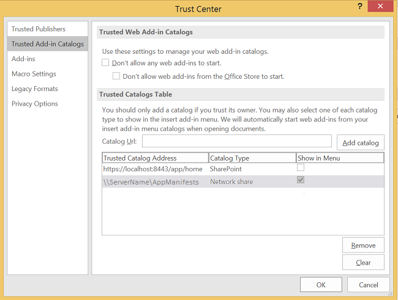

# Create your first task pane add-in for Project 2013 by using a text editor

You can create a task pane add-in for Project Standard 2013 or Project Professional 2013 by using Visual Studio 2015 to create a complex web application or by using a text editor to create files for a local add-in. This article describes how to create a simple add-in that uses an XML manifest that points to an HTML file on a file share. The Project OM Test sample add-in tests some JavaScript functions that use the object model for add-ins. After you use the  **Trust Center** in Project 2013 to register the file share that contains the manifest file, you can open the task pane add-in from the **PROJECT** tab on the ribbon. (The sample code in this article is based on a test application by Arvind Iyer, Microsoft Corporation.)

Project 2013 uses the same add-in manifest schema that other Microsoft Office 2013 clients use, and much of the same JavaScript API. The complete code for the add-in that is described in this article is available in the  `Samples\Apps` subdirectory of the Project 2013 SDK download.

Project OM Test sample add-in can get the GUID of a task and properties of the application and the active project. If Project Professional 2013 opens a project that is in a SharePoint library, the add-in can show the URL of the project. The [Project 2013 SDK download](https://www.microsoft.com/en-us/download/details.aspx?id=30435%20) includes the complete source code. When you extract and install the SDK and samples that are in the Project2013SDK.msi file, see the `\Samples\Apps\Copy_to_AppManifests_FileShare` subdirectory for the manifest file and the `\Samples\Apps\Copy_to_AppSource_FileShare` subdirectory for the source code. The JSOMCall.html sample uses JavaScript functions in the office.js file and project-15.js file, which are included. You can use the corresponding debug files (office.debug.js and project-15.debug.js) to examine the functions.
For an introduction to using JavaScript in Office Add-ins, see [Understanding the JavaScript API for Office](../../docs/develop/understanding-the-javascript-api-for-office.md).

## Procedure 1. To create the add-in manifest file


- Create an XML file in a local directory. The XML file includes the  **OfficeApp** element and child elements, which are described in the [Office Add-ins XML manifest](../../docs/overview/add-in-manifests.md). For example, create a file named JSOM_SimpleOMCalls.xml that contains the following XML (change the GUID value of the **Id** element).
    
   ```XML
     <?xml version="1.0" encoding="utf-8"?>
   <OfficeApp xmlns="http://schemas.microsoft.com/office/appforoffice/1.1" 
              xmlns:xsi="http://www.w3.org/2001/XMLSchema-instance" 
              xsi:type="TaskPaneApp">
     <Id>93A26520-9414-492F-994B-4983A1C7A607</Id>
     <Version>15.0</Version>
     <ProviderName>Microsoft</ProviderName>
     <DefaultLocale>en-us</DefaultLocale>
     <DisplayName DefaultValue="Project OM Test">
       <Override Locale="fr-fr" Value="Le Project OM Test"/>
     </DisplayName>
     <Description DefaultValue="Test the task pane add-in object model for Project - English (US)">
       <Override Locale="fr-fr" Value="Test the task pane add-in object model for Project - French (France)"/>
     </Description>
     <Hosts>
       <Host Name="Project"/>
       <Host Name="Workbook"/>
       <Host Name="Document"/>
     </Hosts>
    <DefaultSettings>
       <SourceLocation DefaultValue="\\ServerName\AppSource\JSOMCall.html">
         <Override Locale="fr-fr" Value="\\ServerName\AppSource\JSOMCall.html"/>
       </SourceLocation>
     </DefaultSettings>
     <Permissions>ReadWriteDocument</Permissions>
     <IconUrl DefaultValue="http://officeimg.vo.msecnd.net/_layouts/images/general/office_logo.jpg">
       <Override Locale="fr-fr" Value="http://officeimg.vo.msecnd.net/_layouts/images/general/office_logo.jpg"/>
     </IconUrl>
     <AllowSnapshot>true</AllowSnapshot>
   </OfficeApp>
   ```


    For Project, the  **OfficeApp** element must include the `xsi:type="TaskPaneApp"` attribute value. The **Id** element is a GUID. The **SourceLocation** value must be a file share path or a SharePoint URL for the add-in HTML source file or the web application that runs in the task pane. For an explanation of the other elements in manifest file, see [Task pane add-ins for Project](../project/project-add-ins.md).
    
Procedure 2 shows how to create the HTML file that the JSOM_SimpleOMCalls.xml manifest specifies for the Project test add-in. Buttons that are specified in the HTML file call related JavaScript functions. You can add the JavaScript functions within the HTML file, or put them in a separate .js file.

## Procedure 2. To create the source files for the Project OM Test add-in


1. Create an HTML file with a name that is specified by the  **SourceLocation** element in the JSOM_SimpleOMCalls.xml manifest. For example, create theJSOMCall.html file in the `C:\Project\AppSource` directory. Although you can use a simple text editor to create the source files, it is easier to use a tool such as Visual Studio 2015, which works with specific document types (such as HTML and JavaScript) and has other editing aids. If you have not already done the Bing Search example that is described in [Task pane add-ins for Project](../project/project-add-ins.md), Procedure 3 shows how to create the  `\\ServerName\AppSource` file share that the manifest specifies.
    
    The JSOMCall.html file uses the common MicrosoftAjax.js file for AJAX functionality and the Office.js file for the add-in functionality in Microsoft Office 2013 applications.
    


```HTML
  <!DOCTYPE html>
<html>
<head>
    <title>Project OM Sample Code</title>
    <meta http-equiv="X-UA-Compatible" content="IE=Edge" />
    <script type="text/javascript" src="MicrosoftAjax.js"></script>

    <!-- Use the CDN reference to office.js when deploying your add-in. -->
    <!-- <script src="https://appsforoffice.microsoft.com/lib/1/hosted/Office.js"></script> -->
    <script type="text/javascript" src="Office.js"></script>
    <script type="text/javascript" src="JSOM_Sample.js"></script>
</head>
<body>
    <div id="Common_JSOM_API">
        OBJECT MODEL TESTS
    </div>

    <textarea id="text" rows="6" cols="25">This is the text result.</textarea>
</body>
</html>
```


    The  **textarea** element specifies a text box that shows results of the JavaScript functions.
    
     >**Note**  For the Project OM Test sample to work, copy the following files from the Project 2013 SDK download to the same directory as the JSOMCall.html file: Office.js, Project-15.js, and MicrosoftAjax.js.

    Step 2 adds the JSOM_Sample.js file for specific functions that the Project OM Test sample add-in uses. In later steps, you will add other HTML elements for buttons that call JavaScript functions.
    
2. Create a JavaScript file named JSOM_Sample.js in the same directory as the JSOMCall.html file. The following code gets the application context and document information by using functions in the Office.js file. The **text** object is the ID of the **textarea** control in the HTML file.
    
    The  **_projDoc** variable is initialized with a **ProjectDocument** object. The code includes some simple error handling functions, and the **getContextValues** function that gets application context and project document context properties. For more information about the JavaScript object model for Project, see [JavaScript API for Office](../../reference/javascript-api-for-office.md).
    


```js
  /*
* JavaScript functions for the Project OM Test example app
* in the Project 2013 SDK.
*/

var _projDoc;
var _app;
var taskGuid;
var resourceGuid;

// The initialize function is required for all add-ins.
Office.initialize = function (reason) {
    // Checks for the DOM to load using the jQuery ready function.
    $(document).ready(function () {
        // After the DOM is loaded, app-specific code can run.
        _projDoc = Office.context.document;
        _app = Office.context;
    });
}

function logError(errorText) {
    text.value = "Error in " + errorText;
}

function logEventError(erroneousEvent) {
    logError("event " + erroneousEvent);
}

function logMethodError(methodName, errorName, errorMessage) {
    logError(methodName + " method.\nError name: " + errorName + "\nMessage: " + errorMessage);
}

// . . . Add other JavaScript functions here.

function getContextValues() {
    getDocumentUrl();
    getDocumentMode();
    getApplicationContentLanguage();
    getApplicationDisplayLanguage();
}

function getDocumentUrl() {
    text.value ="Document URL:\n" +_projDoc.url;
}

function getDocumentMode() {
    var docMode = _projDoc.mode;
    text.value = text.value + "\n\nDocument mode: " + docMode;
}

function getApplicationContentLanguage() {
    text.value = text.value + "\nApp language: " + _app.contentLanguage;
}

function getApplicationDisplayLanguage() {
    text.value = text.value + "\nDisplay language: " + _app.displayLanguage;
}
```


    For information about the functions in the Office.debug.js file, see [JavaScript API for Office](../../reference/javascript-api-for-office.md). For example, the  **getDocumentUrl** function gets the URL or file path of the open project.
    
3. Add JavaScript functions that call asynchronous functions in Office.js and Project-15.js to get selected data:
    
      - For example,  **getSelectedDataAsync** is a general function in Office.js that gets unformatted text for the selected data. For more information, see [AsyncResult object](../../reference/shared/asyncresult.md).
    
  - The  **getSelectedTaskAsync** function in Project-15.js gets the GUID of the selected task. Similarly, the **getSelectedResourceAsync** function gets the GUID of the selected resource. If you call those functions when a task or a resource is not selected, the functions show an undefined error.
    
  - The  **getTaskAsync** function gets the task name and the names of the assigned resources. If the task is in a synchronized SharePoint task list, **getTaskAsync** gets the task ID in the SharePoint list; otherwise, the SharePoint task ID is 0.
    
     >**Note**  For demonstration purposes, the example code includes a bug. If  **taskGuid** is undefined, the **getTaskAsync** function errors off. If you get a valid task GUID and then select a different task, the **getTaskAsync** function gets data for the most recent task that was operated on by the **getSelectedTaskAsync** function.
  -  **getTaskFields**,  **getResourceFields**, and  **getProjectFields** are local functions that call **getTaskFieldAsync**,  **getResourceFieldAsync**, or  **getProjectFieldAsync** multiple times to get specified fields of a task or a resource. In the project-15.debug.js file, the **ProjectTaskFields** enumeration and the **ProjectResourceFields** enumeration show which fields are supported.
    
  - The  **getSelectedViewAsync** function gets the type of view (defined in the **ProjectViewTypes** enumeration in project-15.debug.js) and the name of the view.
    
  - If the project is synchronized with a SharePoint tasks list, the  **getWSSUrlAsync** function gets the URL and the name of the tasks list. If the project is not synchronized with a SharePoint tasks list, the **getWSSUrlAsync** function errors off.
    
     >**Note**  To get the SharePoint URL and name of the tasks list, we recommend that you use the  **getProjectFieldAsync** function with the **WSSUrl** and **WSSList** constants in the [ProjectProjectFields](../../reference/shared/projectprojectfields-enumeration.md) enumeration.

    Each of the functions in the following code includes an anonymous function that is specified by  `function (asyncResult)`, which is a callback that gets the asynchronous result. Instead of anonymous functions, you could use named functions, which can help with maintainability of complex add-ins.
    


```js
  // Get the data in the selected cells of the grid in the active view.
function getSelectedDataAsync() {
    _projDoc.getSelectedDataAsync(
        Office.CoercionType.Text,
        { ValueFormat: "Formatted" },
        function (asyncResult) {
            if (asyncResult.status == Office.AsyncResultStatus.Succeeded)
                text.value = asyncResult.value;
            else
                logMethodError("getSelectedDataAsync", asyncResult.error.name,
                               asyncResult.error.message);
        }
    );
}

// Get the GUID of the selected task.
function getSelectedTaskAsync() {
    _projDoc.getSelectedTaskAsync(function (asyncResult) {
        if (asyncResult.status == Office.AsyncResultStatus.Succeeded) {
            text.value = asyncResult.value;
            taskGuid = asyncResult.value;
        }
        else {
            logMethodError("getSelectedTaskAsync", asyncResult.error.name,
                               asyncResult.error.message);
        }
    });
}

// Get the GUID of the selected resource.
function getSelectedResourceAsync() {
    _projDoc.getSelectedResourceAsync(function (asyncResult) {
        if (asyncResult.status == Office.AsyncResultStatus.Succeeded) {
            text.value = asyncResult.value;
            resourceGuid = asyncResult.value;
        }
        else {
            logMethodError("getSelectedResourceAsync", asyncResult.error.name,
                               asyncResult.error.message);
        }
    });
}

// Get data for the specified task.
function getTaskAsync() {
    if (taskGuid != undefined) {
        _projDoc.getTaskAsync(
            taskGuid,
            function (asyncResult) {
                if (asyncResult.status === Office.AsyncResultStatus.Failed) {
                    logMethodError("getTaskAsync", asyncResult.error.name,
                               asyncResult.error.message);
                } else {
                    var taskInfo = asyncResult.value;
                    var taskOutput = "Task name: " + taskInfo.taskName +
                                     "\nGUID: " + taskGuid +
                                     "\nWSS Id: " + taskInfo.wssTaskId +
                                     "\nResourceNames: " + taskInfo.resourceNames;
                    text.value = taskOutput;
                }
            }
        );
    } else {
        text.value = 'Task GUID not valid:\n' + taskGuid;
    } 
}

// Get additional data for task fields.
function getTaskFields() {
    text.value = "";

    _projDoc. getTaskFieldAsync(taskGuid, Office.ProjectTaskFields.Name,
        function (asyncResult) {
            if (asyncResult.status == Office.AsyncResultStatus.Succeeded) {
                text.value = text.value + "Name: "
                    + asyncResult.value.fieldValue + "\n";
            }
            else {
                logMethodError("getTaskFieldAsync", asyncResult.error.name,
                               asyncResult.error.message);
            }
        }
    );

    _projDoc.getTaskFieldAsync(taskGuid, Office.ProjectTaskFields.ID,
        function (asyncResult) {
            if (asyncResult.status == Office.AsyncResultStatus.Succeeded) {
                text.value = text.value + "ID: "
                    + asyncResult.value.fieldValue + "\n";
            }
            else {
                logMethodError("getTaskFieldAsync", asyncResult.error.name,
                               asyncResult.error.message);
            }
        }
    );

    _projDoc.getTaskFieldAsync(taskGuid, Office.ProjectTaskFields.Start,
        function (asyncResult) {
            if (asyncResult.status == Office.AsyncResultStatus.Succeeded) {
                text.value = text.value + "Start: "
                    + asyncResult.value.fieldValue + "\n";
            }
            else {
                logMethodError("getTaskFieldAsync", asyncResult.error.name,
                               asyncResult.error.message);
            }
        }
    );

    _projDoc.getTaskFieldAsync(taskGuid, Office.ProjectTaskFields.Duration,
        function (asyncResult) {
            if (asyncResult.status == Office.AsyncResultStatus.Succeeded) {
                text.value = text.value + "Duration: "
                    + asyncResult.value.fieldValue + "\n";
            }
            else {
                logMethodError("getTaskFieldAsync", asyncResult.error.name,
                               asyncResult.error.message);
            }
        }
    );

    _projDoc.getTaskFieldAsync(taskGuid, Office.ProjectTaskFields.Priority,
        function (asyncResult) {
            if (asyncResult.status == Office.AsyncResultStatus.Succeeded) {
                text.value = text.value + "Priority: "
                    + asyncResult.value.fieldValue + "\n";
            }
            else {
                logMethodError("getTaskFieldAsync", asyncResult.error.name,
                               asyncResult.error.message);
            }
        }
    );

    _projDoc.getTaskFieldAsync(taskGuid, Office.ProjectTaskFields.Notes,
        function (asyncResult) {
            if (asyncResult.status == Office.AsyncResultStatus.Succeeded) {
                text.value = text.value + "Notes: "
                    + asyncResult.value.fieldValue + "\n";
            }
            else {
                logMethodError("getTaskFieldAsync", asyncResult.error.name,
                               asyncResult.error.message);
            }
        }
    ); 
}

// Get data for the specified resource fields.
function getResourceFields() {
    text.value = "";

    _projDoc.getResourceFieldAsync(resourceGuid, Office.ProjectResourceFields.Name,
        function (asyncResult) {
            if (asyncResult.status == Office.AsyncResultStatus.Succeeded) {
                text.value = text.value + "Resource name: " + asyncResult.value.fieldValue + "\n";
            }
            else {
                logMethodError("getResourceFieldAsync", asyncResult.error.name,
                               asyncResult.error.message);
            }
        }
    );

    _projDoc.getResourceFieldAsync(resourceGuid, Office.ProjectResourceFields.Cost,
        function (asyncResult) {
            if (asyncResult.status == Office.AsyncResultStatus.Succeeded) {
                text.value = text.value + "Cost: " + asyncResult.value.fieldValue + "\n";
            }
            else {
                logMethodError("getResourceFieldAsync", asyncResult.error.name,
                               asyncResult.error.message);
            }
        }
    );

    _projDoc.getResourceFieldAsync(resourceGuid, Office.ProjectResourceFields.StandardRate,
        function (asyncResult) {
            if (asyncResult.status == Office.AsyncResultStatus.Succeeded) {
                text.value = text.value + "Standard Rate: " + asyncResult.value.fieldValue + "\n";
            }
            else {
                logMethodError("getResourceFieldAsync", asyncResult.error.name, asyncResult.error.message);
            }
        }
    );

    _projDoc.getResourceFieldAsync(resourceGuid, Office.ProjectResourceFields.ActualCost,
        function (asyncResult) {
            if (asyncResult.status == Office.AsyncResultStatus.Succeeded) {
                text.value = text.value + "Actual Cost: " + asyncResult.value.fieldValue + "\n";
            }
            else {
                logMethodError("getResourceFieldAsync", asyncResult.error.name, asyncResult.error.message);
            }
        }
    );

    _projDoc.getResourceFieldAsync(resourceGuid, Office.ProjectResourceFields.ActualWork,
        function (asyncResult) {
            if (asyncResult.status == Office.AsyncResultStatus.Succeeded) {
                text.value = text.value + "Actual Work: " + asyncResult.value.fieldValue + "\n";
            }
            else {
                logMethodError("getResourceFieldAsync", asyncResult.error.name,
                               asyncResult.error.message);
            }
        }
    );

    _projDoc.getResourceFieldAsync(resourceGuid, Office.ProjectResourceFields.Units,
        function (asyncResult) {
            if (asyncResult.status == Office.AsyncResultStatus.Succeeded) {
                text.value = text.value + "Units: " + asyncResult.value.fieldValue + "\n";
            }
            else {
                logMethodError("getResourceFieldAsync", asyncResult.error.name,
                               asyncResult.error.message);
            }
        }
    );
}

// Get the URL and list name of the synchronized SharePoint task list.
// Recommended: use getProjectField instead.
function getWSSUrlAsync() {
    _projDoc.getWSSUrlAsync(function (asyncResult) {
        if (asyncResult.status == Office.AsyncResultStatus.Succeeded) {
            text.value = "SharePoint URL:\n" + asyncResult.value.serverUrl
                + "\nList name: " + asyncResult.value.listName;
        }
        else {
            logMethodError("getWSSUrlAsync", asyncResult.error.name, asyncResult.error.message);
        }
    });
}

// Get the type and name of the selected view.
function getSelectedViewAsync() {
    _projDoc.getSelectedViewAsync(function (asyncResult) {
        text.value = "View type: " + asyncResult.value.viewType
            + "\nName: " + asyncResult.value.viewName;
    });
}

// Get information about the active project.
function getProjectFields() {
    text.value = "";

    _projDoc.getProjectFieldAsync(Office.ProjectProjectFields.GUID,
        function (asyncResult) {
            if (asyncResult.status == Office.AsyncResultStatus.Succeeded) {
                text.value = text.value + "Project GUID: " + asyncResult.value.fieldValue + "\n";
            }
            else {
                logMethodError("getProjectFieldAsync", asyncResult.error.name, asyncResult.error.message);
            }
        }
    );

    _projDoc.getProjectFieldAsync(Office.ProjectProjectFields.Start,
        function (asyncResult) {
            if (asyncResult.status == Office.AsyncResultStatus.Succeeded) {
                text.value = text.value + "\nStart: " + asyncResult.value.fieldValue + "\n";
            }
            else {
                logMethodError("getProjectFieldAsync", asyncResult.error.name, asyncResult.error.message);
            }
        }
    );

    _projDoc.getProjectFieldAsync(Office.ProjectProjectFields.Finish,
        function (asyncResult) {
            if (asyncResult.status == Office.AsyncResultStatus.Succeeded) {
                text.value = text.value + "\nFinish: " + asyncResult.value.fieldValue + "\n";
            }
            else {
                logMethodError("getProject " + errorText);
            }
        }
    );

    _projDoc.getProjectFieldAsync(Office.ProjectProjectFields.CurrencyDigits,
        function (asyncResult) {
            if (asyncResult.status == Office.AsyncResultStatus.Succeeded) {
                text.value = text.value + "\nCurrency digits: " + asyncResult.value.fieldValue + "\n";
            }
            else {
                logMethodError("getProjectFieldAsync", asyncResult.error.name, asyncResult.error.message);
            }
        }
    );


    _projDoc.getProjectFieldAsync(Office.ProjectProjectFields.CurrencySymbol,
        function (asyncResult) {
            if (asyncResult.status == Office.AsyncResultStatus.Succeeded) {
                text.value = text.value + "Currency symbol: " + asyncResult.value.fieldValue + "\n";
            }
            else {
                logMethodError("getProjectFieldAsync", asyncResult.error.name, asyncResult.error.message);
            }
        }
    );

    _projDoc.getProjectFieldAsync(Office.ProjectProjectFields.CurrencySymbolPosition,
        function (asyncResult) {
            if (asyncResult.status == Office.AsyncResultStatus.Succeeded) {
                text.value = text.value + "\nSymbol position: " + asyncResult.value.fieldValue + "\n";
            }
            else {
                logMethodError("getProjectFieldAsync", asyncResult.error.name, asyncResult.error.message);
            }
        }
    );

    _projDoc.getProjectFieldAsync(Office.ProjectProjectFields.ProjectServerUrl,
        function (asyncResult) {
            if (asyncResult.status == Office.AsyncResultStatus.Succeeded) {
                text.value = text.value + "\nProject web app URL:\n  " + asyncResult.value.fieldValue + "\n";
            }
            else {
                logMethodError("getProjectFieldAsync", asyncResult.error.name, asyncResult.error.message);
            }
        }
    );

    _projDoc.getProjectFieldAsync(Office.ProjectProjectFields.WSSUrl,
        function (asyncResult) {
            if (asyncResult.status == Office.AsyncResultStatus.Succeeded) {
                text.value = text.value + "\nSharePoint URL:\n  " + asyncResult.value.fieldValue + "\n";
            }
            else {
                logMethodError("getProjectFieldAsync", asyncResult.error.name, asyncResult.error.message);
            }
        }
    );

    _projDoc.getProjectFieldAsync(Office.ProjectProjectFields.WSSList,
        function (asyncResult) {
            if (asyncResult.status == Office.AsyncResultStatus.Succeeded) {
                text.value = text.value + "\nSharePoint list: " + asyncResult.value.fieldValue + "\n";
            }
            else {
                logMethodError("getProjectFieldAsync", asyncResult.error.name, asyncResult.error.message);
            }
        }
    );
}
```

4. Add JavaScript event handler callbacks and functions to register the task selection, resource selection, and view selection change event handlers and to unregister the event handlers. The  **manageEventHandlerAsync** function adds or removes the specified event handler, depending on the _operation_ parameter. The operation can be **addHandlerAsync** or **removeHandlerAsync**.
    
    The  **manageTaskEventHandler**,  **manageResourceEventHandler**, and  **manageViewEventHandler** functions can add or remove an event handler, as specified by the _docMethod_ parameter.
    


```js
  // Task selection changed event handler.
function onTaskSelectionChanged(eventArgs) {
    text.value = "In task selection change event handler";
}

// Resource selection changed event handler.
function onResourceSelectionChanged(eventArgs) {
    text.value = "In Resource selection changed event handler";
}

// View selection changed event handler.
function onViewSelectionChanged(eventArgs) {
    text.value = "In View selection changed event handler";
}

// Add or remove the specified event handler.
function manageEventHandlerAsync(eventType, handler, operation, onComplete) {
    _projDoc[operation]   //The operation is addHandlerAsync or removeHandlerAsync.
    (
        eventType,
        handler,
        function (asyncResult) {
            if (onComplete) {
                onComplete(asyncResult, operation);
            } else {
                var message = "Operation: " + operation;
                message = message + "\nStatus: " + asyncResult.status + "\n";
                text.value = message;
            }
        }
    );
}

// Write the asyncResult status from the manageEventHandlerAsync function (optional). 
function onComplete(asyncResult, operation) {
    var message = "In onComplete function for " + operation;
    message = message + "\nStatus: " + asyncResult.status;
    text.value = message;
}

// Add or remove a task selection changed event handler.
function manageTaskEventHandler(docMethod) {
    manageEventHandlerAsync(
        Office.EventType.TaskSelectionChanged,      // The task selection changed event.
        onTaskSelectionChanged,                     // The event handler.
        docMethod,                // The Office.Document method to add or remove an event handler.
        onComplete                // Manages the successful asyncResult data (optional).
    );
}

// Add or remove a resource selection changed event handler.
function manageResourceEventHandler(docMethod) {
    manageEventHandlerAsync(
        Office.EventType.ResourceSelectionChanged,  // The resource selection changed event.
        onResourceSelectionChanged,                 // The event handler.
        docMethod,                // The Office.Document method to add or remove an event handler.
        onComplete                // Manages the successful asyncResult data (optional).
    );
}

// Add or remove a view selection changed event handler.
function manageViewEventHandler(docMethod) {
    manageEventHandlerAsync(
        Office.EventType.ViewSelectionChanged,      // The view selection changed event.
        onViewSelectionChanged,                     // The event handler.
        docMethod,                // The Office.Document method to add or remove an event handler.
        onComplete                // Manages the successful asyncResult data (optional).
    );
}
```

5. For the body of the HTML document, add buttons that call the JavaScript functions for testing. For example, in the  **div** element for the common JSOM API, add an input button that calls the general **getSelectedDataAsync** function.
    
```HTML
  <body>
    <div id="Common_JSOM_API">
    OBJECT MODEL TESTS
    <br /><br />       
    <strong>General function:</strong>
    <br />
    <input id="Button5" class="button-wide" type="button" onclick="getSelectedDataAsync()" 
        value="getSelectedDataAsync" />
    </div>
   <!--  more code . . .  -->
```

6. Add a  **div** section with buttons for project-specific task functions and for the **TaskSelectionChanged** event.
    
```HTML
  <div id="ProjectSpecificTask">
  <br />
  <strong>Project-specific task methods:</strong><br />
  <button class="button-wide" onclick="getSelectedTaskAsync()">getSelectedTaskAsync</button><br />
  <button class="button-wide" onclick="getTaskAsync()">getTaskAsync</button><br />
  <button class="button-wide" onclick="getTaskFields()">Get Task Fields</button><br />
  <button class="button-wide" onclick="getWSSUrlAsync()">getWSSUrlAsync</button>
  <strong>Task selection changed:</strong>
  <button class="button-narrow" onclick="manageTaskEventHandler('addHandlerAsync')">Add</button>
  <button class="button-narrow" onclick="manageTaskEventHandler('removeHandlerAsync')">Remove</button>         
</div>
```

7. Add  **div** sections with buttons for the resource methods and events, view methods and events, project properties, and context properties
    
```HTML
  <div id="ResourceMethods">
  <br />
  <strong>Resource methods:</strong>
  <button class="button-wide" onclick="getSelectedResourceAsync()">getSelectedResourceAsync</button><br />
  <button class="button-wide" onclick="getResourceFields()">Get Resource Fields</button><br />
  <strong>Resource selection changed:</strong>
  <button class="button-narrow" onclick="manageResourceEventHandler('addHandlerAsync')">Add</button>
  <button class="button-narrow" onclick="manageResourceEventHandler('removeHandlerAsync')">Remove</button>
</div>
<div id="ViewMethods">
  <br />
  <strong>View method:</strong>
  <button class="button-wide" onclick="getSelectedViewAsync()">getSelectedViewAsync</button><br />
  <strong>View selection changed:</strong>
  <button class="button-narrow" onclick="manageViewEventHandler('addHandlerAsync')">Add</button>
  <button class="button-narrow" onclick="manageViewEventHandler('removeHandlerAsync')">Remove</button>         
</div>
<div id="ProjectMethods">
  <br />
  <strong>Project properties:</strong>
  <button class="button-wide" onclick="getProjectFields()">Get Project Fields</button><br />
</div>
<div id="ContextVariables">
  <br />
  <strong>Context properties:</strong>
  <button class="button-wide" onclick="getContextValues()">Get Context Values</button>
</div>
```

8. To format the button elements, add a CSS  **style** element. For example, add the following as a child of the **head** element.
    
```HTML
  <style type="text/css">
    .button-wide
    {
        width: 210px;
        margin-top: 2px;
    }
    .button-narrow
    {
        width: 80px;
        margin-top: 2px;
    }
</style>
```


     >**Note**  The  **Task Pane Add-in (Project)** template in Visual Studio 2015 includes default .css files for a common look and feel of add-ins.
Procedure 3 shows how to install and use the Project OM Test add-in features.

## Procedure 3. To install and use the Project OM Test add-in


1. Create a file share for the directory that contains the JSOM_SimpleOMCalls.xml manifest. You can create the file share on the local computer or on a remote computer that is accessible on the network. For example, if the manifest is in the  `C:\Project\AppManifests` directory on the local computer, run the following command:
    
```
  Net share AppManifests=C:\Project\AppManifests
```


    For more information, see [Create a network shared folder catalog for task pane and content add-ins](../publish/create-a-network-shared-folder-catalog-for-task-pane-and-content-add-ins.md).
    
2. Create a file share for the directory that contains the HTML and JavaScript files for the Project OM Test add-in. Ensure the file share path matches the path that is specified in the JSOM_SimpleOMCalls.xml manifest. For example, if the files are in the  `C:\Project\AppSource` directory on the local computer, run the following command:
    
```
  net share AppSource=C:\Project\AppSource
```

3. In Project, open the  **Project Options** dialog box, choose **Trust Center**, and then choose  **Trust Center Settings**.
    
    The procedure for registering an add-in is also described in [Task pane add-ins for Project](../project/project-add-ins.md), with additional information.
    
4. In the  **Trust Center** dialog box, in the left pane, choose **Trusted Add-in Catalogs**.
    
5. If you have already added the  `\\ServerName\AppManifests` path for the Bing Search add-in, skip this step. Otherwise, in the **Trusted Add-in Catalogs** pane, add the `\\ServerName\AppManifests` path in the **Catalog Url** text box, choose **Add catalog**, enable the network share as a default source (see Figure 1), and then choose  **OK**.
    
    **Figure 1. Adding a network file share for add-in manifests**

    

6. After you add new add-ins, or change the source code, restart Project. On the  **PROJECT** ribbon, choose the **Office Add-ins** drop-down menu, and then choose **See All**. In the  **Insert Add-in** dialog box, choose **SHARED FOLDER** (see Figure 2), select **Project OM Test**, and then choose  **Insert**. The Project OM Test add-in starts in a task pane.
    
    **Figure 2. Starting the Project OM Test add-in that is on a file share**

    

7. In Project, create and save a simple project that has at least two tasks. For example, create tasks named T1, T2, and a milestone named M1, and then set the task durations and predecessors to be similar to those in Figure 3. Choose the  **PROJECT** tab on the ribbon, select the entire row for task T2, and then choose the **getSelectedDataAsync** button in the task pane. Figure 3 shows the data that is selected in the text box of the **Project OM Test** add-in.
    
    **Figure 3. Using the Project OM Test add-in**

    

8. Select the cell in the  **Duration** column for the first task, and then choose the **getSelectedDataAsync** button in the **Project OM Test** add-in. The **getSelectedDataAsync** function sets the text box value to show `2 days`. 
    
9. Select the three  **Duration** cells for all three tasks. The **getSelectedDataAsync** function returns semicolon-separated text values for cells selected in different rows, for example, `2 days;4 days;0 days`.
    
    The  **getSelectedDataAsync** function returns comma-separated text values for cells selected within a row. For example in Figure 3, the entire row for task T2 is selected. When you choose **getSelectedDataAsync**, the text box shows the following:  `,Auto Scheduled,T2,4 days,Thu 6/14/12,Tue 6/19/12,1,,<NA>`
    
    The  **Indicators** column and the **Resource Names** column are both empty, so the text array shows empty values for those columns. The `<NA>` value is for the **Add New Column** cell.
    
10. Select any cell in the row for task T2, or the entire row for task T2, and then choose  **getSelectedTaskAsync**. The text box shows the task GUID value, for example,  `{25D3E03B-9A7D-E111-92FC-00155D3BA208}`. Project stores that value in the global  **taskGuid** variable of the **Project OM Test** add-in.
    
11. Choose  **getTaskAsync**. If the  **taskGuid** variable contains the GUID for task T2, the text box displays the task information. The **ResourceNames** value is empty.
    
    Create two local resources R1 andR2, assign them to task T2 at 50% each, and choose  **getTaskAsync** again. The results in the text box include the resource information. If the task is in a synchronized SharePoint task list, the results also include the SharePoint task ID.
    


```
  Task name: T2
GUID: {25D3E03B-9A7D-E111-92FC-00155D3BA208}
WSS Id: 0
ResourceNames: R1[50%],R2[50%]
```

12. Choose the  **Get Task Fields** button. The **getTaskFields** function calls the **getTaskfieldAsync** function multiple times for the task name, index, start date, duration, priority, and task notes.
    
```
  Name: T2
ID: 2
Start: Thu 6/14/12
Duration: 4d
Priority: 500
Notes: This is a note for task T2. It is only a test note. If it had been a real note, there would be some real information.
```

13. Choose the  **getWSSUrlAsync** button. If the project is one of the following kinds, the results show the task list URL and name.
    
      - A SharePoint task list that was imported to Project Server.
    
  - A SharePoint task list that was imported to Project Professional, and then saved back in SharePoint (not using Project Server).
    
     >**Note**  If Project Professional is installed on a Windows Server computer, to be able to save the project back to SharePoint, you can use the  **Server Manager** to add the **Desktop Experience** feature.

    If the project is a local project, or if you use Project Professional to open a project that is managed by Project Server, the  **getWSSUrlAsync** method shows an undefined error.
    


```
  SharePoint URL: http://ServerName
List name: Test task list
```

14. Choose the  **Add** button in the **TaskSelectionChanged event** section, which calls the **manageTaskEventHandler** function to register a task selection changed event and returns `In onComplete function for addHandlerAsync Status: succeeded` in the text box. Select a different task; the text box shows `In task selection changed event handler`, which is the output of the callback function for the task selection changed event. Choose the  **Remove** button to unregister the event handler.
    
15. To use the resource methods, first select a view such as  **Resource Sheet**,  **Resource Usage**, or  **Resource Form**, and then select a resource in that view. Choose  **getSelectedResourceAsync** to initialize the **resourceGuid** variable, and then choose **Get Resource Fields** to call **getResourceFieldAsync** multiple times for the resource properties. You can also add or remove the resource selection changed event handler.
    
```
  Resource name: R1
Cost: $800.00
Standard Rate: $50.00/h
Actual Cost: $0.00
Actual Work: 0h
Units: 100%
```

16. Choose  **getSelectedViewAsync** to show the type and name of the active view. You can also add or remove the view selection changed event handler. For example, if **Resource Form** is the active view, the **getSelectedViewAsync** function shows the following in the text box:
    
```
  View type: 6
Name: Resource Form
```

17. Choose  **Get Project Fields** to call the **getProjectFieldAsync** function multiple times for different properties of the active project. If the project is opened from Project Web App, the **getProjectFieldAsync** function can get the URL of the Project Web App instance.
    
```
  Project GUID: 9845922E-DAB4-E111-8AF3-00155D3BA208

Start: Tue 6/12/12
Finish: Tue 6/19/12

Currency digits: 2
Currency symbol: $
Symbol position: 0

Project web app URL:
  http://servername/pwa
```

18. Choose the  **Get Context Values** button get properties of the document and the application in which the add-in is running, by getting properties of the **Office.Context.document** object and the **Office.context.application** object. For example, if the Project1.mpp file is on the local computer desktop, the document URL is `C:\Users\UserAlias\Desktop\Project1.mpp`. If the .mpp file is in a SharePoint library, the value is the URL of the document. If you use Project Professional 2013 to open a project named Project1 from Project Web App, the document URL is  `<>\Project1`.
    
```
  Document URL:
<>\Project1
Document mode: readWrite
App language: en-US
Display language: en-US
```

19. You can refresh the add-in after you edit the source code by closing and restarting Project. In the  **Project** ribbon, the **Office Add-ins** drop-down list maintains the list of recently used add-ins.
    

## Example


The Project 2013 SDK download contains the complete code in the JSOMCall.html file, the JSOM_Sample.js file, and the related Office.js, Office.debug.js, Project-15.js, and Project-15.debug.js files. Following is the code in the JSOMCall.html file.


```HTML
<!DOCTYPE html>
<html>
    <head>
        <title>Project OM Sample Code</title>
        <meta http-equiv="X-UA-Compatible" content="IE=Edge"/>

        <script type="text/javascript" src="MicrosoftAjax.js"></script>

        <!-- Use the CDN reference to office.js when deploying your add-in. -->
        <!-- <script src="https://appsforoffice.microsoft.com/lib/1/hosted/Office.js"></script> -->
        <script type="text/javascript" src="Office.js"></script>
        <script type="text/javascript" src="JSOM_Sample.js"></script>

        <style type="text/css">           
            .button-wide {
                width: 210px;
                margin-top: 2px;
            }
            .button-narrow 
            {
                width: 80px;
                margin-top: 2px;
            }
        </style>
    </head>

    <body>
      <div id="Common_JSOM_API">
        OBJECT MODEL TESTS
        <br /><br />       
        <strong>General method:</strong>
        <br />
        <input id="Button5" class="button-wide" type="button" onclick="getSelectedDataAsync()" 
            value="getSelectedDataAsync" />
      </div>

      <div id="ProjectSpecificTask">
        <br />
        <strong>Project-specific task methods:</strong><br />
        <button class="button-wide" onclick="getSelectedTaskAsync()">getSelectedTaskAsync</button><br />
        <button class="button-wide" onclick="getTaskAsync()">getTaskAsync</button><br />
        <button class="button-wide" onclick="getTaskFields()">Get Task Fields</button><br />
        <button class="button-wide" onclick="getWSSUrlAsync()">getWSSUrlAsync</button>
        <strong>Task selection changed:</strong>
        <button class="button-narrow" onclick="manageTaskEventHandler('addHandlerAsync')">Add</button>
        <button class="button-narrow" onclick="manageTaskEventHandler('removeHandlerAsync')">Remove</button>         
      </div>
<div id="ResourceMethods">
  <br />
  <strong>Resource methods:</strong>
  <button class="button-wide" onclick="getSelectedResourceAsync()">getSelectedResourceAsync</button><br />
  <button class="button-wide" onclick="getResourceFields()">Get Resource Fields</button><br />
  <strong>Resource selection changed:</strong>
  <button class="button-narrow" onclick="manageResourceEventHandler('addHandlerAsync')">Add</button>
  <button class="button-narrow" onclick="manageResourceEventHandler('removeHandlerAsync')">Remove</button>
</div>
<div id="ViewMethods">
  <br />
  <strong>View method:</strong>
  <button class="button-wide" onclick="getSelectedViewAsync()">getSelectedViewAsync</button><br />
  <strong>View selection changed:</strong>
  <button class="button-narrow" onclick="manageViewEventHandler('addHandlerAsync')">Add</button>
  <button class="button-narrow" onclick="manageViewEventHandler('removeHandlerAsync')">Remove</button>         
</div>
<div id="ProjectMethods">
  <br />
  <strong>Project properties:</strong>
  <button class="button-wide" onclick="getProjectFields()">Get Project Fields</button><br />
</div>
<div id="ContextVariables">
  <br />
  <strong>Context properties:</strong>
  <button class="button-wide" onclick="getContextValues()">Get Context Values</button>
</div>

      <br />
      <textarea id="text" rows="10" cols="25">This is the text result.</textarea>
    </body>
</html
```


## Robust programming


The  **Project OM Test** add-in is an example that shows the use of some JavaScript functions for Project 2013 in the Project-15.js and Office.js files. The example is for testing only and does not include robust error checks. For example, if you do not select a resource and run the **getSelectedResourceAsync** function, the **resourceGuid** variable is not initialized, and calls to **getResourceFieldAsync** return an error. For a production add-in, you should check for specific errors and ignore the results, hide functionality that does not apply, or notify the user to choose a view and make a valid selection before using a function.

For a simple example, the error output in the following code includes the  **actionMessage** variable that specifies the action to take to avoid an error in the **getSelectedResourceAsync** function.


```js
function logError(errorText) {
    text.value = "Error in " + errorText;
}

function logMethodError(methodName, errorName, errorMessage, actionMessage) {
    logError(methodName + " method.\nError name: " + errorName
        + "\nMessage: " + errorMessage
        + "\n\nAction: " + actionMessage);
}
// Get the GUID of the selected resource.
function getSelectedResourceAsync() {
    _projDoc.getSelectedResourceAsync(function (asyncResult) {
        if (asyncResult.status == Office.AsyncResultStatus.Succeeded) {
            text.value = asyncResult.value;
            resourceGuid = asyncResult.value;
        }
        else {
            var actionMessage = "Select a resource before running the getSelectedResourceAsync method.";
            logMethodError("getSelectedResourceAsync", asyncResult.error.name,
                               asyncResult.error.message, actionMessage);
        }
    });
}
```

It is easier to develop an add-in when you use Visual Studio 2015, where you can set breakpoints to help debug the JavaScript code and quickly integrate common routines for error handling. For example, the  **HelloProject_OData** sample in the Project 2013 SDK download includes the SurfaceErrors.js file that uses the JQuery library to display a pop-up error message. Figure 4 shows the error message in a "toast" notification. The sample also includes the Office-vsdoc.js file that provides Intellisense for JavaScript functions in the Office.js file and the Project-15.js file.

The following code in the SurfaceErrors.js file includes the  **throwError** function that creates a **Toast** object.


```js
/*
 * Show error messages in a "toast" notification.
 */

// Throws a custom defined error.
function throwError(errTitle, errMessage) {
    try {
        // Define and throw a custom error.
        var customError = { name: errTitle, message: errMessage }
        throw customError;
    }
    catch (err) {
        // Catch the error and display it to the user.
        Toast.showToast(err.name, err.message);
    }
}

// Add a dynamically-created div "toast" for displaying errors to the user.
var Toast = {

    Toast: "divToast",
    Close: "btnClose",
    Notice: "lblNotice",
    Output: "lblOutput",

    // Show the toast with the specified information.
    showToast: function (title, message) {

        if (document.getElementById(this.Toast) == null) {
            this.createToast();
        }

        document.getElementById(this.Notice).innerText = title;
        document.getElementById(this.Output).innerText = message;

        $("#" + this.Toast).hide();
        $("#" + this.Toast).show("slow");
    },

    // Create the display for the toast.
    createToast: function () {
        var divToast;
        var lblClose;
        var btnClose;
        var divOutput;
        var lblOutput;
        var lblNotice;

        // Create the container div.
        divToast = document.createElement("div");
        var toastStyle = "background-color:rgba(220, 220, 128, 0.80);" +
            "position:absolute;" +
            "bottom:0px;" +
            "width:90%;" +
            "text-align:center;" +
            "font-size:11pt;";
        divToast.setAttribute("style", toastStyle);
        divToast.setAttribute("id", this.Toast);

        // Create the close button.
        lblClose = document.createElement("div");
        lblClose.setAttribute("id", this.Close);
        var btnStyle = "text-align:right;" +
            "padding-right:10px;" +
            "font-size:10pt;" +
            "cursor:default";
        lblClose.setAttribute("style", btnStyle);
        lblClose.appendChild(document.createTextNode("CLOSE "));

        btnClose = document.createElement("span");
        btnClose.setAttribute("style", "cursor:pointer;");
        btnClose.setAttribute("onclick", "Toast.close()");
        btnClose.innerText = "X";
        lblClose.appendChild(btnClose);

        // Create the div to contain the toast title and message.
        divOutput = document.createElement("div");
        divOutput.setAttribute("id", "divOutput");
        var outputStyle = "margin-top:0px;";
        divOutput.setAttribute("style", outputStyle);

        lblNotice = document.createElement("span");
        lblNotice.setAttribute("id", this.Notice);
        var labelStyle = "font-weight:bold;margin-top:0px;";
        lblNotice.setAttribute("style", labelStyle);

        lblOutput = document.createElement("span");
        lblOutput.setAttribute("id", this.Output);

        // Add the child nodes to the toast div.
        divOutput.appendChild(lblNotice);
        divOutput.appendChild(document.createElement("br"));
        divOutput.appendChild(lblOutput);
        divToast.appendChild(lblClose);
        divToast.appendChild(divOutput);

        // Add the toast div to the document body.
        document.body.appendChild(divToast);
    },

    // Close the toast.
    close: function () {
        $("#" + this.Toast).hide("slow");
    }
}
```

To use the  **throwError** function, include the JQuery library and the SurfaceErrors.js script in the JSOMCall.html file, and then add a call to **throwError** in other JavaScript functions such as **logMethodError**.


 >**Note**  Before you deploy the add-in, change the office.js reference and the jQuery reference to the content delivery network (CDN) reference. The CDN reference provides the most recent version and better performance.


```HTML
<!DOCTYPE html>
<html>
<head>
    <title>Project OM Sample Code</title>
    <meta http-equiv="X-UA-Compatible" content="IE=Edge" />

    <script type="text/javascript" src="MicrosoftAjax.js"></script>

    <!-- Use the CDN reference to Office.js and jQuery when deploying your add-in. -->
    <!-- <script src="https://appsforoffice.microsoft.com/lib/1/hosted/Office.js"></script> -->
    <script type="text/javascript" src="Office.js"></script>
    <script type="text/javascript" src="http://ajax.microsoft.com/ajax/jQuery/jquery-1.9.0.min.js"></script>

    <script type="text/javascript" src="JSOM_Sample.js"></script>
    <script type="text/javascript" src="SurfaceErrors.js"></script>

    <!-- . . . INVALID USE OF SYMBOLS
</head>

```


```js
function logMethodError(methodName, errorName, errorMessage, actionMessage) {
    logError(methodName + " method.\nError name: " + errorName
        + "\nMessage: " + errorMessage
        + "\n\nAction: " + actionMessage);

    throwError(methodName + " error", actionMessage);
}
```


**Figure 4. Functions in the SurfaceErrors.js file can show a "toast" notification**


## Additional resources


- [Task pane add-ins for Project](../project/project-add-ins.md)
    
- [Understanding the JavaScript API for add-ins](../develop/understanding-the-javascript-api-for-office.md)
    
- [JavaScript API for Office add-ins](../../reference/javascript-api-for-office.md)
    
- [Schema reference for Office Add-ins manifests (v1.1)](http://msdn.microsoft.com/library/7e0cadc3-f613-8eb9-57ef-9032cbb97f92%28Office.15%29.aspx)
    
- [Project 2013 SDK download](https://www.microsoft.com/en-us/download/details.aspx?id=30435%20)
    
