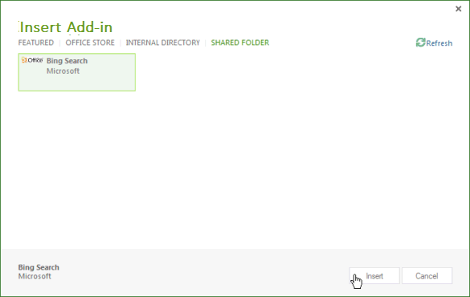

# Task pane add-ins for Project


Project Standard 2013 and Project Professional 2013 both include support for task pane add-ins. You can run general task pane add-ins that are developed for Word 2013 or Excel 2013. You can also develop custom add-ins that handle selection events in Project and integrate task, resource, view, and other cell-level data in a project with SharePoint lists, SharePoint Add-ins, Web Parts, web services, and enterprise applications.

 >**Note**  The [Project 2013 SDK download](https://www.microsoft.com/en-us/download/details.aspx?id=30435%20) includes sample add-ins that show how to use the add-in object model for Project, and how to use the OData service for reporting data in Project Server 2013. When you extract and install the SDK, see the `\Samples\Apps\` subdirectory.

For an introduction to Office Add-ins, see [Office Add-ins platform overview](../../docs/overview/office-add-ins.md).

## Add-in scenarios for Project


Project managers can use Project task pane add-ins to help with project management activities. Instead of leaving Project and opening another application to search for frequently used information, project managers can directly access the information within Project. The content in a task pane add-in can be context-sensitive, based on the selected task, resource, view, or other data in a cell in a Gantt chart, task usage view, or resource usage view.


 >**Note**  With Project Professional 2013, you can develop task pane add-ins that access on-premises installations of Project Server 2013, Project Online, and on-premises or online SharePoint 2013.Project Standard 2013 does not support direct integration with Project Server data or SharePoint task lists that are synchronized with Project Server.

Add-in scenarios for Project include the following:


-  **Project scheduling** View data from related projects that can affect scheduling. A task pane add-in can integrate relevant data from other projects in Project Server 2013. For example, you can view the departmental collection of projects and milestone dates, or view specified data from other projects that are based on a selected custom field.
    
-  **Resource management** View the complete resource pool in Project Server 2013 or a subset based on specified skills, including cost data and resource availability, to help select appropriate resources.
    
-  **Statusing and approvals** Use a web application in a task pane add-in to update or view data from an external enterprise resource planning (ERP) application, timesheet system, or accounting application. Or, create a custom status approval Web Part that can be used within both Project Web App and Project Professional 2013.
    
-  **Team communication** Communicate with team members and resources directly from a task pane add-in, within the context of a project. Or, easily maintain a set of context-sensitive notes for yourself as you work in a project.
    
-  **Work packages** Search for specified kinds of project templates within SharePoint libraries and online template collections. For example, find templates for construction projects and add them to your Project template collection.
    
-  **Related items** View metadata, documents, and messages that are related to specific tasks in a project plan. For example, you can use Project Professional 2013 to manage a project that was imported from a SharePoint task list, and still synchronize the task list with changes in the project. A task pane add-in can show additional fields or metadata that Project did not import for tasks in the SharePoint list.
    
-  **Use the Project Server object models** Use the GUID of a selected task with methods in the Project Server Interface (PSI) or the client-side object model (CSOM) of Project Server. For example, the web application for an add-in can read and update the statusing data of a selected task and resource, or integrate with an external timesheet application.
    
-  **Get reporting data** Use Representational State Transfer (REST), JavaScript, or LINQ queries to find related information for a selected task or resource in the OData service for reporting tables in Project Web App. Queries that use the OData service can be done with an online or an on-premises installation of Project Server 2013.
    
    For example, see [Create a Project add-in that uses REST with an on-premises Project Server OData  service](../project/create-a-project-add-in-that-uses-rest-with-an-on-premises-odata-service.md).
    

## Developing Project add-ins


The JavaScript library for Project add-ins includes extensions of the  **Office** namespace alias that enable developers to access properties of the Project application and tasks, resources, and views in a project. The JavaScript library extensions in the Project-15.js file are used in a Project add-in created with Visual Studio 2015. The Office.js, Office.debug.js, Project-15.js, Project-15.debug.js, and related files are also provided in the Project 2013 SDK download.

To create an add-in, you can use a simple text editor to create an HTML webpage and related JavaScript files, CSS files, and REST queries. In addition to an HTML page or a web application, an add-in requires an XML manifest file for configuration. Project can use a manifest file that includes a  **type** attribute that is specified as **TaskPaneExtension**. The manifest file can be used by multiple Office 2013 client applications, or you can create a manifest file that is specific for Project 2013. For more information, see the  _Development basics_ section in [Office Add-ins platform overview](../../docs/overview/office-add-ins.md).

For complex custom applications, and for easier debugging, we recommend that you use Visual Studio 2015 to develop websites for add-ins. Visual Studio 2015 include templates for add-in projects, where you can choose the kind of add-in (task pane, content, or mail) and the host application (Project, Word, Excel, or Outlook).  For an example that integrates with data from Project Online, see [Connecting a Project task pane add-in to PWA](http://blogs.msdn.com/b/project_programmability/archive/2012/11/02/connecting-a-project-task-pane-app-to-pwa.aspx) in the Project Programmability blog on MSDN.


 >**Note**  The Project 2013 release does not support Napa.

When you install the Project 2013 SDK download, the  `\Samples\Apps\` subdirectory includes the following sample add-ins:


-  **Bing Search:** The BingSearch.xml manifest file points to the Bing search page for mobile devices. Because the Bing web app already exists on the Internet, the Bing Search add-in does not use other source code files or the add-in object model for Project.
    
-  **Project OM Test:** The JSOM_SimpleOMCalls.xml manifest file and the JSOM_Call.html file are, together, an example that tests the object model and add-in functionality in Project 2013. The HTML file references the JSOM_Sample.js file, which has JavaScript functions that use the Office.js file and the Project-15.js file for the primary functionality. The SDK download includes all of the necessary source code files and the manifest XML file for the Project OM Test add-in. The development and installation of the Project OM Test sample is described in [Create your first task pane add-in for Project 2013 by using a text editor](../project/create-your-first-task-pane-add-in-for-project-by-using-a-text-editor.md).
    
-  **HelloProject_OData:** This is a Visual Studio solution for Project Professional 2013 that summarizes data from the active project, such as cost, work, and percent complete, and compares that with the average for all published projects in the Project Web App instance where the active project is stored. The development, installation, and testing of the sample, which uses the REST protocol with the **ProjectData** service in Project Web App, is described in [Create a Project add-in that uses REST with an on-premises Project Server OData service](../project/create-a-project-add-in-that-uses-rest-with-an-on-premises-odata-service.md).
    

### Creating an add-in manifest file


The manifest file specifies the URL of the add-in webpage or web application, the kind of add-in (task pane for Project), optional URLs of content for other languages and locales, and other properties.


### Procedure 1. To create the add-in manifest file for Bing Search


1. Create an XML file in a local directory. The XML file includes the  **OfficeApp** element and child elements, which are described in the [Office Add-ins XML manifest](../../docs/overview/add-in-manifests.md). For example, create a file named BingSearch.xml that contains the following XML.
    
 ```XML
   <?xml version="1.0" encoding="utf-8"?>
 <OfficeApp xmlns="http://schemas.microsoft.com/office/appforoffice/1.0" 
            xmlns:xsi="http://www.w3.org/2001/XMLSchema-instance" 
           xsi:type="TaskPaneApp">
   <Id>1234-5678</Id>
   <Version>15.0</Version>
   <ProviderName>Microsoft</ProviderName>
   <DefaultLocale>en-us</DefaultLocale>
   <DisplayName DefaultValue="Bing Search">
   </DisplayName>
   <Description DefaultValue="Search selected data on Bing">
   </Description>
   <IconUrl DefaultValue="http://officeimg.vo.msecnd.net/_layouts/images/general/office_logo.jpg">
   </IconUrl>
   <Capabilities>
     <Capability Name="Project"/>
   </Capabilities>
   <DefaultSettings>
     <SourceLocation DefaultValue="http://m.bing.com">
     </SourceLocation>
   </DefaultSettings>
   <Permissions>ReadWriteDocument</Permissions>
 </OfficeApp>
 ```

2. Following are the required elements in the add-in manifest:
  - In the  **OfficeApp** element, the `xsi:type="TaskPaneApp"` attribute specifies that the add-in is a task pane type.
  - The  **Id** element is a UUID and must be unique.
  - The  **Version** element is the version of the add-in. The **ProviderName** element is the name of the company or developer who provides the add-in. The **DefaultLocale** element specifies the default locale for the strings in the manifest.
  - The  **DisplayName** element is the name that shows in the **Task Pane Add-in** drop-down list in the **VIEW** tab of the ribbon in Project 2013. The value can contain up to 32 characters.
  - The  **Description** element contains the add-in description for the default locale. The value can contain up to 2000 characters.
  - The  **Capabilities** element contains one or more **Capability** child elements that specify the host application.
  - The  **DefaultSettings** element includes the **SourceLocation** element, which specifies the path of an HTML file on a file share or the URL of a webpage that the add-in uses. A task pane add-in ignores the **RequestedHeight** element and the **RequestedWidth** element.
  - The  **IconUrl** element is optional. It can be an icon on a file share or the URL of an icon in a web application.
    
3. (Optional) Add  **Override** elements that have values for other locales. For example, the following manifest provides **Override** elements for French values of **DisplayName**,  **Description**,  **IconUrl**, and  **SourceLocation**.
    
 ```XML
   <?xml version="1.0" encoding="utf-8"?>
 <OfficeApp xmlns="http://schemas.microsoft.com/office/appforoffice/1.0" 
            xmlns:xsi="http://www.w3.org/2001/XMLSchema-instance" 
           xsi:type="TaskPaneApp">
   <Id>1234-5678</Id>
   <Version>15.0</Version>
   <ProviderName>Microsoft</ProviderName>
   <DefaultLocale>en-us</DefaultLocale>
   <DisplayName DefaultValue="Bing Search">
     <Override Locale="fr-fr" Value="Bing Search"/>
   </DisplayName>
   <Description DefaultValue="Search selected data on Bing">
     <Override Locale="fr-fr" Value="Search selected data on Bing"></Override>
   </Description>
   <IconUrl DefaultValue="http://officeimg.vo.msecnd.net/_layouts/images/general/office_logo.jpg">
     <Override Locale="fr-fr" Value="http://officeimg.vo.msecnd.net/_layouts/images/general/office_logo.jpg"/>
   </IconUrl>
   <Capabilities>
     <Capability Name="Project"/>
   </Capabilities>
   <DefaultSettings>
     <SourceLocation DefaultValue="http://m.bing.com">
       <Override Locale="fr-fr" Value="http://m.bing.com"/>
     </SourceLocation>
   </DefaultSettings>
   <Permissions>ReadWriteDocument</Permissions>
 </OfficeApp>
 ```


## Installing Project add-ins


In Project 2013, you can install add-ins as stand-alone solutions on a file share, or in a private add-in catalog. You can also review and purchase add-ins in the public Office Store.

There can be multiple add-in manifest XML files and subdirectories in a file share. You can add or remove manifest directory locations and catalogs by using the  **Trusted Add-in Catalogs** tab in the **Trust Center** dialog box in Project 2013. To show an add-in in Project, the **SourceLocation** element in a manifest must point to an existing website or HTML source file.


 >**Note**  Internet Explorer 9 (or later) must be installed, but does not have to be the default browser. Office Add-ins require components in Internet Explorer 9. The default browser can be Internet Explorer 9, Safari 5.0.6, Firefox 5, Chrome 13, or a later version of one of these browsers.

In Procedure 2, the Bing Search add-in is installed on the local computer where Project 2013 is installed. However, because the add-in infrastructure does not directly use local file paths such as  `C:\Project\AppManifests`, you can create a network share on the local computer. If you prefer, you can create a file share on a remote computer.


### Procedure 2. To install the Bing Search add-in


1. Create a local directory for add-in manifests. For example, create the  `C:\Project\AppManifests` directory.
    
2. Share the  `C:\Project\AppManifests` directory asAppManifests, so the network path to the file share becomes  `\\ServerName\AppManifests`.
    
3. Copy the BingSearch.xml manifest file to the  `C:\Project\AppManifests` directory.
    
4. In Project 2013, open the  **Project Options** dialog box, choose **Trust Center**, and then choose  **Trust Center Settings**.
    
5. In the  **Trust Center** dialog box, in the left pane, choose **Trusted Add-in Catalogs**.
    
6. In the  **Trusted Add-in Catalogs** pane (see Figure 1), add the `\\ServerName\AppManifests` path in the **Catalog Url** text box, choose **Add Catalog**, and then choose  **OK**.
    
     >**Note**  Figure 1 shows two file shares and one hypothetical URL for a private catalog in the  **Trusted Catalog Address** list. Only one file share can be the default file share and only one catalog URL can be the default catalog. For example, if you set `\\Server2\AppManifests` as the default, Project clears the **Default** check box for `\\ServerName\AppManifests`.If you change the default selection, you can choose  **Clear** to remove installed add-ins, and then restart Project. If you add an add-in to the default file share or SharePoint catalog while Project is open, you should restart Project.

    **Figure 1. Using the Trust Center to add catalogs of add-in manifests**

    

7. On the  **Project** ribbon, choose the **Office Add-ins** drop-down menu, and then choose **See All**. In the  **Insert Add-in** dialog box, choose **SHARED FOLDER** (see Figure 2).
    
    **Figure 2. Starting an add-in that is on a file share**

    

8. Select the Bing Search add-in, and then choose  **Insert**.
    
The Bing Search add-in shows in a task pane, as in Figure 3. You can manually resize the task pane, and use the Bing Search add-in.

**Figure 3. Using the Bing Search add-in**


## Distributing Project add-ins


You can distribute add-ins through a file share, an add-in catalog in a SharePoint library, or an Project Add-in in the Office Store. For more information, see [Publish your Office Add-in](../publish/publish.md).


## Additional resources


- [Office Add-ins platform overview](../../docs/overview/office-add-ins.md)
    
- [Office Add-ins XML manifest](../../docs/overview/add-in-manifests.md)
    
- [JavaScript API for Office](../../reference/javascript-api-for-office.md)
    
- [Create your first task pane add-in for Project 2013 by using a text editor](../project/create-your-first-task-pane-add-in-for-project-by-using-a-text-editor.md)
    
- [Create a Project add-in that uses REST with an on-premises Project Server OData service](../project/create-a-project-add-in-that-uses-rest-with-an-on-premises-odata-service.md)
    
- [Connecting a Project task pane add-in to PWA](http://blogs.msdn.com/b/project_programmability/archive/2012/11/02/connecting-a-project-task-pane-app-to-pwa.aspx)
    
- [Project 2013 SDK download](https://www.microsoft.com/en-us/download/details.aspx?id=30435%20)
    
