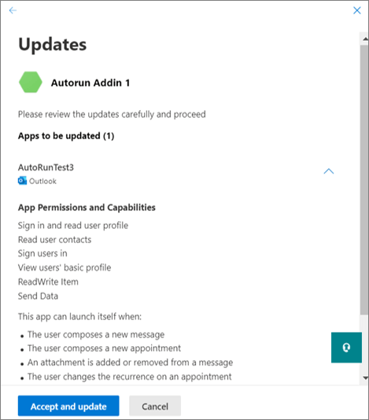

# Microsoft Marketplace listing options for your event-based add-in

When you're ready to publish your [event-based activation](../develop/event-based-activation.md) add-in to [Microsoft Marketplace](https://marketplace.microsoft.com), you can choose to list your add-in as restricted or unrestricted. This article will help you understand these listing options and choose the right approach for your add-in.

[!INCLUDE [outlook-smart-alerts-deployment](../includes/outlook-smart-alerts-deployment.md)]

## Add-in listing options

An event-based add-in can have either a restricted or unrestricted listing in Microsoft Marketplace. The following table compares these listing options based on their prerequisites, supported Office applications, and event-based activation support.

| Listing features | Restricted | Unrestricted |
| --- | --- | --- |
| **Event-based activation support** | Add-in must be deployed by an organization's admin for the event-based activation feature to work. | Event-based activation works immediately upon installation by either the user or admin, without requiring admin deployment. |
| **Store searchability** | Users and admins can't explicitly search for the add-in in Microsoft Marketplace. They must use a specific flight code URL to install the add-in. | Users and administrators can explicitly search and install the add-in from Microsoft Marketplace. |
| **Prerequisites** | You must specify a flight code for your add-in when you publish it to Microsoft Marketplace. | Your add-in must be [Microsoft 365 Certified](/microsoft-365-app-certification/docs/certification) and must comply with certain usage requirements. |
| **Supported Office apps** | <ul><li>Excel</li><li>Outlook</li><li>PowerPoint</li><li>Word</li></ul> | <ul><li>Outlook</li></ul> |

For more information on how to list your event-based add-in as restricted or unrestricted in Microsoft Marketplace, select the tab for the applicable listing option.

# [Restricted listing](#tab/restricted)

Add-ins with restricted listing in Microsoft Marketplace must be deployed by an organization's admins for users to access the event-based activation features. Event-based activation is restricted if the user acquired the add-in directly from Microsoft Marketplace. For example, if the Contoso add-in includes an event-based function, the automatic invocation of the add-in only happens if the add-in was installed for the user by their organization's admin. Otherwise, the automatic invocation of the add-in is blocked.

To enable that restriction, we can provide flight code URLs for add-ins in Microsoft Marketplace. Thanks to the flight codes, only users with these special URLs can access the listing. The following is an example URL.

`https://marketplace.microsoft.com/product/office/WA200002862?flightCodes=EventBasedTest1`

When a flight code is enabled for an add-in, users and admins can't explicitly search for an add-in by name in Microsoft Marketplace or the in-app Microsoft 365 and Copilot store. As the add-in creator, you can privately share these flight codes with organization admins for add-in deployment.

> [!NOTE]
> While users can install an event-based add-in using a flight code, the add-in won't include event-based activation. However, users can use other components of the add-in, such as a task pane or function command.

### Specify a flight code

To specify the flight code for your add-in, share the code in the **Notes for certification** when you publish your add-in. **Important**: Flight codes are case-sensitive.

### Deploy add-in with flight code

After the flight codes are set, you'll receive the URL from the app certification team. You can then share the URL with admins privately.

> [!NOTE]
> Once your add-in is certified, it may take up to 24 hours for the flight codes to take effect and for Microsoft Marketplace to hide your existing listing from the search results.

To deploy the add-in, the admin can use the following steps.

1. Sign in to [https://admin.microsoft.com](https://admin.microsoft.com) or [https://marketplace.microsoft.com](https://marketplace.microsoft.com) with your Microsoft 365 admin account. If the add-in has single sign-on (SSO) enabled, global admin credentials are needed.
1. Open the flight code URL in a web browser.
1. On the add-in listing page, select **Get it now**. You should be redirected to the [integrated apps portal](/microsoft-365/admin/manage/test-and-deploy-microsoft-365-apps).

# [Unrestricted listing](#tab/unrestricted)

If an event-based add-in for Outlook has an unrestricted listing in Microsoft Marketplace, users and admins can use the event-based activation feature immediately after installing the add-in. An unrestricted add-in listing doesn't require admin deployment.

To qualify for unrestricted listing:

1. Your add-in must be Microsoft 365 Certified. For guidance on the certification process, see [Microsoft 365 Certification framework overview](/microsoft-365-app-certification/docs/certification).
1. Once Microsoft 365 Certification is awarded to your add-in, complete the [form](https://aka.ms/AutoLaunchForEndUser) to request for unrestricted listing. You must provide the following information.
    - The certification status of your add-in.
    - A link to your add-in's listing in Microsoft Marketplace.
    - Your contact information.

After submitting the form, your add-in will undergo further review for usage and market trend considerations. Upon approval, your add-in will have unrestricted listing in Microsoft Marketplace and users can immediately access event-based activation features upon installation.

---

## Update existing add-ins to include event-based activation

You can update your existing add-in to include event-based activation then resubmit it for validation and decide if you want a restricted or unrestricted Microsoft Marketplace listing.

After the updated add-in is approved, organization admins who have previously deployed the add-in will receive an update message in the **Integrated apps** section of the admin center. The message advises the admin about the event-based activation changes. After the admin accepts the changes, the update will be deployed to users. To learn more about the admin consent process, see [Admin consent for installing event-based add-ins](#admin-consent-for-installing-event-based-add-ins).

> [!NOTE]
> For users who installed an add-in listed as restricted, the event-based activation feature won't work even after the add-in has been updated.

## Admin consent for installing event-based add-ins

Whenever an event-based add-in is deployed from the **Integrated apps** screen, the admin gets details about the add-in's event-based activation capabilities in the deployment wizard. The details appear in the **App Permissions and Capabilities** section. The admin should see all the events where the add-in can automatically activate.

Similarly, when an existing add-in is updated to event-based functionality, the admin sees an "Update Pending" status on the add-in. The updated add-in is deployed only if the admin consents to the changes noted in the **App Permissions and Capabilities** section, including the set of events where the add-in can automatically activate.

Each time you add any new event-based activation function to your add-in, admins will see the update flow in the admin portal and need to provide consent for additional events. To learn more about the update and consent process, see [Manage apps in the Integrated apps portal](/microsoft-365/admin/manage/test-and-deploy-microsoft-365-apps#manage-apps-in-the-integrated-apps-portal).

## See also

- [Activate add-ins with events](../develop/event-based-activation.md)
