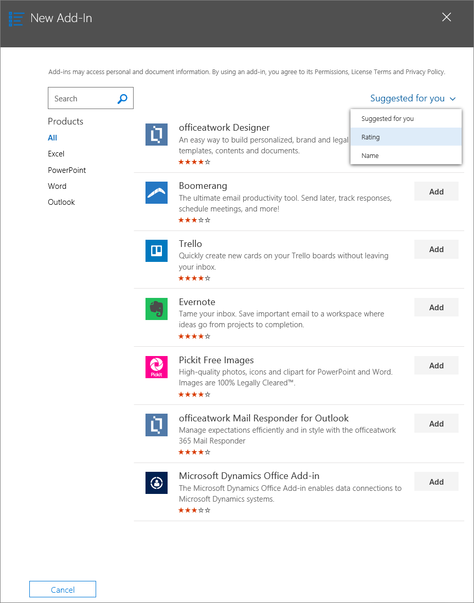

# Publish Office Add-ins using Centralized Deployment via the Office 365 admin center

The Office 365 admin center makes it easy for an administrator to deploy Office Add-ins to users and groups within their organization. Add-ins deployed via the admin center are available to users in their Office applications right away, with no client configuration required. You can use Centralized Deployment to deploy internal add-ins as well as add-ins provided by ISVs.

The Office 365 admin center currently supports the following scenarios:

- Centralized Deployment of new and updated add-ins to individuals, groups, or an organization.
- Deployment to multiple platforms, including Windows and Office web clients, with Mac coming soon.
- Deployment to English language and worldwide tenants.
- Deployment of cloud-hosted add-ins.
- Deployment of add-ins that are hosted within a firewall.
- Deployment of AppSource add-ins.
- Automatic installation of an add-in for users when they launch the Office application.
- Automatic removal of an add-in for users if the admin turns off or deletes the add-in, or if users are removed from Azure Active Directory or from a group to which the add-in has been deployed.

Centralized Deployment is the recommended way for an Office 365 admin to deploy Office Add-ins within an organization, provided that the organization meets all requirements for using Centralized Deployment. For information about how to determine if your organization can use Centralized Deployment, see [Determine if Centralized Deployment of add-ins works for your Office 365 organization](https://support.office.com/article/Determine-if-Centralized-Deployment-of-add-ins-works-for-your-Office-365-organization-B4527D49-4073-4B43-8274-31B7A3166F92).

> [!NOTE]
> In an on-premises environment with no connection to Office 365, or to deploy SharePoint add-ins or Office Add-ins that target Office 2013, use a [SharePoint add-in catalog](publish-task-pane-and-content-add-ins-to-an-add-in-catalog.md). To deploy COM/VSTO add-ins, use ClickOnce or Windows Installer, as described in [Deploying an Office solution](/visualstudio/vsto/deploying-an-office-solution).

## Recommended approach for deploying Office Add-ins

Consider deploying Office Add-ins in a phased approach to help ensure that the deployment goes smoothly. We recommend the following plan:

1. Deploy the add-in to a small set of business stakeholders and members of the IT department. If the deployment is successful, move on to step 2.

2. Deploy the add-in to a larger set of individuals within the business who will be using the add-in. If the deployment is successful, move on to step 3.

3. Deploy the add-in to the full set of individuals who will be using the add-in.

Depending on the size of the target audience, you may want to add steps to or remove steps from this procedure.

## Publish an Office Add-in via Centralized Deployment

Before you begin, confirm that your organization meets all requirements for using Centralized Deployment, as described in [Determine if Centralized Deployment of add-ins works for your Office 365 organization](https://support.office.com/article/Determine-if-Centralized-Deployment-of-add-ins-works-for-your-Office-365-organization-B4527D49-4073-4B43-8274-31B7A3166F92).

If your organization meets all requirements, complete the following steps to publish an Office Add-in via Centralized Deployment:

1. Sign in to Office 365 with your work or school account.
2. Select the app launcher icon in the upper-left and choose **Admin**.
3. In the navigation menu, press **Show more**, then choose **Settings** > **Services & add-ins**.
4. If you see a message on the top of the page announcing the new Office 365 admin center, choose the message to go to the Admin Center Preview (see [About the Office 365 admin center](https://support.office.com/en-ie/article/About-the-Office-365-admin-center-758befc4-0888-4009-9f14-0d147402fd23)).
5. Choose **Deploy Add-In** at the top of the page.
6. Choose **Next** after reviewing the requirements.
7. Choose one of the following options on the **Centralized Deployment** page:

    - **I want to add an Add-In from the Office Store.**
    - **I have the manifest file (.xml) on this device.** For this option, choose **Browse** to locate the manifest file (.xml) that you want to use.
    - **I have a URL for the manifest file.** For this option, type the manifest's URL in the field provided.

    

8. If you selected the option to add an add-in from the Office Store, select the add-in. You can view available add-ins via categories of **Suggested for you**, **Rating**, or **Name**. You may only add free add-ins from Office Store. Adding paid add-ins isn't currently supported.

    > [!NOTE]
    > With the Office Store option, updates and enhancements to the add-in are automatically available to users without your intervention.

    

9. Choose **Next** after reviewing the add-in details.

    

10. On the **Edit who has access** page, choose **Everyone**, **Specific Users/Groups**, or **Only me**. Use the search box to find the users and groups to whom you want to deploy the add-in.

    

    > [!NOTE]
    > A [single sign-on (SSO)](/office/dev/add-ins/develop/sso-in-office-add-ins) system for add-ins is currently in preview and should not be used for production add-ins. When an add-in using SSO is deployed, the users and groups assigned are also shared with add-ins that share the same Azure App ID. Any changes to user assignments are also applied to those add-ins. The related add-ins are shown on this page. For SSO add-ins only, this page displays the list of Microsoft Graph permissions that the add-in requires.

11. When finished, choose **Save** to save the manifest. This process may take up to three minutes. Then, finish the walkthrough by pressing **Next**. You now see your add-in along with other apps in Office 365.

    > [!NOTE]
    > When an administrator chooses **Save**, consent is given for all users.

    

> [!TIP]
> When you deploy a new add-in to users and/or groups in your organization, consider sending them an email that describes when and how to use the add-in, and includes links to relevant Help content, FAQs, or other support resources.

## Considerations when granting access to an add-in

Admins can assign an add-in to everyone in the organization or to specific users and/or groups within the organization. The following list describes the implications of each option:

- **Everyone**: As the name implies, this option assigns the add-in to every user in the tenant. Use this option sparingly and only for add-ins that are truly universal to your organization.

- **Users**: If you assign an add-in to individual users, you'll need to update the Central Deployment settings for the add-in each time you want to assign it additional users. Likewise, you'll need to update the Central Deployment settings for the add-in each time you want to remove a user's access to the add-in.

- **Groups**: If you assign an add-in to a group, users who are added to the group will automatically be assigned the add-in. Likewise, when a user is removed from a group, the user automatically loses access to the add-in. In either case, no additional action is required from the Office 365 admin.

In general, for ease of maintenance, we recommend assigning add-ins by using groups whenever possible. However, in situations where you want to restrict add-in access to a very small number of users, it may be more practical to assign the add-in to specific users.

## Add-in states

The following table describes the different states of an add-in.

|State|How the state occurs|Impact|
|-----|--------------------|------|
|**Active**|Admin uploaded the add-in and assigned it to users and/or groups.|Users and/or groups assigned to the add-in see it in the relevant Office clients.|
|**Turned off**|Admin turned off the add-in.|Users and/or groups assigned to the add-in no longer have access to it. If the add-in state is changed from **Turned off** to **Active**, the users and groups will regain access to it.|
|**Deleted**|Admin deleted the add-in.|Users and/or groups assigned the add-in no longer have access to it.|

## Updating Office Add-ins that are published via Centralized Deployment

After an Office Add-in has been published via Centralized Deployment, any changes made to the add-in's web application will automatically be available to all users as soon as those changes are implemented in the web application. Changes made to an add-in's [XML manifest file](../develop/add-in-manifests.md), for example, to update the add-in's icon, text, or add-in commands, happen as follows:

- **Line-of-business add-in**: If an admin explicitly uploaded a manifest file when implementing Centralized Deployment via the Office 365 admin center, the admin must upload a new manifest file that contains the desired changes. After the updated manifest file has been uploaded, the next time the relevant Office applications start, the add-in will update.

- **Office Store add-in**: If an admin selected an add-in from the Office Store when implementing Centralized Deployment via the Office 365 admin center, and the add-in updates in the Office Store, the add-in will update later via Centralized Deployment. The next time the relevant Office applications start, the add-in will update.

## End user experience with add-ins

After an add-in has been published via Centralized Deployment, end users may start using it on any platform that the add-in supports.

If the add-in supports add-in commands, the commands will appear on the Office application ribbon for all users to whom the add-in is deployed. In the following example, the command **Search Citation** appears in the ribbon for the **Citations** add-in.

If the add-in does not support add-in commands, users can add it to their Office application by doing the following:

1. In Word 2016 or later, Excel 2016 or later, or PowerPoint 2016 or later, choose **Insert** > **My Add-ins**.
2. Choose the **Admin Managed** tab in the add-in window.
3. Choose the add-in, and then choose **Add**.

    

However, for Outlook 2016 or later, users can do the following:

1. In Outlook, choose **Home** > **Store**.
2. Choose the **Admin-managed** item under the add-in tab.
3. Choose the add-in, and then choose **Add**.

    

## See also

- [Determine if Centralized Deployment of add-ins works for your Office 365 organization](https://support.office.com/article/Determine-if-Centralized-Deployment-of-add-ins-works-for-your-Office-365-organization-b4527d49-4073-4b43-8274-31b7a3166f92)
