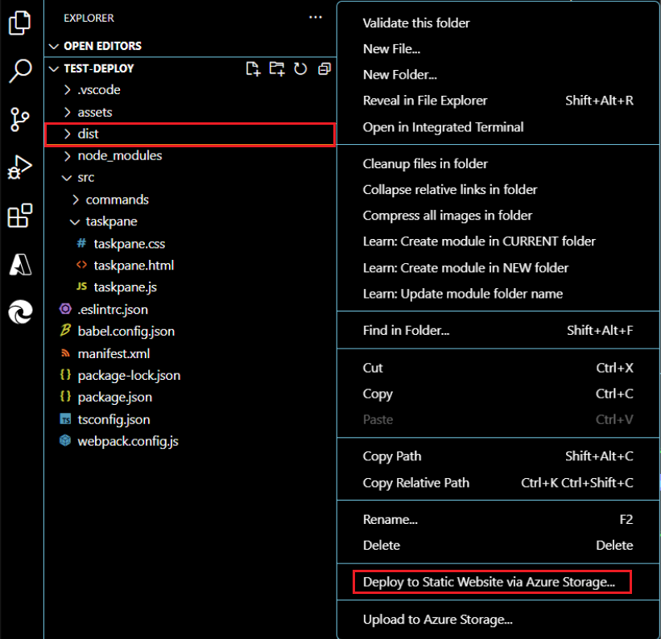

# Publish an add-in developed with Visual Studio Code

This article describes how to publish an Office Add-in that you created using the Yeoman generator and developed with [Visual Studio Code (VS Code)](https://code.visualstudio.com) or any other editor.

> [!NOTE]
> For information about publishing an Office Add-in that you created using Visual Studio, see [Publish your add-in using Visual Studio](package-your-add-in-using-visual-studio.md).

## Publishing an add-in for other users to access

An Office Add-in consists of a web application and a manifest file. The web application defines the add-in's user interface and functionality, while the manifest specifies the location of the web application and defines settings and capabilities of the add-in.

While you're developing, you can run the add-in on your local web server (`localhost`). When you're ready to publish it for other users to access, you'll need to deploy the web application and update the manifest to specify the URL of the deployed application.

When your add-in is working as desired, you can publish it directly through Visual Studio Code using the Azure Storage extension.

## Using Visual Studio Code to publish

>[!NOTE]
> These steps only work for projects created with the Yeoman generator.

1. Open your project from its root folder in Visual Studio Code (VS Code).
2. From the Extensions view in VS Code, search for the Azure Storage extension and install it.
3. Once installed, an Azure icon is added to the Activity Bar. Select it to access the extension. If your Activity Bar is hidden, you won't be able to access the extension. Show the Activity Bar by selecting **View > Appearance > Show Activity Bar**.
4. When in the extension, sign in to your Azure account by selecting **Sign in to Azure**. You can also create an Azure account if you don't already have one by selecting **Create a free Azure account**. Follow the provided steps to set up your account.
5. Once you have signed in to your Azure account, you'll see your Azure storage accounts appear in the extension. If you don't already have a storage account, you'll need to create one using the **Create new storage account** option. Name your storage account a globally unique name, using only 'a-z' and '0-9'. Note that by default, this creates a storage account and a resource group with the same name. It automatically puts the storage account in West US. This can be adjusted online through [your Azure account](https://portal.azure.com/).
6. Select and hold (right-click) your storage account, choosing **Configure static website**. You'll be asked to enter the index document name and the 404 document name. Change the index document name from the default `index.html` to **`taskpane.html`**. You may decide to also change the 404 document name but are not required to.
7. Select and hold (right-click) your storage again, this time choosing **Browse static website**. From the browser window that opens, copy the website URL.
8. In VS Code, open your project's manifest file (`manifest.xml`) and change any reference to your localhost URL (such as `https://localhost:3000`) to the URL you've copied. This endpoint is the static website URL for your newly created storage account. Save the changes to your manifest file.
9. Open a command line prompt and navigate to the root directory of your add-in project. Then run the following command to prepare all files for production deployment.

    ```command&nbsp;line
    npm run build
    ```

    When the build completes, the **dist** folder in the root directory of your add-in project will contain the files that you'll deploy in subsequent steps.

10. To deploy, select the Files explorer, select and hold (right-click) your **dist** folder, and choose **Deploy to Static Website**. When prompted, select the storage account you created previously.



11. When deployment is complete, a **Browse to website** message appears which you can select to open the primary endpoint of the deployed app code.

## See also

- [Develop Office Add-ins with Visual Studio Code](../develop/develop-add-ins-vscode.md)
- [Deploy and publish your Office Add-in](../publish/publish.md)
