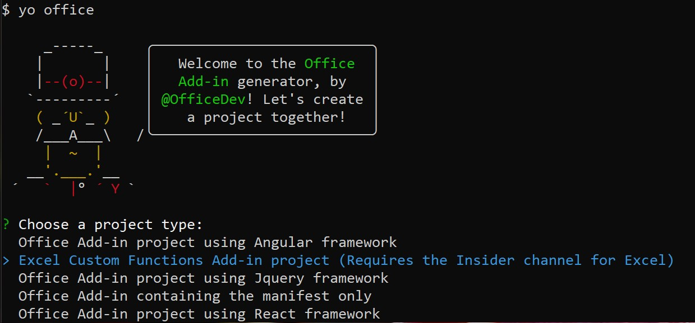

# Get started developing Excel Custom Functions

Custom functions enable developers to add new functions to Excel by defining those functions in JavaScript or Typescript as part of an add-in. Users within Excel can access custom functions just as they would any native function in Excel, such as `SUM()`.

## Prerequisites

[!include[Excel custom functions note](../includes/excel-custom-functions-note.md)]

You'll need the following tools and related resources to begin creating custom functions.

- [Node.js](https://nodejs.org/en/) (version 8.0.0 or later)

- [Git Bash](https://git-scm.com/downloads) (or another Git client)

- The latest version of [Yeoman](https://yeoman.io/) and the [Yeoman generator for Office Add-ins](https://www.npmjs.com/package/generator-office). To install these tools globally, run the following command via the command prompt:

    ```
    npm install -g yo generator-office
    ```

    > [!NOTE]
    > Even if you've previously installed the Yeoman generator, we recommend you update your package to the latest version from npm.

## Build your first custom functions project

To start, you'll use the Yeoman generator to create the custom functions project. This will set up your project with the correct folder structure, source files, and dependencies to begin coding your custom functions.

1. Run the following command and then answer the prompts as follows.

    ```
    yo office
    ```

    - Choose a project type: `Excel Custom Functions Add-in project (...)`

    - Choose a script type: `JavaScript`

    - What do you want to name your add-in? `stock-ticker`

    

    The Yeoman generator will create the project files and install supporting Node components.

2. Go to the project folder.

    ```
    cd stock-ticker
    ```

3. Trust the self-signed certificate that is needed to run this project. For detailed instructions for either Windows or Mac, see [Adding Self Signed Certificates as Trusted Root Certificate](https://github.com/OfficeDev/generator-office/blob/master/src/docs/ssl.md).  

4. Build the project.

    ```
    npm run build
    ```

5. Start the local web server, which runs in Node.js.

    - If you'll be using Excel for Windows to test your custom functions, run the following command to start the local web server, launch Excel, and sideload the add-in:

        ```
         npm run start
        ```
        After running this command, your command prompt will show details about starting the web server. Excel will start with your add-in loaded. If you add-in does not load, check that you have completed step 3 properly.

    - If you'll be using Excel Online to test your custom functions, run the following command to start the local web server:

        ```
        npm run start-web
        ```

         After running this command, your command prompt will show details about starting the web server. To use your functions, open a new workbook in Excel Online. In this workbook, you'll need to load your add-in. 

        To do this, select the **Insert** tab on the ribbon and select **Office Add-ins**. Next select **Manage My Add-ins > Upload My Add-in**. Browse for your manifest file and upload it. If your add-in does not load, check you've completed step 3 correctly.

## Try out the prebuilt custom functions

The custom functions project that you created by using the Yeoman generator contains some prebuilt custom functions, defined within the **src/customfunctions.js** file. The **manifest.xml** file in the root directory of the project specifies that all custom functions belong to the `CONTOSO` namespace.

In your Excel workbook, try out the `ADD` custom function by completing the following steps:

1. Within a cell, type `=CONTOSO`. Notice that the autocomplete menu shows the list of all functions in the `CONTOSO` namespace.

2. Run the `CONTOSO.ADD` function, with numbers `10` and `200` as input parameters, by typing the value `=CONTOSO.ADD(10,200)` in the cell and pressing enter.

The `ADD` custom function computes the sum of the two numbers that you specify as input parameters. Typing `=CONTOSO.ADD(10,200)` should produce the result **210** in the cell after you press enter.

## Next steps

Congratulations, you've successfully created a custom function in an Excel add-in! Next, build a more complex add-in with streaming data capability. The below link will take you to the next steps to follow in the Excel add-in with custom functions tutorial.

> [!div class="nextstepaction"]
> [Excel custom functions add-in tutorial](../tutorials/excel-tutorial-create-custom-functions.md#create-a-custom-function-that-requests-data-from-the-web
)

## See also

* [Custom functions overview](../excel/custom-functions-overview.md)
* [Custom functions metadata](../excel/custom-functions-json.md)
* [Runtime for Excel custom functions](../excel/custom-functions-runtime.md)
* [Custom functions best practices](../excel/custom-functions-best-practices.md)
