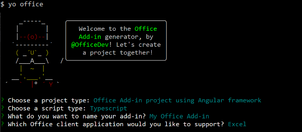

# Build an Excel add-in using Angular

In this article, you'll walk you through the process of building an Excel add-in using Angular and the Excel JavaScript API.

## Prerequisites

- [Node.js](https://nodejs.org)

- Install the latest version of [Yeoman](https://github.com/yeoman/yo) and the [Yeoman generator for Office Add-ins](https://github.com/OfficeDev/generator-office) globally.

    ```bash
    npm install -g yo generator-office
    ```

## Create the web app

1. Use the Yeoman generator to create an Excel add-in project. Run the following command and then answer the prompts as follows:

    ```bash
    yo office
    ```

    - **Choose a project type:** `Office Add-in project using Angular framework`
    - **Choose a script type:** `Typescript`
    - **What do you want to name your add-in?:** `My Office Add-in`
    - **Which Office client application would you like to support?:** `Excel`

    
    
    After you complete the wizard, the generator will create the project and install supporting Node components.

2. Navigate to the root folder of the project.

    ```bash
    cd "My Office Add-in"
    ```

## Update the code

1. In your code editor, open the file **app.css**, add the following styles to the end of the file, and save the file.

    ```css
    #content-header {
        background: #2a8dd4;
        color: #fff;
        position: absolute;
        top: 0;
        left: 0;
        width: 100%;
        height: 80px; 
        overflow: hidden;
        font-family: Arial;
        padding-top: 25px;
    }

    #content-main {
        background: #fff;
        position: fixed;
        top: 80px;
        left: 0;
        right: 0;
        bottom: 0;
        overflow: auto; 
        font-family: Arial;
    }

    .padding {
        padding: 15px;
    }

    .padding-sm {
        padding: 4px;
    }

    .normal-button {
        width: 80px;
        padding: 2px;
    }
    ```

2. Open the file **src/app/app.component.html**, replace the entire contents with the following code, and save the file.

    ```html
    <div id="content-header">
        <div class="padding">
            <h1>{{welcomeMessage}}</h1>
        </div>
    </div>
    <div id="content-main">
        <div class="padding">
            <p>Choose the button below to set the color of the selected range to green.</p>
            <br />
            <h3>Try it out</h3>
            <br />
            <div role="button" class="ms-Button" (click)="setColor()">
                <span class="ms-Button-label">Set color</span>
                <span class="ms-Button-icon"><i class="ms-Icon ms-Icon--ChevronRight"></i></span>
            </div>
        </div>
    </div>
    ```

3. Open the file **src/app/app.component.ts**, replace the entire contents with the following code, and save the file.

    ```typescript
    import { Component } from '@angular/core';
    import * as OfficeHelpers from '@microsoft/office-js-helpers';

    const template = require('./app.component.html');

    @Component({
        selector: 'app-home',
        template
    })
    export default class AppComponent {
        welcomeMessage = 'Welcome';

        async setColor() {
            try {
                await Excel.run(async context => {
                    const range = context.workbook.getSelectedRange();
                    range.load('address');
                    range.format.fill.color = 'green';
                    await context.sync();
                    console.log(`The range address was ${range.address}.`);
                });
            } catch (error) {
                OfficeHelpers.UI.notify(error);
                OfficeHelpers.Utilities.log(error);
            }
        }

    }
    ```

## Update the manifest

1. Open the file **manifest.xml** to define the add-in's settings and capabilities. 

2. The `ProviderName` element has a placeholder value. Replace it with your name.

3. The `DefaultValue` attribute of the `Description` element has a placeholder. Replace it with **A task pane add-in for Excel**.

4. Save the file.

    ```xml
    ...
    <ProviderName>John Doe</ProviderName>
    <DefaultLocale>en-US</DefaultLocale>
    <!-- The display name of your add-in. Used on the store and various places of the Office UI such as the add-ins dialog. -->
    <DisplayName DefaultValue="My Office Add-in" />
    <Description DefaultValue="A task pane add-in for Excel"/>
    ...
    ```

## Start the dev server

[!include[Start server section](../includes/quickstart-yo-start-server.md)] 

## Try it out

1. Follow the instructions for the platform you'll be using to run your add-in and sideload the add-in within Excel.

    - Windows: [Sideload Office Add-ins on Windows](../testing/create-a-network-shared-folder-catalog-for-task-pane-and-content-add-ins.md)
    - Excel Online: [Sideload Office Add-ins in Office Online](../testing/sideload-office-add-ins-for-testing.md#sideload-an-office-add-in-in-office-online)
    - iPad and Mac: [Sideload Office Add-ins on iPad and Mac](../testing/sideload-an-office-add-in-on-ipad-and-mac.md)

   
2. In Excel, choose the **Home** tab, and then choose the **Show Taskpane** button in the ribbon to open the add-in task pane.

    

3. Select any range of cells in the worksheet.

4. In the task pane, choose the **Set color** button to set the color of the selected range to green.

    

## Next steps

Congratulations, you've successfully created an Excel add-in using Angular! Next, learn more about the capabilities of an Excel add-in and build a more complex add-in by following along with the Excel add-in tutorial.

> [!div class="nextstepaction"]
> [Excel add-in tutorial](../tutorials/excel-tutorial.md)

## See also

* [Excel add-in tutorial](../tutorials/excel-tutorial-create-table.md)
* [Fundamental programming concepts with the Excel JavaScript API](../excel/excel-add-ins-core-concepts.md)
* [Excel add-in code samples](https://developer.microsoft.com/office/gallery/?filterBy=Samples,Excel)
* [Excel JavaScript API reference](https://docs.microsoft.com/office/dev/add-ins/reference/overview/excel-add-ins-reference-overview)

