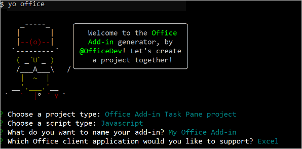
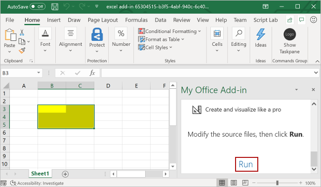

# Build an Excel task pane add-in

In this article, you'll walk through the process of building an Excel task pane add-in. You'll use either the Office Add-ins Development Kit or the Yeoman generator to create your Office Add-in. Select the tab for the one you'd like to use and then follow the instructions to create your add-in and test it locally. If you'd like to create the add-in project within Visual Studio Code, we recommend the Office Add-ins Development Kit.

# [Office Add-ins Development Kit](#tab/devkit)

[!include[Dev_kit prerequisites](../includes/dev-kit-prerequisites.md)]

## Create the add-in project

Click the following button to create an add-in project using the Office Add-ins Development Kit for Visual Studio Code. You'll be prompted to install the extension if don't already have it. A page that contains the project description will open in Visual Studio Code.

> [!div class="nextstepaction"]
> [Create an add-in in Visual Studio Code](vscode://msoffice.microsoft-office-add-in-debugger/open-specific-sample?sample-id=excel-get-started-with-dev-kit)

In the prompted page, select **Create** to create the add-in project. In the **Workspace folder** dialog that opens, select the folder where you want to create the project. 

:::image type="content" source="../images/office-add-ins-development-kit-samplepage-excelquickstart.png" alt-text="The Development Kit sample gallery in Visual Studio Code":::

The Office Add-ins Development Kit will create the project. It will then open the project in a *second* Visual Studio Code window. Close the original Visual Studio Code window.

> [!NOTE]
> If you use VSCode Insiders, or you have problems opening the project page in VSCode, install the extension manually by following [these steps](../develop/development-kit-overview.md?tabs=vscode), and find the sample in the sample gallery.
[!include[Devkit_project_components_taskpane](../includes/devkit-project-components-taskpane.md)]

## Try it out

[!include[Dev_kit_start_debugging](../includes/dev-kit-start-debugging.md)]

[!include[Dev_kit_stop_debugging](../includes/dev-kit-stop-debugging.md)]

[!include[Dev_kit_troubleshooting](../includes/dev-kit-troubleshooting.md)]

# [Yeoman generator](#tab/yeoman)

## Prerequisites

[!include[Yeoman generator prerequisites](../includes/quickstart-yo-prerequisites.md)]

## Create the add-in project

[!include[Yeoman generator create project guidance](../includes/yo-office-command-guidance.md)]

- **Choose a project type:** `Office Add-in Task Pane project`
- **Choose a script type:** `Javascript`
- **What do you want to name your add-in?** `My Office Add-in`
- **Which Office client application would you like to support?** `Excel`



After you complete the wizard, the generator creates the project and installs supporting Node components.

## Explore the project

[!include[Yeoman generator add-in project components](../includes/yo-task-pane-project-components-js.md)]

## Try it out

1. Navigate to the root folder of the project.

    ```command&nbsp;line
    cd "My Office Add-in"
    ```

1. [!include[Start server section](../includes/quickstart-yo-start-server-excel.md)]

1. In Excel, choose the **Home** tab, and then choose the **Show Taskpane** button on the ribbon to open the add-in task pane.

    

1. Select any range of cells in the worksheet.

1. At the bottom of the task pane, choose the **Run** link to set the color of the selected range to yellow.

    

1. [!include[Instructions to stop web server and uninstall dev add-in](../includes/stop-uninstall-dev-add-in.md)]

[!include[The common troubleshooting section for all Yo Office quick starts](../includes/quickstart-troubleshooting-yo.md)]

---

## Next steps

Congratulations, you've successfully created an Excel task pane add-in! Next, learn more about the capabilities of an Excel add-in and build a more complex add-in by following along with the [Excel add-in tutorial](../tutorials/excel-tutorial.md).

## Code samples

- [Excel "Hello world" add-in](https://github.com/OfficeDev/Office-Add-in-samples/tree/main/Samples/hello-world/excel-hello-world): Learn how to build a simple Office Add-in with only a manifest, HTML web page, and a logo.

## See also

- [Office Add-ins platform overview](../overview/office-add-ins.md)
- [Develop Office Add-ins](../develop/develop-overview.md)
- [Excel JavaScript object model in Office Add-ins](../excel/excel-add-ins-core-concepts.md)
- [Excel add-in code samples](https://developer.microsoft.com/microsoft-365/gallery/?filterBy=Excel,Samples)
- [Excel JavaScript API reference](../reference/overview/excel-add-ins-reference-overview.md)
- [Using Visual Studio Code to publish](../publish/publish-add-in-vs-code.md#using-visual-studio-code-to-publish)
