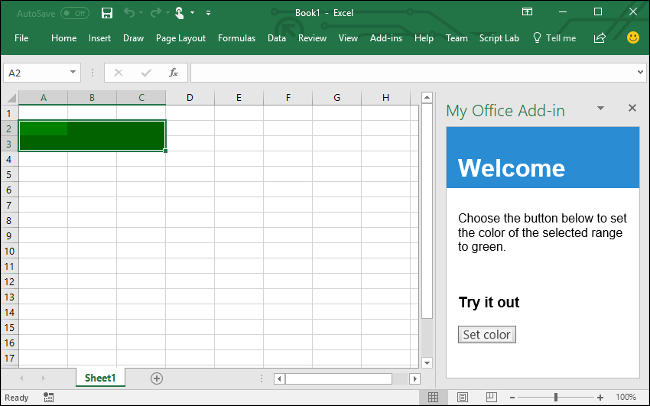

# Build an Excel task pane add-in

In this article, you'll walk through the process of building an Excel task pane add-in.

## Create the add-in

[!include[Choose your editor](../includes/quickstart-choose-editor.md)]

# [Yeoman generator](#tab/yeomangenerator)

### Prerequisites

[!include[Yeoman generator prerequisites](../includes/quickstart-yo-prerequisites.md)]

### Create the add-in project

[!include[Yeoman generator create project guidance](../includes/yo-office-command-guidance.md)]

- **Choose a project type:** `Office Add-in Task Pane project`
- **Choose a script type:** `Javascript`
- **What do you want to name your add-in?** `My Office Add-in`
- **Which Office client application would you like to support?** `Excel`


After you complete the wizard, the generator creates the project and installs supporting Node components.

[!include[Yeoman generator next steps](../includes/yo-office-next-steps.md)]

### Explore the project

[!include[Yeoman generator add-in project components](../includes/yo-task-pane-project-components-js.md)]

### Try it out

1. Navigate to the root folder of the project.

    ```command&nbsp;line
    cd "My Office Add-in"
    ```

1. [!include[Start server section](../includes/quickstart-yo-start-server-excel.md)]

1. In Excel, choose the **Home** tab, and then choose the **Show Taskpane** button on the ribbon to open the add-in task pane.

    

1. Select any range of cells in the worksheet.

1. At the bottom of the task pane, choose the **Run** link to set the color of the selected range to yellow.

    

### Next steps

Congratulations, you've successfully created an Excel task pane add-in! Next, learn more about the capabilities of an Excel add-in and build a more complex add-in by following along with the [Excel add-in tutorial](../tutorials/excel-tutorial.md).

# [Visual Studio](#tab/visualstudio)

### Prerequisites

[!include[Quick Start prerequisites](../includes/quickstart-vs-prerequisites.md)]

### Create the add-in project

1. In Visual Studio, choose **Create a new project**.

1. Using the search box, enter **add-in**. Choose **Excel Web Add-in**, then select **Next**.

1. Name your project **ExcelWebAddIn1** and select **Create**.

1. In the **Create Office Add-in** dialog window, choose **Add new functionalities to Excel**, and then choose **Finish** to create the project.

1. Visual Studio creates a solution and its two projects appear in **Solution Explorer**. The **Home.html** file opens in Visual Studio.

### Explore the Visual Studio solution

[!include[Description of Visual Studio projects](../includes/quickstart-vs-solution.md)]

### Update the code

1. **Home.html** specifies the HTML that will be rendered in the add-in's task pane. In **Home.html**, replace the `<body>` element with the following markup and save the file.

    ```html
    <body class="ms-font-m ms-welcome">
        <div id="content-header">
            <div class="padding">
                <h1>Welcome</h1>
            </div>
        </div>
        <div id="content-main">
            <div class="padding">
                <p>Choose the button below to set the color of the selected range to green.</p>
                <br />
                <h3>Try it out</h3>
                <button class="ms-Button" id="set-color">Set color</button>
            </div>
        </div>
    </body>
    ```

1. Open the file **Home.js** in the root of the web application project. This file specifies the script for the add-in. Replace the entire contents with the following code and save the file.

    ```js
    'use strict';

    (function () {

        Office.onReady(function() {
            // Office is ready
            $(document).ready(function () {
                // The document is ready
                $('#set-color').click(setColor);
            });
        });

        async function setColor() {
            await Excel.run(async (context) => {
                const range = context.workbook.getSelectedRange();
                range.format.fill.color = 'green';

                await context.sync();
            }).catch(function (error) {
                console.log("Error: " + error);
                if (error instanceof OfficeExtension.Error) {
                    console.log("Debug info: " + JSON.stringify(error.debugInfo));
                }
            });
        }
    })();
    ```

1. Open the file **Home.css** in the root of the web application project. This file specifies the custom styles for the add-in. Replace the entire contents with the following code and save the file.

    ```css
    #content-header {
        background: #2a8dd4;
        color: #fff;
        position: absolute;
        top: 0;
        left: 0;
        width: 100%;
        height: 80px;
        overflow: hidden;
    }

    #content-main {
        background: #fff;
        position: fixed;
        top: 80px;
        left: 0;
        right: 0;
        bottom: 0;
        overflow: auto;
    }

    .padding {
        padding: 15px;
    }
    ```

### Update the manifest

1. In **Solution Explorer**, go to the **ExcelWebAddIn1** add-in project and open the **ExcelWebAddIn1Manifest** directory. This directory contains your manifest file, **ExcelWebAddIn1.xml**. The XML manifest file defines the add-in's settings and capabilities. See the preceding section [Explore the Visual Studio solution](#explore-the-visual-studio-solution) for more information about the two projects created by your Visual Studio solution.

1. The `ProviderName` element has a placeholder value. Replace it with your name.

1. The `DefaultValue` attribute of the `DisplayName` element has a placeholder. Replace it with **My Office Add-in**.

1. The `DefaultValue` attribute of the `Description` element has a placeholder. Replace it with **A task pane add-in for Excel**.

1. Save the file.

    ```xml
    ...
    <ProviderName>John Doe</ProviderName>
    <DefaultLocale>en-US</DefaultLocale>
    <!-- The display name of your add-in. Used on the store and various places of the Office UI such as the add-ins dialog. -->
    <DisplayName DefaultValue="My Office Add-in" />
    <Description DefaultValue="A task pane add-in for Excel"/>
    ...
    ```

### Try it out

1. Using Visual Studio, test the newly created Excel add-in by pressing **F5** or choosing the **Start** button to launch Excel with the **Show Taskpane** add-in button displayed on the ribbon. The add-in will be hosted locally on IIS. If you are asked to trust a certificate, do so to allow the add-in to connect to its Office application.

1. In Excel, choose the **Home** tab, and then choose the **Show Taskpane** button on the ribbon to open the add-in task pane.

    

1. Select any range of cells in the worksheet.

1. In the task pane, choose the **Set color** button to set the color of the selected range to green.

    

[!include[Console tool note](../includes/console-tool-note.md)]

### Next steps

Congratulations, you've successfully created an Excel task pane add-in! Next, learn more about [developing Office Add-ins with Visual Studio](../develop/develop-add-ins-visual-studio.md).

---

[!include[The common troubleshooting section for all quickstarts](../includes/quickstart-troubleshooting.md)]

## Code samples

- [Excel "Hello world" add-in](https://github.com/OfficeDev/Office-Add-in-samples/tree/main/Samples/hello-world/excel-hello-world): Learn how to build a simple Office Add-in with only a manifest, HTML web page, and a logo.

## See also

- [Office Add-ins platform overview](../overview/office-add-ins.md)
- [Develop Office Add-ins](../develop/develop-overview.md)
- [Excel JavaScript object model in Office Add-ins](../excel/excel-add-ins-core-concepts.md)
- [Excel add-in code samples](https://developer.microsoft.com/microsoft-365/gallery/?filterBy=Excel,Samples)
- [Excel JavaScript API reference](../reference/overview/excel-add-ins-reference-overview.md)
- [Using Visual Studio Code to publish](../publish/publish-add-in-vs-code.md#using-visual-studio-code-to-publish)
