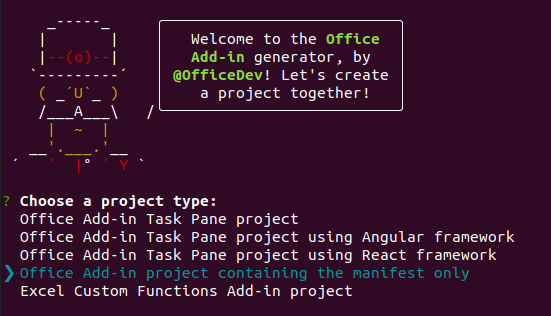

# Use Vue to build an Excel task pane add-in

In this article, you'll walk through the process of building an Excel task pane add-in using Vue and the Excel JavaScript API.

## Prerequisites

[!include[Set up requirements](../includes/set-up-dev-environment-beforehand.md)]
[!include[Yeoman generator prerequisites](../includes/quickstart-yo-prerequisites.md)]

- Install the [Vue CLI](https://cli.vuejs.org/) globally. From the terminal, run the following command.

  ```command&nbsp;line
  npm install -g @vue/cli
  ```

## Generate a new Vue app

To generate a new Vue app, use the Vue CLI.

```command&nbsp;line
vue create my-add-in
```

Then, select the `Default` preset for "Vue 3" (if you prefer, choose "Vue 2").

## Generate the manifest file

Each add-in requires a manifest file to define its settings and capabilities.

1. Navigate to your app folder.

    ```command&nbsp;line
    cd my-add-in
    ```

1. Use the Yeoman generator to generate the manifest file for your add-in.

    ```command&nbsp;line
    yo office
    ```

    > [!NOTE]
    > When you run the `yo office` command, you may receive prompts about the data collection policies of Yeoman and the Office Add-in CLI tools. Use the information that's provided to respond to the prompts as appropriate. If you choose **Exit** in response to the second prompt, you'll need to run the `yo office` command again when you're ready to create your add-in project.

    When prompted, provide the following information to create your add-in project.

    - **Choose a project type:** `Office Add-in project containing the manifest only`
    - **What do you want to name your add-in?** `My Office Add-in`
    - **Which Office client application would you like to support?** `Excel`

    

After completion, the wizard creates a **My Office Add-in** folder containing a **manifest.xml** file. You'll use the manifest to sideload and test your add-in.

> [!TIP]
> You can ignore the *next steps* guidance that the Yeoman generator provides after the add-in project's been created. The step-by-step instructions within this article provide all of the guidance you'll need to complete this tutorial.

## Secure the app

[!include[HTTPS guidance](../includes/https-guidance.md)]

1. Enable HTTPS for your app. In the root folder of the Vue project, create a **vue.config.js** file with the following contents.

    ```js
    const fs = require("fs");
    const path = require("path");
    const homedir = require('os').homedir()
  
    module.exports = {
      devServer: {
        port: 3000,
        https: {
          key: fs.readFileSync(path.resolve(`${homedir}/.office-addin-dev-certs/localhost.key`)),
          cert: fs.readFileSync(path.resolve(`${homedir}/.office-addin-dev-certs/localhost.crt`)),
          ca: fs.readFileSync(path.resolve(`${homedir}/.office-addin-dev-certs/ca.crt`)),
         }
       }
    }
    ```

1. Install the add-in's certificates.

   ```command&nbsp;line
   npx office-addin-dev-certs install
   ```

## Explore the project

The add-in project that you've created with the Yeoman generator contains sample code for a basic task pane add-in. If you'd like to explore the key components of your add-in project, open the project in your code editor and review the files listed below. When you're ready to try out your add-in, proceed to the next section.

- The **manifest.xml** file in the root directory of the project defines the settings and capabilities of the add-in. To learn more about the **manifest.xml** file, see [Office Add-ins XML manifest](../develop/xml-manifest-overview.md).
- The **./src/App.vue** file contains the HTML markup for the task pane, the CSS that's applied to the content in the task pane, and the Office JavaScript API code that facilitates interaction between the task pane and Excel.

## Update the app

1. Open the **./public/index.html** file and add the following `<script>` tag immediately before the `</head>` tag.

   ```html
   <script src="https://appsforoffice.microsoft.com/lib/1/hosted/office.js"></script>
   ```

1. Open **manifest.xml** and find the `<bt:Urls>` tags inside the **\<Resources\>** tag. Locate the `<bt:Url>` tag with the ID `Taskpane.Url` and update its `DefaultValue` attribute. The new `DefaultValue` is `https://localhost:3000/index.html`. The entire updated tag should match the following line.

   ```html
   <bt:Url id="Taskpane.Url" DefaultValue="https://localhost:3000/index.html" />
   ```

1. Open **./src/main.js** and replace the contents with the following code.

   ```js
   import { createApp } from 'vue'
   import App from './App.vue'

   window.Office.onReady(() => {
       createApp(App).mount('#app');
   });
   ```

1. Open **./src/App.vue** and replace the file contents with the following code.

   ```html
   <template>
     <div id="app">
       <div class="content">
         <div class="content-header">
           <div class="padding">
             <h1>Welcome</h1>
           </div>
         </div>
         <div class="content-main">
           <div class="padding">
             <p>
               Choose the button below to set the color of the selected range to
               green.
             </p>
             <br />
             <h3>Try it out</h3>
             <button @click="onSetColor">Set color</button>
           </div>
         </div>
       </div>
     </div>
   </template>

   <script>
     export default {
       name: 'App',
       methods: {
         onSetColor() {
           window.Excel.run(async context => {
             const range = context.workbook.getSelectedRange();
             range.format.fill.color = 'green';
             await context.sync();
           });
         }
       }
     };
   </script>

   <style>
     .content-header {
       background: #2a8dd4;
       color: #fff;
       position: absolute;
       top: 0;
       left: 0;
       width: 100%;
       height: 80px;
       overflow: hidden;
     }

     .content-main {
       background: #fff;
       position: fixed;
       top: 80px;
       left: 0;
       right: 0;
       bottom: 0;
       overflow: auto;
     }

     .padding {
       padding: 15px;
     }
   </style>
   ```

## Start the dev server

1. Start the dev server.

   ```command&nbsp;line
   npm run serve
   ```

1. In a web browser, navigate to `https://localhost:3000` (notice the `https`). If the page on `https://localhost:3000` is blank and without any certificate errors, it means that it's working. The Vue App is mounted after Office is initialized, so it only shows things inside of an Excel environment.

## Try it out

1. Run your add-in and sideload the add-in within Excel. Follow the instructions for the platform you'll be using:

   - Windows: [Sideload Office Add-ins on Windows](../testing/create-a-network-shared-folder-catalog-for-task-pane-and-content-add-ins.md)
   - Web browser: [Sideload Office Add-ins to Office on the web](../testing/sideload-office-add-ins-for-testing.md#sideload-a-yeoman-created-add-in-to-office-on-the-web)
   - iPad: [Sideload Office Add-ins on iPad](../testing/sideload-an-office-add-in-on-ipad.md)
   - Mac: [Sideload Office Add-ins on Mac](../testing/sideload-an-office-add-in-on-mac.md)

1. Open the add-in task pane in Excel. On the **Home** tab, choose the **Show Taskpane** button.

   

1. Select any range of cells in the worksheet.

1. Set the color of the selected range to green. In your add-in's task pane, choose the **Set color** button.

   

## Next steps

Congratulations, you've successfully created an Excel task pane add-in using Vue! Next, learn more about the capabilities of an Excel add-in and build a more complex add-in by following along with the Excel add-in tutorial.

> [!div class="nextstepaction"]
> [Excel add-in tutorial](../tutorials/excel-tutorial.md)

## See also

- [Office Add-ins platform overview](../overview/office-add-ins.md)
- [Develop Office Add-ins](../develop/develop-overview.md)
- [Excel JavaScript object model in Office Add-ins](../excel/excel-add-ins-core-concepts.md)
- [Excel add-in code samples](https://developer.microsoft.com/office/gallery/?filterBy=Samples,Excel)
- [Excel JavaScript API reference](../reference/overview/excel-add-ins-reference-overview.md)
- [Using Visual Studio Code to publish](../publish/publish-add-in-vs-code.md#using-visual-studio-code-to-publish)
