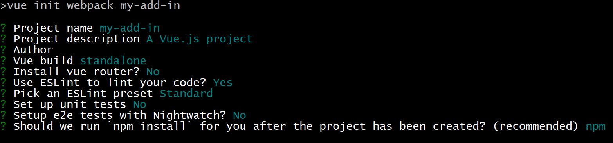

# Build an Excel task pane add-in using Vue

In this article, you'll walk through the process of building an Excel task pane add-in using Vue and the Excel JavaScript API.

## Prerequisites

[!include[Yeoman generator prerequisites](../includes/quickstart-yo-prerequisites.md)]

- Install the [Vue CLI](https://github.com/vuejs/vue-cli) globally.

    ```command&nbsp;line
    npm install -g vue-cli
    ```

## Generate a new Vue app

Use the Vue CLI to generate a new Vue app. From the terminal, run the following command and then answer the prompts as described below.

```command&nbsp;line
vue init webpack my-add-in
```

When responding to the prompts that are generated by the previous command, override the default answers for the following 3 prompts. You can accept the default answers for all other prompts.

- **Install vue-router?** `No`
- **Set up unit tests:** `No`
- **Setup e2e tests with Nightwatch?** `No`



## Generate the manifest file

Each add-in requires a manifest file to define its settings and capabilities.

1. Navigate to your app folder.

    ```command&nbsp;line
    cd my-add-in
    ```

2. Use the Yeoman generator to generate the manifest file for your add-in. Run the following command and then answer the prompts as shown below.

    ```command&nbsp;line
    yo office
    ```

    - **Choose a project type:** `Office Add-in project containing the manifest only`
    - **What do you want to name your add-in?** `My Office Add-in`
    - **Which Office client application would you like to support?** `Excel`

    

    After you complete the wizard, the generator creates the manifest file.

## Secure the app

[!include[HTTPS guidance](../includes/https-guidance.md)]

To enable HTTPS for your app, open the file **package.json** in the root folder of the Vue project, modify the `dev` script to add the `--https` flag, and save the file.

```json
"dev": "webpack-dev-server --https --inline --progress --config build/webpack.dev.conf.js"
```

## Update the app

1. In your code editor, open the folder **My Office Add-in** that Yo Office created at the root of your Vue project. In that folder, you'll see the manifest file that defines the settings for your add-in: **manifest.xml**.

2. Open the manifest file, replace all occurrences of `https://localhost:3000` with `https://localhost:8080`, and save the file.

3. Open the file **index.html** (located at the root of your Vue project), add the following `<script>` tag immediately before the `</head>` tag, and save the file.

    ```html
    <script src="https://appsforoffice.microsoft.com/lib/1/hosted/office.js"></script>
    ```

3. Open **src/main.js** and *remove* the following block of code:

    ```js
    new Vue({
        el: '#app',
        components: {App},
        template: '<App/>'
    })
    ```
    
    Then add the following code in that same location, and save the file. 
                                                         
    ```js
    const Office = window.Office
    Office.initialize = () => {
      new Vue({
        el: '#app',
        components: {App},
        template: '<App/>'
      })
    }
    ```

4. Open **src/App.vue**, replace file contents with the following code, add a line break at the end of the file (i.e., after the `</style>` tag), and save the file. 

    ```html
    <template>
    <div id="app">
        <div id="content">
        <div id="content-header">
            <div class="padding">
            <h1>Welcome</h1>
            </div>
        </div>
        <div id="content-main">
            <div class="padding">
            <p>Choose the button below to set the color of the selected range to green.</p>
            <br/>
            <h3>Try it out</h3>
            <button @click="onSetColor">Set color</button>
            </div>
        </div>
        </div>
    </div>
    </template>

    <script>
    export default {
      name: 'App',
      methods: {
        onSetColor () {
          window.Excel.run(async (context) => {
            const range = context.workbook.getSelectedRange()
            range.format.fill.color = 'green'
            await context.sync()
          })
        }
      }
    }
    </script>

    <style>
    #content-header {
        background: #2a8dd4;
        color: #fff;
        position: absolute;
        top: 0;
        left: 0;
        width: 100%;
        height: 80px;
        overflow: hidden;
    }

    #content-main {
        background: #fff;
        position: fixed;
        top: 80px;
        left: 0;
        right: 0;
        bottom: 0;
        overflow: auto;
    }

    .padding {
        padding: 15px;
    }
    </style>
    ```

## Start the dev server

1. From the terminal, run the following command to start the dev server.

    ```command&nbsp;line
    npm start
    ```

2. In a web browser, navigate to `https://localhost:8080`. If your browser indicates that the site's certificate is not trusted, you will need to configure your computer to trust the certificate. 

3. After your browser loads the add-in page without any certificate errors, you're ready test your add-in. 

## Try it out

1. Follow the instructions for the platform you'll be using to run your add-in and sideload the add-in within Excel.

    - Windows: [Sideload Office Add-ins on Windows](../testing/create-a-network-shared-folder-catalog-for-task-pane-and-content-add-ins.md)
    - Excel Online: [Sideload Office Add-ins in Office Online](../testing/sideload-office-add-ins-for-testing.md#sideload-an-office-add-in-in-office-online)
    - iPad and Mac: [Sideload Office Add-ins on iPad and Mac](../testing/sideload-an-office-add-in-on-ipad-and-mac.md)

2. In Excel, choose the **Home** tab, and then choose the **Show Taskpane** button in the ribbon to open the add-in task pane.

    

3. Select any range of cells in the worksheet.

4. In the task pane, choose the **Set color** button to set the color of the selected range to green.

    

## Next steps

Congratulations, you've successfully created an Excel task pane add-in using Vue! Next, learn more about the capabilities of an Excel add-in and build a more complex add-in by following along with the Excel add-in tutorial.

> [!div class="nextstepaction"]
> [Excel add-in tutorial](../tutorials/excel-tutorial.md)

## See also

* [Excel add-in tutorial](../tutorials/excel-tutorial-create-table.md)
* [Fundamental programming concepts with the Excel JavaScript API](../excel/excel-add-ins-core-concepts.md)
* [Excel add-in code samples](https://developer.microsoft.com/office/gallery/?filterBy=Samples,Excel)
* [Excel JavaScript API reference](/office/dev/add-ins/reference/overview/excel-add-ins-reference-overview)

