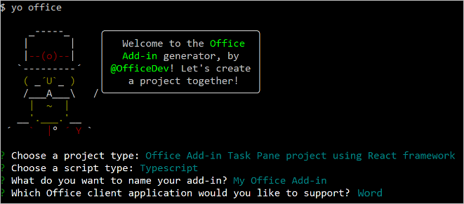
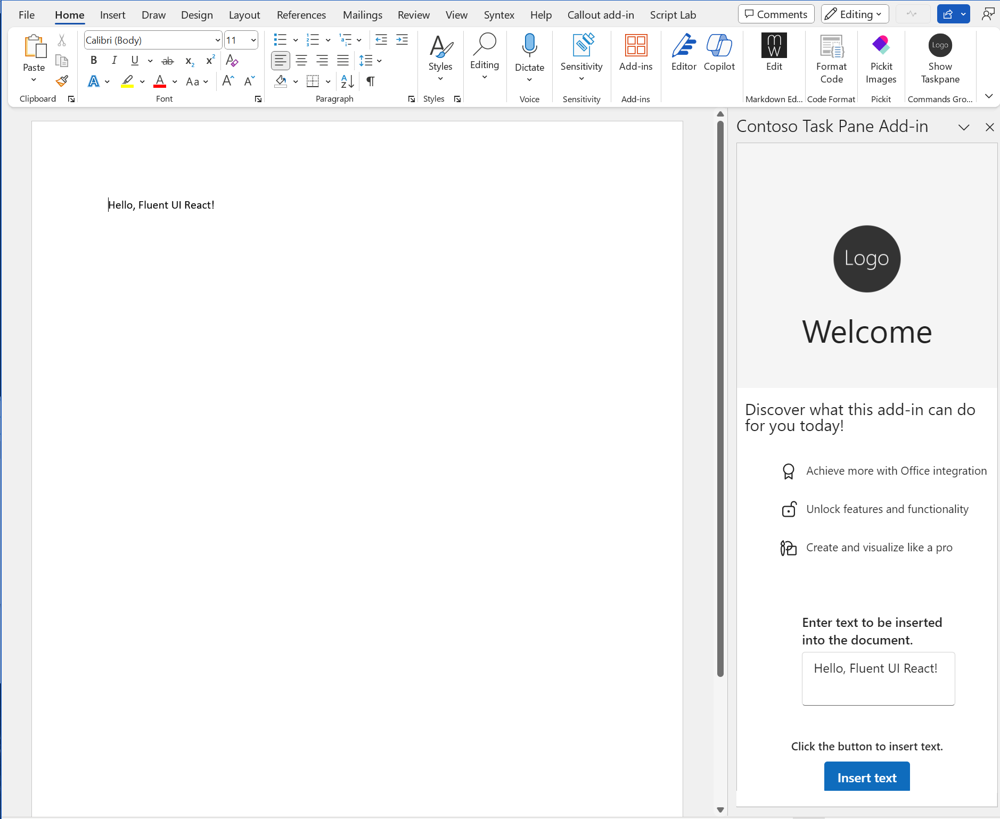

# Use Fluent UI React in Office Add-ins

[Fluent UI React](https://react.fluentui.dev) is the official open-source JavaScript front-end framework designed to build experiences that fit seamlessly into a broad range of Microsoft products, including Microsoft 365 applications. It provides robust, up-to-date, accessible React-based components which are highly customizable using CSS-in-JS.

> [!NOTE]
> This article describes the use of Fluent UI React in the context of Office Add-ins. However, it's also used in a wide range of Microsoft 365 apps and extensions. For more information, see [Fluent UI React](https://react.fluentui.dev) and the [Fluent UI Web](https://github.com/microsoft/fluentui) open source repository.

This article describes how to create an add-in that's built with React and that uses Fluent UI React components.

## Create an add-in project

You'll use the [Yeoman generator for Office Add-ins](../develop/yeoman-generator-overview.md) to create an add-in project that uses React.

### Install the prerequisites

[!INCLUDE [Yeoman generator prerequisites](../includes/quickstart-yo-prerequisites.md)]

### Create the project

[!INCLUDE [Yeoman generator create project guidance](../includes/yo-office-command-guidance.md)]

- **Choose a project type:** Specify `Office Add-in Task Pane project using React framework`.
- **Choose a script type:** Specify either `TypeScript` or `JavaScript`.
- **What do you want to name your add-in?** Specify `My Office Add-in`.
- **Which Office client application would you like to support?** Specify one of the hosts. (The screenshots in this article use `Word`. Running the project for the first time is easier if you select `Excel`, `PowerPoint`, or `Word`. See [Try it out](#try-it-out).)

The following is an example.



After you complete the wizard, the generator creates the project and installs supporting Node components.

### Explore the project

The add-in project that you've created with the Yeoman generator contains sample code for a basic task pane add-in. If you'd like to explore the components of your add-in project, open the project in your code editor and review the following files. The file name extensions depend on which language you choose. TypeScript extensions are in parentheses. When you're ready to try out your add-in, proceed to the next section.

- The **./manifest.xml** or **./manifest.json** file in the root directory of the project defines the settings and capabilities of the add-in. To learn more about the **manifest.xml** file, see [Office Add-ins with the add-in only manifest](../develop/xml-manifest-overview.md). To learn more about the **manifest.json** file, see [Office Add-ins with the unified app manifest for Microsoft 365](../develop/unified-manifest-overview.md).

   [!include[Unified manifest host application support note](../includes/unified-manifest-support-note.md)]

- The **./src/taskpane/taskpane.html** file contains the HTML markup for the task pane and loads the Office JavaScript Library. It also tests whether the webview control supports Fluent UI React v9 and displays a special message if it doesn't.
- The **./src/taskpane/index.jsx (tsx)** file is the React root component. It loads React and Fluent UI React, ensures that the Office JavaScript library has been loaded, and applies the Fluent-defined theme.
- The **./src/taskpane/office-document.js (ts)** file contains the Office JavaScript API code that facilitates interaction between the task pane and the Office client application.
- The **./src/taskpane/components/** folder contains the React component *.jss (tsx) files that create the UI.

### Try it out

1. Navigate to the root folder of the project.

    ```command&nbsp;line
    cd "My Office Add-in"
    ```

1. Complete the following steps to start the local web server and sideload your add-in.
    [!INCLUDE [alert use https](../includes/alert-use-https.md)]

    > [!TIP]
    > If you're testing your add-in on Mac, run the following command before proceeding. When you run this command, the local web server starts.
    >
    > ```command&nbsp;line
    > npm run dev-server
    > ```

    - To test your add-in, run the following command in the root directory of your project. This starts the local web server and opens the Office host application with your add-in loaded.

        ```command&nbsp;line
        npm start
        ```

        > [!NOTE]
        > If you're testing your add-in in Outlook, `npm start` sideloads the add-in to both the Outlook desktop and web clients. For more information on how to sideload add-ins in Outlook, see [Sideload Outlook add-ins for testing](../outlook/sideload-outlook-add-ins-for-testing.md).

    - To test your add-in in Excel, Word, or PowerPoint on the web, run the following command in the root directory of your project. When you run this command, the local web server starts. Replace "{url}" with the URL of a Word document on your OneDrive or a SharePoint library to which you have permissions.

        [!INCLUDE [npm start on web command syntax](../includes/start-web-sideload-instructions.md)]

    > [!NOTE]
    > If this is the first time that you have sideloaded an Office add-in on your computer (or the first time in over a month), you're prompted first to delete an old certificate and then to install a new one. Agree to both prompts.

1. A **WebView Stop On Load** prompt appears. Select **OK**.

1. If the "My Office Add-in" task pane isn't already open, choose the **Home** tab, and then choose the **Show Taskpane** button on the ribbon to open the add-in task pane.

    > [!NOTE]
    > If you're testing your add-in in Outlook, create a new message. Then, navigate to the **Message** tab and choose **Show Taskpane** from the ribbon to open the add-in task pane.

1. Enter text into the text box and then select **Insert text**.

    

1. When you're ready to stop the dev server and uninstall the add-in, run the following command.

    ```command&nbsp;line
    npm stop
    ```

## Migrate to Fluent UI React v9

If you have an existing add-in that implements an older version of Fluent UI React, we recommend migrating to Fluent UI v9. For guidance on the migration process, see [Getting started migrating to v9](https://react.fluentui.dev/?path=/docs/concepts-migration-getting-started--page).

[!include[The common troubleshooting section for all Yo Office quick starts](../includes/quickstart-troubleshooting-yo.md)]

## See also

- [UX design patterns for Office Add-ins](../design/ux-design-pattern-templates.md)
- [Fluent UI React](https://react.fluentui.dev)
- [Fluent UI GitHub repository](https://github.com/microsoft/fluentui)
