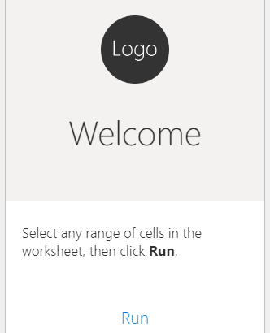

# Build an add-in with a basic first-run experience

In this article, you'll walk through the process of building a task pane add-in that implements a [first-run experience](../design/first-run-experience-patterns.md) using the value placemat pattern. When the user runs the add-in, the add-in determines whether or not to show the first-run experience by checking local storage for the existence of a certain flag.

This quick start provides instructions and screenshots for Excel but you can use a similar pattern to implement a first-run experience in other Office applications where Office Web Add-ins are supported. If you'd like to use a different Office application, see that application's quick start for setup instructions before proceeding. Also note that actual interactions with your selected Office application will differ.

## Prerequisites

[!include[Yeoman generator prerequisites](../includes/quickstart-yo-prerequisites.md)]

## Create the add-in project

[!include[Yeoman generator create project guidance](../includes/yo-office-command-guidance.md)]

- **Choose a project type:** `Office Add-in Task Pane project`
- **Choose a script type:** `JavaScript`
- **What do you want to name your add-in?** `My Office Add-in`
- **Which Office client application would you like to support?** `Excel`


After you complete the wizard, the generator creates the project and installs supporting Node components.

[!include[Node.js version 20 warning](../includes/node-20-warning-note.md)]

[!include[Yeoman generator next steps](../includes/yo-office-next-steps.md)]

## Explore the project

[!include[Yeoman generator add-in project components](../includes/yo-task-pane-project-components-js.md)]

## Try it out

1. Navigate to the root folder of the project.

    ```command&nbsp;line
    cd "My Office Add-in"
    ```

1. [!include[Start server section](../includes/quickstart-yo-start-server-excel.md)]

    > [!NOTE]
    > If this is the first time that you have sideloaded an Office add-in on your computer (or the first time in over a month), you're prompted first to delete an old certificate and then to install a new one. Agree to both prompts.

1. A **WebView Stop On Load** prompt appears. Select **OK**.

1. In Excel, choose the **Home** tab, and then choose the **Show Taskpane** button on the ribbon to open the add-in task pane.

    

1. Select any range of cells in the worksheet.

1. At the bottom of the task pane, choose the **Run** link to set the color of the selected range to yellow.

    

## Implement the first-run experience

1. Open the **taskpane.html**. Replace the `<main>` element with the following markup, then save the file.

    ```html
    <main id="app-body" class="ms-welcome__main" style="display: none;">
        <div id="first-run-experience" style="display: none;">
            <h2 class="ms-font-xl"> Discover what Office Add-ins can do for you today! </h2>
            <ul class="ms-List ms-welcome__features">
                <li class="ms-ListItem">
                    <i class="ms-Icon ms-Icon--Ribbon ms-font-xl"></i>
                    <span class="ms-font-m">Achieve more with Office integration</span>
                </li>
                <li class="ms-ListItem">
                    <i class="ms-Icon ms-Icon--Unlock ms-font-xl"></i>
                    <span class="ms-font-m">Unlock features and functionality</span>
                </li>
                <li class="ms-ListItem">
                    <i class="ms-Icon ms-Icon--Design ms-font-xl"></i>
                    <span class="ms-font-m">Create and visualize like a pro</span>
                </li>
            </ul>
        </div>
        <p class="ms-font-l">Select any range of cells in the worksheet, then click <b>Run</b>.</p>
        <div role="button" id="run" class="ms-welcome__action ms-Button ms-Button--hero ms-font-xl">
            <span class="ms-Button-label">Run</span>
        </div>
        <p><label id="item-subject"></label></p>    
    </main>
    ```

1. Open the **taskpane.js** file. Replace the `Office.onReady` statement with the following code, then save the file.

    ```javascript
    Office.onReady((info) => {
      if (info.host === Office.HostType.Excel) {
        document.getElementById("sideload-msg").style.display = "none";
        document.getElementById("app-body").style.display = "flex";
    
        if (!localStorage.getItem("showedFRE")) {
          showFirstRunExperience();
        }
    
        document.getElementById("run").onclick = run;
      }
    });
    
    async function showFirstRunExperience() {
      document.getElementById("first-run-experience").style.display = "flex";
      localStorage.setItem("showedFRE", true);
    }  
    ```

1. Open the **taskpane.css** file. Replace the line `.ms-welcome__main {` with the following code, then save the file.

    ```css
    .ms-welcome__main, .ms-welcome__main > div {
    ```

### Try it out

1. If the local web server is already running and your add-in is already loaded in Excel, proceed to step 2. Otherwise, start the local web server and sideload your add-in.

    - To test your add-in in Excel, run the following command in the root directory of your project. This starts the local web server (if it isn't already running) and opens Excel with your add-in loaded.

    ```command&nbsp;line
    npm start
    ```

    - To test your add-in in Excel on the web, run the following command in the root directory of your project. When you run this command, the local web server starts. Replace "{url}" with the URL of a Excel workbook on your OneDrive or a SharePoint library to which you have permissions.

    [!INCLUDE [npm start:web command syntax](../includes/start-web-sideload-instructions.md)]

1. If the add-in task pane isn't already open in Excel, go to the **Home** tab and choose the **Show Taskpane** button on the ribbon to open it.

1. Verify that the task pane includes the list of features.

1. Close the task pane then reopen it. Verify that the task pane no longer displays the list of features.

    

1. If the local web server is running, run the following command when you want to stop the server and uninstall the add-in.

    ```command&nbsp;line
    npm stop
    ```

## Next steps

Congratulations, you've successfully created a Office task pane add-in with a first-run experience!

### Make it production ready

Using this quick start, you implemented a basic [first-run experience](../design/first-run-experience-patterns.md). For the first-run experience to be ready for users, you should consider the following:

- Use a more secure and robust option for tracking first-run state. For example, use storage partitioning if available, or implement a Single Sign-on (SSO) authentication solution. For more about available settings options, see [Persist add-in state and settings](../develop/persisting-add-in-state-and-settings.md). For more about available authentication options, see [Overview of authentication and authorization](../develop/overview-authn-authz.md).
- Update the features listed in the value placemat to match what your add-in actually does.
- Implement a different pattern (for example, video placemat or carousel) that better showcases the benefits of your add-in.

If you're planning to make your add-in available in the AppSource marketplace, you'll need to have a robust and useful first-run experience. For more information, see [Best practices for developing Office Add-ins](../concepts/add-in-development-best-practices.md).

[!include[The common troubleshooting section for all quickstarts](../includes/quickstart-troubleshooting.md)]

## Code samples

- ["Hello world" add-ins](../overview/office-add-in-code-samples.md#getting-started): Learn how to build a simple Office Add-in with only a manifest, HTML web page, and a logo.

## See also

- [Office Add-ins platform overview](../overview/office-add-ins.md)
- [Develop Office Add-ins](../develop/develop-overview.md)
- [Using Visual Studio Code to publish](../publish/publish-add-in-vs-code.md#using-visual-studio-code-to-publish)
