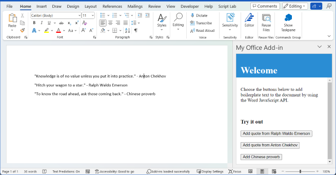

# Test of tabs

Intro... 

## Create the add-in

[!include[Choose your editor](../includes/quickstart-choose-editor.md)]

# [VS Code](#tab/visual-studio-code)

### Prerequisites

[!include[Yeoman generator prerequisites](../includes/quickstart-yo-prerequisites.md)]

### Create the add-in project

Use the Yeoman generator to create a Word add-in project. Run the following command and then answer the prompts as follows:

```command&nbsp;line
yo office
```

- **Choose a project type:** `Office Add-in Task Pane project`
- **Choose a script type:** `Javascript`
- **What do you want to name your add-in?** `My Office Add-in`
- **Which Office client application would you like to support?** `Word`


After you complete the wizard, the generator creates the project and installs supporting Node components.

### Explore the project

[!include[Yeoman generator add-in project components](../includes/yo-task-pane-project-components-js.md)]

### Try it out

1. Navigate to the root folder of the project.

    ```command&nbsp;line
    cd "My Office Add-in"
    ```

2. Complete the following steps to start the local web server and sideload your add-in.

    > [!NOTE]
    > Office Add-ins should use HTTPS, not HTTP, even when you are developing. If you are prompted to install a certificate after you run one of the following commands, accept the prompt to install the certificate that the Yeoman generator provides.

    > [!TIP]
    > If you're testing your add-in on Mac, run the following command before proceeding. When you run this command, the local web server starts.
    >
    > ```command&nbsp;line
    > npm run dev-server
    > ```

    - To test your add-in in Word, run the following command in the root directory of your project. This starts the local web server (if it's not already running) and opens Word with your add-in loaded.

        ```command&nbsp;line
        npm start
        ```

    - To test your add-in in Word on a browser, run the following command in the root directory of your project. When you run this command, the local web server will start (if it's not already running).

        ```command&nbsp;line
        npm run start:web
        ```

        To use your add-in, open a new document in Word on the web and then sideload your add-in by following the instructions in [Sideload Office Add-ins in Office on the web](../testing/sideload-office-add-ins-for-testing.md#sideload-an-office-add-in-in-office-on-the-web).

3. In Word, open a new document, choose the **Home** tab, and then choose the **Show Taskpane** button in the ribbon to open the add-in task pane.

    

4. At the bottom of the task pane, choose the **Run** link to add the text "Hello World" to the document in blue font.

    

---

## Next steps

Congratulations, you've successfully created a Word task pane add-in! Next, learn more about the capabilities of a Word add-in and build a more complex add-in by following along with the Word add-in tutorial.

> [!div class="nextstepaction"]
> [Word add-in tutorial](../tutorials/word-tutorial.md)

## See also

* [Word add-ins overview](../word/word-add-ins-programming-overview.md)
* [Word add-in code samples](https://developer.microsoft.com/en-us/office/gallery/?filterBy=Samples,Word)
* [Word JavaScript API reference](/office/dev/add-ins/reference/overview/word-add-ins-reference-overview)


# [Visual Studio](#tab/visual-studio)

### Prerequisites

[!include[Quick Start prerequisites](../includes/quickstart-vs-prerequisites.md)]

### Create the add-in project

1. On the Visual Studio menu bar, choose  **File** > **New** > **Project**.

2. In the list of project types under **Visual C#** or **Visual Basic**, expand  **Office/SharePoint**, choose **Add-ins**, and then choose **Word Web Add-in** as the project type. 

3. Name the project, and then choose **OK**.

4. Visual Studio creates a solution and its two projects appear in **Solution Explorer**. The **Home.html** file opens in Visual Studio.

### Explore the Visual Studio solution

[!include[Description of Visual Studio projects](../includes/quickstart-vs-solution.md)]

### Update the code

1. **Home.html** specifies the HTML that will be rendered in the add-in's task pane. In **Home.html**, replace the `<body>` element with the following markup and save the file.

    ```html
    <body>
        <div id="content-header">
            <div class="padding">
                <h1>Welcome</h1>
            </div>
        </div>
        <div id="content-main">
            <div class="padding">
                <p>Choose the buttons below to add boilerplate text to the document by using the Word JavaScript API.</p>
                <br />
                <h3>Try it out</h3>
                <button id="emerson">Add quote from Ralph Waldo Emerson</button>
                <br /><br />
                <button id="checkhov">Add quote from Anton Chekhov</button>
                <br /><br />
                <button id="proverb">Add Chinese proverb</button>
            </div>
        </div>
        <br />
        <div id="supportedVersion"/>
    </body>
    ```

2. Open the file **Home.js** in the root of the web application project. This file specifies the script for the add-in. Replace the entire contents with the following code and save the file.

    ```js
    'use strict';

    (function () {

        Office.onReady(function() {
            // Office is ready
            $(document).ready(function () {
                // The document is ready
                // Use this to check whether the API is supported in the Word client.
                if (Office.context.requirements.isSetSupported('WordApi', 1.1)) {
                    // Do something that is only available via the new APIs
                    $('#emerson').click(insertEmersonQuoteAtSelection);
                    $('#checkhov').click(insertChekhovQuoteAtTheBeginning);
                    $('#proverb').click(insertChineseProverbAtTheEnd);
                    $('#supportedVersion').html('This code is using Word 2016 or later.');
                }
                else {
                    // Just letting you know that this code will not work with your version of Word.
                    $('#supportedVersion').html('This code requires Word 2016 or later.');
                }
            });
        });

        function insertEmersonQuoteAtSelection() {
            Word.run(function (context) {

                // Create a proxy object for the document.
                var thisDocument = context.document;

                // Queue a command to get the current selection.
                // Create a proxy range object for the selection.
                var range = thisDocument.getSelection();

                // Queue a command to replace the selected text.
                range.insertText('"Hitch your wagon to a star."\n', Word.InsertLocation.replace);

                // Synchronize the document state by executing the queued commands,
                // and return a promise to indicate task completion.
                return context.sync().then(function () {
                    console.log('Added a quote from Ralph Waldo Emerson.');
                });
            })
            .catch(function (error) {
                console.log('Error: ' + JSON.stringify(error));
                if (error instanceof OfficeExtension.Error) {
                    console.log('Debug info: ' + JSON.stringify(error.debugInfo));
                }
            });
        }

        function insertChekhovQuoteAtTheBeginning() {
            Word.run(function (context) {

                // Create a proxy object for the document body.
                var body = context.document.body;

                // Queue a command to insert text at the start of the document body.
                body.insertText('"Knowledge is of no value unless you put it into practice."\n', Word.InsertLocation.start);

                // Synchronize the document state by executing the queued commands,
                // and return a promise to indicate task completion.
                return context.sync().then(function () {
                    console.log('Added a quote from Anton Chekhov.');
                });
            })
            .catch(function (error) {
                console.log('Error: ' + JSON.stringify(error));
                if (error instanceof OfficeExtension.Error) {
                    console.log('Debug info: ' + JSON.stringify(error.debugInfo));
                }
            });
        }

        function insertChineseProverbAtTheEnd() {
            Word.run(function (context) {

                // Create a proxy object for the document body.
                var body = context.document.body;

                // Queue a command to insert text at the end of the document body.
                body.insertText('"To know the road ahead, ask those coming back."\n', Word.InsertLocation.end);

                // Synchronize the document state by executing the queued commands,
                // and return a promise to indicate task completion.
                return context.sync().then(function () {
                    console.log('Added a quote from a Chinese proverb.');
                });
            })
            .catch(function (error) {
                console.log('Error: ' + JSON.stringify(error));
                if (error instanceof OfficeExtension.Error) {
                    console.log('Debug info: ' + JSON.stringify(error.debugInfo));
                }
            });
        }
    })();
    ```

3. Open the file **Home.css** in the root of the web application project. This file specifies the custom styles for the add-in. Replace the entire contents with the following code and save the file.

    ```css
    #content-header {
        background: #2a8dd4;
        color: #fff;
        position: absolute;
        top: 0;
        left: 0;
        width: 100%;
        height: 80px; 
        overflow: hidden;
    }

    #content-main {
        background: #fff;
        position: fixed;
        top: 80px;
        left: 0;
        right: 0;
        bottom: 0;
        overflow: auto;
    }

    .padding {
        padding: 15px;
    }
    ```

### Update the manifest

1. Open the XML manifest file in the add-in project. This file defines the add-in's settings and capabilities.

2. The `ProviderName` element has a placeholder value. Replace it with your name.

3. The `DefaultValue` attribute of the `DisplayName` element has a placeholder. Replace it with **My Office Add-in**.

4. The `DefaultValue` attribute of the `Description` element has a placeholder. Replace it with **A task pane add-in for Word**.

5. Save the file.

    ```xml
    ...
    <ProviderName>John Doe</ProviderName>
    <DefaultLocale>en-US</DefaultLocale>
    <!-- The display name of your add-in. Used on the store and various places of the Office UI such as the add-ins dialog. -->
    <DisplayName DefaultValue="My Office Add-in" />
    <Description DefaultValue="A task pane add-in for Word"/>
    ...
    ```

### Try it out

1. Using Visual Studio, test the newly created Word add-in by pressing **F5** or choosing the **Start** button to launch Word with the **Show Taskpane** add-in button displayed in the ribbon. The add-in will be hosted locally on IIS.

2. In Word, choose the **Home** tab, and then choose the **Show Taskpane** button in the ribbon to open the add-in task pane. (If you are using the one-time purchase version of Office, instead of the Office 365 version, then custom buttons are not supported. Instead, the task pane will open immediately.)

    

3. In the task pane, choose any of the buttons to add boilerplate text to the document.

    

