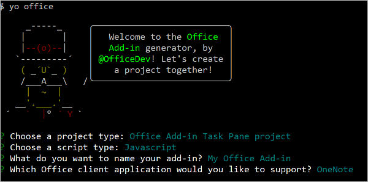
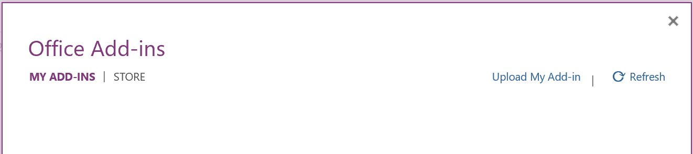
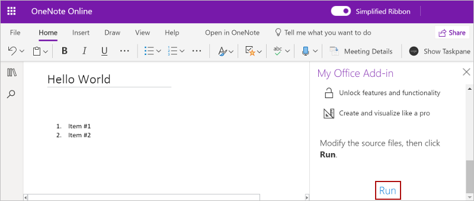

# Build your first OneNote task pane add-in

In this article, you'll walk through the process of building a OneNote task pane add-in.

## Prerequisites

[!include[Yeoman generator prerequisites](../includes/quickstart-yo-prerequisites.md)]

## Create the add-in project

[!include[Yeoman generator create project guidance](../includes/yo-office-command-guidance.md)]

- **Choose a project type:** `Office Add-in Task Pane project`
- **Choose a script type:** `Javascript`
- **What do you want to name your add-in?** `My Office Add-in`
- **Which Office client application would you like to support?** `OneNote`



After you complete the wizard, the generator creates the project and installs supporting Node components.

## Explore the project

The add-in project that you've created with the Yeoman generator contains sample code for a very basic task pane add-in.

- The **./manifest.xml** file in the root directory of the project defines the settings and capabilities of the add-in.
- The **./src/taskpane/taskpane.html** file contains the HTML markup for the task pane.
- The **./src/taskpane/taskpane.css** file contains the CSS that's applied to content in the task pane.
- The **./src/taskpane/taskpane.js** file contains the Office JavaScript API code that facilitates interaction between the task pane and the Office client application.

## Update the code

In your code editor, open the file **./src/taskpane/taskpane.js** and add the following code within the `run` function. This code uses the OneNote JavaScript API to set the page title and add an outline to the body of the page.

```js
try {
    await OneNote.run(async (context) => {

        // Get the current page.
        const page = context.application.getActivePage();

        // Queue a command to set the page title.
        page.title = "Hello World";

        // Queue a command to add an outline to the page.
        const html = "<p><ol><li>Item #1</li><li>Item #2</li></ol></p>";
        page.addOutline(40, 90, html);

        // Run the queued commands.
        await context.sync();
    });
} catch (error) {
    console.log("Error: " + error);
}
```

## Try it out

1. Navigate to the root folder of the project.

    ```command&nbsp;line
    cd "My Office Add-in"
    ```

1. Start the local web server. Run the following command in the root directory of your project.

    ```command&nbsp;line
    npm run dev-server
    ```

    [!INCLUDE [alert use https](../includes/alert-use-https.md)]

1. In [OneNote on the web](https://www.onenote.com/notebooks), open a notebook and create a new page.

1. Choose **Insert** > **Office Add-ins** to open the Office Add-ins dialog.

    - If you're signed in with your consumer account, select the **MY ADD-INS** tab, and then choose **Upload My Add-in**.

    - If you're signed in with your work or education account, select the **MY ORGANIZATION** tab, and then select **Upload My Add-in**.

    The following image shows the **MY ADD-INS** tab for consumer notebooks.

    

1. In the Upload Add-in dialog, browse to **manifest.xml** in your project folder, and then choose **Upload**.

1. From the **Home** tab, choose the **Show Taskpane** button on the ribbon. The add-in task pane opens in an iFrame next to the OneNote page.

1. At the bottom of the task pane, choose the **Run** link to set the page title and add an outline to the body of the page.

    

1. When you want to stop the local web server and uninstall the add-in, follow these instructions:

    - To stop the server, run the following command.

        ```command&nbsp;line
        npm stop
        ```

    - To uninstall the sideloaded add-in, see [Remove a sideloaded add-in](../testing/sideload-office-add-ins-for-testing.md#remove-a-sideloaded-add-in).

## Next steps

Congratulations, you've successfully created a OneNote task pane add-in! Next, learn more about the core concepts of building OneNote add-ins.

> [!div class="nextstepaction"]
> [OneNote JavaScript API programming overview](../onenote/onenote-add-ins-programming-overview.md)

[!include[The common troubleshooting section for all Yo Office quick starts](../includes/quickstart-troubleshooting-yo.md)]

## See also

- [Office Add-ins platform overview](../overview/office-add-ins.md)
- [Develop Office Add-ins](../develop/develop-overview.md)
- [OneNote JavaScript API programming overview](../onenote/onenote-add-ins-programming-overview.md)
- [OneNote JavaScript API reference](../reference/overview/onenote-add-ins-javascript-reference.md)
- [Rubric Grader sample](https://github.com/OfficeDev/OneNote-Add-in-Rubric-Grader)
- [Using Visual Studio Code to publish](../publish/publish-add-in-vs-code.md#using-visual-studio-code-to-publish)
