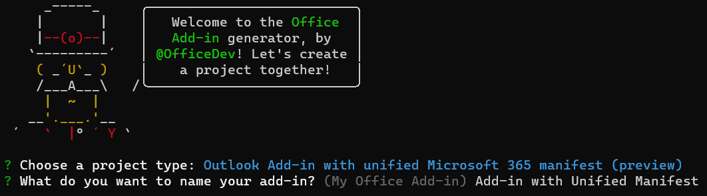

# Build an Outlook add-in with a Teams manifest (preview)

In this article, you'll walk through the process of building an Outlook task pane add-in that displays a property of a selected message, triggers a notification on the reading pane, and inserts text into a message on the compose pane. This add-in will use a preview version of the JSON-formatted manifest that Teams extensions, like custom tabs and messaging extensions, use. For more information about this manifest, see [Teams manifest for Office Add-ins (preview)](../develop/json-manifest-overview.md).

> [!NOTE]
> The new manifest is available for preview and is subject to change based on feedback. We encourage experienced add-in developers to experiment with it. The preview manifest should not be used in production add-ins.

The preview is only supported in Office downloaded from a Microsoft 365 subscription and installed on Windows.

> [!TIP]
> If you want to build an Outlook add-in using the XML manifest, see [Build your first Outlook add-in](outlook-quickstart.md).

## Create the add-in

You can create an Office Add-in with a JSON manifest by using the [Yeoman generator for Office Add-ins](../develop/yeoman-generator-overview.md). The Yeoman generator creates a Node.js project that can be managed with Visual Studio Code or any other editor.

### Prerequisites

[!include[Set up requirements](../includes/set-up-dev-environment-beforehand.md)]

- [.NET runtime](https://dotnet.microsoft.com/download/dotnet/6.0/runtime) for Windows. One of the tools used in the preview runs on .NET.

[!INCLUDE [Yeoman generator prerequisites](../includes/quickstart-yo-prerequisites.md)]

- [Visual Studio Code (VS Code)](https://code.visualstudio.com/) or your preferred code editor

- Outlook on Windows (connected to a Microsoft 365 account)

### Create the add-in project

1. [!include[Yeoman generator create project guidance](../includes/yo-office-command-guidance.md)]

    - **Choose a project type** - `Outlook Add-in with Teams Manifest (Developer preview)`

    - **What do you want to name your add-in?** - `Add-in with Teams Manifest`

     

    > [!NOTE]
    > For this preview, the add-in name cannot be more than 30 characters.

    After you complete the wizard, the generator will create the project and install supporting Node components.

    [!include[Yeoman generator next steps](../includes/yo-office-next-steps.md)]

1. Navigate to the root folder of the web application project.

    ```command&nbsp;line
    cd "Add-in with Teams Manifest"
    ```

### Explore the project

The add-in project that you've created with the Yeoman generator contains sample code for a very basic task pane add-in.

- The **./manifest/manifest.json** file in the root directory of the project defines the settings and capabilities of the add-in.
- The **./src/taskpane/taskpane.html** file contains the HTML markup for the task pane.
- The **./src/taskpane/taskpane.css** file contains the CSS that's applied to content in the task pane.
- The **./src/taskpane/taskpane.ts** file contains code that calls the Office JavaScript library to facilitate interaction between the task pane and Outlook.
- The **./src/command/command.html** file will be edited by WebPack at build time to insert an HTML `<script>` tag that loads the JavaScript file that is transpiled from the command.ts file.
- The **./src/command/command.ts** file has little code in it at first. Later in this article, you'll add code to it that calls the Office JavaScript library and that executes when a custom ribbon button is selected.

### Update the code

1. Open your project in VS Code or your preferred code editor.

    > [!TIP]
    > On Windows, you can navigate to the root directory of the project via the command line and then enter `code .` to open that folder in VS Code.

1. Open the file **./src/taskpane/taskpane.html** and replace the entire **\<main\>** element (within the **\<body\>** element) with the following markup. This new markup adds a label where the script in **./src/taskpane/taskpane.ts** will write data.

    ```html
    <main id="app-body" class="ms-welcome__main" style="display: none;">
        <h2 class="ms-font-xl"> Discover what Office Add-ins can do for you today! </h2>
        <p><label id="item-subject"></label></p>
        <div role="button" id="run" class="ms-welcome__action ms-Button ms-Button--hero ms-font-xl">
            <span class="ms-Button-label">Run</span>
        </div>
    </main>
    ```

1. In your code editor, open the file **./src/taskpane/taskpane.ts** and add the following code within the **run** function. This code uses the Office JavaScript API to get a reference to the current message and write its **subject** property value to the task pane.

    ```typescript
    // Get a reference to the current message.
    let item = Office.context.mailbox.item;

    // Write a message property value to the task pane.
    document.getElementById("item-subject").innerHTML = "<b>Subject:</b> <br/>" + item.subject;
    ```

### Try it out

[!INCLUDE [alert use https](../includes/alert-use-https.md)]

1. Run the following command in the root directory of your project. When you run this command, the local web server starts and your add-in will be [sideloaded](../outlook/sideload-outlook-add-ins-for-testing.md).

    ```command&nbsp;line
    npm start
    ```

1. Use the classic ribbon in Outlook. The remainder of these instructions assume this.  

1. View a message in the [Reading Pane](https://support.microsoft.com/office/2fd687ed-7fc4-4ae3-8eab-9f9b8c6d53f0), or open the message in its own window. A new control group named **Contoso Add-in** appears on the Outlook **Home** tab (or the **Message** tab if you opened the message in a new window). The group has a button named **Show Taskpane** and one named **Perform an action**.

    > [!NOTE]
    > If the new group isn't present, then your add-in wasn't automatically sideloaded. Follow the instructions in [Sideload manually](sideload-outlook-add-ins-for-testing.md?tabs=windows#sideload-manually) to manually sideload the add-in in Outlook. When you are prompted to upload the manifest file, use the file `C:\Users\{your_user_name}\AppData\Local\Temp\manifest.xml`. The file has an `.xml` extension because during the preview period, the JSON-formatted manifest is converted to an XML manifest, which is then sideloaded.

1. Select the **Perform an action** button. It [executes a command](../develop/create-addin-commands.md?branch=outlook-json-manifest#step-5-add-the-functionfile-element) to generate a small informational notification at the bottom of the message header, just above the message body.

1. When prompted with the **WebView Stop On Load** dialog box, select **OK**.

    [!INCLUDE [Cancelling the WebView Stop On Load dialog box](../includes/webview-stop-on-load-cancel-dialog.md)]

1. To open the add-in task pane, choose **Show Taskpane**.

    > [!NOTE]
    > If you receive the error "We can't open this add-in from localhost" in the task pane, follow the steps outlined in the [troubleshooting article](/office/troubleshoot/office-suite-issues/cannot-open-add-in-from-localhost).

1. When prompted with the **WebView Stop On Load** dialog box, select **OK**.

    [!INCLUDE [Cancelling the WebView Stop On Load dialog box](../includes/webview-stop-on-load-cancel-dialog.md)]

1. Scroll to the bottom of the task pane and choose the **Run** link to copy the message's subject to the task pane.

1. End the debugging session with the following command:

    ```command&nbsp;line
    npm stop
    ```

    > [!IMPORTANT]
    > Closing the web server window doesn't reliably shut down the web server. If it isn't properly shut down, you'll encounter problems as you change and rerun the project.

1. Close all instances of Outlook.

## Add a custom button to the ribbon

Add a custom button to the ribbon that inserts text into a message body.

1. Open your project in VS Code or your preferred code editor.

    > [!TIP]
    > On Windows, you can navigate to the root directory of the project via the command line and then enter `code .` to open that folder in VS Code.

1. In your code editor, open the file **./src/command/command.ts** and add the following code to the end of the file. This function will insert `Hello World` at the cursor point in message body.

    ```typescript
    function insertHelloWorld(event: Office.AddinCommands.Event) {
        Office.context.mailbox.item.body.setSelectedDataAsync("Hello World", {coercionType: Office.CoercionType.Text});

        // Be sure to indicate when the add-in command function is complete
        event.completed();
    }

    // Register the function with Office
    Office.actions.associate("insertHelloWorld", insertHelloWorld);
    ```

1. Open the file **./manifest/manifest.json**.

    > [!NOTE]
    > When referring to nested JSON properties, this article uses dot notation. When an item in an array is referenced, the bracketed zero-based number of the item is used.

1. To write to a message, the add-in's permissions need to be raised. Scroll to the property `authorization.permissions.resourceSpecific[0].name` and change the value to `MailboxItem.ReadWrite.User`.

1. When an add-in command runs code instead of opening a task pane, it must run the code in a runtime that is separate from the embedded webview where the task pane code runs. So the manifest must specify an additional runtime. Scroll to the property `extension.runtimes` and add the following object to the `runtimes` array. Be sure to put a comma after the object that is already in the array. Note the following about this markup.

    - The value of the `actions[0].id` property must be exactly the same as the name of the function that you added to the **commands.ts** file, in this case `insertHelloWorld`. In a later step, you'll refer to the item by this ID.

    ```json
    {
        "id": "ComposeCommandsRuntime",
        "type": "general",
        "code": {
            "page": "https://localhost:3000/commands.html",
            "script": "https://localhost:3000/commands.js"
        },
        "lifetime": "short",
        "actions": [
            {
                "id": "insertHelloWorld",
                "type": "executeFunction",
                "displayName": "insertHelloWorld"
            }
        ]
    }
    ```

1. The **Show Taskpane** button appears when the user is reading an email, but the button for adding text should only appear when the user is composing a new email (or replying to one). So the manifest must specify a new ribbon object. Scroll to the property `extension.ribbons` and add the following object to the `ribbons` array. Be sure to put a comma after the object that is already in the array. Note the following about this markup:

    - The only value in the `contexts` array is "mailCompose", so the button will appear when in a compose (or reply) window but not in a message read window where the **Show Taskpane** and **Perform an action** buttons appear. Compare this value with the `contexts` array in the existing ribbon object, whose value is `["mailRead"]`.
    - The value of the `tabs[0].groups[0].controls[0].actionId` must be exactly the same as the value of `actions[0].id` property in the runtime object you created in an earlier step.

    ```json
    {
        "contexts": ["mailCompose"],
        "tabs": [
            {
                "builtInTabId": "TabDefault",
                "groups": [
                    {
                        "id": "msgWriteGroup",
                        "label": "Contoso Add-in",
                        "icons": [
                            { "size": 16, "file": "https://localhost:3000/assets/icon-16.png" },
                            { "size": 32, "file": "https://localhost:3000/assets/icon-32.png" },
                            { "size": 80, "file": "https://localhost:3000/assets/icon-80.png" }
                        ],
                        "controls": [
                            {
                                "id": "HelloWorldButton",
                                "type": "button",
                                "label": "Insert text",
                                "icons": [
                                    { "size": 16, "file": "https://localhost:3000/assets/icon-16.png" },
                                    { "size": 32, "file": "https://localhost:3000/assets/icon-32.png" },
                                    { "size": 80, "file": "https://localhost:3000/assets/icon-80.png" }
                                ],
                                "supertip": {
                                    "title": "Insert text",
                                    "description": "Inserts some text."
                                },
                                "actionId": "insertHelloWorld"
                            }                  
                        ]
                    }
                ]
            }
        ]
    }
    ```

### Try out the updated add-in

1. Run the following command in the root directory of your project.

    ```command&nbsp;line
    npm start
    ```

1. In Outlook, open a new message window (or reply to an existing message). A new control group named **Contoso Add-in** will appear on the Outlook **Message** tab. The group has a button named **Insert text**.

    > [!NOTE]
    > If the new group isn't present, then your add-in wasn't automatically sideloaded. Follow the instructions in [Sideload manually](sideload-outlook-add-ins-for-testing.md?tabs=windows#sideload-manually) to manually sideload the add-in in Outlook. When you're prompted to upload the manifest file, use the file `C:\Users\{your_user_name}\AppData\Local\Temp\manifest.xml`. The file has an `.xml` extension because during the preview period, the JSON-formatted manifest is converted to an XML manifest, which is then sideloaded.

1. Put the cursor anywhere in the message body and choose the **Insert text** button.

1. When prompted with the **WebView Stop On Load** dialog box, select **OK**.

    [!INCLUDE [Cancelling the WebView Stop On Load dialog box](../includes/webview-stop-on-load-cancel-dialog.md)]

    The phrase "Hello World" will be inserted at the cursor.

1. End the debugging session with the following command:

    ```command&nbsp;line
    npm stop
    ```

## See also

- [Teams manifest for Office Add-ins (preview)](../develop/json-manifest-overview.md)
- [Using Visual Studio Code to publish](../publish/publish-add-in-vs-code.md#using-visual-studio-code-to-publish)
