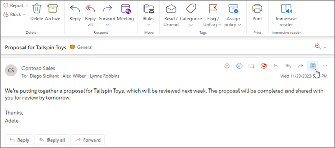
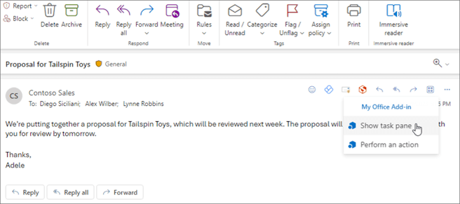
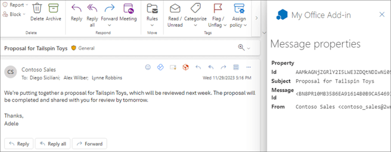

# Build your first Outlook add-in with Visual Studio

In this article, you'll walk through the process of building an Outlook task pane add-in in Visual Studio that displays at least one property of a selected message.

## Prerequisites

- [Visual Studio 2019](https://www.visualstudio.com/vs/) or later with the **Office/SharePoint development** workload installed

    > [!NOTE]
    > If you've previously installed Visual Studio 2019 or later, [use the Visual Studio Installer](/visualstudio/install/modify-visual-studio) to ensure that the **Office/SharePoint development** workload is installed.

- Office connected to a Microsoft 365 subscription (including Office on the web).

## Create the add-in project

1. On the Visual Studio menu bar, choose **File** > **New** > **Project**.

1. In the list of project types under **Visual C#** or **Visual Basic**, expand **Office/SharePoint**, choose **Add-ins**, and then choose **Outlook Web Add-in** as the project type.

1. Name the project, and then choose **OK**.

1. Visual Studio creates a solution and its two projects appear in **Solution Explorer**. The **MessageRead.html** file opens in Visual Studio.

## Explore the Visual Studio solution

When you've completed the wizard, Visual Studio creates a solution that contains two projects.

|Project|Description|
|:-----|:-----|
|Add-in project|Contains an add-in only manifest file, which contains all the settings that describe your add-in. These settings help the Office application determine when your add-in should be activated and where the add-in should appear. Visual Studio generates the contents of this file for you so that you can run the project and use your add-in immediately. You can change these settings any time by modifying the XML file.|
|Web application project|Contains the content pages of your add-in, including all the files and file references that you need to develop Office-aware HTML and JavaScript pages. While you develop your add-in, Visual Studio hosts the web application on your local Internet Information Services (IIS) server. When you're ready to publish the add-in, you'll need to deploy this web application project to a web server.|

## Update the code

1. **MessageRead.html** specifies the HTML that will be rendered in the add-in's task pane. In **MessageRead.html**, replace the **\<body\>** element with the following markup and save the file.

    ```HTML
    <body class="ms-font-m ms-welcome">
        <div class="ms-Fabric content-main">
            <h1 class="ms-font-xxl">Message properties</h1>
            <table class="ms-Table ms-Table--selectable">
                <thead>
                    <tr>
                        <th>Property</th>
                        <th>Value</th>
                    </tr>
                </thead>
                <tbody>
                    <tr>
                        <td><strong>Id</strong></td>
                        <td class="prop-val"><code><label id="item-id"></label></code></td>
                    </tr>
                    <tr>
                        <td><strong>Subject</strong></td>
                        <td class="prop-val"><code><label id="item-subject"></label></code></td>
                    </tr>
                    <tr>
                        <td><strong>Message Id</strong></td>
                        <td class="prop-val"><code><label id="item-internetMessageId"></label></code></td>
                    </tr>
                    <tr>
                        <td><strong>From</strong></td>
                        <td class="prop-val"><code><label id="item-from"></label></code></td>
                    </tr>
                </tbody>
            </table>
        </div>
    </body>
    ```

1. Open the file **MessageRead.js** in the root of the web application project. This file specifies the script for the add-in. Replace the entire contents with the following code and save the file.

    ```js
    'use strict';

    (function () {

        Office.onReady(function () {
            // Office is ready
            $(document).ready(function () {
                // The document is ready
                loadItemProps(Office.context.mailbox.item);
            });
        });

        function loadItemProps(item) {
            // Write message property values to the task pane
            $('#item-id').text(item.itemId);
            $('#item-subject').text(item.subject);
            $('#item-internetMessageId').text(item.internetMessageId);
            $('#item-from').html(item.from.displayName + " &lt;" + item.from.emailAddress + "&gt;");
        }
    })();
    ```

1. Open the file **MessageRead.css** in the root of the web application project. This file specifies the custom styles for the add-in. Replace the entire contents with the following code and save the file.

    ```CSS
    html,
    body {
        width: 100%;
        height: 100%;
        margin: 0;
        padding: 0;
    }

    td.prop-val {
        word-break: break-all;
    }

    .content-main {
        margin: 10px;
    }
    ```

## Update the manifest

1. Open the manifest file in the Add-in project. This file defines the add-in's settings and capabilities.

1. The **\<ProviderName\>** element has a placeholder value. Replace it with your name.

1. The **DefaultValue** attribute of the **\<DisplayName\>** element has a placeholder. Replace it with `My Office Add-in`.

1. The **DefaultValue** attribute of the **\<Description\>** element has a placeholder. Replace it with `My First Outlook add-in`.

1. Save the file.

    ```xml
    ...
    <ProviderName>John Doe</ProviderName>
    <DefaultLocale>en-US</DefaultLocale>
    <!-- The display name of your add-in. Used on the store and various places of the Office UI such as the add-ins dialog. -->
    <DisplayName DefaultValue="My Office Add-in" />
    <Description DefaultValue="My First Outlook add-in"/>
    ...
    ```

## Try it out

1. Using Visual Studio, test the newly created Outlook add-in by pressing <kbd>F5</kbd> or choosing the **Start** button. The add-in will be hosted locally on IIS.

1. In the **Connect to Exchange email account** dialog box, enter the email address and password for your [Microsoft account](https://account.microsoft.com/account), then choose **Connect**. When the Outlook.com login page opens in a browser, sign in to your email account with the same credentials as you entered previously.

    > [!NOTE]
    > If the **Connect to Exchange email account** dialog box repeatedly prompts you to sign in or you receive an error that you are unauthorized, Basic authentication may be turned off for accounts on your Microsoft 365 tenant. To test this add-in, try signing in again after setting the **Use multi-factor auth** property to **True** in the Deployment section of the Web Add-in project properties dialog, or sign in using a [Microsoft account](https://account.microsoft.com/account) instead.

1. Your mailbox opens in Outlook on the web. Select or open a message.

    > [!TIP]
    > You can also test the add-in in classic Outlook on Windows as long as the IIS server is running.

1. Within the message, navigate to the action bar, then select **Apps**.

    

1. From the list of add-ins, select **My Office Add-in**, then choose **Show task pane**.

    

1. View the properties of the selected message from the task pane that opens.

    

    > [!NOTE]
    > If the task pane doesn't load, try to verify by opening it in a browser on the same machine.

## Next steps

Congratulations, you've successfully created your first Outlook task pane add-in! Next, learn more about [developing Office Add-ins with Visual Studio](../develop/develop-add-ins-visual-studio.md).

[!include[The common troubleshooting section for all Visual Studio quick starts](../includes/quickstart-troubleshooting-vs.md)]

- If you receive the error "We can't open this add-in from localhost" in the task pane, follow the steps outlined in the [troubleshooting article](/office/troubleshoot/office-suite-issues/cannot-open-add-in-from-localhost).

## Code samples

- [Outlook "Hello world" add-in](https://github.com/OfficeDev/Office-Add-in-samples/tree/main/Samples/hello-world/outlook-hello-world): Learn how to build a simple Office Add-in with only a manifest, HTML web page, and a logo.

## See also

- [Office Add-ins with the add-in only manifest](../develop/xml-manifest-overview.md)
- [Publish your add-in using Visual Studio](../publish/package-your-add-in-using-visual-studio.md)
