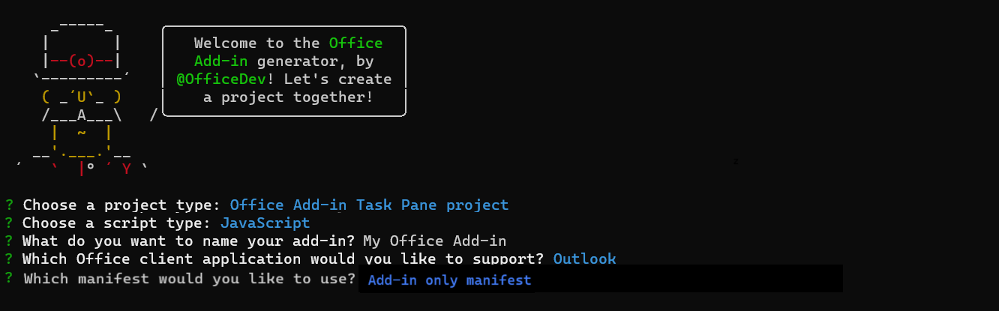
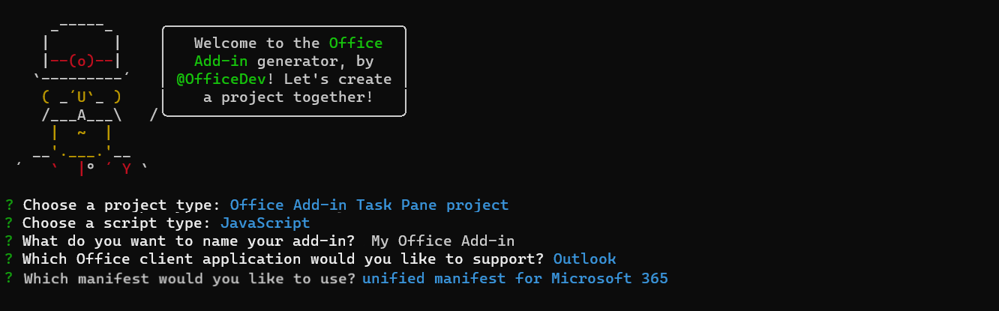
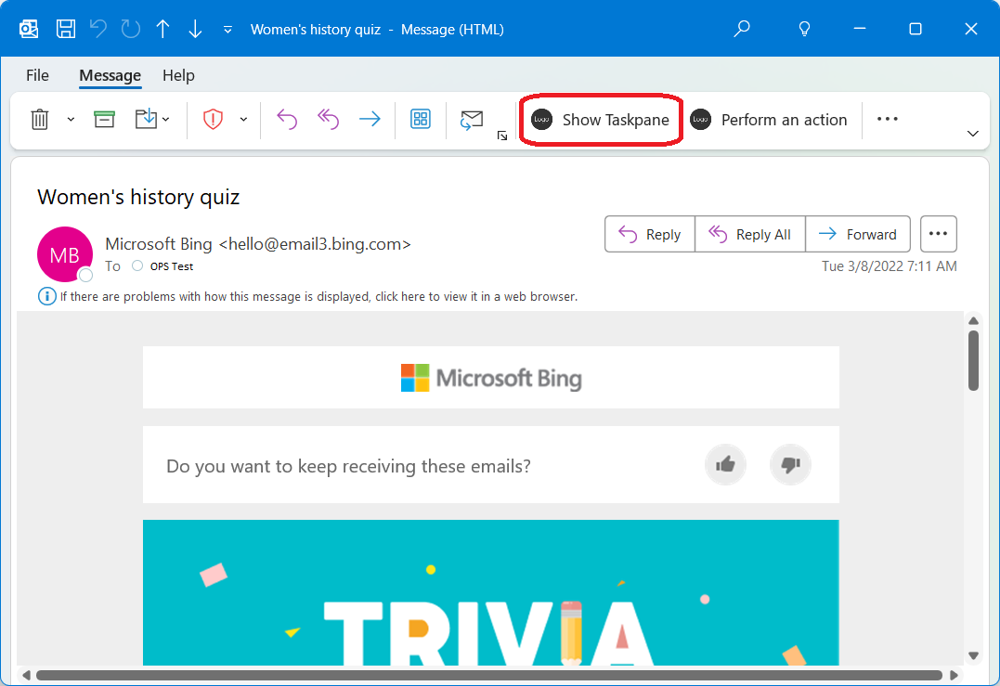
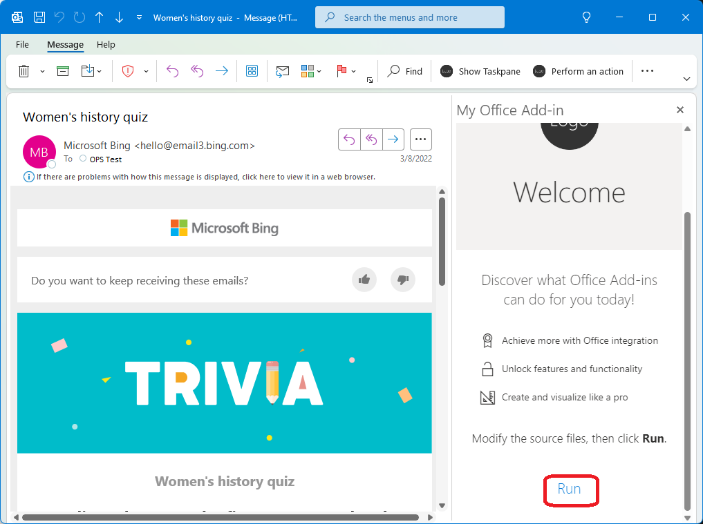
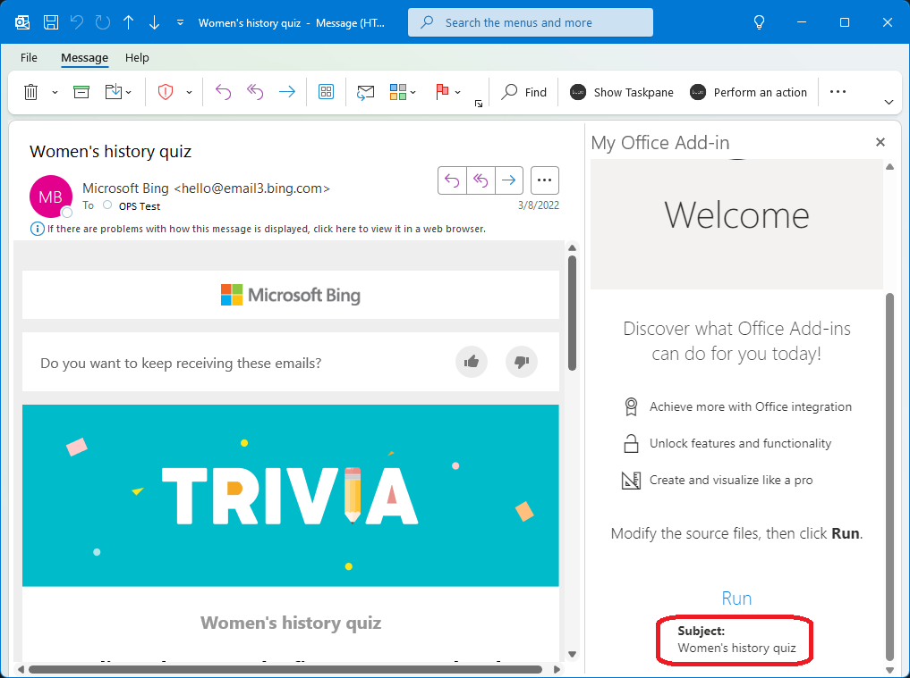

# Build your first Outlook add-in

In this article, you'll walk through the process of building an Outlook task pane add-in using Yo Office that displays at least one property of a selected message.

## Prerequisites

[!INCLUDE [Yeoman generator prerequisites](../includes/quickstart-yo-prerequisites.md)]

- Outlook on the web, [new Outlook on Windows](https://support.microsoft.com/office/656bb8d9-5a60-49b2-a98b-ba7822bc7627), Outlook 2016 or later on Windows (connected to a Microsoft 365 account), or Outlook on Mac.

## Create the add-in project

1. [!include[Yeoman generator create project guidance](../includes/yo-office-command-guidance.md)]

    - **Choose a project type** - `Office Add-in Task Pane project`
    - **Choose a script type** - `JavaScript`
    - **What do you want to name your add-in?** - `My Office Add-in`
    - **Which Office client application would you like to support?** - `Outlook`
    - **Which manifest would you like to use?** - Choose either `Unified manifest for Microsoft 365` or `Add-in only manifest`

    [!INCLUDE [Unified manifest value proposition and feedback request](../includes/unified-manifest-value-prop-feedback.md)]

    Depending on your choice of manifest, the prompts and answers should look like one of the following:

    

    

    After you complete the wizard, the generator will create the project and install supporting Node components.

    [!include[Yeoman generator next steps](../includes/yo-office-next-steps.md)]

1. Navigate to the root folder of the web application project.

    ```command&nbsp;line
    cd "My Office Add-in"
    ```

## Explore the project

The Yeoman generator creates a project in a folder with the project name that you chose. The project contains sample code for a very basic task pane add-in. The following are the most important files.

- The **./manifest.json** or **./manifest.xml** file in the root directory of the project defines the settings and capabilities of the add-in.
- The **./src/taskpane/taskpane.html** file contains the HTML markup for the task pane.
- The **./src/taskpane/taskpane.css** file contains the CSS that's applied to content in the task pane.
- The **./src/taskpane/taskpane.js** file contains the Office JavaScript API code that facilitates interaction between the task pane and Outlook.

## Update the code

1. Open your project in VS Code or your preferred code editor.
   [!INCLUDE [Instructions for opening add-in project in VS Code via command line](../includes/vs-code-open-project-via-command-line.md)]

1. Open the file **./src/taskpane/taskpane.js**, then replace the contents of the **run** function with the following code. This code uses the Office JavaScript API to get a reference to the current message and write its **subject** property value to the task pane.

    ```js
    // Get a reference to the current message.
    const item = Office.context.mailbox.item;

    // Write message property value to the task pane.
    document.getElementById("item-subject").innerHTML = "<b>Subject:</b> <br/>" + item.subject;
    ```

    Your **taskpane.js** file should now contain the following code.

    ```js
    /*
     * Copyright (c) Microsoft Corporation. All rights reserved. Licensed under the MIT license.
     * See LICENSE in the project root for license information.
     */

    /* global document, Office */

    Office.onReady((info) => {
      if (info.host === Office.HostType.Outlook) {
        document.getElementById("sideload-msg").style.display = "none";
        document.getElementById("app-body").style.display = "flex";
        document.getElementById("run").onclick = run;
      }
    });
    
    export async function run() {
      // Get a reference to the current message.
      const item = Office.context.mailbox.item;
    
      // Write message property value to the task pane.
      document.getElementById("item-subject").innerHTML = "<b>Subject:</b> <br/>" + item.subject;
    }
    ```

## Try it out

[!INCLUDE [alert use https](../includes/alert-use-https.md)]

1. Run the following command in the root directory of your project. When you run this command, the local web server starts and your add-in is sideloaded.

    ```command&nbsp;line
    npm start
    ```

    [!INCLUDE [outlook-manual-sideloading](../includes/outlook-manual-sideloading.md)]

1. In Outlook, view a message in the [Reading Pane](https://support.microsoft.com/office/2fd687ed-7fc4-4ae3-8eab-9f9b8c6d53f0), or open the message in its own window.

1. Select the **Show Taskpane** button to open the add-in task pane. The location of the add-in button varies depending on the Outlook client you're using. 

    - **Outlook on the web** and **new Outlook on Windows**: From the action bar of the message, select **Apps**. Then, select **My Office Add-in** > **Show Taskpane**.
    - **Classic Outlook on Windows**: Select the **Home** tab (or the **Message** tab if you opened the message in a new window). Then, select **Show Taskpane** from the ribbon.
    - **Outlook on Mac**: Select **My Office Add-in** from the ribbon, then select **Show Taskpane**. You may need to select the ellipsis button (`...`)  from the ribbon to view your add-ins.

    The following screenshots show how the add-in appears in classic Outlook on Windows.

    

1. When prompted with the **WebView Stop On Load** dialog box, select **OK**.

    [!INCLUDE [Cancelling the WebView Stop On Load dialog box](../includes/webview-stop-on-load-cancel-dialog.md)]

1. Scroll to the bottom of the task pane and choose the **Run** link to write the message subject to the task pane.

    

    

1. [!include[Instructions to stop web server and uninstall dev add-in](../includes/stop-uninstall-outlook-dev-add-in.md)]

## Next steps

Congratulations, you've successfully created your first Outlook task pane add-in! Next, learn more about the capabilities of an Outlook add-in and build a more complex add-in by following along with the [Outlook add-in tutorial](../tutorials/outlook-tutorial.md).

[!include[The common troubleshooting section for all yo office quick starts](../includes/quickstart-troubleshooting-yo.md)]

- If you receive the error "We can't open this add-in from localhost" in the task pane, follow the steps outlined in the [troubleshooting article](/office/troubleshoot/office-suite-issues/cannot-open-add-in-from-localhost).

## Code samples

- [Outlook "Hello world" add-in](https://github.com/OfficeDev/Office-Add-in-samples/tree/main/Samples/hello-world/outlook-hello-world): Learn how to build a simple Office Add-in with only a manifest, HTML web page, and a logo.

## See also

- [Office Add-ins with the add-in only manifest](../develop/xml-manifest-overview.md)
- [Using Visual Studio Code to publish](../publish/publish-add-in-vs-code.md#using-visual-studio-code-to-publish)
