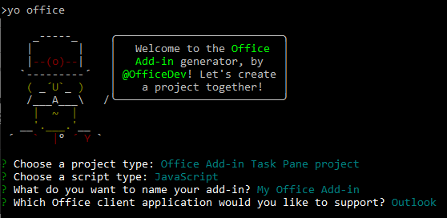
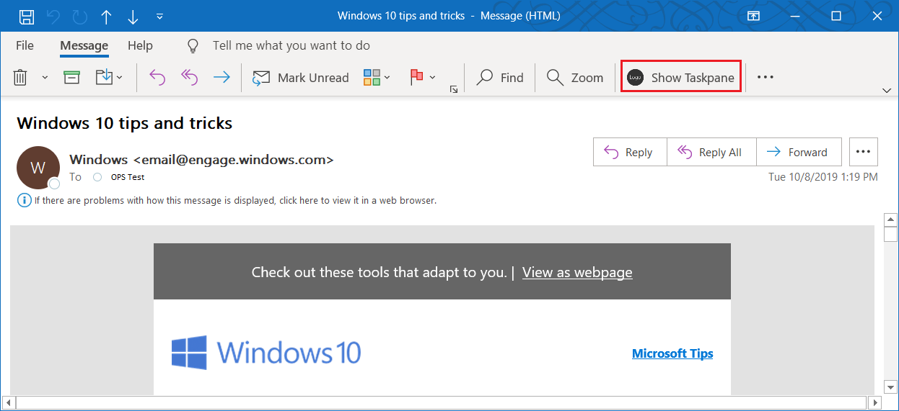
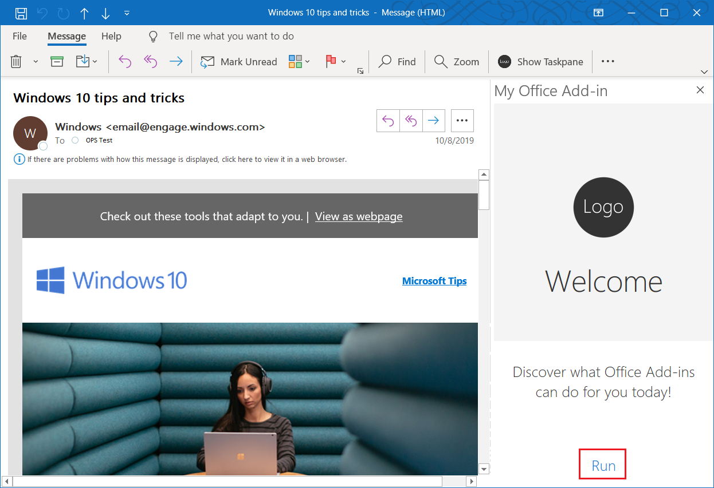
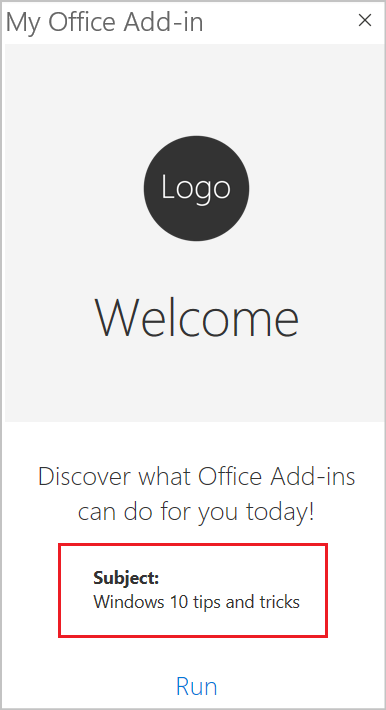
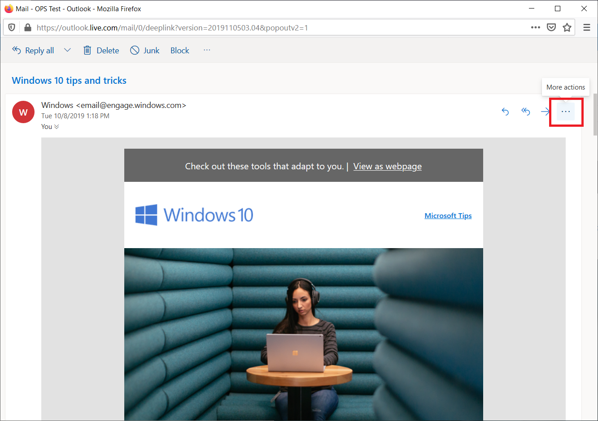
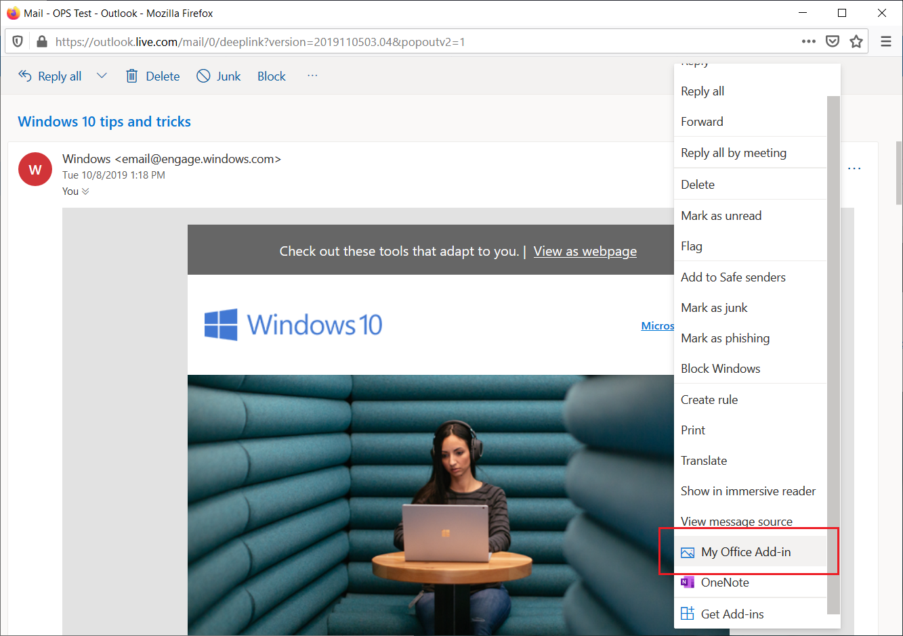
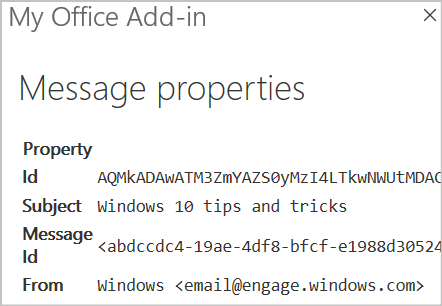

# Build your first Outlook add-in

In this article, you'll walk through the process of building an Outlook task pane add-in that displays at least one property of a selected message.

## Create the add-in

You can create an Office Add-in by using the Yeoman generator for Office Add-ins or Visual Studio. The Yeoman generator creates a Node.js project that can be managed with Visual Studio Code or any other editor, whereas Visual Studio creates a Visual Studio solution. Select the tab for the one you'd like to use and then follow the instructions to create your add-in and test it locally.

# [Yeoman generator](#tab/yeomangenerator)

### Prerequisites

[!INCLUDE [Yeoman generator prerequisites](../includes/quickstart-yo-prerequisites.md)]

- Outlook 2016 or later on Windows (connected to a Microsoft 365 account) or Outlook on the web.

### Create the add-in project

1. [!include[Yeoman generator create project guidance](../includes/yo-office-command-guidance.md)]

    - **Choose a project type** - `Office Add-in Task Pane project`

    - **Choose a script type** - `JavaScript`

    - **What do you want to name your add-in?** - `My Office Add-in`

    - **Which Office client application would you like to support?** - `Outlook`

    

    After you complete the wizard, the generator will create the project and install supporting Node components.

    [!include[Yeoman generator next steps](../includes/yo-office-next-steps.md)]

1. Navigate to the root folder of the web application project.

    ```command&nbsp;line
    cd "My Office Add-in"
    ```

### Explore the project

The add-in project that you've created with the Yeoman generator contains sample code for a very basic task pane add-in.

- The **./manifest.xml** file in the root directory of the project defines the settings and capabilities of the add-in.
- The **./src/taskpane/taskpane.html** file contains the HTML markup for the task pane.
- The **./src/taskpane/taskpane.css** file contains the CSS that's applied to content in the task pane.
- The **./src/taskpane/taskpane.js** file contains the Office JavaScript API code that facilitates interaction between the task pane and Outlook.

### Update the code

1. Open your project in VS Code or your preferred code editor.
   [!INCLUDE [Instructions for opening add-in project in VS Code via command line](../includes/vs-code-open-project-via-command-line.md)]

1. Open the file **./src/taskpane/taskpane.html** and replace the entire **\<main\>** element (within the **\<body\>** element) with the following markup. This new markup adds a label where the script in **./src/taskpane/taskpane.js** will write data.

    ```html
    <main id="app-body" class="ms-welcome__main" style="display: none;">
        <h2 class="ms-font-xl"> Discover what Office Add-ins can do for you today! </h2>
        <p><label id="item-subject"></label></p>
        <div role="button" id="run" class="ms-welcome__action ms-Button ms-Button--hero ms-font-xl">
            <span class="ms-Button-label">Run</span>
        </div>
    </main>
    ```

1. In your code editor, open the file **./src/taskpane/taskpane.js**, then add the following code to the **run** function. This code uses the Office JavaScript API to get a reference to the current message and write its **subject** property value to the task pane.

    ```js
    // Get a reference to the current message
    const item = Office.context.mailbox.item;

    // Write message property value to the task pane
    document.getElementById("item-subject").innerHTML = "<b>Subject:</b> <br/>" + item.subject;
    ```

    Your **taskpane.js** file should now contain the following code.


    ```js
    /*
     * Copyright (c) Microsoft Corporation. All rights reserved. Licensed under the MIT license.
     * See LICENSE in the project root for license information.
     */

    /* global document, Office */

    Office.onReady((info) => {
      if (info.host === Office.HostType.Outlook) {
        document.getElementById("sideload-msg").style.display = "none";
        document.getElementById("app-body").style.display = "flex";
        document.getElementById("run").onclick = run;
      }
    });
    
    export async function run() {
      // Get a reference to the current message
      const item = Office.context.mailbox.item;
    
      // Write message property value to the task pane
      document.getElementById("item-subject").innerHTML = "<b>Subject:</b> <br/>" + item.subject;
    }
    ```

### Try it out

[!INCLUDE [alert use https](../includes/alert-use-https.md)]

1. Run the following command in the root directory of your project. When you run this command, the local web server starts and your add-in will be sideloaded.

    ```command&nbsp;line
    npm start
    ```

1. In Outlook, view a message in the [Reading Pane](https://support.microsoft.com/office/2fd687ed-7fc4-4ae3-8eab-9f9b8c6d53f0), or open the message in its own window.

1. Choose the **Home** tab (or the **Message** tab if you opened the message in a new window), and then choose the **Show Taskpane** button on the ribbon to open the add-in task pane.

    

1. When prompted with the **WebView Stop On Load** dialog box, select **OK**.

    [!INCLUDE [Cancelling the WebView Stop On Load dialog box](../includes/webview-stop-on-load-cancel-dialog.md)]

1. Scroll to the bottom of the task pane and choose the **Run** link to write the message subject to the task pane.

    

    

### Next steps

Congratulations, you've successfully created your first Outlook task pane add-in! Next, learn more about the capabilities of an Outlook add-in and build a more complex add-in by following along with the [Outlook add-in tutorial](../tutorials/outlook-tutorial.md).

# [Visual Studio](#tab/visualstudio)

### Prerequisites

- [Visual Studio 2019](https://www.visualstudio.com/vs/) or later with the **Office/SharePoint development** workload installed

    > [!NOTE]
    > If you've previously installed Visual Studio 2019 or later, [use the Visual Studio Installer](/visualstudio/install/modify-visual-studio) to ensure that the **Office/SharePoint development** workload is installed.

- Office connected to a Microsoft 365 subscription (including Office on the web).

### Create the add-in project

1. On the Visual Studio menu bar, choose **File** > **New** > **Project**.

1. In the list of project types under **Visual C#** or **Visual Basic**, expand **Office/SharePoint**, choose **Add-ins**, and then choose **Outlook Web Add-in** as the project type.

1. Name the project, and then choose **OK**.

1. Visual Studio creates a solution and its two projects appear in **Solution Explorer**. The **MessageRead.html** file opens in Visual Studio.

### Explore the Visual Studio solution

When you've completed the wizard, Visual Studio creates a solution that contains two projects.

|**Project**|**Description**|
|:-----|:-----|
|Add-in project|Contains only an XML manifest file, which contains all the settings that describe your add-in. These settings help the Office application determine when your add-in should be activated and where the add-in should appear. Visual Studio generates the contents of this file for you so that you can run the project and use your add-in immediately. You can change these settings any time by modifying the XML file.|
|Web application project|Contains the content pages of your add-in, including all the files and file references that you need to develop Office-aware HTML and JavaScript pages. While you develop your add-in, Visual Studio hosts the web application on your local IIS server. When you're ready to publish the add-in, you'll need to deploy this web application project to a web server.|

### Update the code

1. **MessageRead.html** specifies the HTML that will be rendered in the add-in's task pane. In **MessageRead.html**, replace the **\<body\>** element with the following markup and save the file.

    ```HTML
    <body class="ms-font-m ms-welcome">
        <div class="ms-Fabric content-main">
            <h1 class="ms-font-xxl">Message properties</h1>
            <table class="ms-Table ms-Table--selectable">
                <thead>
                    <tr>
                        <th>Property</th>
                        <th>Value</th>
                    </tr>
                </thead>
                <tbody>
                    <tr>
                        <td><strong>Id</strong></td>
                        <td class="prop-val"><code><label id="item-id"></label></code></td>
                    </tr>
                    <tr>
                        <td><strong>Subject</strong></td>
                        <td class="prop-val"><code><label id="item-subject"></label></code></td>
                    </tr>
                    <tr>
                        <td><strong>Message Id</strong></td>
                        <td class="prop-val"><code><label id="item-internetMessageId"></label></code></td>
                    </tr>
                    <tr>
                        <td><strong>From</strong></td>
                        <td class="prop-val"><code><label id="item-from"></label></code></td>
                    </tr>
                </tbody>
            </table>
        </div>
    </body>
    ```

1. Open the file **MessageRead.js** in the root of the web application project. This file specifies the script for the add-in. Replace the entire contents with the following code and save the file.

    ```js
    'use strict';

    (function () {

        Office.onReady(function () {
            // Office is ready
            $(document).ready(function () {
                // The document is ready
                loadItemProps(Office.context.mailbox.item);
            });
        });

        function loadItemProps(item) {
            // Write message property values to the task pane
            $('#item-id').text(item.itemId);
            $('#item-subject').text(item.subject);
            $('#item-internetMessageId').text(item.internetMessageId);
            $('#item-from').html(item.from.displayName + " &lt;" + item.from.emailAddress + "&gt;");
        }
    })();
    ```

1. Open the file **MessageRead.css** in the root of the web application project. This file specifies the custom styles for the add-in. Replace the entire contents with the following code and save the file.

    ```CSS
    html,
    body {
        width: 100%;
        height: 100%;
        margin: 0;
        padding: 0;
    }

    td.prop-val {
        word-break: break-all;
    }

    .content-main {
        margin: 10px;
    }
    ```

### Update the manifest

1. Open the XML manifest file in the Add-in project. This file defines the add-in's settings and capabilities.

1. The **\<ProviderName\>** element has a placeholder value. Replace it with your name.

1. The **DefaultValue** attribute of the **\<DisplayName\>** element has a placeholder. Replace it with `My Office Add-in`.

1. The **DefaultValue** attribute of the **\<Description\>** element has a placeholder. Replace it with `My First Outlook add-in`.

1. Save the file.

    ```xml
    ...
    <ProviderName>John Doe</ProviderName>
    <DefaultLocale>en-US</DefaultLocale>
    <!-- The display name of your add-in. Used on the store and various places of the Office UI such as the add-ins dialog. -->
    <DisplayName DefaultValue="My Office Add-in" />
    <Description DefaultValue="My First Outlook add-in"/>
    ...
    ```

### Try it out

1. Using Visual Studio, test the newly created Outlook add-in by pressing F5 or choosing the **Start** button. The add-in will be hosted locally on IIS.

1. In the **Connect to Exchange email account** dialog box, enter the email address and password for your [Microsoft account](https://account.microsoft.com/account) and then choose **Connect**. When the Outlook.com login page opens in a browser, sign in to your email account with the same credentials as you entered previously.

    > [!NOTE]
    > If the **Connect to Exchange email account** dialog box repeatedly prompts you to sign in or you receive an error that you are unauthorized, Basic Auth may be disabled for accounts on your Microsoft 365 tenant. To test this add-in, try signing in again after setting the **Use multi-factor auth** property to True in the Web Add-in project properties dialog, or sign in using a [Microsoft account](https://account.microsoft.com/account) instead.

1. In Outlook on the web, select or open a message.

1. Within the message, locate the ellipsis for the overflow menu containing the add-in's button.

    

1. Within the overflow menu, locate the add-in's button.

    

1. Click the button to open the add-in's task pane.

    

    > [!NOTE]
    > If the task pane doesn't load, try to verify by opening it in a browser on the same machine.

### Next steps

Congratulations, you've successfully created your first Outlook task pane add-in! Next, learn more about [developing Office Add-ins with Visual Studio](../develop/develop-add-ins-visual-studio.md).

---

[!include[The common troubleshooting section for all quickstarts](../includes/quickstart-troubleshooting.md)]

If you receive the error "We can't open this add-in from localhost" in the task pane, follow the steps outlined in the [troubleshooting article](/office/troubleshoot/office-suite-issues/cannot-open-add-in-from-localhost).

## Code samples

- [Outlook "Hello world" add-in](https://github.com/OfficeDev/Office-Add-in-samples/tree/main/Samples/hello-world/outlook-hello-world): Learn how to build a simple Office Add-in with only a manifest, HTML web page, and a logo.

## See also

- [Using Visual Studio Code to publish](../publish/publish-add-in-vs-code.md#using-visual-studio-code-to-publish)
