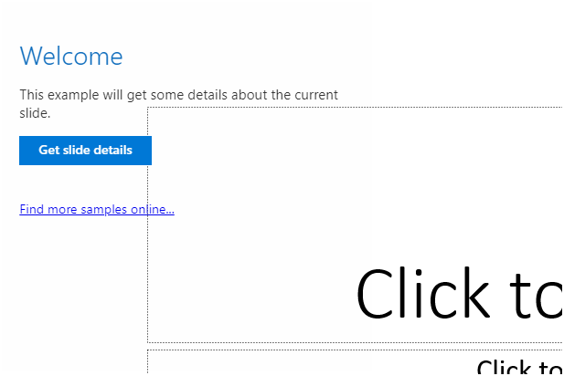

# Build your first PowerPoint content add-in

In this article, you'll walk through the process of building a PowerPoint [content add-in](../design/content-add-ins.md) using Visual Studio.

## Create the add-in

### Prerequisites

[!include[Quick Start prerequisites](../includes/quickstart-vs-prerequisites.md)]

### Create the add-in project

1. In Visual Studio, choose **Create a new project**.

2. Using the search box, enter **add-in**. Choose **PowerPoint Web Add-in**, then select **Next**.

3. Name your project and select **Create**.

4. In the **Create Office Add-in** dialog window, choose **Insert content into PowerPoint slides**, and then choose **Finish** to create the project.

5. Visual Studio creates a solution and its two projects appear in **Solution Explorer**. The **Home.html** file opens in Visual Studio.

### Explore the Visual Studio solution

[!include[Description of Visual Studio projects](../includes/quickstart-vs-solution.md)]

### Update the manifest

1. Open the XML manifest file in the add-in project. This file defines the add-in's settings and capabilities.

2. The `ProviderName` element has a placeholder value. Replace it with your name.

3. The `DefaultValue` attribute of the `DisplayName` element has a placeholder. Replace it with **My Office Add-in**.

4. The `DefaultValue` attribute of the `Description` element has a placeholder. Replace it with **A content add-in for PowerPoint.**.

5. Save the file. The updated lines should look like the following code sample.

    ```xml
    ...
    <ProviderName>John Doe</ProviderName>
    <DefaultLocale>en-US</DefaultLocale>
    <!-- The display name of your add-in. Used on the store and various places of the Office UI such as the add-ins dialog. -->
    <DisplayName DefaultValue="My Office Add-in" />
    <Description DefaultValue="A content add-in for PowerPoint."/>
    ...
    ```

### Try it out

1. Using Visual Studio, test the newly created PowerPoint add-in by pressing **F5** or choosing the **Start** button to launch PowerPoint with the content add-in displayed over the slide.

2. In PowerPoint, add text to the slide, select any or all of the text, and then choose the **Get data from selection** button in the content add-in to get the text from the selection.

    

[!include[Console tool note](../includes/console-tool-note.md)]

### Next steps

Congratulations, you've successfully created a PowerPoint content add-in! Next, learn more about [developing Office Add-ins with Visual Studio](../develop/develop-add-ins-visual-studio.md).

## See also

- [Office Add-ins platform overview](../overview/office-add-ins.md)
- [Develop Office Add-ins](../develop/develop-overview.md)
- [Using Visual Studio Code to publish](../publish/publish-add-in-vs-code.md#using-visual-studio-code-to-publish)
