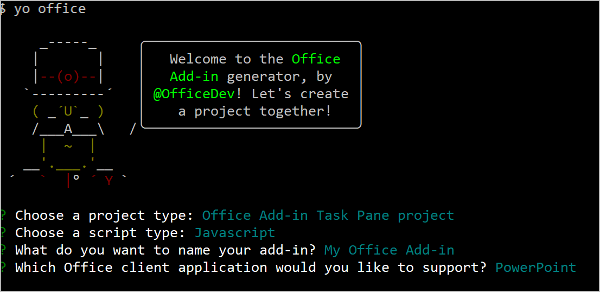
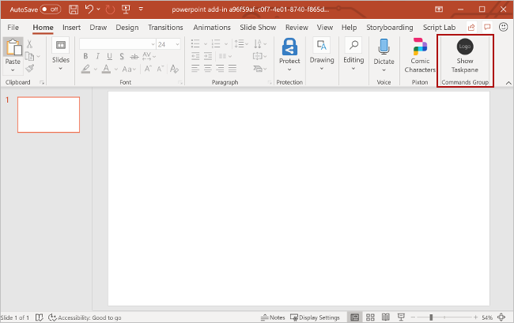
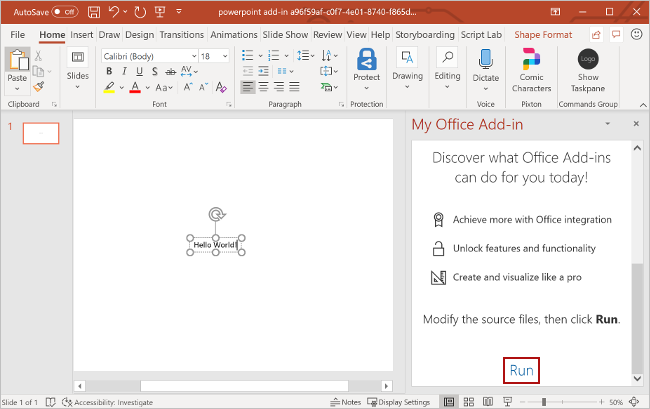

# Build your first PowerPoint task pane add-in

In this article, you'll walk through the process of building a PowerPoint task pane add-in.

## Prerequisites

[!include[Yeoman generator prerequisites](../includes/quickstart-yo-prerequisites.md)]

## Create the add-in project

[!include[Yeoman generator create project guidance](../includes/yo-office-command-guidance.md)]

- **Choose a project type:** `Office Add-in Task Pane project`
- **Choose a script type:** `Javascript`
- **What do you want to name your add-in?** `My Office Add-in`
- **Which Office client application would you like to support?** `PowerPoint`



After you complete the wizard, the generator creates the project and installs supporting Node components.

## Explore the project

[!include[Yeoman generator add-in project components](../includes/yo-task-pane-project-components-js.md)]

## Try it out

1. Navigate to the root folder of the project.

    ```command&nbsp;line
    cd "My Office Add-in"
    ```

1. Complete the following steps to start the local web server and sideload your add-in.

    [!INCLUDE [alert use https](../includes/alert-use-https.md)]

    > [!TIP]
    > If you're testing your add-in on Mac, run the following command before proceeding. When you run this command, the local web server starts.
    >
    > ```command&nbsp;line
    > npm run dev-server
    > ```

    - To test your add-in in PowerPoint, run the following command in the root directory of your project. This starts the local web server (if it's not already running) and opens PowerPoint with your add-in loaded.

        ```command&nbsp;line
        npm start
        ```

    - To test your add-in in PowerPoint on a browser, run the following command in the root directory of your project. When you run this command, the local web server starts. Replace "{url}" with the URL of a PowerPoint document on your OneDrive or a SharePoint library to which you have permissions.

        [!INCLUDE [npm start on web command syntax](../includes/start-web-sideload-instructions.md)]

1. In PowerPoint, insert a new blank slide, choose the **Home** tab, and then choose the **Show Taskpane** button on the ribbon to open the add-in task pane.

    

1. At the bottom of the task pane, choose the **Run** link to insert the text "Hello World" into the current slide.

    

1. [!include[Instructions to stop web server and uninstall dev add-in](../includes/stop-uninstall-dev-add-in.md)]

## Next steps

Congratulations, you've successfully created a PowerPoint task pane add-in! Next, learn more about the capabilities of a PowerPoint add-in and build a more complex add-in by following along with the [PowerPoint add-in tutorial](../tutorials/powerpoint-tutorial-yo.md).

[!include[The common troubleshooting section for all Yo Office quick starts](../includes/quickstart-troubleshooting-yo.md)]

## Code samples

- [PowerPoint "Hello world" add-in](https://github.com/OfficeDev/Office-Add-in-samples/tree/main/Samples/hello-world/powerpoint-hello-world): Learn how to build a simple Office Add-in with only a manifest, HTML web page, and a logo.

## See also

- [Office Add-ins platform overview](../overview/office-add-ins.md)
- [Develop Office Add-ins](../develop/develop-overview.md)
- [Using Visual Studio Code to publish](../publish/publish-add-in-vs-code.md#using-visual-studio-code-to-publish)
