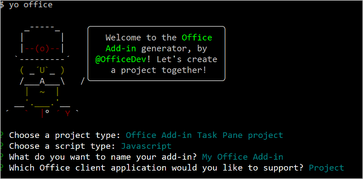
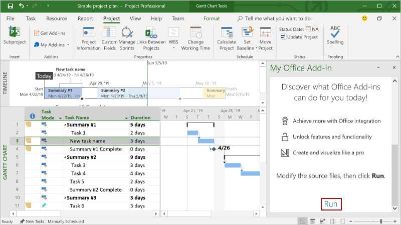

# Build your first Project task pane add-in

In this article, you'll walk through the process of building a Project task pane add-in.

## Prerequisites

[!include[Yeoman generator prerequisites](../includes/quickstart-yo-prerequisites.md)]

- Project 2016 or later on Windows

## Create the add-in

[!include[Yeoman generator create project guidance](../includes/yo-office-command-guidance.md)]

- **Choose a project type:** `Office Add-in Task Pane project`
- **Choose a script type:** `JavaScript`
- **What do you want to name your add-in?** `My Office Add-in`
- **Which Office client application would you like to support?** `Project`



After you complete the wizard, the generator creates the project and installs supporting Node components.

## Explore the project

The add-in project that you've created with the Yeoman generator contains sample code for a basic task pane add-in.

- The **./manifest.xml** file in the root directory of the project defines the settings and capabilities of the add-in.
- The **./src/taskpane/taskpane.html** file contains the HTML markup for the task pane.
- The **./src/taskpane/taskpane.css** file contains the CSS that's applied to content in the task pane.
- The **./src/taskpane/taskpane.js** file contains the Office JavaScript API code that facilitates interaction between the task pane and the Office client application. In this quick start, the code sets the `Name` field and `Notes` field of the selected task of a project.

## Try it out

1. Navigate to the root folder of the project.

    ```command&nbsp;line
    cd "My Office Add-in"
    ```

1. Complete the following steps to start the local web server and sideload your add-in.

    [!INCLUDE [alert use https](../includes/alert-use-https.md)]

    - To test your add-in in Project, run the following command in the root directory of your project. This starts the local web server and sideloads your add-in.

        ```command&nbsp;line
        npm start
        ```

    If your add-in doesn't automatically sideload, follow the instructions in [Sideload Office Add-ins on Windows](../testing/create-a-network-shared-folder-catalog-for-task-pane-and-content-add-ins.md) to manually sideload the add-in in Project.

1. In Project, create a simple project plan.

1. Select a single task within the project.

1. At the bottom of the task pane, choose the **Run** link to rename the selected task and add notes to the selected task.

    

1. [!include[Instructions to stop web server and uninstall dev add-in](../includes/stop-uninstall-dev-add-in.md)]

[!include[The common troubleshooting section for all Yo Office quick starts](../includes/quickstart-troubleshooting-yo.md)]

## Next steps

Congratulations, you've successfully created a Project task pane add-in! Next, learn more about the capabilities of a Project add-in and explore common scenarios.

> [!div class="nextstepaction"]
> [Project add-ins](../project/project-add-ins.md)

## See also

- [Office Add-ins platform overview](../overview/office-add-ins.md)
- [Develop Office Add-ins](../develop/develop-overview.md)
- [Core concepts for Office Add-ins](../overview/core-concepts-office-add-ins.md)
- [Project add-in code samples](https://developer.microsoft.com/microsoft-365/gallery/?filterBy=Project,Samples)
- [Using Visual Studio Code to publish](../publish/publish-add-in-vs-code.md#using-visual-studio-code-to-publish)
