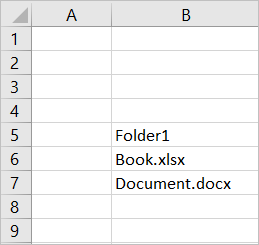
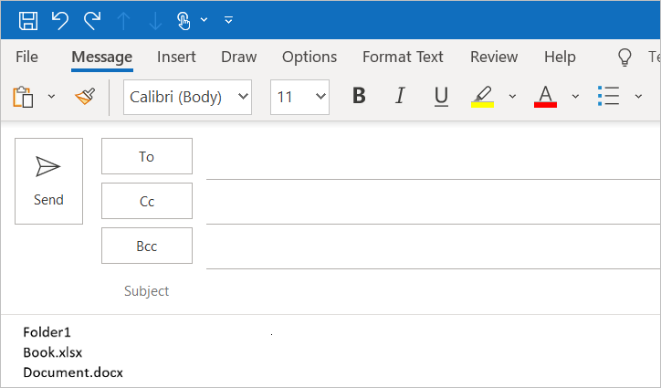

# Customize your Node.js SSO-enabled add-in

> [!IMPORTANT]
> This article builds upon the SSO-enabled add-in that's created by completing the [single sign-on (SSO) quick start](sso-quickstart.md). Please complete the quick start before reading this article.

The [SSO quick start](sso-quickstart.md) creates an SSO-enabled add-in that gets the signed-in user's profile information and writes it to the document or message. In this article, you'll walk through the process of updating the add-in that you created with the Yeoman generator in the SSO quick start, to add new functionality that requires different permissions.

## Prerequisites

* An Office Add-in that you created by following the instructions in the [SSO quick start](sso-quickstart.md).

* At least a few files and folders stored on OneDrive for Business in your Office 365 subscription.

* [Node.js](https://nodejs.org) (the latest [LTS](https://nodejs.org/about/releases) version).

[!include[additional prerequisites](../includes/sso-tutorial-prereqs.md)]

## Review contents of the project

Let's begin with a quick review of the add-in project that you previously [created with the Yeoman generator](sso-quickstart.md).

> [!NOTE]
> All script files mentioned in this article have the **.js** extension; files in a TypeScript project will use the **.ts** extension instead. Script code snippets in this article are provided in JavaScript and TypeScript. Use the snippets corresponding to the language you selected when creating your project with the Yeoman generator. 


[!include[project structure for an SSO-enabled add-in created with the Yeoman generator](../includes/sso-yeoman-project-structure.md)]

## Add new functionality 

The add-in that you created with the SSO quick start uses Microsoft Graph to get the signed-in user's profile information and writes that information to the document or message. Let's change the add-in's functionality such that it gets the names of the top 10 files and folders from the signed-in user's OneDrive for Business and writes that information to the document or message. Enabling this new functionality requires updating code within the add-in project and also updating app permissions in Azure.

### Update code in the add-in project

To enable the add-in to read contents of the signed-in user's OneDrive for Business, you'll need to:

- Update the code that references the Microsoft Graph URL, parameters, and required access scope.

- Update the code that defines the task pane UI, so that it accurately describes the new functionality. 

- Update the code that parses the response from Microsoft Graph and writes it to the document or message.

The following steps describe these updates.

### Changes required for any type of add-in

Complete the following steps for your add-in. These steps are the same, regardless of which Office host your add-in targets.

1. In the **./.ENV** file:

    a. Replace `GRAPH_URL_SEGMENT=/me` with the following: `GRAPH_URL_SEGMENT=/me/drive/root/children`

    b. Replace `QUERY_PARAM_SEGMENT=` with the following: `QUERY_PARAM_SEGMENT=?$select=name&$top=10`

    c. Replace `SCOPE=User.Read` with the following: `SCOPE=Files.Read.All`

2. In **./manifest.xml**, find the line `<Scope>User.Read</Scope>` near the end of the file and replace it with the line `<Scope>Files.Read.All</Scope>`.

3. In **./src/helpers/fallbackauthdialog.js**, find the string `https://graph.microsoft.com/User.Read` and replace it with the string `https://graph.microsoft.com/Files.Read.All`, such that `requestObj` is defined as follows:

    ```javascript
    var requestObj = {
      scopes: [`https://graph.microsoft.com/Files.Read.All`]
    };
    ```

    ```typescript
    var requestObj: Object = {
      scopes: [`https://graph.microsoft.com/Files.Read.All`]
    };
    ```

4. In **./src/taskpane/taskpane.html**, find the element `<section class="ms-firstrun-instructionstep__header">` and update the text within that element to describe the add-in's new functionality.

    ```html
    <section class="ms-firstrun-instructionstep__header">
        <h2 class="ms-font-m">This add-in demonstrates how to use single sign-on by making a call to Microsoft
            Graph to read content from OneDrive for Business.</h2>
        <div class="ms-firstrun-instructionstep__header--image"></div>
    </section>
    ```

5. In **./src/taskpane/taskpane.html**, find and replace both occurrences of the string `Get My User Profile Information` with the string `Read my OneDrive for Business`.

    ```html
    <li class="ms-ListItem">
        <span class="ms-ListItem-primaryText">Click the <b>Read my OneDrive for Business</b>
            button.</span>
        <div class="clearfix"></div>
    </li>
    ```

    ```html
    <p align="center">
        <button id="getGraphDataButton" class="popupButton ms-Button ms-Button--primary"><span
                class="ms-Button-label">Read my OneDrive for Business</span></button>
    </p>
    ```

6. In **./src/taskpane/taskpane.html**, find and replace the string `Your user profile information will be displayed in the document.` with the string `The names of the top 10 files and folders in your OneDrive for Business will be displayed in the document or message.`.

    ```html
    <li class="ms-ListItem">
        <span class="ms-ListItem-primaryText">The names of the top 10 files and folders in your OneDrive for Business will be displayed in the document or message.</span>
        <div class="clearfix"></div>
    </li>
    ```

7. Complete the additional changes required for your type of add-in, as described in one of the following sections:

    - [Changes required for an Excel add-in](#changes-required-for-an-excel-add-in)
    - [Changes required for an Outlook add-in](#changes-required-for-an-outlook-add-in)
    - [Changes required for a PowerPoint add-in](#changes-required-for-a-powerpoint-add-in)
    - [Changes required for a Word add-in](#changes-required-for-a-word-add-in)

### Changes required for an Excel add-in

If your add-in is an Excel add-in, make the following changes in **./src/helpers/documentHelper.js**:

1. Find the `writeDataToOfficeDocument` function and replace it with the following function:

    ```javascript
    export function writeDataToOfficeDocument(result) {
      return new OfficeExtension.Promise(function(resolve, reject) {
        try {
          writeDataToExcel(result);
          resolve();
        } catch (error) {
          reject(Error("Unable to write data to document. " + error.toString()));
        }
      });
    }
    ```

2. Find the `filterUserProfileInfo` function and replace it with the following function:

    ```javascript
    function filterOneDriveInfo(result) {
      let itemNames = [];
      let oneDriveItems = result['value'];
      for (let item of oneDriveItems) {
        itemNames.push(item['name']);
      }
      return itemNames;
    }
    ```

3. Find the `writeDataToExcel` function and replace it with the following function:

    ```javascript
    function writeDataToExcel(result) {
      return Excel.run(function (context) {
        var sheet = context.workbook.worksheets.getActiveWorksheet();
        let data = [];
        let oneDriveInfo = filterOneDriveInfo(result);

        for (let i = 0; i < oneDriveInfo.length; i++) {
          if (oneDriveInfo[i] !== null) {
            let innerArray = [];
            innerArray.push(oneDriveInfo[i]);
            data.push(innerArray);
          }
        }

        const rangeAddress = `B5:B${5 + (data.length - 1)}`;
        const range = sheet.getRange(rangeAddress);
        range.values = data;
        range.format.autofitColumns();

        return context.sync();
      });
    }
    ```

4. Delete the `writeDataToOutlook` function.

5. Delete the `writeDataToPowerPoint` function.

6. Delete the `writeDataToWord` function.

After you've made these changes, skip ahead to the [Update app permissions in Azure](#update-app-permissions-in-azure) section of this article to make the necessary updates in Azure.

### Changes required for an Outlook add-in

If your add-in is an Outlook add-in, make the following changes in **./src/helpers/documentHelper.js**:

1. Find the `writeDataToOfficeDocument` function and replace it with the following function:

    ```javascript
    export function writeDataToOfficeDocument(result) {
      return new OfficeExtension.Promise(function(resolve, reject) {
        try {
          writeDataToOutlook(result);
          resolve();
        } catch (error) {
          reject(Error("Unable to write data to message. " + error.toString()));
        }
      });
    }
    ```

2. Find the `filterUserProfileInfo` function and replace it with the following function:

    ```javascript
    function filterOneDriveInfo(result) {
      let itemNames = [];
      let oneDriveItems = result['value'];
      for (let item of oneDriveItems) {
        itemNames.push(item['name']);
      }
      return itemNames;
    }
    ```

3. Find the `writeDataToOutlook` function and replace it with the following function:

    ```javascript
    function writeDataToOutlook(result) {
      let data = [];
      let oneDriveInfo = filterOneDriveInfo(result);

      for (let i = 0; i < oneDriveInfo.length; i++) {
        if (oneDriveInfo[i] !== null) {
          data.push(oneDriveInfo[i]);
        }
      }

      let objectNames = "";
      for (let i = 0; i < data.length; i++) {
        objectNames += data[i] + "\n";
      }

      Office.context.mailbox.item.body.setSelectedDataAsync(objectNames, { coercionType: Office.CoercionType.Html });
    }
    ```

4. Delete the `writeDataToExcel` function.

5. Delete the `writeDataToPowerPoint` function.

6. Delete the `writeDataToWord` function.

After you've made these changes, skip ahead to the [Update app permissions in Azure](#update-app-permissions-in-azure) section of this article to make the necessary updates in Azure.

### Changes required for a PowerPoint add-in

If your add-in is a PowerPoint add-in, make the following changes in **./src/helpers/documentHelper.js**:

1. Find the `writeDataToOfficeDocument` function and replace it with the following function:

    ```javascript
    export function writeDataToOfficeDocument(result) {
      return new OfficeExtension.Promise(function(resolve, reject) {
        try {
          writeDataToPowerPoint(result);
          resolve();
        } catch (error) {
          reject(Error("Unable to write data to document. " + error.toString()));
        }
      });
    }
    ```

2. Find the `filterUserProfileInfo` function and replace it with the following function:

    ```javascript
    function filterOneDriveInfo(result) {
      let itemNames = [];
      let oneDriveItems = result['value'];
      for (let item of oneDriveItems) {
        itemNames.push(item['name']);
      }
      return itemNames;
    }
    ```

3. Find the `writeDataToPowerPoint` function and replace it with the following function:

    ```javascript
    function writeDataToPowerPoint(result) {
      let data = [];
      let oneDriveInfo = filterOneDriveInfo(result);

      for (let i = 0; i < oneDriveInfo.length; i++) {
        if (oneDriveInfo[i] !== null) {
          data.push(oneDriveInfo[i]);
        }
      }

      let objectNames = "";
      for (let i = 0; i < data.length; i++) {
        objectNames += data[i] + "\n";
      }

      Office.context.document.setSelectedDataAsync(
        objectNames, 
        function(asyncResult) {
          if (asyncResult.status === Office.AsyncResultStatus.Failed) {
            throw asyncResult.error.message;
          }
      });
    }
    ```

4. Delete the `writeDataToExcel` function.

5. Delete the `writeDataToOutlook` function.

6. Delete the `writeDataToWord` function.

After you've made these changes, skip ahead to the [Update app permissions in Azure](#update-app-permissions-in-azure) section of this article to make the necessary updates in Azure.

### Changes required for a Word add-in 

If your add-in is a Word add-in, make the following changes in **./src/helpers/documentHelper.js**:

1. Find the `writeDataToOfficeDocument` function and replace it with the following function:

    ```javascript
    export function writeDataToOfficeDocument(result) {
      return new OfficeExtension.Promise(function(resolve, reject) {
        try {
          writeDataToWord(result);
          resolve();
        } catch (error) {
          reject(Error("Unable to write data to document. " + error.toString()));
        }
      });
    }
    ```

2. Find the `filterUserProfileInfo` function and replace it with the following function:

    ```javascript
    function filterOneDriveInfo(result) {
      let itemNames = [];
      let oneDriveItems = result['value'];
      for (let item of oneDriveItems) {
        itemNames.push(item['name']);
      }
      return itemNames;
    }
    ```

3. Find the `writeDataToWord` function and replace it with the following function:

    ```javascript
    function writeDataToWord(result) {
      return Word.run(function (context) {
        let data = [];
        let oneDriveInfo = filterOneDriveInfo(result);

        for (let i = 0; i < oneDriveInfo.length; i++) {
          if (oneDriveInfo[i] !== null) {
            data.push(oneDriveInfo[i]);
          }
        }

        const documentBody = context.document.body;
        for (let i = 0; i < data.length; i++) {
          if (data[i] !== null) {
            documentBody.insertParagraph(data[i], "End");
          }
        }

        return context.sync();
      });
    }
    ```

4. Delete the `writeDataToExcel` function.

5. Delete the `writeDataToOutlook` function.

6. Delete the `writeDataToPowerPoint` function.

### Update app permissions in Azure

Before the add-in can successfully read the contents of the user's OneDrive for Business, the app must be granted the appropriate permissions. Complete the following steps to grant the app the **Files.Read.All** permission and revoke the **User.Read** permission, which is no longer needed.

1. Navigate to the [Azure portal](https://ms.portal.azure.com/#home) and sign in using your Office 365 administrator credentials. 

2. Navigate to the **App registrations** page. 
    > [!TIP]
    > You can do this either by choosing the **App registrations** tile on the Azure home page or by using the search box on the home page to find and choose **App registrations**.

3. On the **App registrations** page, choose the app that you created during the quick start. 
    > [!TIP]
    > The **Display name** of the app will match the add-in name that you specified when you created the project with the Yeoman generator.

4. From the app overview page, choose **API permissions** under the **Manage** heading on the left side of the page.

5. In the **User.Read** row of the permissions table, choose the ellipsis and then select **Revoke admin consent** from the menu that appears.

6. Select the **Yes, remove** button in response to the prompt that's displayed.

7. In the **User.Read** row of the permissions table, choose the ellipsis and then select **Remove permission** from the menu that appears.

8. Select the **Yes, remove** button in response to the prompt that's displayed.

9. Select the **Add a permission** button.

10. On the panel that opens choose **Microsoft Graph** and then choose **Delegated permissions**.

11. On the **Request API permissions** panel:

    a. Under **Files**, select **Files.Read.All**.

    b. Select the **Add permissions** button at the bottom of the panel to save these permissions changes.

12. Select the **Grant admin consent for [tenant name]** button.

13. Select the **Yes** button in response to the prompt that's displayed.

## Try it out

If your add-in is an Excel, Word, or PowerPoint add-in, complete the steps in the following section to try it out. If your add-in is an Outlook add-in, complete the steps in the [Outlook](#outlook) section instead.

### Excel, Word, and PowerPoint

Complete the following steps to try out an Excel, Word, or PowerPoint add-in.

1. In the root folder of the project, run the following command to build the project, start the local web server, and sideload your add-in in the previously selected Office client application.

    > [!NOTE]
    > Office Add-ins should use HTTPS, not HTTP, even when you are developing. If you are prompted to install a certificate after you run the following command, accept the prompt to install the certificate that the Yeoman generator provides.

    ```command&nbsp;line
    npm start
    ```

2. In the Office client application that opens when you run the previous command (i.e., Excel, Word or PowerPoint), make sure that you're signed in with a user that's a member of the same Office 365 organization as the Office 365 administrator account that you used to connect to Azure while [configuring SSO](sso-quickstart.md#configure-sso) for the app. Doing so establishes the appropriate conditions for SSO to succeed. 

3. In the Office client application, choose the **Home** tab, and then choose the **Show Taskpane** button in the ribbon to open the add-in task pane. The following image shows this button in Excel.

    

4. At the bottom of the task pane, choose the **Read my OneDrive for Business** button to initiate the SSO process. 

5. If a dialog window appears to request permissions on behalf of the add-in, this means that SSO is not supported for your scenario and the add-in has instead fallen back to an alternate method of user authentication. This may occur when the tenant administrator hasn't granted consent for the add-in to access Microsoft Graph, or when the user isn't signed into Office with a valid Microsoft Account or Office 365 ("Work or School") account. Choose the **Accept** button in the dialog window to continue.

    

    > [!NOTE]
    > After a user accepts this permissions request, they won't be prompted again in the future.

6. The add-in reads data from the signed-in user's OneDrive for Business and writes the names of the top 10 files and folders to the document. The following image shows an example of file and folder names written to an Excel worksheet.

    

### Outlook

Complete the following steps to try out an Outlook add-in.

1. In the root folder of the project, run the following command to build the project and start the local web server.

    > [!NOTE]
    > Office Add-ins should use HTTPS, not HTTP, even when you are developing. If you are prompted to install a certificate after you run the following command, accept the prompt to install the certificate that the Yeoman generator provides.

    ```command&nbsp;line
    npm start
    ```

2. Follow the instructions in [Sideload Outlook add-ins for testing](/outlook/add-ins/sideload-outlook-add-ins-for-testing) to sideload the add-in in Outlook. Make sure that you're signed in to Outlook with a user that's a member of the same Office 365 organization as the Office 365 administrator account that you used to connect to Azure while [configuring SSO](sso-quickstart.md#configure-sso) for the app. Doing so establishes the appropriate conditions for SSO to succeed. 

3. In Outlook, compose a new message.

4. In the message compose window, choose the **Show Taskpane** button in the ribbon to open the add-in task pane.

    

5. At the bottom of the task pane, choose the **Read my OneDrive for Business** button to initiate the SSO process. 

6. If a dialog window appears to request permissions on behalf of the add-in, this means that SSO is not supported for your scenario and the add-in has instead fallen back to an alternate method of user authentication. This may occur when the tenant administrator hasn't granted consent for the add-in to access Microsoft Graph, or when the user isn't signed into Office with a valid Microsoft Account or Office 365 ("Work or School") account. Choose the **Accept** button in the dialog window to continue.

    

    > [!NOTE]
    > After a user accepts this permissions request, they won't be prompted again in the future.

7. The add-in reads data from the signed-in user's OneDrive for Business and writes the names of the top 10 files and folders to the body of the email message.

    

## Next steps

Congratulations, you've successfully customized the functionality of the SSO-enabled add-in that you created with the Yeoman generator in the [SSO quick start](sso-quickstart.md). To learn more about SSO configuration steps that the Yeoman generator completed automatically, and the code that facilitates the SSO process, see the [Create a Node.js Office Add-in that uses single sign-on](../develop/create-sso-office-add-ins-nodejs.md) tutorial.

## See also

- [Enable single sign-on for Office Add-ins](../develop/sso-in-office-add-ins.md)
- [Single sign-on (SSO) quick start](sso-quickstart.md)
- [Create a Node.js Office Add-in that uses single sign-on](../develop/create-sso-office-add-ins-nodejs.md)
- [Troubleshoot error messages for single sign-on (SSO)](../develop/troubleshoot-sso-in-office-add-ins.md)
