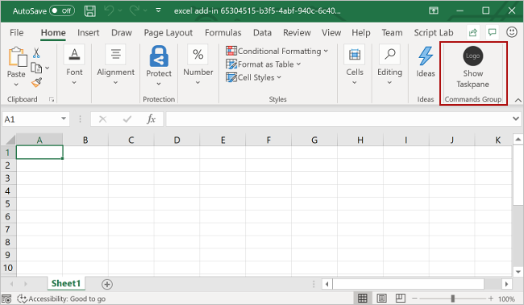

# Customize the SSO-enabled add-in you that created with the Yeoman generator

The [single sign-on (SSO) quick start](sso-quickstart.md) creates an SSO-enabled add-in that gets the signed-in user's profile information and writes it to the document. In this article, you'll walk through the process of customizing the SSO-enabled add-in that you created with the quick start, adding support for two-factor authentication and adding new functionality that requires different access scopes.

> [!IMPORTANT]
> This article builds upon the SSO-enabled add-in that's created by completing the [SSO quick start](sso-quickstart.md). Please complete the quick start before proceeding any further with this article.

## Prerequisites

* An Office Add-in that you created by following the instructions in the [SSO quick start](sso-quickstart.md).

* [Node.js](https://nodejs.org) (the latest [LTS](https://nodejs.org/about/releases) version)

[!include[additional prerequisites](../includes/sso-tutorial-prereqs.md)]

## Review contents of the project - TODO: add more contextual info for the files that we'll modify throughout this process

Let's begin with a quick review of the add-in project that you've created with the Yeoman generator.

[!include[project structure for an SSO-enabled add-in created with the Yeoman generator](../includes/sso-yeoman-project-structure.md)]

## Configure SSO

At this point, your add-in project has been created and contains the code that's necessary to facilitate the SSO process. Next, complete the following steps to configure SSO for your add-in.

1. Navigate to the root folder of the project.

    ```command&nbsp;line
    cd "My SSO Office Add-in"
    ```

2. Run the following command to configure SSO for the add-in.

    ```command&nbsp;line
    npm run configure-sso
    ```

    > [!WARNING]
    > This command will fail if your tenant is configured to require two-factor authentication. In this scenario, you'll need to manually complete the Azure app registration and SSO configuration steps, as described in the [Create a Node.js Office Add-in that uses single sign-on](../develop/create-sso-office-add-ins-nodejs.md) tutorial.

3. A web browser window will open and prompt you to sign in to Azure. Sign in to Azure using your Office 365 administrator credentials. These credentials will be used to register a new application in Azure and configure the settings required by SSO.

    > [!NOTE]
    > If you sign in to Azure using non-administrator credentials during this step, the `configure-sso` script won't be able to provide administrator consent for the add-in to users within your organization. SSO will therefore not be available to users of the add-in and they'll be prompted to sign-in.

4. After you enter your credentials, close the browser window and return to the command prompt. As the SSO configuration process continues, you'll see status messages being written to the console. As described in the console messages, files within the add-in project that the Yeoman generator created are automatically updated with data that's required by the SSO process.

## Try it out

1. When the SSO configuration process completes, run the following command to build the project, start the local web server, and sideload your add-in in the previously selected Office client application.

    > [!NOTE]
    > Office Add-ins should use HTTPS, not HTTP, even when you are developing. If you are prompted to install a certificate after you run the following command, accept the prompt to install the certificate that the Yeoman generator provides.

    ```command&nbsp;line
    npm start
    ```

2. In the Office client application that opens when you run the previous command (i.e., Excel, Word or PowerPoint), make sure that you're signed in with a user that's a member of the same Office 365 organization as the Office 365 administrator account that you used to connect to Azure while configuring SSO in step 3 of the [previous section](#configure-sso). Doing so establishes the appropriate conditions for SSO to succeed. 

3. In the Office client application, choose the **Home** tab, and then choose the **Show Taskpane** button in the ribbon to open the add-in task pane. The following image shows this button in Excel.

    

4. At the bottom of the task pane, choose the **Get My User Profile Information** button to initiate the SSO process. 

    > [!NOTE] 
    > If you're not already signed in to Office at this point, you'll be prompted to sign in. As described previously, you should sign in with a user that's a member of the same Office 365 organization as the Office 365 administrator account that you used to connect to Azure while configuring SSO in step 3 of the [previous section](#configure-sso), if you want SSO to succeed.

5. If a dialog window appears to request permissions on behalf of the add-in, this means that SSO is not supported for your scenario and the add-in has instead fallen back to an alternate method of user authentication. This may occur when the tenant administrator hasn't granted consent for the add-in to access Microsoft Graph, or when the user isn't signed into Office with a valid Microsoft Account or Office 365 ("Work or School") account. Choose the **Accept** button in the dialog window to continue.

    

    > [!NOTE]
    > After a user accepts this permissions request, they won't be prompted again in the future.

6. The add-in retrieves profile information for the signed-in user and writes it to the document. The following image shows an example of profile information written to an Excel worksheet.

    

## Next steps

Congratulations, you've successfully created a task pane add-in that uses SSO when possible, and uses an alternate method of user authentication when SSO is not supported. To learn more about SSO configuration steps that the Yeoman generator completed automatically, and the code that facilitates the SSO process, see the [Create a Node.js Office Add-in that uses single sign-on](../develop/create-sso-office-add-ins-nodejs.md) tutorial.

## See also

- [Enable single sign-on for Office Add-ins](../develop/sso-in-office-add-ins.md)
- [Create a Node.js Office Add-in that uses single sign-on](../develop/create-sso-office-add-ins-nodejs.md)
- [Troubleshoot error messages for single sign-on (SSO)](../develop/troubleshoot-sso-in-office-add-ins.md)