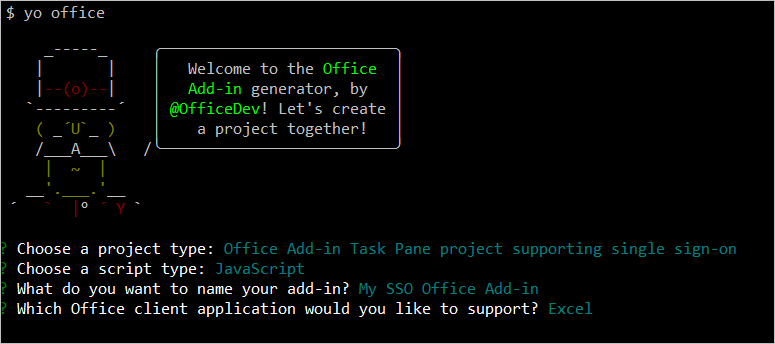

# Use the Yeoman generator to create an Office Add-in that uses single sign-on (preview)

In this article, you'll walk through the process of using the Yeoman generator to create an Office Add-in for Excel, Outlook, Word, or PowerPoint that uses single sign-on (SSO) when possible, and uses an alternate method of user authentication when SSO is not supported.

> [!TIP]
> Before you attempt to complete this quick start, review [Enable single sign-on for Office Add-ins](../develop/sso-in-office-add-ins.md) to learn basic concepts about SSO in Office Add-ins. 
 
The Yeoman generator simplifies the process of creating an SSO add-in, by automating the steps required to configure SSO within Azure and generating the code that's necessary for an add-in to use SSO. For a detailed walkthrough that describes how to manually complete the steps that the Yeoman generator automates, see the [Create a Node.js Office Add-in that uses single sign-on](../develop/create-sso-office-add-ins-nodejs.md) tutorial.

## Prerequisites

* [Node.js](https://nodejs.org) (the latest [LTS](https://nodejs.org/about/releases) version).

* The latest version of [Yeoman](https://github.com/yeoman/yo) and the [Yeoman generator for Office Add-ins](https://github.com/OfficeDev/generator-office). To install these tools globally, run the following command via the command prompt:

    ```command&nbsp;line
    npm install -g yo generator-office
    ```

    [!include[note to update Yeoman generator](../includes/note-yeoman-generator-update.md)]

[!include[additional prerequisites](../includes/sso-tutorial-prereqs.md)]

## Create the add-in project

> [!TIP]
> The Yeoman generator can create an SSO-enabled Office Add-in for Excel, Outlook, Word, or PowerPoint, and can be created with script type of JavaScript or TypeScript. The following instructions specify `JavaScript` and `Excel`, but you should choose the script type and Office client application that best suits your scenario.

[!include[Yeoman generator create project guidance](../includes/yo-office-command-guidance.md)]

- **Choose a project type:** `Office Add-in Task Pane project supporting single sign-on`
- **Choose a script type:** `Javascript`
- **What do you want to name your add-in?** `My SSO Office Add-in`
- **Which Office client application would you like to support?** `Excel`



After you complete the wizard, the generator creates the project and installs supporting Node components.

[!include[Yeoman generator next steps](../includes/yo-office-next-steps.md)]

## Explore the project

The add-in project that you've created with the Yeoman generator contains code for an SSO-enabled task pane add-in.

[!include[project structure for an SSO-enabled add-in created with the Yeoman generator](../includes/sso-yeoman-project-structure.md)]

## Configure SSO

At this point, your add-in project has been created and contains the code that's necessary to facilitate the SSO process. Next, complete the following steps to configure SSO for your add-in.

1. Navigate to the root folder of the project.

    ```command&nbsp;line
    cd "My SSO Office Add-in"
    ```

2. Run the following command to configure SSO for the add-in.

    ```command&nbsp;line
    npm run configure-sso
    ```

    > [!WARNING]
    > This command will fail if your tenant is configured to require two-factor authentication. In this scenario, you'll need to manually complete the Azure app registration and SSO configuration steps, as described in the [Create a Node.js Office Add-in that uses single sign-on](../develop/create-sso-office-add-ins-nodejs.md) tutorial.

3. A web browser window will open and prompt you to sign in to Azure. Sign in to Azure using your Office 365 administrator credentials. These credentials will be used to register a new application in Azure and configure the settings required by SSO.

    > [!NOTE]
    > If you sign in to Azure using non-administrator credentials during this step, the `configure-sso` script won't be able to provide administrator consent for the add-in to users within your organization. SSO will therefore not be available to users of the add-in and they'll be prompted to sign-in.

4. After you enter your credentials, close the browser window and return to the command prompt. As the SSO configuration process continues, you'll see status messages being written to the console. As described in the console messages, files within the add-in project that the Yeoman generator created are automatically updated with data that's required by the SSO process.

## Try it out

If you've created an Excel, Word, or PowerPoint add-in, complete the steps in the following section to try it out. If you've created an Outlook add-in, complete the steps in the [Outlook](#outlook) section instead.

### Excel, Word, and PowerPoint

Complete the following steps to try out an Excel, Word, or PowerPoint add-in.

1. When the SSO configuration process completes, run the following command to build the project, start the local web server, and sideload your add-in in the previously selected Office client application.

    > [!NOTE]
    > Office Add-ins should use HTTPS, not HTTP, even when you are developing. If you are prompted to install a certificate after you run the following command, accept the prompt to install the certificate that the Yeoman generator provides.

    ```command&nbsp;line
    npm start
    ```

2. In the Office client application that opens when you run the previous command (i.e., Excel, Word or PowerPoint), make sure that you're signed in with a user that's a member of the same Office 365 organization as the Office 365 administrator account that you used to connect to Azure while configuring SSO in step 3 of the [previous section](#configure-sso). Doing so establishes the appropriate conditions for SSO to succeed. 

3. In the Office client application, choose the **Home** tab, and then choose the **Show Taskpane** button in the ribbon to open the add-in task pane. The following image shows this button in Excel.

    

4. At the bottom of the task pane, choose the **Get My User Profile Information** button to initiate the SSO process. 

5. If a dialog window appears to request permissions on behalf of the add-in, this means that SSO is not supported for your scenario and the add-in has instead fallen back to an alternate method of user authentication. This may occur when the tenant administrator hasn't granted consent for the add-in to access Microsoft Graph, or when the user isn't signed into Office with a valid Microsoft Account or Office 365 ("Work or School") account. Choose the **Accept** button in the dialog window to continue.

    

    > [!NOTE]
    > After a user accepts this permissions request, they won't be prompted again in the future.

6. The add-in retrieves profile information for the signed-in user and writes it to the document. The following image shows an example of profile information written to an Excel worksheet.

    

### Outlook

Complete the following steps to try out an Outlook add-in.

1. When the SSO configuration process completes, run the following command to build the project and start the local web server.

    > [!NOTE]
    > Office Add-ins should use HTTPS, not HTTP, even when you are developing. If you are prompted to install a certificate after you run the following command, accept the prompt to install the certificate that the Yeoman generator provides.

    ```command&nbsp;line
    npm start
    ```

2. Follow the instructions in [Sideload Outlook add-ins for testing](/outlook/add-ins/sideload-outlook-add-ins-for-testing) to sideload the add-in in Outlook. Make sure that you're signed in to Outlook with a user that's a member of the same Office 365 organization as the Office 365 administrator account that you used to connect to Azure while configuring SSO in step 3 of the [previous section](#configure-sso). Doing so establishes the appropriate conditions for SSO to succeed. 

3. In Outlook, compose a new message.

4. In the message compose window, choose the **Show Taskpane** button in the ribbon to open the add-in task pane.

    

5. At the bottom of the task pane, choose the **Get My User Profile Information** button to initiate the SSO process. 

6. If a dialog window appears to request permissions on behalf of the add-in, this means that SSO is not supported for your scenario and the add-in has instead fallen back to an alternate method of user authentication. This may occur when the tenant administrator hasn't granted consent for the add-in to access Microsoft Graph, or when the user isn't signed into Office with a valid Microsoft Account or Office 365 ("Work or School") account. Choose the **Accept** button in the dialog window to continue.

    

    > [!NOTE]
    > After a user accepts this permissions request, they won't be prompted again in the future.

7. The add-in retrieves profile information for the signed-in user and writes it to the body of the email message. 

    

## Next steps

Congratulations, you've successfully created a task pane add-in that uses SSO when possible, and uses an alternate method of user authentication when SSO is not supported. To learn about customizing your add-in to add new functionality that requires different permissions, see [Customize your Node.js SSO-enabled add-in](sso-quickstart-customize.md).

## See also

- [Enable single sign-on for Office Add-ins](../develop/sso-in-office-add-ins.md)
- [Customize your Node.js SSO-enabled add-in](sso-quickstart-customize.md)
- [Create a Node.js Office Add-in that uses single sign-on](../develop/create-sso-office-add-ins-nodejs.md)
- [Troubleshoot error messages for single sign-on (SSO)](../develop/troubleshoot-sso-in-office-add-ins.md)