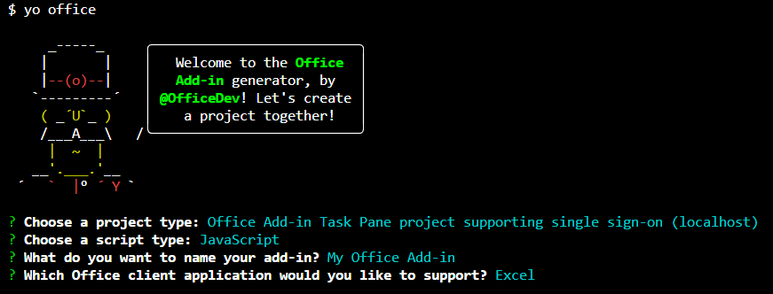

# Use the Yeoman generator to create an Office Add-in that uses single sign-on (preview)

In this article, you'll walk through the process of using the Yeoman generator to create an Office Add-in for Excel, Word, or PowerPoint that uses single sign-on (SSO) when possible, and uses an alternate method of user authentication when SSO is not supported.

> [!TIP]
> Before you attempt to complete this quick start, review [Enable single sign-on for Office Add-ins](../develop/sso-in-office-add-ins.md) to learn basic concepts about SSO in Office Add-ins. 
 
The Yeoman generator simplifies the process of creating an SSO add-in, by automating the steps required to configure SSO within Azure and generating the code that's necessary for an add-in to use SSO. For a detailed walkthrough that describes how to manually complete the steps that the Yeoman generator automates, see the [Create a Node.js Office Add-in that uses single sign-on](../develop/create-sso-office-add-ins-nodejs.md) tutorial.

## Prerequisites

- [Node.js](https://nodejs.org) (version 10.15.0 or later)

- The latest version of [Yeoman](https://github.com/yeoman/yo) and the [Yeoman generator for Office Add-ins](https://github.com/OfficeDev/generator-office). To install these tools globally, run the following command via the command prompt:

    ```command&nbsp;line
    npm install -g yo generator-office
    ```

    [!include[note to update Yeoman generator](../includes/note-yeoman-generator-update.md)]

- An Office 365 (the subscription version of Office) account, which you can get by joining the [Office 365 Developer Program](https://aka.ms/devprogramsignup) that includes a free 1 year subscription to Office 365. You should use the latest monthly version and build from the Insiders channel but you need to be an Office Insider to get this version. For more information, see [Be an Office Insider](https://products.office.com/office-insider?tab=tab-1). Please note that when a build graduates to the production semi-annual channel, support for preview features, including SSO, is turned off for that build.

- A Microsoft Azure subscription. This add-in requires Azure Active Directory (AD). Azure AD provides identity services that applications use for authentication and authorization. A trial subscription can be acquired at [Microsoft Azure](https://account.windowsazure.com/SignUp).

## Create the add-in project

> [!TIP]
> The Yeoman generator can create an SSO-enabled Office Add-in for Excel, Word, or PowerPoint, and can be created with script type of JavaScript or TypeScript. The following instructions specify `JavaScript` and `Excel`, but you should choose the script type and Office client application that best suits your scenario.

[!include[Yeoman generator create project guidance](../includes/yo-office-command-guidance.md)]

- **Choose a project type:** `Office Add-in Task Pane project supporting single sign-on`
- **Choose a script type:** `Javascript`
- **What do you want to name your add-in?** `My SSO Office Add-in`
- **Which Office client application would you like to support?** `Excel`



After you complete the wizard, the generator creates the project and installs supporting Node components.

[!include[Yeoman generator next steps](../includes/yo-office-next-steps.md)]

## Explore the project

The add-in project that you've created with the Yeoman generator contains code for an SSO-enabled task pane add-in.

- The **./ENV** file in the root directory of the project defines constants that are used by the add-in project.
- The **./manifest.xml** file in the root directory of the project defines the settings and capabilities of the add-in.
- The **./src/helpers/documentHelper.js** file uses the Office JavaScript library to add the data from Microsoft Graph to the Office document.
- The **./src/helpers/fallbackauthdialog.html** file is the UI-less page that loads the fallback authentication method's JavaScript.
- The **./src/helpers/fallbackauthdialog.js** file contains the fallback authentication method's JavaScript that signs on the user with msal.js.
- The **./src/helpers/fallbackauthhelper.js** file contains the task pane JavaScript that invokes the fallback authentication method in scenarios when SSO authentication is not supported.
- The **./src/helpers/ssoauthhelper.js** file contains the JavaScript call to the SSO API, `getAccessToken`, receives the bootstrap token, initiates the swap of the bootstrap token for an access token to Microsoft Graph, and calls to Microsoft Graph for the data.
- The **./src/taskpane/taskpane.html** file contains the HTML markup for the task pane.
- The **./src/taskpane/taskpane.css** file contains the CSS that's applied to content in the task pane.
- The **./src/taskpane/taskpane.js** file contains the Office JavaScript API code that facilitates interaction between the task pane and the Office host application.

## Configure SSO

At this point, your add-in project has been created and contains the code that's necessary to facilitate the SSO process. Next, complete the following steps to configure SSO for your add-in.

1. Navigate to the root folder of the project.

    ```command&nbsp;line
    cd "My SSO Office Add-in"
    ```

2. Run the following command to configure SSO for the add-in.

    ```command&nbsp;line
    npm run configure-sso
    ```

    > [!WARNING]
    > This command will fail if your tenant is configured to require two-factor authentication. In this scenario, you'll need to manually complete the Azure app registration and SSO configuration steps manually, as described in the [Create a Node.js Office Add-in that uses single sign-on](../develop/create-sso-office-add-ins-nodejs.md) tutorial.

3. A web browser window will open and prompt you to sign into Azure. Sign into Azure using your Office 365 administrator credentials. These credentials will be used to register a new application in Azure and configure the settings required by SSO.

4. After you enter your credentials, close the browser window and return to the command prompt. As the SSO configuration process continues, you'll see status messages being written to the console. As described in the console messages, files within the add-in project that the Yeoman generator created are automatically updated with data that's required by the SSO process.

## Try it out

1. When the SSO configuration process completes, run the following command to start the local web server and sideload your add-in in the previously selected Office client application.

    > [!NOTE]
    > Office Add-ins should use HTTPS, not HTTP, even when you are developing. If you are prompted to install a certificate after you run the following command, accept the prompt to install the certificate that the Yeoman generator provides.

    ```command&nbsp;line
    npm start
    ```

2. In the Office client application that opens when you run the previous command (i.e., Excel, Word or PowerPoint), make sure that you're signed in with a user that's a member of the same Office 365 organization as the Office 365 administrator account that you used to connect to Azure while configuring SSO in step 3 of the [previous section](#configure-sso)). Doing so establishes the appropriate conditions for SSO to succeed. 

3. In the Office client application, choose the **Home** tab, and then choose the **Show Taskpane** button in the ribbon to open the add-in task pane. The following image shows this button in Excel.

    

4. At the bottom of the task pane, choose the **Get My User Profile Information** button to initiate the SSO process. 

    > [!NOTE] 
    > If you're not already signed in to Office at this point, you'll be prompted to sign in. Sign in with the credentials that you want the add-in to use for SSO. As described previously, you should sign in with a user that's a member of the same Office 365 organization as the Office 365 administrator account that you used to connect to Azure while configuring SSO in step 3 of the [previous section](#configure-sso)), if you want SSO to succeed.

5. If a dialog window appears to request permissions on behalf of the add-in, this means that SSO is not supported for your scenario and the add-in has instead fallen back to an alternate method of user authentication. This may occur when the tenant administrator hasn't granted consent for the add-in to access Microsoft Graph, or when the user isn't signed into Office with a valid Microsoft Account or Office 365 ("Work or School") account. Choose the **Accept** button in the dialog window to continue.

    

6. The add-in retrieves profile information for the signed-in user and writes it to the document. The following image shows an example of profile information written to an Excel worksheet.

    

## Next steps

Congratulations, you've successfully created a task pane add-in that uses SSO when possible, and uses an alternate method of user authentication when SSO is not supported. To learn more about SSO configuration steps that the Yeoman generator completed automatically, and the code that facilitates the SSO process, see the [Create a Node.js Office Add-in that uses single sign-on](../develop/create-sso-office-add-ins-nodejs.md) tutorial.

## See also

- [Enable single sign-on for Office Add-ins](../develop/sso-in-office-add-ins.md)
- [Create a Node.js Office Add-in that uses single sign-on](../develop/create-sso-office-add-ins-nodejs.md)
- [Troubleshoot error messages for single sign-on (SSO)](../develop/troubleshoot-sso-in-office-add-ins.md)