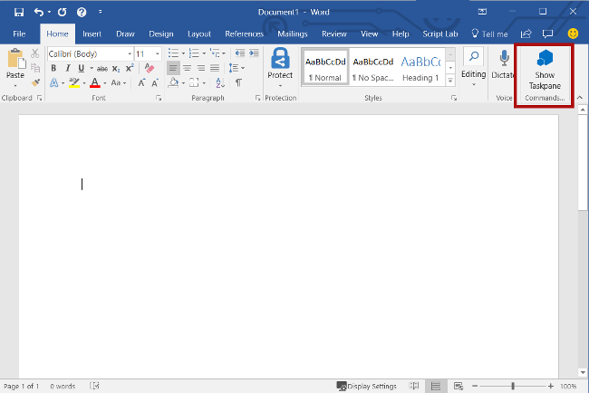
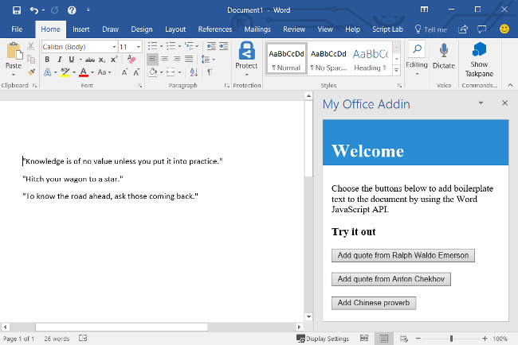

# Build your first Word task pane add-in with Visual Studio

In this article, you'll walk through the process of building a Word task pane add-in.

## Prerequisites

[!include[Quick Start prerequisites](../includes/quickstart-vs-prerequisites.md)]

## Create the add-in project

[!include[Visual Studio instructions to create Word solution](../includes/vs-word-instructions.md)]

## Explore the Visual Studio solution

[!include[Description of Visual Studio projects](../includes/quickstart-vs-solution.md)]

## Update the code

1. **Home.html** specifies the HTML that will be rendered in the add-in's task pane. In **Home.html**, replace the `<body>` element with the following markup and save the file.

    ```html
    <body>
        <div id="content-header">
            <div class="padding">
                <h1>Welcome</h1>
            </div>
        </div>
        <div id="content-main">
            <div class="padding">
                <p>Choose the buttons below to add boilerplate text to the document by using the Word JavaScript API.</p>
                <br />
                <h3>Try it out</h3>
                <button id="emerson">Add quote from Ralph Waldo Emerson</button>
                <br /><br />
                <button id="checkhov">Add quote from Anton Chekhov</button>
                <br /><br />
                <button id="proverb">Add Chinese proverb</button>
            </div>
        </div>
        <br />
        <div id="supportedVersion"/>
    </body>
    ```

1. Open the file **Home.js** in the root of the web application project. This file specifies the script for the add-in. Replace the entire contents with the following code and save the file.

    ```js
    'use strict';

    (function () {

        Office.onReady(function() {
            // Office is ready.
            $(document).ready(function () {
                // The document is ready.
                // Use this to check whether the API is supported in the Word client.
                if (Office.context.requirements.isSetSupported('WordApi', '1.1')) {
                    // Do something that is only available via the new APIs.
                    $('#emerson').on("click", insertEmersonQuoteAtSelection);
                    $('#checkhov').on("click", insertChekhovQuoteAtTheBeginning);
                    $('#proverb').on("click", insertChineseProverbAtTheEnd);
                    $('#supportedVersion').html('This code is using Word 2016 or later.');
                } else {
                    // Lets you know that this code will not work with your version of Word.
                    $('#supportedVersion').html('This code requires Word 2016 or later.');
                }
            });
        });

        async function insertEmersonQuoteAtSelection() {
            await Word.run(async (context) => {

                // Create a proxy object for the document.
                const thisDocument = context.document;

                // Queue a command to get the current selection.
                // Create a proxy range object for the selection.
                const range = thisDocument.getSelection();

                // Queue a command to replace the selected text.
                range.insertText('"Hitch your wagon to a star." - Ralph Waldo Emerson\n', Word.InsertLocation.replace);

                // Synchronize the document state by executing the queued commands,
                // and return a promise to indicate task completion.
                await context.sync();
                console.log('Added a quote from Ralph Waldo Emerson.');
            })
            .catch(function (error) {
                console.log('Error: ' + JSON.stringify(error));
                if (error instanceof OfficeExtension.Error) {
                    console.log('Debug info: ' + JSON.stringify(error.debugInfo));
                }
            });
        }

        async function insertChekhovQuoteAtTheBeginning() {
            await Word.run(async (context) => {

                // Create a proxy object for the document body.
                const body = context.document.body;

                // Queue a command to insert text at the start of the document body.
                body.insertText('"Knowledge is of no value unless you put it into practice." - Anton Chekhov\n', Word.InsertLocation.start);

                // Synchronize the document state by executing the queued commands,
                // and return a promise to indicate task completion.
                await context.sync();
                console.log('Added a quote from Anton Chekhov.');
            })
            .catch(function (error) {
                console.log('Error: ' + JSON.stringify(error));
                if (error instanceof OfficeExtension.Error) {
                    console.log('Debug info: ' + JSON.stringify(error.debugInfo));
                }
            });
        }

        async function insertChineseProverbAtTheEnd() {
            await Word.run(async (context) => {

                // Create a proxy object for the document body.
                const body = context.document.body;

                // Queue a command to insert text at the end of the document body.
                body.insertText('"To know the road ahead, ask those coming back." - Chinese proverb\n', Word.InsertLocation.end);

                // Synchronize the document state by executing the queued commands,
                // and return a promise to indicate task completion.
                await context.sync();
                console.log('Added a quote from a Chinese proverb.');
            })
            .catch(function (error) {
                console.log('Error: ' + JSON.stringify(error));
                if (error instanceof OfficeExtension.Error) {
                    console.log('Debug info: ' + JSON.stringify(error.debugInfo));
                }
            });
        }
    })();
    ```

1. Open the file **Home.css** in the root of the web application project. This file specifies the custom styles for the add-in. Replace the entire contents with the following code and save the file.

    ```css
    #content-header {
        background: #2a8dd4;
        color: #fff;
        position: absolute;
        top: 0;
        left: 0;
        width: 100%;
        height: 80px;
        overflow: hidden;
    }

    #content-main {
        background: #fff;
        position: fixed;
        top: 80px;
        left: 0;
        right: 0;
        bottom: 0;
        overflow: auto;
    }

    .padding {
        padding: 15px;
    }
    ```

## Update the manifest

1. Open the add-in only manifest file in the add-in project. This file defines the add-in's settings and capabilities.

1. The `ProviderName` element has a placeholder value. Replace it with your name.

1. The `DefaultValue` attribute of the `DisplayName` element has a placeholder. Replace it with **My Office Add-in**.

1. The `DefaultValue` attribute of the `Description` element has a placeholder. Replace it with **A task pane add-in for Word**.

1. Save the file.

    ```xml
    ...
    <ProviderName>John Doe</ProviderName>
    <DefaultLocale>en-US</DefaultLocale>
    <!-- The display name of your add-in. Used on the Store and various places of the Office UI such as the add-in's dialog. -->
    <DisplayName DefaultValue="My Office Add-in" />
    <Description DefaultValue="A task pane add-in for Word."/>
    ...
    ```

## Try it out

1. Using Visual Studio, test the newly created Word add-in by pressing <kbd>F5</kbd> or choosing **Debug** > **Start Debugging** to launch Word with the **Show Taskpane** add-in button displayed on the ribbon. The add-in will be hosted locally on IIS.

1. In Word, if the add-in task pane isn't already open, choose the **Home** tab, and then choose the **Show Taskpane** button on the ribbon to open the add-in task pane. (If you're using a volume-licensed perpetual version of Office 2016 or older, then custom buttons aren't supported. Instead, the task pane will open immediately.)

    

1. In the task pane, choose any of the buttons to add boilerplate text to the document.

    

[!include[Console tool note](../includes/console-tool-note.md)]

## Next steps

Congratulations, you've successfully created a Word task pane add-in! Next, to learn more about developing Office Add-ins with Visual Studio, continue to the following article.

> [!div class="nextstepaction"]
> [Develop Office Add-ins with Visual Studio](../develop/develop-add-ins-visual-studio.md)

[!include[The common troubleshooting section for all Visual Studio quick starts](../includes/quickstart-troubleshooting-vs.md)]

## Code samples

- [Word "Hello world" add-in](https://github.com/OfficeDev/Office-Add-in-samples/tree/main/Samples/hello-world/word-hello-world): Learn how to build a simple Office Add-in with only a manifest, HTML web page, and a logo.

## See also

- [Office Add-ins platform overview](../overview/office-add-ins.md)
- [Develop Office Add-ins](../develop/develop-overview.md)
- [Word add-ins overview](../word/word-add-ins-programming-overview.md)
- [Word add-in code samples](https://developer.microsoft.com/office/gallery/?filterBy=Samples,Word)
- [Word JavaScript API reference](../reference/overview/word-add-ins-reference-overview.md)
- [Publish your add-in using Visual Studio](../publish/package-your-add-in-using-visual-studio.md)
