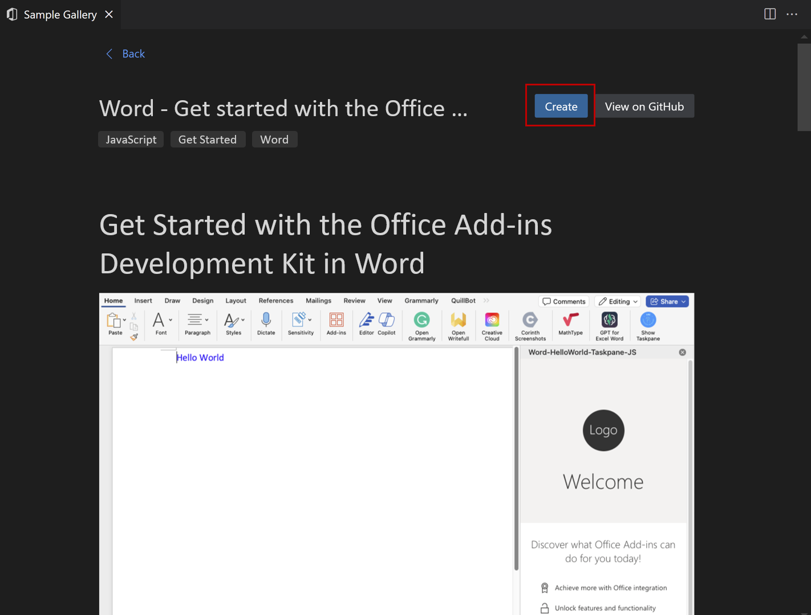

# Build your first Word task pane add-in

In this article, you'll walk through the process of building a Word task pane add-in. You'll use either the Office Add-ins Development Kit or the Yeoman generator to create your Office Add-in. Select the tab for the one you'd like to use and then follow the instructions to create your add-in and test it locally. If you'd like to use Visual Studio Code, we recommend the Office Add-ins Development Kit.

# [Office Add-ins Development Kit](#tab/devkit)
## Prerequisites

- Download and install [Visual Studio Code](https://code.visualstudio.com/).
- Node.js (the latest LTS version). Visit the [Node.js site](https://nodejs.org/) to download and install the right version for your operating system. To verify if you've already installed these tools, run the commands `node -v` and `npm -v` in your terminal.
- Office connected to a Microsoft 365 subscription. You might qualify for a Microsoft 365 E5 developer subscription through the [Microsoft 365 Developer Program](https://developer.microsoft.com/microsoft-365/dev-program), see [FAQ](/office/developer-program/microsoft-365-developer-program-faq#who-qualifies-for-a-microsoft-365-e5-developer-subscription-) for details. Alternatively, you can [sign up for a 1-month free trial](https://www.microsoft.com/microsoft-365/try?rtc=1) or [purchase a Microsoft 365 plan](https://www.microsoft.com/microsoft-365/buy/compare-all-microsoft-365-products).

## Create the add-in project

Click the following button to create an add-in project using the Office Add-ins Development Kit for Visual Studio Code. A page that contains the project decription will open in Visual Studio Code.

<button type="button">[Create an add-in in Visual Studio Code](vscode://msoffice.microsoft-office-add-in-debugger/open-specific-sample?sample-id=Word-HelloWorld-TaskPane-JS)</button>



In the prompted page, select **Create** to create the add-in project. In the **Workspace folder** dialog that opens, select the folder where you want to create the project. 

The Office Add-ins Development Kit will create the project. It will then open the project in a *second* Visual Studio Code window. Close the original Visual Studio Code window.

> [!NOTE]
> You'll be prompted to install the Office Add-ins Development Kit extension if don't already have it. If you need to install the Office Add-ins Development Kit manually, follow [these steps](../development-kit-overview.md?tabs=vscode).

## Explore the project

The add-in project that you've created with the Office Add-ins Development Kit contains sample code for a basic task pane add-in. If you'd like to explore the components of your add-in project, open the project in your code editor and review the files listed below. When you're ready to try out your add-in, proceed to the next section.

1. The ./manifest.xml or manifest.json file in the root directory of the project defines the settings and capabilities of the add-in.
1. The ./src/taskpane/taskpane.html file contains the HTML markup for the task pane.
1. The ./src/taskpane/taskpane.css file contains the CSS that's applied to content in the task pane.
1. The ./src/taskpane/taskpane.js file contains the Office JavaScript API code that facilitates interaction between the task pane and the Office client application.

## Try it out

1. Open the extension by selecting the Office Add-ins Development Kit icon in the **Activity Bar**.
1. Select **Preview Your Office Add-in (F5)**
1. In the Quick Pick menu, select the option **{Office Host} Desktop (Edge Chromium)**. This will launch the add-in and debug the code.
The development kit checks that the prerequisites are met before debugging starts. Check the terminal for detailed information if there are issues with your environment. After this process, the Office desktop application launches and sideloads the add-in. Please note that the first time you run a project, it may make take a few minutes to install the dependencies. You will need to install the certificate when prompted.

## Stop testing your Office Add-in

Once you are finished testing and debugging the add-in, close the add-in by following these steps.

1. Open the extension by selecting the Office Add-ins Development Kit icon in the **Activity Bar**.
1. Select **Stop Previewing Your Office Add-in**. This closes the web server and removes the add-in from the registry and cache.
1. Close the Office application window at your convenience.

## Troubleshooting

If you have problems running the add-in, take these steps.

- Close any open instances of Office.
- Close the previous web server started for the add-in with the **Stop Previewing Your Office Add-in** Office Add-ins Development Kit extension option.

The article [Troubleshoot development errors with Office Add-ins](../testing/troubleshoot-development-errors.md) contains solutions to common problems. If you're still having issues, [create a GitHub issue](https://aka.ms/officedevkitnewissue) and we'll help you.  

For information on running the add-in on Office on the web, see [Sideload Office Add-ins to Office on the web](../testing/sideload-office-add-ins-for-testing.md).

For information on debugging on older versions of Office, see [Debug add-ins using developer tools in Microsoft Edge Legacy](../testing/debug-add-ins-using-devtools-edge-legacy.md).


# [Yeoman generator](#tab/yeoman)
## Prerequisites

[!include[Yeoman generator prerequisites](../includes/quickstart-yo-prerequisites.md)]

## Create the add-in project

[!include[Yeoman generator create project guidance](../includes/yo-office-command-guidance.md)]

- **Choose a project type:** `Office Add-in Task Pane project`
- **Choose a script type:** `JavaScript`
- **What do you want to name your add-in?** `My Office Add-in`
- **Which Office client application would you like to support?** `Word`


After you complete the wizard, the generator creates the project and installs supporting Node components.

## Explore the project

[!include[Yeoman generator add-in project components](../includes/yo-task-pane-project-components-js.md)]

## Try it out

1. Navigate to the root folder of the project.

    ```command&nbsp;line
    cd "My Office Add-in"
    ```

1. Complete the following steps to start the local web server and sideload your add-in.

    [!INCLUDE [alert use https](../includes/alert-use-https.md)]

    > [!TIP]
    > If you're testing your add-in on Mac, run the following command before proceeding. When you run this command, the local web server starts.
    >
    > ```command&nbsp;line
    > npm run dev-server
    > ```

    - To test your add-in in Word, run the following command in the root directory of your project. This starts the local web server (if it's not already running) and opens Word with your add-in loaded.

        ```command&nbsp;line
        npm start
        ```

    - To test your add-in in Word on a browser, run the following command in the root directory of your project. When you run this command, the local web server starts. Replace "{url}" with the URL of a Word document on your OneDrive or a SharePoint library to which you have permissions.

        [!INCLUDE [npm start:web command syntax](../includes/start-web-sideload-instructions.md)]

1. In Word, if the "My Office Add-in" task pane isn't already open, open a new document, choose the **Home** tab, and then choose the **Show Taskpane** button on the ribbon to open the add-in task pane.

    

1. At the bottom of the task pane, choose the **Run** link to add the text "Hello World" to the document in blue font.

    

1. [!include[Instructions to stop web server and uninstall dev add-in](../includes/stop-uninstall-dev-add-in.md)]

## Next steps

Congratulations, you've successfully created a Word task pane add-in! Next, learn more about the capabilities of a Word add-in and build a more complex add-in by following along with the Word add-in tutorial.

> [!div class="nextstepaction"]
> [Word add-in tutorial](../tutorials/word-tutorial.md)

[!include[The common troubleshooting section for all Yo Office quick starts](../includes/quickstart-troubleshooting-yo.md)]

## Code samples

- [Word "Hello world" add-in](https://github.com/OfficeDev/Office-Add-in-samples/tree/main/Samples/hello-world/word-hello-world): Learn how to build a simple Office Add-in with only a manifest, HTML web page, and a logo.

## See also

- [Office Add-ins platform overview](../overview/office-add-ins.md)
- [Develop Office Add-ins](../develop/develop-overview.md)
- [Word add-ins overview](../word/word-add-ins-programming-overview.md)
- [Word add-in code samples](https://developer.microsoft.com/office/gallery/?filterBy=Samples,Word)
- [Word JavaScript API reference](../reference/overview/word-add-ins-reference-overview.md)
- [Using Visual Studio Code to publish](../publish/publish-add-in-vs-code.md#using-visual-studio-code-to-publish)
