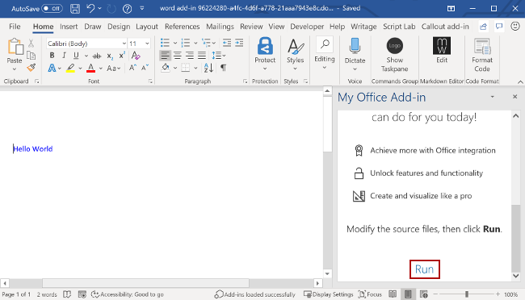

# Build your first Word task pane add-in

In this article, you'll walk through the process of building a Word task pane add-in. You'll use either the Office Add-ins Development Kit or the Yeoman generator to create your Office Add-in. Select the tab for the one you'd like to use and then follow the instructions to create your add-in and test it locally. If you'd like to create the add-in project within Visual Studio Code, we recommend the Office Add-ins Development Kit.

# [Office Add-ins Development Kit](#tab/devkit)

[!include[Dev_kit prerequisites](../includes/dev-kit-prerequisites.md)]

## Create the add-in project

Click the following button to create an add-in project using the Office Add-ins Development Kit for Visual Studio Code. You'll be prompted to install the extension if don't already have it. A page that contains the project description will open in Visual Studio Code.

> [!div class="nextstepaction"]
> [Create an add-in in Visual Studio Code](vscode://msoffice.microsoft-office-add-in-debugger/open-specific-sample?sample-id=word-get-started-with-dev-kit)

In the prompted page, select **Create** to create the add-in project. In the **Workspace folder** dialog that opens, select the folder where you want to create the project. 

:::image type="content" source="../images/office-add-ins-development-kit-samplepage-wordquickstart.png" alt-text="The Development Kit sample gallery in Visual Studio Code":::

The Office Add-ins Development Kit will create the project. It will then open the project in a *second* Visual Studio Code window. Close the original Visual Studio Code window.

> [!NOTE]
> If you use VSCode Insiders, or you have problems opening the project page in VSCode, install the extension manually by following [these steps](../develop/development-kit-overview.md?tabs=vscode), and find the sample in the sample gallery.

[!include[Devkit_project_components_taskpane](../includes/devkit-project-components-taskpane.md)]

## Try it out

[!include[Dev_kit_start_debugging](../includes/dev-kit-start-debugging.md)]

[!include[Dev_kit_stop_debugging](../includes/dev-kit-stop-debugging.md)]

[!include[Dev_kit_troubleshooting](../includes/dev-kit-troubleshooting.md)]
# [Yeoman generator](#tab/yeoman)
## Prerequisites

[!include[Yeoman generator prerequisites](../includes/quickstart-yo-prerequisites.md)]

## Create the add-in project

[!include[Yeoman generator create project guidance](../includes/yo-office-command-guidance.md)]

- **Choose a project type:** `Office Add-in Task Pane project`
- **Choose a script type:** `JavaScript`
- **What do you want to name your add-in?** `My Office Add-in`
- **Which Office client application would you like to support?** `Word`


After you complete the wizard, the generator creates the project and installs supporting Node components.

## Explore the project

[!include[Yeoman generator add-in project components](../includes/yo-task-pane-project-components-js.md)]

## Try it out

1. Navigate to the root folder of the project.

    ```command&nbsp;line
    cd "My Office Add-in"
    ```

1. Complete the following steps to start the local web server and sideload your add-in.

    [!INCLUDE [alert use https](../includes/alert-use-https.md)]

    > [!TIP]
    > If you're testing your add-in on Mac, run the following command before proceeding. When you run this command, the local web server starts.
    >
    > ```command&nbsp;line
    > npm run dev-server
    > ```

    - To test your add-in in Word, run the following command in the root directory of your project. This starts the local web server (if it's not already running) and opens Word with your add-in loaded.

        ```command&nbsp;line
        npm start
        ```

    - To test your add-in in Word on a browser, run the following command in the root directory of your project. When you run this command, the local web server starts. Replace "{url}" with the URL of a Word document on your OneDrive or a SharePoint library to which you have permissions.

        [!INCLUDE [npm start on web command syntax](../includes/start-web-sideload-instructions.md)]

1. In Word, if the "My Office Add-in" task pane isn't already open, open a new document, choose the **Home** tab, and then choose the **Show Taskpane** button on the ribbon to open the add-in task pane.

    

1. At the bottom of the task pane, choose the **Run** link to add the text "Hello World" to the document in blue font.

    

1. [!include[Instructions to stop web server and uninstall dev add-in](../includes/stop-uninstall-dev-add-in.md)]

## Next steps

Congratulations, you've successfully created a Word task pane add-in! Next, learn more about the capabilities of a Word add-in and build a more complex add-in by following along with the Word add-in tutorial.

> [!div class="nextstepaction"]
> [Word add-in tutorial](../tutorials/word-tutorial.md)

[!include[The common troubleshooting section for all Yo Office quick starts](../includes/quickstart-troubleshooting-yo.md)]

## Code samples

- [Word "Hello world" add-in](https://github.com/OfficeDev/Office-Add-in-samples/tree/main/Samples/hello-world/word-hello-world): Learn how to build a simple Office Add-in with only a manifest, HTML web page, and a logo.

## See also

- [Office Add-ins platform overview](../overview/office-add-ins.md)
- [Develop Office Add-ins](../develop/develop-overview.md)
- [Word add-ins overview](../word/word-add-ins-programming-overview.md)
- [Word add-in code samples](https://developer.microsoft.com/office/gallery/?filterBy=Samples,Word)
- [Word JavaScript API reference](../reference/overview/word-add-ins-reference-overview.md)
- [Using Visual Studio Code to publish](../publish/publish-add-in-vs-code.md#using-visual-studio-code-to-publish)
