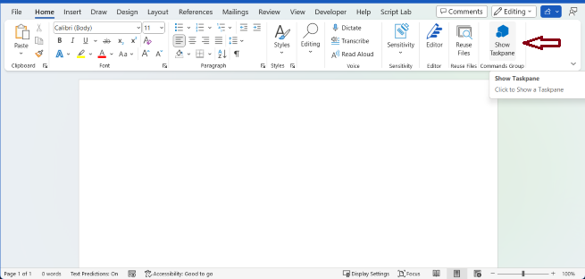

# Build your first Word task pane add-in

In this article, you'll walk through the process of building a Word task pane add-in.

## Create the add-in

[!include[Choose your editor](../includes/quickstart-choose-editor.md)]

# [Visual Studio Code (preview)](#tab/visualstudiocode)

## Prerequisites
- Download and install [Visual Studio Code](https://visualstudio.microsoft.com/downloads/).
- Install the latest version of Office Add-ins Development Kit into Visual Studio Code as described in [Install Office Add-ins Development Kit](install-office-add-ins-development-kit.md).
- Node.js (the latest LTS version). Visit the [Node.js site](https://nodejs.org/) to download and install the right version for your operating system. To verify if you've already installed these tools, run the commands `node -v` and `npm -v` in your terminal.
- Office connected to a Microsoft 365 subscription. You might qualify for a Microsoft 365 E5 developer subscription through the [Microsoft 365 Developer Program](https://developer.microsoft.com/microsoft-365/dev-program), see [FAQ](https://learn.microsoft.com/office/developer-program/microsoft-365-developer-program-faq#who-qualifies-for-a-microsoft-365-e5-developer-subscription-) for details. Alternatively, you can [sign up for a 1-month free trial](https://www.microsoft.com/microsoft-365/try?rtc=1) or [purchase a Microsoft 365 plan](https://www.microsoft.com/microsoft-365/buy/compare-all-microsoft-365-products).

## Create and run the add-in project

Click the button to create an Word taskpane add-in using the Office Add-ins Development Kit for Visual Studio Code.

<button type="button">[Create an add-in in Visual Studio Code](vscode://msoffice.microsoft-office-add-in-debugger/open-specific-sample?sample-id=Word-HelloWorld-TaskPane-JS)</button>

Once you click the above button, you can follow the below steps to create and run the add-in.  

1. In the pop-up window in browser, select **Open**.

    

1. In the pop-up window in Visual Studio Code, select **Open**.

    

1. In Visual Studio Code, you will see the description of a basic Word task pane add-in.  

    

    Select **Create** to create the add-in project.

1. In the **Workspace folder** dialog that opens, select the folder where you want to create the project. Office Add-ins Development Kit will create the add-in project. It will then open the project *in a second Visual Studio Code window*. Close the original Visual Studio Code window.

## Preview your add-in in Office apps

To understand how the add-in will work in Office apps, you can use the Office Add-ins Development Kit to easily run and debug your Office add-in in your local dev environment.

### Preview Your Office Add-in (F5)

Select **Preview Your Office Add-in(F5)** to launch the add-in and debug the code. In the drop down menu, select the option **Desktop (Edge Chromium)**.


The extension then checks that the prerequisites are met before debugging starts. Check the terminal for detailed information if there are issues with your environment. After this process, the Office desktop application launches and sideloads the add-in.


### Stop Previewing Your Office Add-in

Once you are finished testing and debugging the add-in, select **Stop Previewing Your Office Add-in**. This closes the web server and removes the add-in from the registry and cache.

## Troubleshooting

If you have problems running the add-in, take these steps.
- Close any open instances of Office.
- Close the previous web server started for the add-in with the **Stop Previewing Your Office Add-in** Office Add-ins Development Kit extension option.

If you still have problems, see [troubleshoot development errors](https://learn.microsoft.com//office/dev/add-ins/testing/troubleshoot-development-errors) or [create a GitHub issue](https://aka.ms/officedevkitnewissue) and we'll help you.  

For information on running the add-in on Office on the web, see [Sideload Office Add-ins to Office on the web](https://learn.microsoft.com/office/dev/add-ins/testing/sideload-office-add-ins-for-testing).

For information on debugging on older versions of Office, see [Debug add-ins using developer tools in Microsoft Edge Legacy](https://learn.microsoft.com/office/dev/add-ins/testing/debug-add-ins-using-devtools-edge-legacy).


# [Yeoman generator](#tab/yeomangenerator)

### Prerequisites

[!include[Yeoman generator prerequisites](../includes/quickstart-yo-prerequisites.md)]

### Create the add-in project

[!include[Yeoman generator create project guidance](../includes/yo-office-command-guidance.md)]

- **Choose a project type:** `Office Add-in Task Pane project`
- **Choose a script type:** `JavaScript`
- **What do you want to name your add-in?** `My Office Add-in`
- **Which Office client application would you like to support?** `Word`


After you complete the wizard, the generator creates the project and installs supporting Node components.

[!include[Node.js version 20 warning](../includes/node-20-warning-note.md)]

[!include[Yeoman generator next steps](../includes/yo-office-next-steps.md)]

### Explore the project

[!include[Yeoman generator add-in project components](../includes/yo-task-pane-project-components-js.md)]

### Try it out

1. Navigate to the root folder of the project.

    ```command&nbsp;line
    cd "My Office Add-in"
    ```

1. Complete the following steps to start the local web server and sideload your add-in.

    [!INCLUDE [alert use https](../includes/alert-use-https.md)]

    > [!TIP]
    > If you're testing your add-in on Mac, run the following command before proceeding. When you run this command, the local web server starts.
    >
    > ```command&nbsp;line
    > npm run dev-server
    > ```

    - To test your add-in in Word, run the following command in the root directory of your project. This starts the local web server (if it's not already running) and opens Word with your add-in loaded.

        ```command&nbsp;line
        npm start
        ```

    - To test your add-in in Word on a browser, run the following command in the root directory of your project. When you run this command, the local web server starts. Replace "{url}" with the URL of a Word document on your OneDrive or a SharePoint library to which you have permissions.

        [!INCLUDE [npm start:web command syntax](../includes/start-web-sideload-instructions.md)]

1. In Word, if the "My Office Add-in" task pane isn't already open, open a new document, choose the **Home** tab, and then choose the **Show Taskpane** button on the ribbon to open the add-in task pane.

    

1. At the bottom of the task pane, choose the **Run** link to add the text "Hello World" to the document in blue font.

    

### Next steps

Congratulations, you've successfully created a Word task pane add-in! Next, learn more about the capabilities of a Word add-in and build a more complex add-in by following along with the Word add-in tutorial.

> [!div class="nextstepaction"]
> [Word add-in tutorial](../tutorials/word-tutorial.md)

# [Visual Studio](#tab/visualstudio)

### Prerequisites

[!include[Quick Start prerequisites](../includes/quickstart-vs-prerequisites.md)]

### Create the add-in project

[!include[Visual Studio instructions to create Word solution](../includes/vs-word-instructions.md)]

### Explore the Visual Studio solution

[!include[Description of Visual Studio projects](../includes/quickstart-vs-solution.md)]

### Update the code

1. **Home.html** specifies the HTML that will be rendered in the add-in's task pane. In **Home.html**, replace the `<body>` element with the following markup and save the file.

    ```html
    <body>
        <div id="content-header">
            <div class="padding">
                <h1>Welcome</h1>
            </div>
        </div>
        <div id="content-main">
            <div class="padding">
                <p>Choose the buttons below to add boilerplate text to the document by using the Word JavaScript API.</p>
                <br />
                <h3>Try it out</h3>
                <button id="emerson">Add quote from Ralph Waldo Emerson</button>
                <br /><br />
                <button id="checkhov">Add quote from Anton Chekhov</button>
                <br /><br />
                <button id="proverb">Add Chinese proverb</button>
            </div>
        </div>
        <br />
        <div id="supportedVersion"/>
    </body>
    ```

1. Open the file **Home.js** in the root of the web application project. This file specifies the script for the add-in. Replace the entire contents with the following code and save the file.

    ```js
    'use strict';

    (function () {

        Office.onReady(function() {
            // Office is ready.
            $(document).ready(function () {
                // The document is ready.
                // Use this to check whether the API is supported in the Word client.
                if (Office.context.requirements.isSetSupported('WordApi', '1.1')) {
                    // Do something that is only available via the new APIs.
                    $('#emerson').on("click", insertEmersonQuoteAtSelection);
                    $('#checkhov').on("click", insertChekhovQuoteAtTheBeginning);
                    $('#proverb').on("click", insertChineseProverbAtTheEnd);
                    $('#supportedVersion').html('This code is using Word 2016 or later.');
                } else {
                    // Lets you know that this code will not work with your version of Word.
                    $('#supportedVersion').html('This code requires Word 2016 or later.');
                }
            });
        });

        async function insertEmersonQuoteAtSelection() {
            await Word.run(async (context) => {

                // Create a proxy object for the document.
                const thisDocument = context.document;

                // Queue a command to get the current selection.
                // Create a proxy range object for the selection.
                const range = thisDocument.getSelection();

                // Queue a command to replace the selected text.
                range.insertText('"Hitch your wagon to a star." - Ralph Waldo Emerson\n', Word.InsertLocation.replace);

                // Synchronize the document state by executing the queued commands,
                // and return a promise to indicate task completion.
                await context.sync();
                console.log('Added a quote from Ralph Waldo Emerson.');
            })
            .catch(function (error) {
                console.log('Error: ' + JSON.stringify(error));
                if (error instanceof OfficeExtension.Error) {
                    console.log('Debug info: ' + JSON.stringify(error.debugInfo));
                }
            });
        }

        async function insertChekhovQuoteAtTheBeginning() {
            await Word.run(async (context) => {

                // Create a proxy object for the document body.
                const body = context.document.body;

                // Queue a command to insert text at the start of the document body.
                body.insertText('"Knowledge is of no value unless you put it into practice." - Anton Chekhov\n', Word.InsertLocation.start);

                // Synchronize the document state by executing the queued commands,
                // and return a promise to indicate task completion.
                await context.sync();
                console.log('Added a quote from Anton Chekhov.');
            })
            .catch(function (error) {
                console.log('Error: ' + JSON.stringify(error));
                if (error instanceof OfficeExtension.Error) {
                    console.log('Debug info: ' + JSON.stringify(error.debugInfo));
                }
            });
        }

        async function insertChineseProverbAtTheEnd() {
            await Word.run(async (context) => {

                // Create a proxy object for the document body.
                const body = context.document.body;

                // Queue a command to insert text at the end of the document body.
                body.insertText('"To know the road ahead, ask those coming back." - Chinese proverb\n', Word.InsertLocation.end);

                // Synchronize the document state by executing the queued commands,
                // and return a promise to indicate task completion.
                await context.sync();
                console.log('Added a quote from a Chinese proverb.');
            })
            .catch(function (error) {
                console.log('Error: ' + JSON.stringify(error));
                if (error instanceof OfficeExtension.Error) {
                    console.log('Debug info: ' + JSON.stringify(error.debugInfo));
                }
            });
        }
    })();
    ```

1. Open the file **Home.css** in the root of the web application project. This file specifies the custom styles for the add-in. Replace the entire contents with the following code and save the file.

    ```css
    #content-header {
        background: #2a8dd4;
        color: #fff;
        position: absolute;
        top: 0;
        left: 0;
        width: 100%;
        height: 80px;
        overflow: hidden;
    }

    #content-main {
        background: #fff;
        position: fixed;
        top: 80px;
        left: 0;
        right: 0;
        bottom: 0;
        overflow: auto;
    }

    .padding {
        padding: 15px;
    }
    ```

### Update the manifest

1. Open the add-in only manifest file in the add-in project. This file defines the add-in's settings and capabilities.

1. The `ProviderName` element has a placeholder value. Replace it with your name.

1. The `DefaultValue` attribute of the `DisplayName` element has a placeholder. Replace it with **My Office Add-in**.

1. The `DefaultValue` attribute of the `Description` element has a placeholder. Replace it with **A task pane add-in for Word**.

1. Save the file.

    ```xml
    ...
    <ProviderName>John Doe</ProviderName>
    <DefaultLocale>en-US</DefaultLocale>
    <!-- The display name of your add-in. Used on the Store and various places of the Office UI such as the add-in's dialog. -->
    <DisplayName DefaultValue="My Office Add-in" />
    <Description DefaultValue="A task pane add-in for Word."/>
    ...
    ```

### Try it out

1. Using Visual Studio, test the newly created Word add-in by pressing **F5** or choosing **Debug** > **Start Debugging** to launch Word with the **Show Taskpane** add-in button displayed on the ribbon. The add-in will be hosted locally on IIS.

1. In Word, if the add-in task pane isn't already open, choose the **Home** tab, and then choose the **Show Taskpane** button on the ribbon to open the add-in task pane. (If you're using a volume-licensed perpetual version of Office 2016 or older, then custom buttons aren't supported. Instead, the task pane will open immediately.)

    

1. In the task pane, choose any of the buttons to add boilerplate text to the document.

    

[!include[Console tool note](../includes/console-tool-note.md)]

### Next steps

Congratulations, you've successfully created a Word task pane add-in! Next, to learn more about developing Office Add-ins with Visual Studio, continue to the following article.

> [!div class="nextstepaction"]
> [Develop Office Add-ins with Visual Studio](../develop/develop-add-ins-visual-studio.md)

---

[!include[The common troubleshooting section for all quickstarts](../includes/quickstart-troubleshooting.md)]

## Code samples

- [Word "Hello world" add-in](https://github.com/OfficeDev/Office-Add-in-samples/tree/main/Samples/hello-world/word-hello-world): Learn how to build a simple Office Add-in with only a manifest, HTML web page, and a logo.

## See also

- [Office Add-ins platform overview](../overview/office-add-ins.md)
- [Develop Office Add-ins](../develop/develop-overview.md)
- [Word add-ins overview](../word/word-add-ins-programming-overview.md)
- [Word add-in code samples](https://developer.microsoft.com/office/gallery/?filterBy=Samples,Word)
- [Word JavaScript API reference](../reference/overview/word-add-ins-reference-overview.md)
- [Using Visual Studio Code to publish](../publish/publish-add-in-vs-code.md#using-visual-studio-code-to-publish)