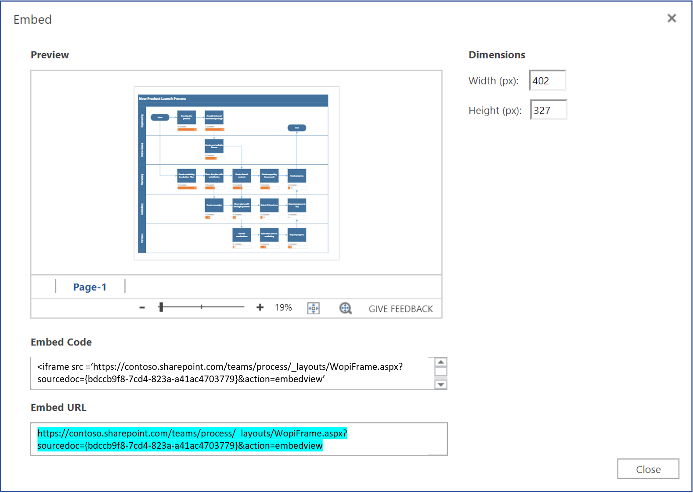

# Visio JavaScript API overview

You can use the Visio JavaScript APIs to embed Visio diagrams in *classic* SharePoint pages in SharePoint Online. (This extensibility feature is not supported in on-premise SharePoint or on SharePoint Framework pages.)

An embedded Visio diagram is a diagram that is stored in a SharePoint document library and displayed on a SharePoint page. To embed a Visio diagram, display it in an HTML `<iframe>` element. Then you can use Visio JavaScript APIs to programmatically work with the embedded diagram.


You can use the Visio JavaScript APIs to:

- Interact with Visio diagram elements like pages and shapes.
- Create visual markup on the Visio diagram canvas.
- Write custom handlers for mouse events within the drawing.
- Expose diagram data, such as shape text, shape data, and hyperlinks, to your solution.

This article describes how to use the Visio JavaScript APIs with Visio on the web to build your solutions for SharePoint Online. It introduces key concepts that are fundamental to using the APIs, such as `EmbeddedSession`, `RequestContext`, and JavaScript proxy objects, and the `sync()`, `Visio.run()`, and `load()` methods. The code examples show you how to apply these concepts.

## EmbeddedSession

The EmbeddedSession object initializes communication between the developer frame and the Visio frame in the browser.

```js
const session = new OfficeExtension.EmbeddedSession(url, { id: "embed-iframe",container: document.getElementById("iframeHost") });
session.init().then(function () {
    window.console.log("Session successfully initialized");
});
```

## Visio.run(session, function(context) { batch })

`Visio.run()` executes a batch script that performs actions on the Visio object model. The batch commands include definitions of local JavaScript proxy objects and `sync()` methods that synchronize the state between local and Visio objects and promise resolution. The advantage of batching requests in `Visio.run()` is that when the promise is resolved, any tracked page objects that were allocated during the execution will be automatically released.

The `run` function takes in session and RequestContext object and returns a promise (typically, just the result of `context.sync()`). It is possible to run the batch operation outside of the `Visio.run()`. However, in such a scenario, any page object references needs to be manually tracked and managed.

## RequestContext

The RequestContext object facilitates requests to the Visio application. Because the developer frame and the Visio web client run in two different iframes, the RequestContext object (context in next example) is required to get access to Visio and related objects such as pages and shapes, from the developer frame.

```js
function hideToolbars() {
    Visio.run(session, function(context){
        const app = context.document.application;
        app.showToolbars = false;
        return context.sync().then(function () {
            window.console.log("Toolbars Hidden");
        });
    }).catch(function(error)
    {
        window.console.log("Error: " + error);
    });
};
```

## Proxy objects

The Visio JavaScript objects declared and used in an embedded session are proxy objects for the real objects in a Visio document. All actions taken on proxy objects are not realized in Visio, and the state of the Visio document is not realized in the proxy objects until the document state has been synchronized. The document state is synchronized when `context.sync()` is run.

For example, the local JavaScript object getActivePage is declared to reference the selected page. This can be used to queue the setting of its properties and invoking methods. The actions on such objects are not realized until the `sync()` method is run.

```js
const activePage = context.document.getActivePage();
```

## sync()

The `sync()` method synchronizes the state between JavaScript proxy objects and real objects in Visio by executing instructions queued on the context and retrieving properties of loaded Office objects for use in your code. This method returns a promise, which is resolved when synchronization is complete.

## load()

The `load()` method is used to fill in the proxy objects created in the JavaScript layer. When trying to retrieve an object such as a document, a local proxy object is created first in the JavaScript layer. Such an object can be used to queue the setting of its properties and invoking methods. However, for reading object properties or relations, the `load()` and `sync()` methods need to be invoked first. The load() method takes in the properties and relations that need to be loaded when the `sync()` method is called.

The following shows the syntax for the `load()` method.

```js
object.load(string: properties); //or object.load(array: properties); //or object.load({loadOption});
```

1. **properties** is the list of property names to be loaded, specified as comma-delimited strings or array of names. See `.load()` methods under each object for details.

2. **loadOption** specifies an object that describes the selection, expansion, top, and skip options. See object load [options](/javascript/api/office/officeextension.loadoption) for details.

## Example: Printing all shapes text in active page

The following example shows you how to print shape text value from an array shapes object.
The `Visio.run()` function contains a batch of instructions. As part of this batch, a proxy object is created that references shapes on the active document.

All these commands are queued and run when `context.sync()` is called. The `sync()` method returns a promise that can be used to chain it with other operations.

```js
Visio.run(session, function (context) {
    const page = context.document.getActivePage();
    const shapes = page.shapes;
    shapes.load();
    return context.sync().then(function () {
        for(let i=0; i<shapes.items.length;i++) {
            let shape = shapes.items[i];
            window.console.log("Shape Text: " + shape.text );
        }
    });
}).catch(function(error) {
    window.console.log("Error: " + error);
    if (error instanceof OfficeExtension.Error) {
        window.console.log ("Debug info: " + JSON.stringify(error.debugInfo));
    }
});
```

## Error messages

Errors are returned using an error object that consists of a code and a message. The following table provides a list of possible error conditions that can occur.

| error.code            | error.message |
|-----------------------|----------------------------------------------------------------|
| InvalidArgument       | The argument is invalid or missing or has an incorrect format. |
| GeneralException      | There was an internal error while processing the request. |
| NotImplemented        | The requested feature isn't implemented.  |
| UnsupportedOperation  | The operation being attempted is not supported. |
| AccessDenied          | You cannot perform the requested operation. |
| ItemNotFound          | The requested resource doesn't exist. |

## Get started

You can use the example in this section to get started. This example shows you how to programmatically display the shape text of the selected shape in a Visio diagram. To begin, create a classic page in SharePoint Online or edit an existing page. Add a script editor webpart on the page and copy-paste the following code.

```HTML
<script src='https://appsforoffice.microsoft.com/embedded/1.0/visio-web-embedded.js' type='text/javascript'></script>

Enter Visio File Url:<br/>
<script language="javascript">
document.write("<input type='text' id='fileUrl' size='120'/>");
document.write("<input type='button' value='InitEmbeddedFrame' onclick='initEmbeddedFrame()' />");
document.write("<br />");
document.write("<input type='button' value='SelectedShapeText' onclick='getSelectedShapeText()' />");
document.write("<textarea id='ResultOutput' style='width:350px;height:60px'> </textarea>");
document.write("<div id='iframeHost' />");

let session; // Global variable to store the session and pass it afterwards in Visio.run()
let textArea;
// Loads the Visio application and Initializes communication between developer frame and Visio online frame
function initEmbeddedFrame() {
    textArea = document.getElementById('ResultOutput');
    let url = document.getElementById('fileUrl').value;
    if (!url) {
        window.alert("File URL should not be empty");
    }
    // APIs are enabled for EmbedView action only.
    url = url.replace("action=view","action=embedview");
    url = url.replace("action=interactivepreview","action=embedview");
    url = url.replace("action=default","action=embedview");
    url = url.replace("action=edit","action=embedview");
  
    session = new OfficeExtension.EmbeddedSession(url, { id: "embed-iframe",container: document.getElementById("iframeHost") });
    return session.init().then(function () {
        // Initialization is successful
        textArea.value  = "Initialization is successful";
    });
}

// Code for getting selected Shape Text using the shapes collection object
function getSelectedShapeText() {
    Visio.run(session, function (context) {
        const page = context.document.getActivePage();
        const shapes = page.shapes;
        shapes.load();
        return context.sync().then(function () {
            textArea.value = "Please select a Shape in the Diagram";
            for(let i=0; i<shapes.items.length;i++) {
                let shape = shapes.items[i];
                if ( shape.select == true) {
                    textArea.value = shape.text;
                    return;
                }
            }
        });
    }).catch(function(error) {
        textArea.value = "Error: ";
        if (error instanceof OfficeExtension.Error) {
            textArea.value += "Debug info: " + JSON.stringify(error.debugInfo);
        }
    });
}
</script>
```

After that, all you need is the URL of a Visio diagram that you want to work with. Just upload the Visio diagram to SharePoint Online and open it in Visio on the web. From there, open the Embed dialog and use the Embed URL in the above example.



If you are using Visio on the web in Edit mode, open the Embed dialog by choosing **File** > **Share** > **Embed**. If you are using Visio on the web in View mode, open the Embed dialog by choosing '...' and then **Embed**.

## Visio JavaScript API reference

For detailed information about Visio JavaScript API, see the [Visio JavaScript API reference documentation](/javascript/api/visio).
