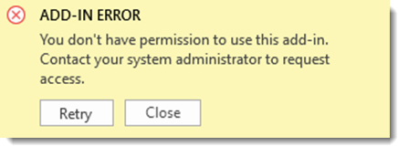

# Office Add-ins known issues

_Last updated 09/24/2025_

This article provides information about current known issues with Office Add-ins. For more information about common error messages you might encounter, see [Troubleshoot user errors with Office Add-ins](/office/dev/add-ins/testing/testing-and-troubleshooting) or contact the add-in developer on the **Details + support** tab on the add-in's detail page in [AppSource](https://appsource.microsoft.com).

## Active issues in Office Add-ins

### Excel: Centrally deployed add-in error "You don't have permission to use this add-in"

#### ISSUE

Numerous customers report that after updating Office from 2505 to 2507 their add-in will not load and an error is displayed "You don't have permission to use this add-in. Contact your system administrator." Any add-in may reproduce this issue; it is not specific to a single add-in.

 

Tracking ID: 667052546.

Version affected: Office Monthly Enterprise 2507.

#### STATUS

We're currently working on a fix.

#### WORKAROUND

##### Option 1: Use a previous version of Office

1. Roll back Office to version 2505.

##### Option 2: Refresh admin-managed add-ins

1. Select **Home** > **Add-ins** in the ribbon.
1. Select **More add-ins**.
1. Go to the **Admin Managed** tab.
1. Select the **Refresh** button in top right.
1. The add-in should reappear. Open it to reload the add-in.

### Excel: Increased frequency of RichApi.Error: Error code: 0xF532001

#### ISSUE

Since late August, customers are seeing an increase of RichApi.Error 0xF532001 in their error telemetry.

Tracking ID: 679969584.

#### STATUS

We're currently working on a fix.

#### WORKAROUND

1. Roll back Office to version 2505.

## Recently resolved issues in Office Add-ins

### Outlook: Delays loading inline images in email signatures in the new Outlook for Windows and Outlook for the web

#### Resolution summary

Outlook users experienced loading delays of inline images in email signatures when using the new Outlook for Windows and Outlook for the web. Our findings indicated that this was a server-side performance issue that affected rendering of all inline images. Attempting to send messages while the images weren't loaded resulted in the following dialog box.

 

Tracking ID: 678890927.
Date fix was deployed: 09/24/2025
Client action required: Restart Outlook

#### STATUS

The service has been restored for all impacted forests worldwide. We're closely monitoring the situation and assessing performance metrics.

For more information about resolved issues in Office Add-ins, see the [Office-js closed issues in GitHub](https://github.com/OfficeDev/office-js/issues?q=is%3Aissue%20state%3Aclosed).
