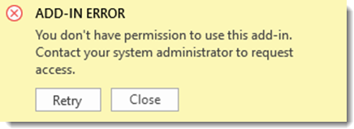

# Troubleshoot Office Add-ins

_Last updated 09/18/2025_

Use information in this article to help you resolve current known issues in Office Add-ins.  For more information about common error messages you might encounter, see [Troubleshoot user errors with Office Add-ins](/office/dev/add-ins/testing/testing-and-troubleshooting.md) or contact the add-in developer on the **Details + support** tab on the add-in's detail page in [AppSource](https://appsource.microsoft.com).

## Active issues in Office Add-ins

### Outlook: Delay in sending email in New Outlook for Windows

**ISSUE**
Outlook customers report that there is an ongoing issue where emails composed in New Outlook for Windows are stuck in the Outbox and not sent. Our investigations indicate that this Outlook issue affects signature add-ins, including CodeTwo, and causes delays in sending emails due to slow inline image loading.

 

Tracking ID: 678890927.

The versions affected are 20250829003.06 and 20250829003.07.

**STATUS**
The Outlook team has deployed a fix to Dogfood and is validating it. Rollout to production rollout expected to start soon (week of September 22 or sooner.)

**WORKAROUND**

1. Uninstall signature add-ins.
1. Remove inline images from signature.
1. Switch to Classic Outlook

### Excel: Centrally deployed add-in error "You don't have permission to use this add-in"

**ISSUE**
Numerous customers report that after updating Office from 2505 to 2507 their add-in will not load and an error is displayed "You don't have permission to use this add-in. Contact your system administrator." Any add-in may reproduce this issue; it is not specific to a single add-in.

 

Tracking ID: 667052546.

Version affected: Office Monthly Enterprise 2507.

**STATUS**
Office Extensibility team is currently working on a fix. No ETA.

**WORKAROUND**
1. Roll back Office to previous version 2505.

### Excel: Increased frequency of RichApi.Error: Error code: 0xF532001

**ISSUE**
Since late August, customers are seeing an increase of RichApi.Error 0xF532001 in there error telemetry

Trakcking ID: 679969584.

**STATUS**
Under investigation.

## Resolved issues in Office Add-ins

For more information about resolved issues in Office Add-ins, see the [Office-js closed issues in GitHub](https://github.com/OfficeDev/office-js/issues?q=is%3Aissue%20state%3Aclosed). 
