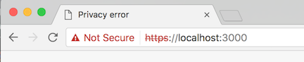
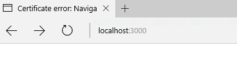
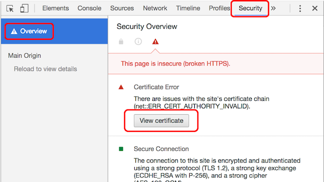
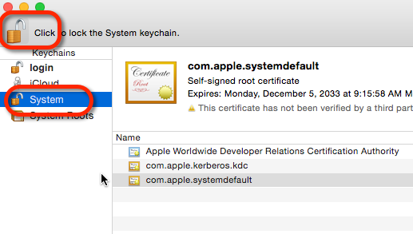
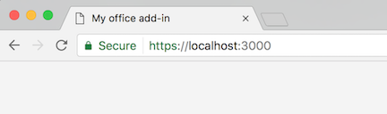
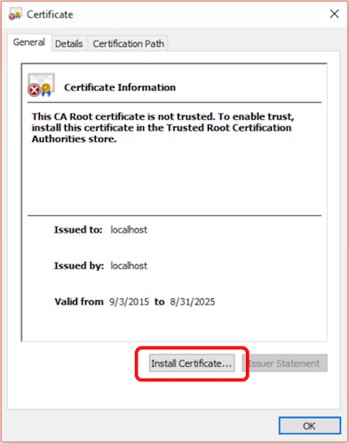
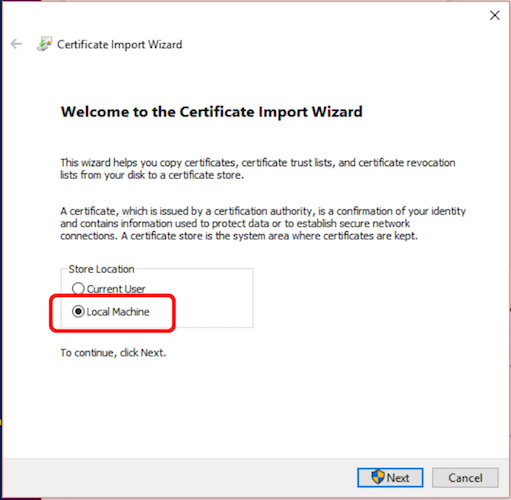

# Add a self-signed certificate as a trusted root certificate

Office requires add-ins and their web pages to come from a trusted and secure location. The [Yeoman generator for Office Add-ins](https://github.com/OfficeDev/generator-office) leverages [Browsersync](https://browsersync.io/) to start a web server, which requires a self-signed certificate. You'll need to add the certificate as a trusted root certificate so that Office can load your add-in.

When you browse to a site that has an untrusted certificate, the browser will display an error with the certificate:
  		  
  
   
  
   
To work around the error, you need to configure your developer workstation to trust the self-signed certificate. The steps to trust the self-signed certificate are different depending on your operating system (macOS / Windows / Linux).

## Trust a self-signed certificate on macOS

To begin you'll need to get the certificate by using Chrome.

1. Start Chrome.
1. Open Developer Tools window by using keyboard shortcuts: Option + Command + I.
1. Click to go to **security** panel and **overview** screen.
1. Click **View certificate**. 

   

1. Click and drag the image to your desktop. It looks like a little certificate.

Next you'll need to get the certificate file from the project directory. You can locate the server.crt file at **~/your_yo_office_project/certs/server.crt**.

Finally you'll add the certificate file to Key Chain Access.

1. Open the **Keychain Access** utility.
1. Select the **System** option on the left.
1. Click the lock icon in the upper-left corner to enable changes.
   

1. Click the plus button at the bottom and select the **localhost.cer** file you copied to the desktop.
1. In the dialog that comes up, click **Always Trust**.
1. After **localhost** gets added to the **System** keychain, double-click it to open it again.
1. Expand the **Trust** section and for the first option pick **Always Trust**.

  
  
At this point everything has been configured. Quit all browsers, then restart a browser and go to the local HTTPS site for your add-in. The browser should report it as a valid certificate:

  

## Trust a self-signed certificate on Windows

Use the following steps to set up the certificate authority cert for localhost.

1.	Go to {project root}\certs.
2.	Double-click ca.crt, and select **Install Certificate**.
    
    
    
3.	Select **Local Machine** and select **Next** to continue.
    
    
    
4.	Select **Place all certificates in the following store** and then select **Browse**.
5.	Select **Trusted Root Certification Authorities** and then select **OK**.
6.	Select **Next** and then **Finish**.

You now have a self-signed certificate installed on your computer.