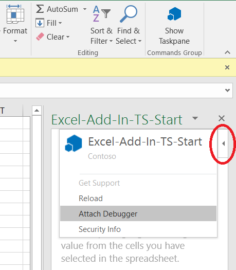

# Attach a debugger from the task pane

In some environments, a debugger can be attached on an Office Add-in that is already running. This can be useful when you want to debug an add-in that is already in staging or production. If you are still developing and testing the add-in, see [Overview of debugging Office Add-ins](debug-add-ins-overview.md).

The technique described in this article can be used only when the following conditions are met.

- The add-in is running in Office on Windows.
- The computer is using a combination of Windows and Office versions that use the Edge (Chromium-based) webview control, WebView2. To determine which webview you're using, see [Browsers and webview controls used by Office Add-ins](../concepts/browsers-used-by-office-web-add-ins.md).

> [!TIP]
> [!INCLUDE[Identify the webview through the add-in UI](../includes/identify-webview-in-ui.md)]

To launch the debugger, choose the top right corner of the task pane to activate the **Personality** menu (as shown in the red circle in the following image).

Select **Attach Debugger**. This launches the Microsoft Edge (Chromium-based) developer tools. Use the tools as described in [Debug add-ins using developer tools in Microsoft Edge (Chromium-based)](debug-add-ins-using-devtools-edge-chromium.md).

## See also

- [Overview of debugging Office Add-ins](debug-add-ins-overview.md)
