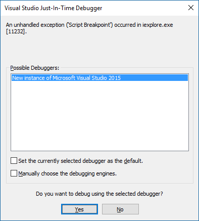

# Attach a debugger from the task pane

In Office 2016 for Windows, Build 77xx.xxxx or later, you can attach the debugger from the task pane. The attach debugger feature will directly attach the debugger to the correct Internet Explorer process for you. You can attach a debugger regardless of whether you are using Yeoman Generator, Visual Studio Code, node.js, Angular, or another tool. 

To launch the **Attach Debugger** tool, choose the top right corner of the task pane to activate the **Personality** menu (as shown in the red circle in the following image).   

 >  **Note**:  Currently the only supported debugger tool is [Visual Studio 2015](https://www.visualstudio.com/downloads/) with [Update 3](https://msdn.microsoft.com/en-us/library/mt752379.aspx) or later. If you don't have Visual Studio installed, selecting the **Attach Debugger** option doesn’t result in any action.   

Select **Attach Debugger**. This launches the **Visual Studio Just-in-Time Debugger** dialog box, as shown in the following image. 

In Visual Studio, you will see the code files in **Solution Explorer**.   You can set breakpoints to the line of code you want to debug in Visual Studio.

For more information about debugging in Visual Studio, see the following:

-	To launch and use the DOM Explorer in Visual Studio, see Tip 4 in the [Tips and Tricks](https://blogs.msdn.microsoft.com/officeapps/2013/04/16/building-great-looking-apps-for-office-using-the-new-project-templates/#tips_tricks) section of the [Building great-looking apps for Office using the new project templates](https://blogs.msdn.microsoft.com/officeapps/2013/04/16/building-great-looking-apps-for-office-using-the-new-project-templates) blog post.
-	To set breakpoints, see [Using Breakpoints](https://msdn.microsoft.com/en-US/library/5557y8b4.aspx).
-	To use F12, see [Using the F12 developer tools](https://msdn.microsoft.com/en-us/library/bg182326(v=vs.85).aspx).

## Additional resources

- [Create and debug Office Add-ins in Visual Studio](../../docs/get-started/create-and-debug-office-add-ins-in-visual-studio.md)
- [Create an Office Add-in using any editor](../../docs/get-started/create-an-office-add-in-using-any-editor.md)
- [Publish your Office Add-in](../publish/publish.md)
