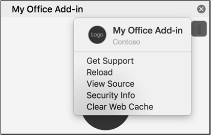

# Clear the Office cache

The Office cache stores resources and data used by Office Add-ins. By accessing stored resources, an add-in's performance is improved as it avoids redownloading these resources when needed.

You should clear the Office cache in the following scenarios.

- When you want to remove an add-in that you've previously sideloaded on Windows, Mac, or iOS.
- When you've updated the manifest (for example, to update the file names of icons or text of add-in commands). This ensures that you're using the latest version of the add-in.
  > [!TIP]
  > For add-ins that implement a task pane, if you only want the sideloaded add-in to reflect recent changes to its HTML or JavaScript source files, you shouldn't need to clear the cache. Instead, put focus in the add-in's task pane (by selecting anywhere within the task pane). Then, select <kbd>Ctrl</kbd>+<kbd>F5</kbd> to reload the add-in.
- When you want to resolve issues or errors when running the add-in.

> [!NOTE]
> To remove a sideloaded add-in from Excel, OneNote, PowerPoint, or Word on the web, see [Sideload Office Add-ins in Office on the web for testing: Remove a sideloaded add-in](sideload-office-add-ins-for-testing.md#remove-a-sideloaded-add-in).
>
> To remove a sideloaded add-in from Outlook on the web, see [Sideload Outlook add-ins for testing](../outlook/sideload-outlook-add-ins-for-testing.md#remove-a-sideloaded-add-in).

> [!CAUTION]
> When you clear the Office cache, clear it completely. Don't delete individual manifest files. This can cause all add-ins to stop loading.

## Types of caches

The Office cache can refer to either the web cache or the Wef cache.

- The **web cache** temporarily stores web-based resources and data used by an individual Office Add-in.
- The **Wef cache** locally stores resources and data for all installed Office Add-ins.

The following table outlines which Office cache types can be cleared on different platforms. It also provides links to instructions on how to clear a specific cache.

| Platform | Types of caches to clear | Options to clear the cache |
| ----- | ----- | ----- |
| Windows | Both the web and Wef caches. There's currently no option to clear one cache without clearing the other. | <ul><li>[Automatically clear the cache](#automatically-clear-the-cache)</li><li>[Manually clear the cache](#manually-clear-the-cache)</li><li>[Use the Microsoft Edge developer tools on Windows 10](#use-the-microsoft-edge-developer-tools-on-windows-10)</li></ul> |
| Mac | <ul><li>Web</li><li>Both web and Wef caches</li></ul> | <ul><li>**Web**: [Use the personality menu to clear the web cache](#clear-the-web-cache)</li><li>**Web and Wef**: [Clear the web and Wef caches on Mac](#clear-the-web-and-wef-caches)</li></ul> |
| iOS | <ul><li>Web</li></ul> | <ul><li>[Use JavaScript to clear the cache on iOS](#clear-the-office-cache-on-ios)</li></ul> |

## Clear the Office cache on Windows

Depending on your Office host and operating system, you can automatically or manually clear both the web and Wef caches on a Windows computer.

> [!IMPORTANT]
> On Windows, the automatic and manual options clear both the web and Wef caches. There's currently no option to clear one cache without clearing the other.

### Automatically clear the cache

> [!NOTE]
> The automatic option is only supported for Excel, PowerPoint, and Word. Outlook only supports the [manual option](#manually-clear-the-cache-in-outlook).

This method is recommended for add-in development computers. If your Office on Windows version is 2108 or later, the following steps configure the Office cache to be cleared the next time Office is reopened.

1. From the ribbon of Excel, PowerPoint, or Word, navigate to **File** > **Options** > **Trust Center** > **Trust Center Settings** > **Trusted Add-in Catalogs**.
1. Select the **Next time Office starts, clear all previously-started web add-ins cache** checkbox.
1. Select **OK**.
1. Restart Excel, PowerPoint, or Word.

### Manually clear the cache

#### Manually clear the cache in Excel, Word, and PowerPoint

To remove all sideloaded add-ins from Excel, Word, and PowerPoint, delete the contents of the following folder.

```
%LOCALAPPDATA%\Microsoft\Office\16.0\Wef\
```

If the following folder exists, delete its contents, too.

```
%userprofile%\AppData\Local\Packages\Microsoft.Win32WebViewHost_cw5n1h2txyewy\AC\#!123\INetCache\
```

#### Manually clear the cache in Outlook

Before clearing the cache in Outlook, first try removing the sideloaded add-in using the steps outlined in [Sideload Outlook add-ins for testing](../outlook/sideload-outlook-add-ins-for-testing.md#remove-a-sideloaded-add-in). If this option doesn't remove the add-in or resolve the issue with your add-in, clear the cache for your Outlook on Windows client.

##### Classic Outlook on Windows

To clear the cache in classic Outlook on Windows, perform the following actions.

1. Delete the contents of the `Wef` folder as noted for Excel, Word, and PowerPoint in [Manually clear the cache in Excel, Word, and PowerPoint](#manually-clear-the-cache-in-excel-word-and-powerpoint).

1. If your Outlook add-in uses the [unified manifest for Microsoft 365](../develop/json-manifest-overview.md), also delete the following folder.

    ```
    %userprofile%\AppData\Local\Microsoft\Outlook\HubAppFileCache
    ```

##### New Outlook on Windows

To clear the cache in [new Outlook on Windows](https://support.microsoft.com/office/656bb8d9-5a60-49b2-a98b-ba7822bc7627), perform the following steps.

1. Close the Outlook client if it's open.
1. From a command line, run the following:

    ```command&nbsp;line
    olk.exe --devtools
    ```

    This opens the new Outlook on Windows client and an instance of the Microsoft Edge DevTools.
1. In the Microsoft Edge DevTools window, select the **Network** tab.
1. Select and hold (or right-click) anywhere in the **Requests** table. Then, select **Clear browser cache**.

  :::image type="content" source="../images/devtools-clear-cache.png" alt-text="The 'Clear browser cache' option is selected in Microsoft Edge DevTools.":::

### Use the Microsoft Edge developer tools on Windows 10

To clear the Office cache on Windows 10 when the add-in is running in Microsoft Edge, use the Microsoft Edge DevTools.

> [!NOTE]
> To clear the Office cache using the following steps, your add-in must have a task pane. If your add-in is a UI-less add-in -- for example, one that uses the [on-send](../outlook/outlook-on-send-addins.md) feature -- you'll need to add a task pane to your add-in that uses the same domain for [SourceLocation](/javascript/api/manifest/sourcelocation), before you can use the following steps to clear the cache.

1. Install the [Microsoft Edge DevTools](https://apps.microsoft.com/detail/9mzbfrmz0mnj).

2. Open your add-in in the Office client.

3. Run the Microsoft Edge DevTools.

4. In the Microsoft Edge DevTools, open the **Local** tab. Your add-in will be listed by its name.

5. Select the add-in name to attach the debugger to your add-in. A new Microsoft Edge DevTools window will open when the debugger attaches to your add-in.

6. On the **Network** tab of the new window, select **Clear cache**.

    

7. If completing these steps doesn't produce the desired result, try selecting **Always refresh from server**.

    

## Clear the Office cache on Mac

You can choose to clear the web or both the web and Wef caches on Mac.

### Clear the web cache

Normally, the web cache is cleared by reloading the add-in. If more than one add-in exists in the same document, the process of automatically clearing the cache on reload might not be reliable.

To clear the web cache in Excel, PowerPoint, and Word, use the personality menu of any task pane add-in.

> [!NOTE]
>
> - The personality menu in task panes is only supported in Excel, PowerPoint, and Word. Because it isn't supported in Outlook, you must use the [option to clear both the web and Wef caches instead](#clear-the-web-and-wef-caches).
> - The personality menu is only shown in macOS Version 10.13.6 or later.

From the add-in's task pane, choose the personality menu. Then, choose **Clear Web Cache**.



### Clear the web and Wef caches

To clear both the web and Wef caches on Mac, delete the contents of the `~/Library/Containers/com.Microsoft.OsfWebHost/Data/` and `~/Library/Containers/com.microsoft.{host}/Data/Documents/wef` folders. Replace `{host}` with the Office application, such as `Excel`.

> [!TIP]
> Use the terminal or Finder to search for the specified folders. To look for these folders via Finder, you must set Finder to show hidden files. Finder displays the folders inside the **Containers** directory by product name, such as **Microsoft Excel** instead of **com.microsoft.Excel**.

Deleting the contents of the `~/Library/Containers/com.microsoft.{host}/Data/Documents/wef` folder removes all sideloaded add-ins from an application.

> [!NOTE]
> If the `~/Library/Containers/com.Microsoft.OsfWebHost/Data/` folder doesn't exist, check for the following folders via terminal or Finder. If found, delete the contents of each folder.
>
> - `~/Library/Containers/com.microsoft.{host}/Data/Library/Caches/` where `{host}` is the Office application (e.g., `Excel`)
> - `~/Library/Containers/com.microsoft.{host}/Data/Library/Application Support/Microsoft/Office/16.0/Wef/` where `{host}` is the Office application (e.g., `Excel`)
> - `~/Library/Containers/com.microsoft.Office365ServiceV2/Data/Caches/com.microsoft.Office365ServiceV2/`
> - `~/Library/Containers/com.microsoft.Office365ServiceV2/Data/Library/Caches/com.microsoft.Office365ServiceV2/`

## Clear the Office cache on iOS

To clear the web cache on iOS, call `window.location.reload(true)` from JavaScript in the add-in. This forces the add-in to reload. Alternatively, reinstall Office.

## See also

- [Troubleshoot development errors with Office Add-ins](troubleshoot-development-errors.md)
- [Debug add-ins using developer tools in Microsoft Edge](debug-add-ins-using-devtools-edge-chromium.md)
- [Debug your add-in with runtime logging](runtime-logging.md)
- [Sideload Office Add-ins for testing](sideload-office-add-ins-for-testing.md)
- [Office Add-ins manifest](../develop/add-in-manifests.md)
- [Validate an Office Add-in's manifest](troubleshoot-manifest.md)
- [Uninstall add-ins under development](uninstall-add-in.md)
