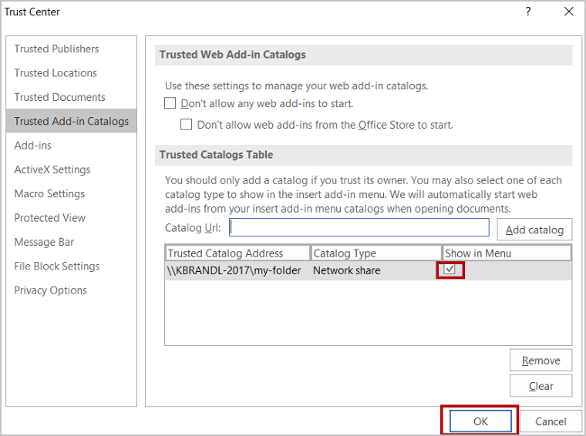

# Sideload Office Add-ins for testing

You can install an Office Add-in for testing in an Office client running on Windows by publishing the manifest to a network file share (instructions below).

> [!NOTE]
> If your add-in project was created with a sufficiently recent version of the [Yeoman generator for Office Add-ins](https://github.com/OfficeDev/generator-office), the add-in will automatically sideload in the Office desktop client when you run `npm start`.

This article applies only to testing Word, Excel, PowerPoint, and Project add-ins on Windows. If you want to test on another platform or want to test an Outlook add-in, see one of the following topics to sideload your add-in:

- [Sideload Office Add-ins in Office on the web for testing](sideload-office-add-ins-for-testing.md)
- [Sideload Office Add-ins on iPad and Mac for testing](sideload-an-office-add-in-on-ipad-and-mac.md)
- [Sideload Outlook add-ins for testing](../outlook/sideload-outlook-add-ins-for-testing.md)

The following video walks you through the process of sideloading your add-in in Office on the web or desktop using a shared folder catalog.  

> [!VIDEO https://www.youtube.com/embed/XXsAw2UUiQo]

## Share a folder

1. In File Explorer on the Windows computer where you want to host your add-in, go to the parent folder, or drive letter, of the folder you want to use as your shared folder catalog.

2. Open the context menu for the folder you want to use as your shared folder catalog (right-click the folder) and choose **Properties**.

3. Within the **Properties** dialog window, open the **Sharing** tab and then choose the **Share** button.

    

4. Within the **Network access** dialog window, add yourself and any other users and/or groups with whom you want to share your add-in. You will need at least **Read/Write** permission to the folder. After you have finished choosing people to share with, choose the **Share** button.

5. When you see confirmation that **Your folder is shared**, make note of the full network path that's displayed immediately following the folder name. (You will need to enter this value as the **Catalog Url** when you [specify the shared folder as a trusted catalog](#specify-the-shared-folder-as-a-trusted-catalog), as described in the next section of this article.) Choose the **Done** button to close the **Network access** dialog window.

   

6. Choose the **Close** button to close the **Properties** dialog window.

## Specify the shared folder as a trusted catalog

### Configure the trust manually

1. Open a new document in Excel, Word, PowerPoint, or Project.

2. Choose the **File** tab, and then choose **Options**.

3. Choose **Trust Center**, and then choose the **Trust Center Settings** button.

4. Choose **Trusted Add-in Catalogs**.

5. In the **Catalog Url** box, enter the full network path to the folder that you [shared](#share-a-folder) previously. If you failed to note the folder's full network path when you shared the folder, you can get it from the folder's **Properties** dialog window, as shown in the following screenshot.

    

6. After you've entered the full network path of the folder into the **Catalog Url** box, choose the **Add catalog** button.

7. Select the **Show in Menu** check box for the newly-added item, and then choose the **OK** button to close the **Trust Center** dialog window. 

    

8. Choose the **OK** button to close the **Word Options** dialog window.

9. Close and reopen the Office application so your changes will take effect.

### Configure the trust with a Registry script

1. In a text editor, create a file named TrustNetworkShareCatalog.reg.

2. Add the following content to the file:

    ```
    Windows Registry Editor Version 5.00

    [HKEY_CURRENT_USER\Software\Microsoft\Office\16.0\WEF\TrustedCatalogs\{-random-GUID-here-}]
    "Id"="{-random-GUID-here-}"
    "Url"="\\\\-share-\\-folder-"
    "Flags"=dword:00000001
    ```
3. Use one of the many online GUID generation tools, such as [GUID Generator](https://guidgenerator.com/), to generate a random GUID, and within the TrustNetworkShareCatalog.reg file, replace the string "-random-GUID-here-" *in both places* with the GUID. (The enclosing `{}` symbols should remain.)

4. Replace the `Url` value with the full network path to the folder that you [shared](#share-a-folder) previously. (Note that any `\` characters in the URL must be doubled.) If you failed to note the folder's full network path when you shared the folder, you can get it from the folder's **Properties** dialog window, as shown in the following screenshot.

    

5. The file should now look like the following. Save it.

    ```
    Windows Registry Editor Version 5.00

    [HKEY_CURRENT_USER\Software\Microsoft\Office\16.0\WEF\TrustedCatalogs\{01234567-89ab-cedf-0123-456789abcedf}]
    "Id"="{01234567-89ab-cedf-0123-456789abcedf}"
    "Url"="\\\\TestServer\\OfficeAddinManifests"
    "Flags"=dword:00000001
    ```

6. Close *all* Office applications.

7. Run the TrustNetworkShareCatalog.reg just as you would any executable, such as double-clicking it.

## Sideload your add-in

1. Put the manifest XML file of any add-in that you are testing in the shared folder catalog. Note that you deploy the web application itself to a web server. Be sure to specify the URL in the **SourceLocation** element of the manifest file.

    > [!IMPORTANT]
    > [!include[HTTPS guidance](../includes/https-guidance.md)]

2. In Excel, Word, or PowerPoint, select **My Add-ins** on the **Insert** tab of the ribbon. In Project, select **My Add-ins** on the **Project** tab of the ribbon.

3. Choose **SHARED FOLDER** at the top of the **Office Add-ins** dialog box.

4. Select the name of the add-in and choose **Add** to insert the add-in.

## Remove a sideloaded add-in

You can remove a previously sideloaded add-in by clearing the Office cache on your computer. Details on how to clear the cache on Windows can be found in the article [Clear the Office cache](clear-cache.md#clear-the-office-cache-on-windows).

## See also

- [Validate an Office Add-in's manifest](troubleshoot-manifest.md)
- [Clear the Office cache](clear-cache.md)
- [Publish your Office Add-in](../publish/publish.md)