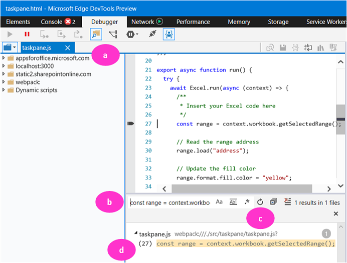

# Debug add-ins using developer tools in Microsoft Edge Legacy

This article shows how to debug the client-side code (JavaScript or TypeScript) of your add-in when the following conditions are met.

- You cannot, or don't wish to, debug using tools built into your IDE; or you are encountering a problem that only occurs when the add-in is run outside the IDE.
- Your computer is using a combination of Windows and Office versions that use the original Edge webview control, EdgeHTML.

To determine which browser you're using, see [Browsers used by Office Add-ins](../concepts/browsers-used-by-office-web-add-ins.md). 

> [!TIP]
> [!INCLUDE[Identify the webview through the add-in UI](../includes/identify-webview-in-ui.md)]

> [!NOTE]
> To install a version of Office that uses the Edge legacy webview, see [Install a version of Office that uses Microsoft Edge Legacy](#install-a-version-of-office-that-uses-microsoft-edge-legacy).

## Debug a task pane add-in using Microsoft Edge DevTools Preview

1. Install the [Microsoft Edge DevTools Preview](https://www.microsoft.com/p/microsoft-edge-devtools-preview/9mzbfrmz0mnj?activetab=pivot%3Aoverviewtab). (The word "Preview" is in the name for historical reasons. There isn't a more recent version.)

   > [!NOTE]
   > If your add-in has an [add-in command](../design/add-in-commands.md) that executes a function, the function runs in a hidden browser process that the Microsoft Edge DevTools cannot detect or attach to, so the technique described in this article cannot be used to debug code in the function.

1. [Sideload](create-a-network-shared-folder-catalog-for-task-pane-and-content-add-ins.md) and run the add-in.
1. Run the Microsoft Edge DevTools.
1. In the tools, open the **Local** tab. Your add-in will be listed by its name. (Only processes that are running in EdgeHTML appear on the tab. The tool cannot attach to processes that are running in other browsers or webviews, including Microsoft Edge (WebView2) and Internet Explorer (Trident).)

   

5. Select the add-in name to open it in the tools.
6. Open the **Debugger** tab.
7. Open the file that you want to debug with the following steps.

   <ol type="a">
      <li>On the debugger task bar, select <b>Show find in files</b>. This will open a search window.</li>
      <li>Enter a line of code from the file you want to debug in the search box. It should be something that's not likely to be in any other file.</li>
      <li>Select the refresh button.</li>
      <li>In the search results, select the line to open the code file in the pane above the search results.</li>
   </ol>

   

8. To set a breakpoint, select the line in the code file. The breakpoint is registered in the **Call stack** (bottom right) pane. There may also be a red dot by the line in the code file, but this doesn't appear reliably.
9. Execute functions in the add-in as needed to trigger the breakpoint.

> [!TIP]
> For more information about using the tools, see [Microsoft Edge (EdgeHTML) Developer Tools](/archive/microsoft-edge/legacy/developer/devtools-guide/).

## Debug a dialog in an add-in

If your add-in uses the Office Dialog API, the dialog runs in a separate process from the task pane (if any) and the tools must attach to that process. Run the add-in and the tools. Open the dialog and then select the **Refresh** button in the tools. The dialog process is shown. Its name comes from the `<title>` element in the HTML file that is open in the dialog. Select the process to open it and debug just as described in the section [Debug a task pane add-in using Microsoft Edge DevTools Preview](#debug-a-task-pane-add-in-using-microsoft-edge-devtools-preview).

   

## Install a version of Office that uses Microsoft Edge Legacy

[!INCLUDE [Steps to install Office that uses Edge Legacy or Internet Explorer](../includes/install-office-that-uses-legacy-edge-or-ie.md)]