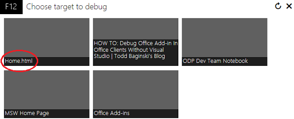
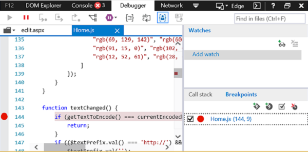
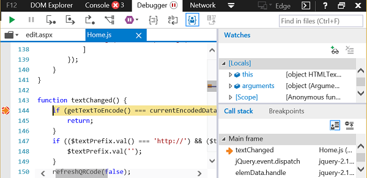

# Debug add-ins using F12 developer tools on Windows 10

The F12 developer tools included in Windows 10 help you debug, test, and speed up your webpages. You can also use them to develop and debug Office Add-ins, if you are not using an IDE like Visual Studio, or if you need to investigate a problem while running your add-in outside the IDE. This article describes how to use the Debugger tool from the F12 developer tools in Windows 10 to test your Office Add-in.

> [!NOTE]
> The instructions in this article cannot be used to debug an Outlook add-in that uses Execute Functions. To debug an Outlook add-in that uses Execute Functions, we recommend that you attach to Visual Studio in script mode or to some other script debugger.

## Prerequisites

You need the following software:

- The F12 developer tools, which are included in Windows 10. 
    
- The Office client application that hosts your add-in. 
    
- Your add-in. 

## Using the Debugger

You can use the Debugger from the F12 developer tools in Windows 10 to test add-ins from AppSource or add-ins that you have added from other locations. You can start the F12 developer tools after your add-in is running. The F12 tools display in a separate window and do not use Visual Studio.

> [!NOTE]
> The Debugger is part of the F12 developer tools in Windows 10 and Internet Explorer. Earlier versions of Windows do not include the Debugger. 

This example uses Word and a free add-in from AppSource.

1. Open Word and choose a blank document. 
    
2. On the **Insert** tab, in the Add-ins group, choose **Store** and select the **QR4Office** Add-in. (You can load any add-in from the Store or your add-in catalog.)
    
3. Launch the F12 development tools that corresponds to your version of Office:
    
   - For the 32-bit version of Office, use C:\Windows\System32\F12\IEChooser.exe
    
   - For the 64-bit version of Office, use C:\Windows\SysWOW64\F12\IEChooser.exe
    
   When you launch IEChooser, a separate window named "Choose target to debug" displays the possible applications to debug. Select the application that you are interested in. If you are writing your own add-in, select the website where you have the add-in deployed, which might be a localhost URL. 
    
   For example, select **home.html**. 
    
   

4. In the F12 window, select the file you want to debug.
    
   To select the file in the F12 window, choose the folder icon above the **script** (left) pane. From the list of available files shown in the dropdown list, select **Home.js**.
    
5. Set the breakpoint.
    
   To set the breakpoint in **Home.js**, choose line 144, which is in the  `textChanged` function. You will see a red dot to the left of the line and a corresponding line in the **Callstack and Breakpoints** (bottom right) pane. For other ways to set a breakpoint, see [Inspect running JavaScript with the Debugger](https://docs.microsoft.com/previous-versions/windows/internet-explorer/ie-developer/samples/dn255007(v=vs.85)). 
    
   

6. Run your add-in to trigger the breakpoint.
    
   In Word, choose the URL textbox in the upper part of the **QR4Office** pane and attempt to enter some text. In the Debugger, in the **Callstack and Breakpoints** pane, you'll see that the breakpoint has triggered and shows various information. You might need to refresh the debugger tool to see the results.
    
   

## See also

- [Inspect running JavaScript with the Debugger](https://docs.microsoft.com/previous-versions/windows/internet-explorer/ie-developer/samples/dn255007(v=vs.85))
- [Using the F12 developer tools](https://docs.microsoft.com/previous-versions/windows/internet-explorer/ie-developer/samples/bg182326(v=vs.85))
