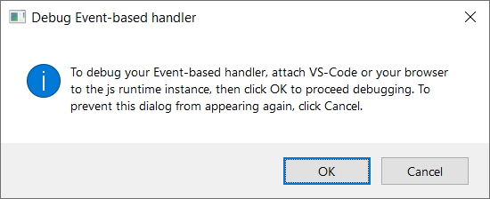
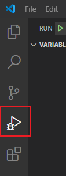
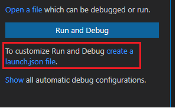
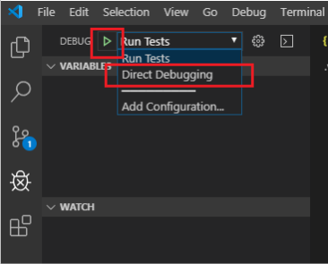

---
title: Debug event-based or spam-reporting add-ins
description: Learn how to debug your Office Add-ins that implement event-based activation or integrated spam reporting.
ms.date: 07/15/2025
ms.topic: how-to
ms.localizationpriority: medium
---

# Debug event-based or spam-reporting add-ins

This article discusses the key debugging stages to enable and set breakpoints in your code as you implement [event-based activation](../develop/event-based-activation.md) or [integrated spam reporting](../outlook/spam-reporting.md) in your add-in. Before you proceed, we recommend reviewing the [troubleshooting guide](troubleshoot-event-based-and-spam-reporting-add-ins.md) for additional steps on how to resolve development errors.

To begin debugging, select the tab for your applicable client.

# [Web](#tab/web)

Use your preferred browser's developer tools to debug your event-based add-in in Office on the web. For more information, see [Debug add-ins in Office on the web](debug-add-ins-in-office-online.md).

# [Windows (new)](#tab/new-windows)

To debug your add-in in [new Outlook on Windows desktop client](https://support.microsoft.com/office/656bb8d9-5a60-49b2-a98b-ba7822bc7627), run the following command to open Microsoft Edge DevTools.

```command&nbsp;line
olk.exe --devtools
```

For more information, see the "Debug your add-in" section of [Develop Outlook add-ins for the new Outlook on Windows](../outlook/one-outlook.md#debug-your-add-in).

# [Windows (classic)](#tab/windows)

If you used the [Yeoman generator for Office Add-ins](../develop/yeoman-generator-overview.md) to create your add-in project (for example, by completing an [event-based activation walkthrough](../outlook/on-new-compose-events-walkthrough.md)), follow the **Created with Yeoman generator** option throughout this article. Otherwise, follow the **Other** steps.

## Mark your add-in for debugging and set the debugger port

1. Get your add-in's ID from the manifest.

    - **Add-in only manifest**: Use the value of the `<Id>` element child of the root `<OfficeApp>` element.
    - **Unified manifest for Microsoft 365**: Use the value of the `"id"` property of the root anonymous `{ ... }` object.

1. In the registry, mark your add-in for debugging.

    - **Created with Yeoman generator**: In a command line window, navigate to the root of your add-in folder then run the following command.

        ```command&nbsp;line
        npm start
        ```

        In addition to building the code and starting the local server, this command sets the data of the `HKEY_CURRENT_USER\SOFTWARE\Microsoft\Office\16.0\WEF\Developer\[Add-in ID]\UseDirectDebugger` registry DWORD value for this add-in to `1`. `[Add-in ID]` is your add-in's ID from the manifest.

    - **Other**: In the `HKEY_CURRENT_USER\SOFTWARE\Microsoft\Office\16.0\WEF\Developer\[Add-in ID]\UseDirectDebugger` registry DWORD value, where `[Add-in ID]` is your add-in's ID from the manifest, set its data to `1`.

        [!include[Developer registry key](../includes/developer-registry-key.md)]

1. In the registry key `HKEY_CURRENT_USER\SOFTWARE\Microsoft\Office\16.0\WEF\Developer\[Add-in ID]`, where `[Add-in ID]` is your add-in's ID from the manifest, create a new `DWORD` value with the following configuration.

    - **Value name**: `DebuggerPort`
    - **Value data (hexadecimal)**: `00002407`

   This sets the debugger port to `9223`.

1. Start your Office application or restart it if it's already open.
1. Perform the action to initiate the event you're developing for, such as creating a new message to initiate the `OnNewMessageCompose` event or reporting spam messages. The **Debug Event-based handler** dialog should appear. Do *not* interact with the dialog yet.

    

## Configure and attach the debugger

You can debug your add-in using the Microsoft Edge Inspect tool or Visual Studio Code.

### Debug with Microsoft Edge

1. Open Microsoft Edge and go to **edge://inspect/#devices**.
1. In the **Remote Target** section, look for your add-in using its ID from the manifest. Then, select **Inspect**.

    The DevTools window appears.

    > [!NOTE]
    > It may take some time for your add-in to appear in the **Remote Target** section. You may need to refresh the page for the add-in to appear.

1. In the **Sources** tab, go to **file://** > **Users/[User]/AppData/Local/Microsoft/Office/16.0/Wef/{[Office profile GUID]}/[Office account encoding]/Javascript/[Add-in ID]\_[Add-in Version]_[locale]** > **bundle.js**. For readability, this article refers to the file name as **bundle.js**, but exact name depends on the Office application.
    - Excel: **bundle_excel.js**
    - Outlook: **bundle.js**
    - PowerPoint: **bundle_powerpoint.js**
    - Word: **bundle_word.js**

    > [!TIP]
    > There's no direct method to determine the Office profile GUID or mail account encoding used in the **bundle.js** file path. If you're debugging multiple add-ins simultaneously, the easiest way to access an add-in's **bundle.js** file from the DevTools window is to locate the add-in's ID in the file path.

1. In the **bundle.js** file, place breakpoints where you want the debugger to stop.
1. [Run the debugger](#run-the-debugger).

### Debug with Visual Studio Code

To debug your add-in in Visual Studio Code, you must have at least version 1.56.1 installed.

#### Configure the debugger

Configure the debugger in Visual Studio Code. Follow the steps applicable to your add-in project.

##### Created with Yeoman generator

1. In the command line, run the following to open your add-in project in Visual Studio Code.

    ```command&nbsp;line
    code .
    ```

1. In Visual Studio Code, open the **./.vscode/launch.json** file and add the following excerpt to your list of configurations. Save your changes.

    ```json
    {
      "name": "Direct Debugging",
      "type": "node",
      "request": "attach",
      "port": 9223,
      "timeout": 600000,
      "trace": true
    }
    ```

##### Other

1. Create a new folder called **Debugging** (perhaps in your **Desktop** folder).
1. Open Visual Studio Code.
1. Go to **File** > **Open Folder**, navigate to the folder you created, then choose **Select Folder**.
1. On the Activity Bar, select **Run and Debug** (<kbd>Ctrl</kbd>+<kbd>Shift</kbd>+<kbd>D</kbd>).

    

1. Select the **create a launch.json file** link.

    

1. In the **Select Environment** dropdown, select **Edge: Launch** to create a launch.json file.
1. Add the following excerpt to your list of configurations. Save your changes.

    ```json
    {
      "name": "Direct Debugging",
      "type": "node",
      "request": "attach",
      "port": 9223,
      "timeout": 600000,
      "trace": true
    }
    ```

#### Attach the debugger

The **bundle.js** file of an add-in contains the JavaScript code of your add-in. It's created when an Office on Windows application is opened. When Office starts, the **bundle.js** file of each installed add-in is cached in the **Wef** folder of your machine.

1. To find the add-in's **bundle.js** file, navigate to the following folder in File Explorer. The text enclosed in `[]` represents your applicable Office and add-in information.

    ```text
    %LOCALAPPDATA%\Microsoft\Office\16.0\Wef\{[Office profile GUID]}\[Office account encoding]\Javascript\[Add-in ID]_[Add-in Version]_[locale]
    ```

    [!INCLUDE [office-bundle-js](../includes/office-bundle-js.md)]

1. Open **bundle.js** in Visual Studio Code.
1. Place breakpoints in **bundle.js** where you want the debugger to stop.
1. In the **DEBUG** dropdown, select **Direct Debugging**, then select the **Start Debugging** icon.

    

## Run the debugger

After confirming that the debugger is attached, return to the Office application. In the **Debug Event-based handler** dialog, select **OK**.

You can now reach your breakpoints to debug your event-based activation or spam-reporting code.

> [!IMPORTANT]
> Starting in Version 2403 (Build 17425.20000), event-based and spam-reporting add-ins use the [V8 JavaScript engine](https://v8.dev/) to run JavaScript, regardless of whether debugging is turned on or off. In earlier versions, the Chakra JavaScript engine is used when debugging is off, but the V8 engine may be used when debugging is turned on.

## Stop the debugger

To stop debugging the rest of the current Office on Windows session, in the **Debug Event-based handler** dialog, choose **Cancel**. To re-enable debugging, restart the Office application.

To prevent the **Debug Event-based handler** dialog from popping up and stop debugging for subsequent sessions, delete the associated registry key, `HKEY_CURRENT_USER\SOFTWARE\Microsoft\Office\16.0\WEF\Developer\[Add-in ID]\UseDirectDebugger`, or set its value to `0`.

## Stop the local server

[!include[Instructions to stop web server and uninstall dev add-in](../includes/stop-uninstall-outlook-dev-add-in.md)]

# [Mac](#tab/mac)

Event-based add-ins that run in Office on Mac use the browser runtime. Because of this, you can debug your add-in using Safari Web Inspector.

1. To use the Safari Web Inspector in Office, follow the steps in [Debugging with Safari Web Inspector on a Mac](debug-office-add-ins-on-ipad-and-mac.md#debugging-with-safari-web-inspector-on-a-mac).
1. Open Office, then [sideload your add-in](../testing/test-debug-office-add-ins.md#sideload-an-office-add-in-for-testing).
1. Perform an action that will initiate the event your add-in handles. For example, create a new message to initiate the `OnNewMessageCompose` event. This opens an empty Developer Window. The name of your add-in appears in the title bar of the window.
1. Right-click (or select and hold) anywhere in the Developer Window, then select **Inspect Element**. This opens the Inspector, where you can set breakpoints and debug your add-in.

---

## See also

- [Activate add-ins with events](../develop/event-based-activation.md)
- [Implement an integrated spam-reporting add-in](../outlook/spam-reporting.md)
- [Troubleshoot event-based and spam-reporting add-ins](troubleshoot-event-based-and-spam-reporting-add-ins.md)
- [Debug your add-in with runtime logging](runtime-logging.md)
