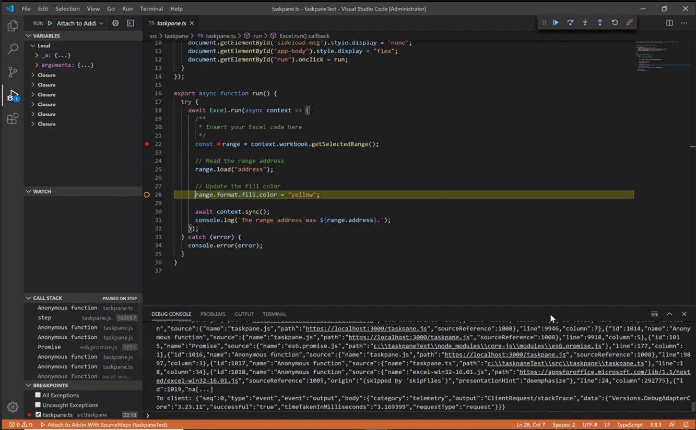
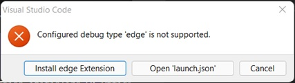
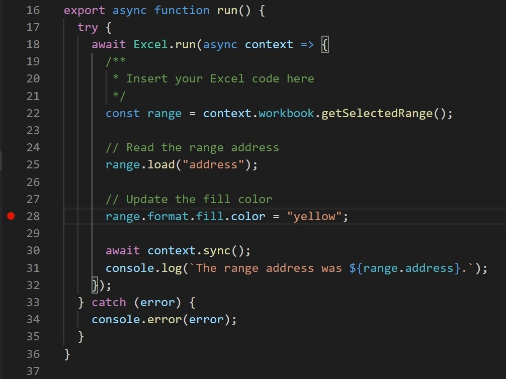

# Debug add-ins on Windows using Visual Studio Code and Microsoft Edge WebView2 (Chromium-based)

Office Add-ins running on Windows can debug against the Edge Chromium WebView2 runtime directly in Visual Studio Code.

> [!IMPORTANT]
> This article only applies when Office runs add-ins in the Microsoft Edge Chromium WebView2 runtime, as explained in [Browsers used by Office Add-ins](../concepts/browsers-used-by-office-web-add-ins.md). For instructions about debugging in Visual Studio Code against Microsoft Edge Legacy with the original WebView (EdgeHTML) runtime, see [Office Add-in Debugger Extension for Visual Studio Code](debug-with-vs-extension.md).

> [!TIP]
> If you cannot, or don't wish to, debug using tools built into Visual Studio Code; or you are encountering a problem that only occurs when the add-in is run outside Visual Studio Code, you can debug Edge Chromium WebView2 runtime by using the Edge (Chromium-based) developer tools as described in [Debug add-ins using developer tools for Microsoft Edge WebView2](debug-add-ins-using-devtools-edge-chromium.md).

This debugging mode is dynamic, allowing you to set breakpoints while code is running. See changes in your code immediately while the debugger is attached, all without losing your debugging session. Your code changes also persist, so you see the results of multiple changes to your code. The following image shows this extension in action.



## Prerequisites

- [Visual Studio Code](https://code.visualstudio.com/)
- [Node.js (version 10+)](https://nodejs.org/)
- Windows 10, 11
- A combination of platform and Office application that supports Microsoft Edge with WebView2 (Chromium-based) as explained in [Browsers used by Office Add-ins](../concepts/browsers-used-by-office-web-add-ins.md). If your version of Microsoft 365 is earlier than 2101, you will need to install WebView2. Use the instructions for installing it at [Microsoft Edge WebView2 / Embed web content ... with Microsoft Edge WebView2](https://developer.microsoft.com/microsoft-edge/webview2/).

## Use the Visual Studio Code debugger

These instructions assume you have experience using the command line, understand basic JavaScript, and have created an Office Add-in project before using the [Yeoman generator for Office Add-ins](../develop/yeoman-generator-overview.md). If you haven't done this before, consider visiting one of our tutorials, such as the [Excel Office Add-in tutorial](../tutorials/excel-tutorial.md).

1. The first step depends on the project and how it was created.

   - If you want to create a project to experiment with debugging in Visual Studio Code, use the [Yeoman generator for Office Add-ins](../develop/yeoman-generator-overview.md). Use any one of our quick start guides, such as the [Outlook add-in quick start](../quickstarts/outlook-quickstart.md), in order to do this.
   - If you want to debug an existing project that was created with Yo Office, skip to the next step.
   - If you want to debug an existing project that was not created with Yo Office, complete the procedure in the [Appendix A](#appendix-a) and then return to the next step of this procedure.

1. Open VS Code and open your project in it. 

1. Choose  **View > Run** or enter **Ctrl+Shift+D** to switch to debug view.

1. From the **RUN AND DEBUG** options, choose the Edge Chromium option for your host application, such as **Outlook Desktop (Edge Chromium)**. Select **F5** or choose **Run > Start Debugging** from the menu to begin debugging. This action automatically launches a local server in a Node window to host your add-in and then automatically opens the host application, such as Excel or Word. This may take several seconds.

   > [!TIP]
   > If you aren't using a project created with Yo Office, you may be prompted to adjust a registry key. While in the root folder of your project, run the following in the command line.
   >
   > ``` command&nbsp;line
   > npx office-addin-debugging start <your manifest path>
   > ```

   > [!IMPORTANT]
   > If your project was created with older versions of Yo Office, you may see the following error dialog box about 10 - 30 seconds after you start debugging (at which point you may have already gone on to another step in this procedure) and it may be hidden behind the dialog box described in the next step.
   >
   > 
   >
   > Complete the tasks in [Appendix B](#appendix-b) and then restart this procedure.
   
1. In the host application, your add-in is now ready to use. Select **Show Taskpane** or run any other add-in command. A dialog box will appear with text similar to the following:

   > WebView Stop On Load.
   > To debug the webview, attach VS Code to the webview instance using the Microsoft Debugger for Edge extension, and click OK to continue. To prevent this dialog from appearing in the future, click Cancel.

   Select **OK**.

   [!INCLUDE [Cancelling the WebView Stop On Load dialog box](../includes/webview-stop-on-load-cancel-dialog.md)]

1. You're now able to set breakpoints in your project's code and debug. To set breakpoints in Visual Studio Code, hover next to a line of code and select the red circle that appears.

    

1. Run functionality in your add-in that calls the lines with breakpoints. You'll see that breakpoints have been hit and you can inspect local variables.

   > [!NOTE]
   > Breakpoints in calls of `Office.initialize` or `Office.onReady` are ignored. For details about these functions, see [Initialize your Office Add-in](../develop/initialize-add-in.md).

> [!IMPORTANT]
> The best way to stop a debugging session is to select **Shift+F5** or choose **Run > Stop Debugging** from the menu. This action should close the Node server window and attempt to close the host application, but there will be a prompt on the host application asking you whether to save the document or not. Make an appropriate choice and let the host application close. Avoid manually closing the Node window or host application. Doing so can cause bugs especially when you are stopping and starting debugging sessions repeatedly.
>
> If debugging stops working; for example, if breakpoints are being ignored; stop debugging. Then, if necessary, close all host application windows and the Node window. Finally, close Visual Studio Code and reopen it.

### Appendix A

If your project was not created with Yo Office, you need to create a debug configuration for Visual Studio Code. 

1. Create a file named `launch.json` in the `\.vscode` folder of the project if there isn't one there already. 
1. Ensure that the file has a `configurations` array. The following is a simple example of a `launch.json`.

   ```json
   {
     // other properities may be here.
   
     "configurations": [
   
       // configuration objects may be here.
   
     ]
   
     //other properies may be here.
   }
   ```

1. Add the following object to the `configurations` array.

   ```json
   {
      "name": "$HOST$ Desktop (Edge Chromium)",
      "type": "pwa-msedge",
      "request": "attach",
      "useWebView": true,
      "port": 9229,
      "timeout": 600000,
      "webRoot": "${workspaceRoot}",
      "preLaunchTask": "Debug: Excel Desktop",
      "postDebugTask": "Stop Debug"
   },
   ```

1. Replace the placeholder `$HOST$` with the name of the Office application that the add-in runs in; for example, `Outlook` or `Word`.
1. Save and close the file.

### Appendix B

1. In the error dialog box, select the **Cancel** button.
1. If debugging doesn't stop automatically, select **Shift+F5** or choose **Run > Stop Debugging** from the menu. 
1. Close the Node window where the local server is running, if it doesn't close automatically.
1. Close the Office application if it doesn't close automatically.
1. Open the `\.vscode\launch.json` file in the project. 
1. In the `configurations` array, there are several configuration objects. Find the one whose name has the pattern `$HOST$ Desktop (Edge Chromium)`, where $HOST$ is an Office application that your add-in runs in; for example, `Outlook Desktop (Edge Chromium)` or `Word Desktop (Edge Chromium)`. 
1. Change the value of the `"type"` property from `"edge"` to `"pwa-msedge"`.
1. Change the value of the `"useWebView"` property from the string `"advanced"` to the boolean `true` (note there are no quotation marks around the `true`).
1. Save the file.
1. Close VS Code.

## See also

- [Test and debug Office Add-ins](test-debug-office-add-ins.md)
- [Debug add-ins on Windows using Visual Studio Code and Microsoft Edge legacy WebView (EdgeHTML)](debug-with-vs-extension.md)
- [Debug add-ins using developer tools for Internet Explorer](debug-add-ins-using-f12-tools-ie.md)
- [Debug add-ins using developer tools for Edge Legacy](debug-add-ins-using-devtools-edge-legacy.md)
- [Debug add-ins using developer tools in Microsoft Edge (Chromium-based)](debug-add-ins-using-devtools-edge-chromium.md)
- [Attach a debugger from the task pane](attach-debugger-from-task-pane.md)
- [Runtimes in Office Add-ins](runtimes.md)
