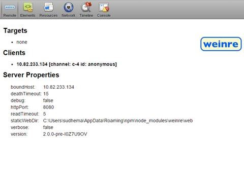

# Debug Office Add-ins on iPad and Mac

You can use Visual Studio to develop and debug add-ins on Windows, but you can't use it to debug add-ins on the iPad or Mac. Because add-ins are developed using HTML and Javascript, they are designed to work across platforms, but there might be subtle differences in how different browsers render the HTML. This article describes how to debug add-ins running on an iPad or Mac. 

 >**Note**  We recommend that you continue using Visual Studio to debug add-ins on Windows.

## Debugging with Weinre

Weinre is a debugger for web pages, similar to the F12 tools, that is designed to work remotely and allows you to debug web pages on a mobile device. For more information, see the [Weinre website](http://people.apache.org/~pmuellr/weinre-docs/latest/).

 >**Note**  You can use remote debugging on your iPad or Mac. 

### To use Weinre to debug your add-in

1. Install the latest version of Node.js from [https://nodejs.org/](https://nodejs.org/) on your Windows or Mac computer. Because Weinre is built on Node.js, you need to install Node.js first.
    
2. Install Weinre using this npm command:  `npm -g install weinre`
    
    When installing on a Mac, you might have to use:  `sudo npm -g install weinre`
    
    If the above command fails, install directly from a URL: `npm -g install http://people.apache.org/~pmuellr/weinre/builds/2.0.0-pre-I0Z7U9OV/apache-cordova-weinre-2.0.0-pre-I0Z7U9OV-bin.tar.gz`
    
3. To ensure that IIS, Apache, or the web server of your choice is running on your computer, verify that  `http://localhost` returns a valid page.
    
4. Start Weinre:  `weinre --httpPort 8080 --boundHost <ipaddr>`, where  _ _&lt;ipaddr&gt;__ is your PC's or Mac's IP address.

   Navigate to  `http://<ipaddr>:8080` to access the Weinre server home page.
 
  
 
 Navigate to  `http://<ipaddr>:8080/client` to get the list of clients connected to this server.

  

### To start debugging

1. Include the following in the  `<head>` tag of your add-in's web page to reference the Weinre target code.

  ```HTML
  <script src="http://<ipaddr>:8080/target/target-script-min.js#anonymous"></script>
  ```

2. Launch your add-in on the iPad or Mac.

  

3. Debug your add-in using your favorite browser's F12 developer tools.

  

## Additional resources

- [Sideload an Office Add-in on iPad and Mac](../testing/sideload-an-office-add-in-on-ipad-and-mac.md)
    
