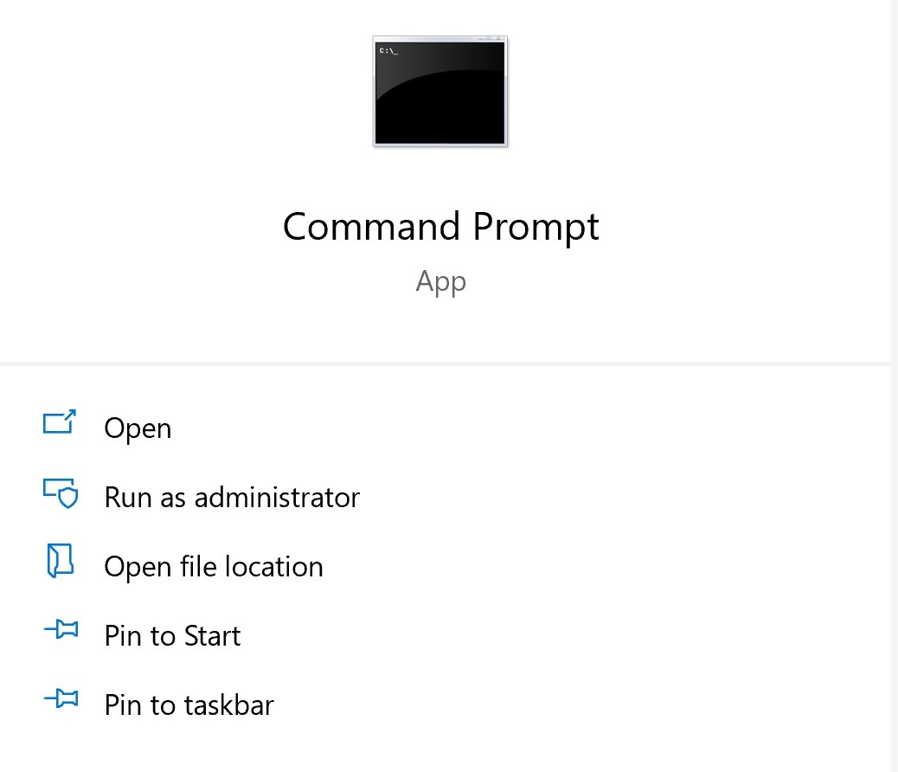

# Microsoft Office Add-in Debugger Extension for Visual Studio Code

The Microsoft Office Add-in Debugger Extension for Visual Studio Code allows you to debug your Office Add-in against the Microsoft Edge with the original webView (EdgeHTML) runtime. For instructions about debugging against Microsoft Edge WebView2 (Chromium-based), [see this article](./debug-desktop-using-edge-chromium.md)

This debugging mode is dynamic, allowing you to set breakpoints while code is running. You can see changes in your code immediately while the debugger is attached, all without losing your debugging session. Your code changes also persist, so you can see the results of multiple changes to your code. The following image shows this extension in action.


## Prerequisites

- [Visual Studio Code](https://code.visualstudio.com/) (must be run as an administrator)
- [Node.js (version 10+)](https://nodejs.org/)
- Windows 10
- [Microsoft Edge](https://www.microsoft.com/edge)

These instructions assume you have experience using the command line, understand basic JavaScript, and have created an Office Add-in project before using the Yo Office generator. If you haven't done this before, consider visiting one of our tutorials, like this [Excel Office Add-in tutorial](../tutorials/excel-tutorial.md).

## Install and use the debugger

1. If you need to create an add-in project, [use the Yo Office generator to create one](../quickstarts/excel-quickstart-jquery.md?tabs=yeomangenerator). Follow the prompts within the command line to set up your project. You can choose any language or type of project to suit your needs.

    > [!NOTE]
    > If you already have a project, skip step 1 and move to step 2.

1. Open a command prompt as administrator.
   

1. Navigate to your project directory.

1. Run the following command to open your project in Visual Studio Code as an administrator.

    ```command&nbsp;line
    code .
    ```

  Once Visual Studio Code is open, navigate manually to the project folder.

  > [!TIP]
  > To open Visual Studio Code as an administrator, select the **run as administrator** option when opening Visual Studio Code after searching for it in Windows.

1. Within VS Code, select **CTRL + SHIFT + X** to open the Extensions bar. Search for the "Microsoft Office Add-in Debugger" extension and install it.

1. In the .vscode folder of your project, open the **launch.json** file. Add the following code to the `configurations` section.

    ```JSON
    {
      "type": "office-addin",
      "request": "attach",
      "name": "Attach to Office Add-ins",
      "port": 9222,
      "trace": "verbose",
      "url": "https://localhost:3000/taskpane.html?_host_Info=HOST$Win32$16.01$en-US$$$$0",
      "webRoot": "${workspaceFolder}",
      "timeout": 45000
    }
    ```

1. In the section of JSON you just copied, find the "url" section. In this URL, you will need to replace the uppercase HOST text with the application that is hosting your Office Add-in. For example, if your Office Add-in is for Excel, your URL value would be "https://localhost:3000/taskpane.html?_host_Info=<strong>Excel</strong>$Win32$16.01$en-US$\$\$\$0".

1. Open the command prompt and ensure you are at the root folder of your project. Run the command `npm start` to start the dev server. When your add-in loads in the Office client, open the task pane.

1. Return to Visual Studio Code and choose **View > Debug** or enter **CTRL + SHIFT + D** to switch to debug view.

1. From the Debug options, choose **Attach to Office Add-ins**. Select **F5** or choose **Debug -> Start Debugging** from the menu to begin debugging.

1. Set a breakpoint in your project's task pane file. You can set breakpoints in Visual Studio Code by hovering next to a line of code and selecting the red circle which appears.

    

1. Run your add-in. You will see that breakpoints have been hit and you can inspect local variables.

## See also

- [Test and debug Office Add-ins](test-debug-office-add-ins.md)

- [Debug add-ins using developer tools on Windows 10](debug-add-ins-using-f12-developer-tools-on-windows-10.md)

- [Debug add-ins on Windows using Microsoft Edge WebView2 (Chromium-based)](debug-desktop-using-edge-chromium.md)
