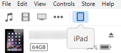
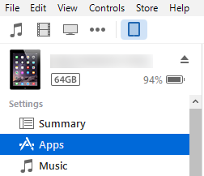
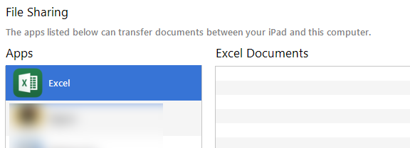
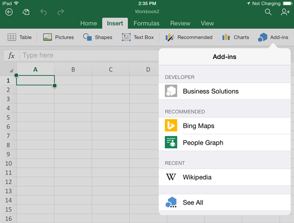
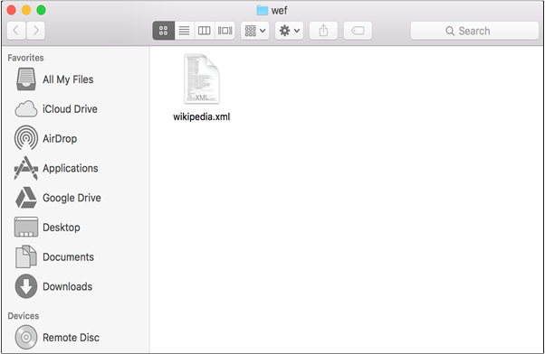

# Sideload an Office Add-in on iPad and Mac

To see how your add-in will run in Office for iOS, you can sideload your add-in's manifest onto an iPad using iTunes. Or sideload your add-in's manifest directly in Office for Mac. This action won't enable you to set breakpoints and debug your add-in's code while it's running, but you can see how it behaves and verify that the UI is usable and rendering appropriately. 

## Prerequisites for Office for iOS

- A Windows or Mac computer with [iTunes](http://www.apple.com/itunes/download/) installed.
    
- An iPad running iOS 8.2 or later with [Excel for iPad](https://itunes.apple.com/us/app/microsoft-excel/id586683407?mt=8) installed, and a sync cable.
    
- The manifest .xml file for the add-in you want to test.
    

## Prerequisites for Office for Mac

- A Mac running OS X v10.10 "Yosemite" or later with [Office for Mac](https://products.office.com/en-us/buy/compare-microsoft-office-products?tab=omac) installed.
    
- Word for Mac version 15.18 (160109).
    
- Excel for Mac version 15.19 (160206).
    
- The manifest .xml file for the add-in you want to test.
    

## Sideload an add-in on Excel or Word for iPad

1. Use a sync cable to connect your iPad to your computer. If you're connecting the iPad to your computer for the first time, you'll be prompted with  **Trust This Computer?** Choose **Trust** to continue.

2. In iTunes, choose the  **iPad** icon below the menu bar.
    
    

3. Under  **Settings** on the left side of iTunes, choose **Apps**.
    
    

4. On the right side of iTunes, scroll down to  **File Sharing**, and then choose  **Excel** or **Word** in the **Add-ins** column.
    
    

5. At the bottom of the  **Excel** or **Word Documents** column, choose **Add File**, and then select the manifest .xml file of the add-in you want to sideload. 
    
6. Open the Excel or Word app on your iPad. If the Excel or Word app is already running, choose the  **Home** button, and then close and restart the app.
    
7. Open a document.
    
8. Choose  **Add-ins** on the **Insert** tab. Your sideloaded add-in is available to insert under the **Developer** heading in the **Add-ins** UI.
    
    

## Sideload an add-in on Office for Mac

1. Open  **Terminal** and navigate to one of the following folders where you'll save your add-in's manifest file. If the `wef` folder doesn't exist on your computer, create it.
    
      - For Word:  `/Users/<username>/Library/Containers/com.microsoft.Word/Data/documents/wef`
    
  - For Excel:  `/Users/<username>/Library/Containers/com.microsoft.Excel/Data/documents/wef`
    
2. Open the folder in  **Finder** using the command `open .` (including the period or dot). Copy your add-in's manifest file to this folder.
    
    

3. Open Word, and then open a document. Restart Word if it's already running.
    
4. In Word, choose  **Insert** > **Add-ins** > **My Add-ins**, and then choose your add-in.
    
    
    
     >**Note**  The  **Store** and **See All** options will remain unavailable in the Office for Mac (Preview).
5. Verify that your add-in is displayed in Word.
    
    

## Known issues in Office for Mac

- Word crashes when  **getFileAsync** is called.
    
- Your add-in cannot make calls to the JavaScript API for Office if a pop-up is displayed. You must dismiss the pop-up before your add-in can continue executing calls to the JavaScript API for Office.
    

## Additional resources

- [Debug Office Add-ins on iPad and Mac](../testing/debug-office-add-ins-on-ipad-and-mac.md)
    
