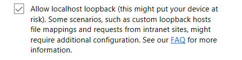

# Sideload Office Add-ins in Office Online for testing

You can install an Office Add-in for testing without having to first put it in an add-in catalog by using sideloading. Sideloading can be done in either Office 365 or Office Online. The procedure is slightly different for the two platforms. 

When you sideload an add-in, the add-in manifest is stored in the browser's local storage, so if you clear the browser's cache, or switch to a different browser, you have to sideload the add-in again.

> [!NOTE]
> Sideloading as described in this article is supported on Word, Excel, and PowerPoint. To sideload an Outlook add-in, see [Sideload Outlook add-ins for testing](/outlook/add-ins/sideload-outlook-add-ins-for-testing).

The following video walks you through the process of sideloading your add-in in Office desktop or Office Online.  

> [!VIDEO https://www.youtube.com/embed/XXsAw2UUiQo]

## Sideload an Office Add-in in Office Online

1. Open [Microsoft Office Online](https://office.live.com/).
    
2. In  **Get started with the online apps now**, choose  **Excel**,  **Word**, or  **PowerPoint**; and then open a new document.
    
3. Open the  **Insert** tab on the ribbon and, in the **Add-ins** section, choose **Office Add-ins**.
    
4. On the  **Office Add-ins** dialog, select the **MY ADD-INS** tab, choose **Manage My Add-ins**, and then  **Upload My Add-in**.
    
    

5.  **Browse** to the add-in manifest file, and then select **Upload**.
    
    

6. Verify that your add-in is installed. For example, if it is an add-in command, it should appear on either the ribbon or the context menu. If it is a task pane add-in, the pane should appear.

> [!NOTE]
>To test your Office Add-in with Microsoft Edge, two configuration steps are required: 
>
> - In a Windows Command Prompt, run the following line: `CheckNetIsolation LoopbackExempt -a -n="Microsoft.MicrosoftEdge_8wekyb3d8bbwe"`
>
> - Enter “**about:flags**” in the Microsoft Edge search bar to bring up the Developer Settings options.  Check the “**Allow localhost loopback**” option and restart Microsoft Edge.

>    

## Sideload an Office Add-in in Office 365

1. Sign in to your Office 365 account.
    
2. Open the App Launcher on the left end of the toolbar and select  **Excel**,  **Word**, or  **PowerPoint**, and then create a new document.
    
3. Steps 3 - 6 are the same as in the preceding section **Sideload an Office Add-in in Office Online**.

## Sideload an add-in when using Visual Studio

If you're using Visual Studio to develop your add-in, the process to sideload is similar. The only difference is that you must update the value of the **SourceURL** element in your manifest to include the full URL where the add-in is deployed.

> [!NOTE]
> Although you can sideload add-ins from Visual Studio to Office Online, you cannot debug them from Visual Studio. To debug you will need to use the browser debugging tools. For more information, see [Debug add-ins in Office Online](debug-add-ins-in-office-online.md).

1. In Visual Studio, show the **Properties** window by choosing **View** -> **Properties Window**.
2. In the **Solution Explorer**, select the web project. This will display properties for the project in the **Properties** window.
3. In the Properties window, copy the **SSL URL**.
4. In the add-in project, open the manifest XML file. Be sure you are editing the source XML. For some project types Visual Studio will open a visual view of the XML which will not work for the next step.
5. Search and replace all instances of **~remoteAppUrl/** with the SSL URL you just copied. You will see several replacements depending on the project type, and the new URLs will appear similar to `https://localhost:44300/Home.html`.
6. Save the XML file.
7. Right click the web project and choose **Debug** -> **Start new instance**. This will run the web project without launching Office.
8. From Office Online, sideload the add-in using steps previously described in [Sideload an Office Add-in in Office Online](#sideload-an-office-add-in-in-office-online).
