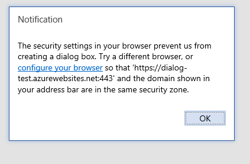

---
title: Troubleshoot user errors with Office Add-ins
description: Learn how to troubleshoot user errors in Office Add-ins.
ms.topic: troubleshooting-problem-resolution
ms.date: 06/23/2025
ms.localizationpriority: medium
---

# Troubleshoot user errors with Office Add-ins

At times your users might encounter issues with Office Add-ins that you develop. For example, an add-in fails to load or is inaccessible. Use the information in this article to help resolve common issues that your users encounter with your Office Add-in.

You can also use tools to intercept HTTP messages to identify and debug issues with your add-ins. Popular choices include [Fiddler](https://www.telerik.com/fiddler), [Charles](https://www.charlesproxy.com), and [Requestly](https://requestly.com/downloads).

## Common errors and troubleshooting steps

The following table lists common error messages that users might encounter and steps that your users can take to resolve the errors.

|Error message|Resolution|
|:-----|:-----|
|App error: Catalog could not be reached|Verify firewall settings."Catalog" refers to Microsoft Marketplace. This message indicates that the user cannot access Microsoft Marketplace.|
|APP ERROR: This app could not be started. Close this dialog to ignore the problem or click "Restart" to try again.|Verify that the latest Office updates are installed, or update with the [Windows Installer](/officeupdates/office-updates-msi).|
|Error: Access denied. `E_ACCESSDENIED (0x80070005)` | The antivirus software installed on the machine might prevent the host app from creating a WebView2 process. To resolve this issue, add an exemption or exclusion to the antivirus for the `.exe` files in the Office root folder (`C:\Program Files\Microsoft Office\root\Office16`) or for the entire Office root folder. If this does not fix the issue, add an exemption or exclusion for the WebView2 process (`C:\Program Files (x86)\Microsoft\EdgeWebView\Application[latest installed version]\msedgewebview2.exe`). |
|Error: Object doesn't support property or method 'defineProperty'|Confirm that Internet Explorer is not running in Compatibility Mode. Go to **Tools** > **Compatibility View Settings**.|
|Sorry, we couldn't load the app because your browser version is not supported. Click here for a list of supported browser versions.|Make sure that the browser supports HTML5 local storage, or reset your Internet Explorer settings. For information about supported browsers, see [Requirements for running Office Add-ins](../concepts/requirements-for-running-office-add-ins.md).|

## When installing an add-in, you see "Error loading add-ins" in the status bar

1. Close Office.
1. Check that the time and date are set correctly on your computer. An incorrect time and date can cause issues when verifying the add-in's manifest.
1. Verify that the manifest is valid. See [Validate an Office Add-in's manifest](troubleshoot-manifest.md).
1. Restart the add-in.
1. Install the add-in again.

If the add-in package was tampered with before installation, this error will occur. Download the add-in again and try to reinstall it. Alternatively, contact the publisher of the add-in for help.

You can also give us feedback: if using Office on Windows or Mac, you can report feedback to the Office extensibility team directly from Office. To do this, select **Help** > **Feedback** > **Report a problem**. Sending a report provides necessary information to understand the issue.

## Outlook add-in doesn't work correctly

If an Outlook add-in running on Windows and [using Internet Explorer](../concepts/browsers-used-by-office-web-add-ins.md) is not working correctly, try turning on script debugging in Internet Explorer.

- Go to **Tools** > **Internet Options** > **Advanced**.
- Under **Browsing**, uncheck **Disable script debugging (Internet Explorer)** and **Disable script debugging (Other)**.

We recommend that you uncheck these settings only to troubleshoot the issue. If you leave them unchecked, you will get prompts when you browse. After the issue is resolved, check **Disable script debugging (Internet Explorer)** and **Disable script debugging (Other)** again.

## Add-in doesn't activate in Office

If the add-in doesn't activate when the user performs the following steps.

1. Signs in with their Microsoft account in the Office application.

1. Enables two-step verification for their Microsoft account.

1. Verifies their identity when prompted when they try to insert an add-in.

Verify that the latest Office updates are installed, or update with the [Windows Installer](/officeupdates/office-updates-msi).

## Add-in dialog box cannot be displayed

When using an Office Add-in, the user is asked to allow a dialog box to be displayed. The user chooses **Allow**, and the following error message occurs.

"The security settings in your browser prevent us from creating a dialog box. Try a different browser, or configure your browser so that [URL] and the domain shown in your address bar are in the same security zone."



|Affected browsers|Affected platforms|
|:--------------------|:---------------------|
|Microsoft Edge|Office on the web|

To resolve the issue, end users or administrators can add the domain of the add-in to the list of trusted sites in the Microsoft Edge browser.

> [!IMPORTANT]
> Do not add the URL for an add-in to your list of trusted sites if you don't trust the add-in.

To add a URL to your list of trusted sites:

1. In **Control Panel**, go to **Internet options** > **Security**.
1. Select the **Trusted sites** zone, and choose **Sites**.
1. Enter the URL that appears in the error message, and choose **Add**.
1. Try to use the add-in again. If the problem persists, verify the settings for the other security zones and ensure that the add-in domain is in the same zone as the URL that is displayed in the address bar of the Office application.

This issue occurs when the Dialog API is used in pop-up mode. To prevent this issue from occurring, use the [displayInFrame](/javascript/api/office/office.ui) flag. This requires that your page support display within an iframe. The following example shows how to use the flag.

```js
Office.context.ui.displayDialogAsync(startAddress, {displayInIFrame:true}, callback);
```

## Add-in won't upgrade

You may see the following error when deploying an updated manifest for your add-in: `ADD-IN WARNING: This add-in is currently upgrading. Please close the current message or appointment, and re-open in a few moments.`

[!INCLUDE [deploy-updates-that-require-admin-consent](../includes/deploy-updates-that-require-admin-consent.md)]

## See also

- [Troubleshoot development errors with Office Add-ins](troubleshoot-development-errors.md)
