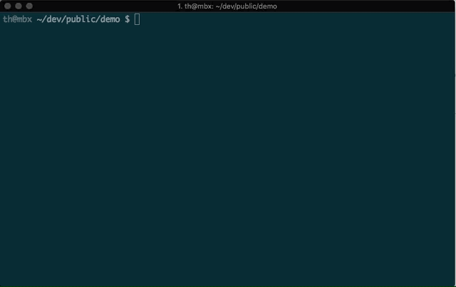

# Validate and troubleshoot issues with your manifest

You may want to validate your add-in's manifest file to ensure that it's correct and complete. Validation can also identify issues that are causing the error "Your add-in manifest is not valid" when you attempt to sideload your add-in. This article describes multiple ways to validate the manifest file and troubleshoot problems with your add-in.

## Validate your manifest with the Yeoman generator for Office Add-ins

If you used the [Yeoman generator for Office Add-ins](https://www.npmjs.com/package/generator-office) to create your add-in, you can also use it to validate your project's manifest file. Run the following command in the root directory of your project:

```command&nbsp;line
npm run validate
```



> [!NOTE]
> To have access to this functionality, your add-in project must have been created by using [Yeoman generator for Office Add-ins](https://www.npmjs.com/package/generator-office) version 1.1.17 or later.

## Validate your manifest with office-addin-manifest

If you didn't use the [Yeoman generator for Office Add-ins](https://www.npmjs.com/package/generator-office) to create your add-in, you can validate the manifest by using [office-addin-manifest](https://www.npmjs.com/package/office-addin-manifest).

1. Install [Node.js](https://nodejs.org/download/).

2. Run the following command in the root directory of your project. Replace `MANIFEST_FILE` with the name of the manifest file.

	```command&nbsp;line
	npx office-addin-manifest validate MANIFEST_FILE
	```

	> [!NOTE]
	> If running this command results in the error message "The command syntax is not valid." (because the `validate` command is not recognized), run the following command to validate the manifest (replacing `MANIFEST_FILE` with the name of the manifest file): 
	> 
	> `npx --ignore-existing office-addin-manifest validate MANIFEST_FILE`

## Validate your manifest against the XML schema

You can validate the manifest file against the [XML Schema Definition (XSD)](https://github.com/OfficeDev/office-js-docs-pr/tree/master/docs/overview/schemas) files. This will ensure that the manifest file follows the correct schema, including any namespaces for the elements you are using. If you copied elements from other sample manifests double check that you also **include the appropriate namespaces**. You can use an XML schema validation tool to perform this validation.

### To use a command-line XML schema validation tool to validate your manifest

1. Install [tar](https://www.gnu.org/software/tar/) and [libxml](http://xmlsoft.org/FAQ.html), if you haven't already.

2. Run the following command. Replace `XSD_FILE` with the path to the manifest XSD file, and replace `XML_FILE` with the path to the manifest XML file.
	
	```command&nbsp;line
	xmllint --noout --schema XSD_FILE XML_FILE
	```

## Use runtime logging to debug your add-in

You can use runtime logging to debug your add-in's manifest as well as several installation errors. This feature can help you identify and fix issues with your manifest that are not detected by XSD schema validation, such as a mismatch between resource IDs. Runtime logging is particularly  useful for debugging add-ins that implement add-in commands and Excel custom functions.   

> [!NOTE]
> The runtime logging feature is currently available for Office 2016 desktop.

> [!IMPORTANT]
> Runtime Logging affects performance. Turn it on only when you need to debug issues with your add-in manifest.

### Use runtime logging from the command line

Enabling runtime logging from the command line is the fastest way to use this logging tool. The below commands use npx, which is provided by default as part of npm@5.2.0+. If you have an earlier version of [npm](https://www.npmjs.com/), try [Runtime logging on Windows](#runtime-logging-on-windows) or [Runtime logging on Mac](#runtime-logging-on-mac) instructions, or [install npx](https://www.npmjs.com/package/npx).

To enable runtime logging, run the following:
    ```command&nbsp;line
	npx office-addin-dev-settings runtime-log --enable
	```

To enable runtime logging only for a specific file, use the same command with a filename. Use your own file name in the following sample, instead of filename.txt:
    ```command&nbsp;line
	npx office-addin-dev-settings runtime-log --enable filename.txt
	```

To disable runtime logging, run the following:
    ```command&nbsp;line
	npx office-addin-dev-settings runtime-log --disable
	```

To display whether or not runtime logging is enabled, run the following:
    ```command&nbsp;line
	npx office-addin-dev-settings runtime-log
	```

To pull up help within the command line for runtime logging, use the following:
    ```command&nbsp;line
	npx office-addin-dev-settings runtime-log --help
	```

### Runtime logging on Windows

1. Make sure that you are running Office 2016 desktop build **16.0.7019** or later. 

2. Add the `RuntimeLogging` registry key under `HKEY_CURRENT_USER\SOFTWARE\Microsoft\Office\16.0\WEF\Developer\`. 

    > [!NOTE]
    > If the `Developer` key (folder) does not already exist under `HKEY_CURRENT_USER\SOFTWARE\Microsoft\Office\16.0\WEF\`, complete the following steps to create it: 
	> 1. Right-click the **WEF** key (folder) and select **New** > **Key**.
	> 2. Name the new key **Developer**.

3. Set the default value of the key to the full path of the file where you want the log to be written. For an example, see [EnableRuntimeLogging.zip](https://github.com/OfficeDev/Office-Add-in-Commands-Samples/raw/master/Tools/RuntimeLogging/EnableRuntimeLogging.zip). 

    > [!NOTE]
    > The directory in which the log file will be written must already exist, and you must have write permissions to it. 
 
The following image shows what the registry should look like. To turn the feature off, remove the `RuntimeLogging` key from the registry. 


### Runtime logging on Mac

1. Make sure that you are running Office 2016 desktop build **16.27** (19071500) or later.

2. Open **Terminal** and set a runtime logging preference by using the `defaults` command:
    
	```command&nbsp;line
	defaults write <bundle id> CEFRuntimeLoggingFile -string <file_name>
	```

	`<bundle id>` identifies which the host for which to enable runtime logging. `<file_name>` is the name of the text file to which the log will be written.

	Set `<bundle id>` to one of the following values to enable runtime logging for the corresponding host:

	- `com.microsoft.Word`
	- `com.microsoft.Excel`
	- `com.microsoft.Powerpoint`
	- `com.microsoft.Outlook`

The following example enables runtime logging for Word and then opens the log file:

```command&nbsp;line
defaults write com.microsoft.Word CEFRuntimeLoggingFile -string "runtime_logs.txt"
open ~/library/Containers/com.microsoft.Word/Data/runtime_logs.txt
```

> [!NOTE] 
> You'll need to restart Office after running the `defaults` command to enable runtime logging.

To turn off runtime logging, use the `defaults delete` command:

```command&nbsp;line
defaults delete <bundle id> CEFRuntimeLoggingFile
```

The following example will turn off runtime logging for Word:

```command&nbsp;line
defaults delete com.microsoft.Word CEFRuntimeLoggingFile
```

### To troubleshoot issues with your manifest

To use runtime logging to troubleshoot issues loading an add-in:
 
1. [Sideload your add-in](sideload-office-add-ins-for-testing.md) for testing. 

	> [!NOTE]
	> We recommend that you sideload only the add-in that you are testing to minimize the number of messages in the log file.

2. If nothing happens and you don't see your add-in (and it's not appearing in the add-ins dialog box), open the log file.

3. Search the log file for your add-in ID, which you define in your manifest. In the log file, this ID is labeled `SolutionId`. 

In the following example, the log file identifies a control that points to a resource file that doesn't exist. For this example, the fix would be to correct the typo in the manifest or to add the missing resource.

 

### Known issues with runtime logging

You might see messages in the log file that are confusing or that are classified incorrectly. For example:

- The message `Medium Current host not in add-in's host list` followed by `Unexpected Parsed manifest targeting different host` is incorrectly classified as an error.

- If you see the message `Unexpected Add-in is missing required manifest fields	DisplayName` and it doesn't contain a SolutionId, the error is most likely not related to the add-in you are debugging. 

- Any `Monitorable` messages are expected errors from a system point of view. Sometimes they indicate an issue with your manifest, such as a misspelled element that was skipped but didn't cause the manifest to fail. 

## Clear the Office cache

If changes you've made in the manifest, such as file names of ribbon button icons or text of add-in commands, do not seem to take effect, try clearing the Office cache on your computer. 

#### For Windows:
Delete the contents of the folder `%LOCALAPPDATA%\Microsoft\Office\16.0\Wef\`.

#### For Mac:

[!include[additional cache folders on Mac](../includes/mac-cache-folders.md)]

#### For iOS:
Call `window.location.reload(true)` from JavaScript in the add-in to force a reload. Alternatively, you can reinstall Office.

## See also

- [Office Add-ins XML manifest](../develop/add-in-manifests.md)
- [Sideload Office Add-ins for testing](sideload-office-add-ins-for-testing.md)
- [Debug Office Add-ins](debug-add-ins-using-f12-developer-tools-on-windows-10.md)
