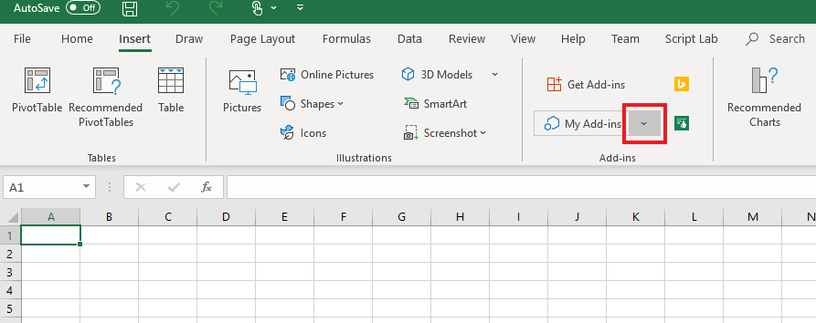
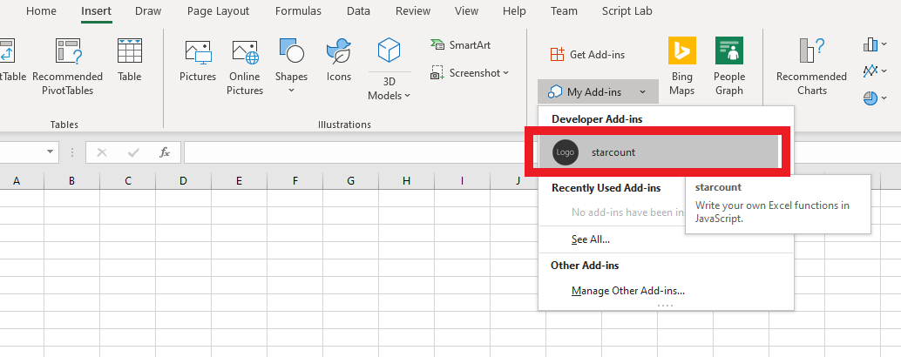

# Tutorial: Create custom functions in Excel

Custom functions enable you to add new functions to Excel by defining those functions in JavaScript as part of an add-in. Users within Excel can access custom functions as they would any native function in Excel, such as `SUM()`. You can create custom functions that perform simple tasks like calculations or more complex tasks such as streaming real-time data from the web into a worksheet.

In this tutorial, you will:
> [!div class="checklist"]
> * Create a custom function add-in using the [Yeoman generator for Office Add-ins](https://www.npmjs.com/package/generator-office). 
> * Use a prebuilt custom function to perform a simple calculation.
> * Create a custom function that gets data from the web.
> * Create a custom function that streams real-time data from the web.

## Prerequisites

[!include[Yeoman generator prerequisites](../includes/quickstart-yo-prerequisites.md)]

* Excel on Windows (version 1904 or later, connected to Office 365 subscription) or on the web

## Create a custom functions project

 To start, you'll create the code project to build your custom function add-in. The [Yeoman generator for Office Add-ins](https://www.npmjs.com/package/generator-office) will set up your project with some prebuilt custom functions that you can try out. If you have already run the custom functions quick start and generated a project, continue to use that project and skip to [this step](#create-a-custom-function-that-requests-data-from-the-web) instead.

1. Run the following command and then answer the prompts as follows.
    
    ```command&nbsp;line
    yo office
    ```
    
    * **Choose a project type:** `Excel Custom Functions Add-in project`
    * **Choose a script type:** `JavaScript`
    * **What do you want to name your add-in?** `starcount`

    
    
    The Yeoman generator will create the project files and install supporting Node components.

2. Navigate to the root folder of the project.
    
    ```command&nbsp;line
    cd starcount
    ```

3. Build the project.
    
    ```command&nbsp;line
    npm run build
    ```

    > [!NOTE]
    > Office Add-ins should use HTTPS, not HTTP, even when you are developing. If you are prompted to install a certificate after you run `npm run build`, accept the prompt to install the certificate that the Yeoman generator provides.

4. Start the local web server, which runs in Node.js. You can try out the custom function add-in in Excel on the web or Windows.

# [Excel on Windows or Mac](#tab/excel-windows)

To test your add-in in Excel on Windows or Mac, run the following command. When you run this command, the local web server will start and Excel will open with your add-in loaded.

```command&nbsp;line
npm run start:desktop
```

# [Excel on the web](#tab/excel-online)

To test your add-in in Excel on a browser, run the following command. When you run this command, the local web server will start.

```command&nbsp;line
npm run start:web
```

To use your custom functions add-in, open a new workbook in Excel on the web. In this workbook, complete the following steps to sideload your add-in.

1. In Excel, choose the **Insert** tab and then choose **Add-ins**.

   
   
2. Choose **Manage My Add-ins** and select **Upload My Add-in**.

3. Choose **Browse...** and navigate to the root directory of the project that the Yeoman generator created.

4. Select the file **manifest.xml** and choose **Open**, then choose **Upload**.

--- 
    
## Try out a prebuilt custom function

The custom functions project that you created contains some prebuilt custom functions, defined within the **./src/functions/functions.js** file. The **./manifest.xml** file specifies that all custom functions belong to the `CONTOSO` namespace. You'll use the CONTOSO namespace to access the custom functions in Excel.

Next you'll try out the `ADD` custom function by completing the following steps:

1. In Excel, go to any cell and enter `=CONTOSO`. Notice that the autocomplete menu shows the list of all functions in the `CONTOSO` namespace.

2. Run the `CONTOSO.ADD` function, with numbers `10` and `200` as input parameters, by typing the value `=CONTOSO.ADD(10,200)` in the cell and pressing enter.

The `ADD` custom function computes the sum of the two numbers that you provided and returns the result of **210**.

## Create a custom function that requests data from the web

Integrating data from the Web is a great way to extend Excel through custom functions. Next you’ll create a custom function named `getStarCount` that shows how many stars a given Github repository possesses.

1. In the **starcount** project, find the file **./src/functions/functions.js** and open it in your code editor. 

2. In **function.js**, add the following code: 

```JS
/**
  * Gets the star count for a given Github repository.
  * @customfunction 
  * @param {string} userName string name of Github user or organization.
  * @param {string} repoName string name of the Github repository.
  * @return {number} number of stars given to a Github repository.
  */
  async function getStarCount(userName, repoName) {
    try {
      //You can change this URL to any web request you want to work with.
      const url = "https://api.github.com/repos/" + userName + "/" + repoName;
      const response = await fetch(url);
      //Expect that status code is in 200-299 range
      if (!response.ok) {
        throw new Error(response.statusText)
      }
        const jsonResponse = await response.json();
        return jsonResponse.watchers_count;
    }
    catch (error) {
      return error;
    }
  }
```

3. Run the following command to rebuild the project.

    ```command&nbsp;line
    npm run build
    ```

4. Complete the following steps (for Excel on the web, Windows, or Mac) to re-register the add-in in Excel. You must complete these steps before the new function will be available.

### [Excel on Windows or Mac](#tab/excel-windows)

1. Close Excel and then reopen Excel.

2. In Excel, choose the **Insert** tab and then choose the down-arrow located to the right of **My Add-ins**.
    

3. In the list of available add-ins, find the **Developer Add-ins** section and select the **starcount** add-in to register it.
    


# [Excel on the web](#tab/excel-online)

1. In Excel, choose the **Insert** tab and then choose **Add-ins**.
    

2. Choose **Manage My Add-ins** and select **Upload My Add-in**.

3. Choose **Browse...** and navigate to the root directory of the project that the Yeoman generator created.

4. Select the file **manifest.xml** and choose **Open**, then choose **Upload**.

---

<ol start="5">
<li> Try out the new function. In cell <strong>B1</strong>, type the text <strong>=CONTOSO.GETSTARCOUNT("OfficeDev", "Excel-Custom-Functions")</strong> and press enter. You should see that the result in cell <strong>B1</strong> is the current number of stars given to the [Excel-Custom-Functions Github repository](https://github.com/OfficeDev/Excel-Custom-Functions).</li>
</ol>

## Create a streaming asynchronous custom function

The `getStarCount` function returns the number of stars a repository has at a specific moment in time. Custom functions can also return data that is continuously changing. These functions are called streaming functions. They must include an `invocation` parameter which refers to the cell where the function was called from. The `invocation` parameter is used to update the contents of the cell at any time.  

In the following code sample, you'll notice that there are two functions, `currentTime` and `clock`. The `currentTime` function is a static function that does not use streaming. It returns the date as a string. The `clock` function uses the `currentTime` function to provide the new time every second to a cell in Excel. It uses `invocation.setResult` to deliver the time to the Excel cell and `invocation.onCanceled` to handle what occurs when the function is canceled.

1. In the **starcount** project, add the following code to **./src/functions/functions.js** and save the file.

```JS
/**
 * Returns the current time
 * @returns {string} String with the current time formatted for the current locale.
 */
function currentTime() {
  return new Date().toLocaleTimeString();
}

 /**
 * Displays the current time once a second
 * @customfunction
 * @param {CustomFunctions.StreamingInvocation<string>} invocation Custom function invocation
 */
function clock(invocation) {
  const timer = setInterval(() => {
    const time = currentTime();
    invocation.setResult(time);
  }, 1000);

  invocation.onCanceled = () => {
    clearInterval(timer);
  };
}
```

2. Run the following command to rebuild the project.

    ```command&nbsp;line
    npm run build
    ```

3. Complete the following steps (for either Excel on the web or Windows) to re-register the add-in in Excel. You must complete these steps before the new function will be available. 

# [Excel on Windows or Mac](#tab/excel-windows)

1. Close Excel and then reopen Excel.

2. In Excel, choose the **Insert** tab and then choose the down-arrow located to the right of **My Add-ins**.
    

3. In the list of available add-ins, find the **Developer Add-ins** section and select the **starcount** add-in to register it.
    

# [Excel on the web](#tab/excel-online)

1. In Excel, choose the **Insert** tab and then choose **Add-ins**.
    

2. Choose **Manage My Add-ins** and select **Upload My Add-in**.

3. Choose **Browse...** and navigate to the root directory of the project that the Yeoman generator created.

4. Select the file **manifest.xml** and choose **Open**, then choose **Upload**.

--- 

<ol start="4">
<li>Try out the new function. In cell <strong>C1</strong>, type the text <strong>=CONTOSO.CLOCK())</strong> and press enter. You should see the current date, which streams an update every second. While this clock is just a timer on a loop, you can use the same idea of setting a timer on more complex functions that make web requests for real-time data.</li>
</ol>

## Next steps

Congratulations! You've created a new custom functions project, tried out a prebuilt function, created a custom function that requests data from the web, and created a custom function that streams data. You can also try out debugging this function using [the custom function debugging instructions](../excel/custom-functions-debugging.md). To learn more about custom functions in Excel, continue to the following article:

> [!div class="nextstepaction"]
> [Create custom functions in Excel](../excel/custom-functions-overview.md)
